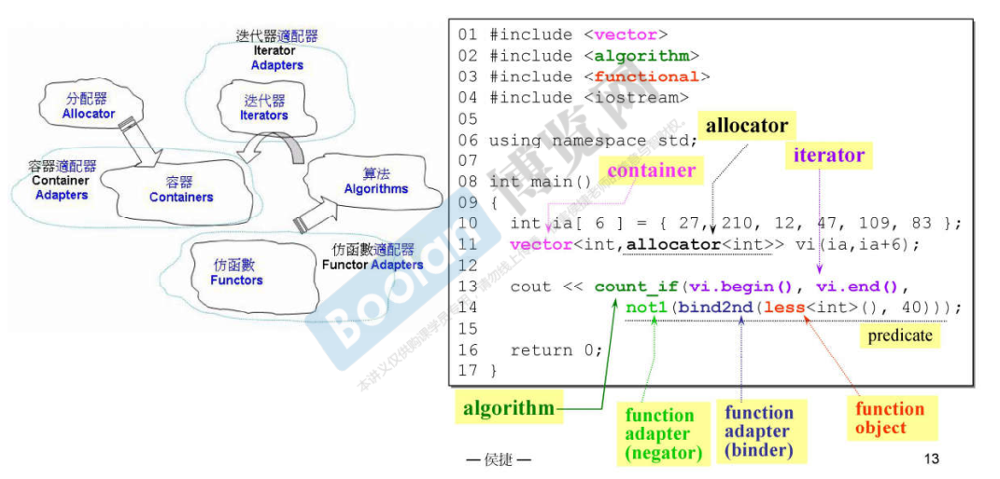

[toc]

## 前言

大二暑假那年，闲着没事翻看了一本C++的教材，忘了书名叫啥了。因为翻看过C++，所以开学的时候没有选修这门课。后来为了考CCF，了解了容器的使用。再后来，大四那年，闲着没事，翻看了半本《C++ primer》。比较零碎，这个暑假以C++为专题，梳理下。

我先计划了一个星期的解设计模式：[设计模式-笔记](https://blog.csdn.net/sinat_38816924/category_11230976.html)

再计划18天来了解下STL与泛型编程：[C++标准库(STL)与泛型编程](https://www.bilibili.com/video/BV1BX4y1G7bX?p=2)

之后，去github上找个简单的C++小游戏源码阅读以收尾。

<br>

## C++ 六大部件

来源：[C++标准库(STL)与泛型编程 - 侯捷](https://www.bilibili.com/video/BV1BX4y1G7bX?p=2)

我们需要弄明白下面这张图的含义。



<font color=blue>容器用以存储数据结构；算法通过迭代器操作容器；分配器用以管理代码相关内存；适配器的原理是[适配器模式](https://blog.csdn.net/sinat_38816924/article/details/119143509)，将已有的接口转换成我们需要的接口。</font>

<font color=blue>仿函数是什么？我们google下，阅读[C++ 仿函数](https://blog.csdn.net/K346K346/article/details/82818801)可知：仿函数重写operator() 运算符，使类可以像函数一样使用。好处是其可以像函数一样使用，但是可以拥有自己的私有数据。</font>

上面的代码我敲了一遍，我们一点点看。

```c++
#include <iostream>
#include <vector>
#include <memory>
#include <functional>
#include <algorithm>

using namespace std;

int main(void){
    int tmp[] = {1,2,3,4,5,6};
    vector<int,allocator<int>> vec(tmp,tmp+sizeof(tmp)/sizeof(tmp[0]));
    
    cout<<count_if(vec.begin(),vec.end(),not1(bind2nd(less<int>(),2)))<<endl;
    return 0;
}
```

首先，C++中遇见不清楚的内容，可以参考附录的方法。

* 仿函数`less<int>()` 

  [std::less](https://www.cplusplus.com/reference/functional/less/) 用于比较两个对象的大小，返回bool型结果。

* 其他内容自行阅读： [std::bind2nd](https://www.cplusplus.com/reference/functional/bind2nd/)、[std::not1](https://www.cplusplus.com/reference/functional/not1/)、[std::count_if](https://www.cplusplus.com/reference/algorithm/count_if/)、[std::vector](https://www.cplusplus.com/reference/vector/vector/)、[std::allocator](https://www.cplusplus.com/reference/memory/allocator/)

## 附录

**C++常用的官方网站**：[cplusplus.com - C++](https://www.cplusplus.com/)、[cppreference.com-zh](https://zh.cppreference.com/w/%E9%A6%96%E9%A1%B5)、[gun-libstdc++: Containers](https://gcc.gnu.org/onlinedocs/gcc-11.2.0/libstdc++/api/a01541.html)

查手册，我一般去官网查看，因为权威标准；

查问题/缘由，我一般直接google，因为相对于官网的说明书，博客逻辑性比较好。

