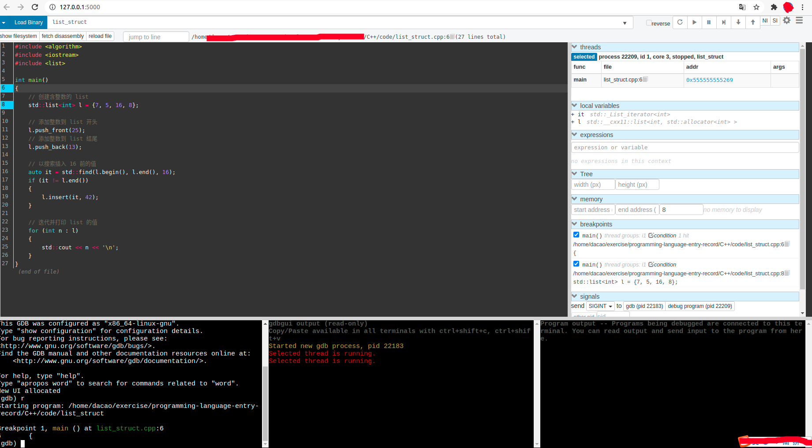

[toc]

# 摘要

list双链表结构，是非常常见的数据结构。本文记录了，STL中的list源码的阅读过程。

第一部分是分配器的源码阅读。分配器的实现分为两层：具体的分配器+分配器萃取器。两层的好处是，将具体的分配器与list代码解耦，分配器萃取器作为接口，可以替换使用不同的分配器。第二部分是list链表头结构。list链表头结构包含链表节点的分配器，表头结构相当于链表的管理者，这个设计很好。第三部分是常规的链表增删改查操作(略)。

<br>

# 背景介绍

## 前言

源码阅读分三步(可能不对)：**了解接口如何使用；大体的框架结构；使用Demo调试阅读源码**（实际中使用Demo边调试，边阅读源码。）。

本次需要阅读的是STL中list源码。掌握大体，细节忽略(细节我也看不懂)

**我当前的环境**：[gcc 9.3.0; C++14;](https://github.com/gcc-mirror/gcc/tree/releases/gcc-9.3.0/libstdc++-v3)

```shell
# 版本查看，可参考：https://blog.csdn.net/sinat_38816924/article/details/119577090

➜  g++ --version
g++ (Ubuntu 9.3.0-17ubuntu1~20.04) 9.3.0

➜  g++ -dM -E -x c++  /dev/null | grep -F __cplusplus
#define __cplusplus 201402L
```

<br>

## list的接口使用

详见：[std::list -- cppreference](https://zh.cppreference.com/w/cpp/container/list)

`std::list` 是支持常数时间从容器任何位置插入和移除元素的容器。不支持快速随机访问。它通常实现为**双向链表**。下面这里例子，来自上方链接。后面我们使用这个Demo，通过调试的方式来阅读list源码。

```c++
#include <algorithm>
#include <iostream>
#include <list>
 
int main()
{
    // 创建含整数的 list
    std::list<int> l = { 7, 5, 16, 8 };
 
    // 添加整数到 list 开头
    l.push_front(25);
    // 添加整数到 list 结尾
    l.push_back(13);
 
    // 以搜索插入 16 前的值
    auto it = std::find(l.begin(), l.end(), 16);
    if (it != l.end()) {
        l.insert(it, 42);
    }
 
    // 迭代并打印 list 的值
    for (int n : l) {
        std::cout << n << '';
    }
}
```

输出：

```shell
25 7 5 42 16 8 13
```

<br>

## list源码结构

网上搜一篇[参考](http://ibillxia.github.io/blog/2014/07/06/stl-source-insight-3-sequential-containers-2-list/)，结合[list源码](https://github.com/gcc-mirror/gcc/blob/releases/gcc-9.3.0/libstdc%2B%2B-v3/include/bits/stl_list.h)，了解下大概的代码结构。

**数据结构**：[_List_node_base](https://github.com/gcc-mirror/gcc/blob/4212a6a3e44f870412d9025eeb323fd4f50a61da/libstdc%2B%2B-v3/include/bits/stl_list.h#L80)、[_List_node_header](https://github.com/gcc-mirror/gcc/blob/4212a6a3e44f870412d9025eeb323fd4f50a61da/libstdc%2B%2B-v3/include/bits/stl_list.h#L103)、[_List_node](https://github.com/gcc-mirror/gcc/blob/4212a6a3e44f870412d9025eeb323fd4f50a61da/libstdc%2B%2B-v3/include/bits/stl_list.h#L166)

```c++
/// Common part of a node in the %list.
struct _List_node_base{
    _List_node_base* _M_next;
    _List_node_base* _M_prev;
    ...
}

/// The %list node header.
struct _List_node_header : public _List_node_base
{
    std::size_t _M_size;
    ...
	private:
      _List_node_base* _M_base() { return this; }
}

/// An actual node in the %list.
template<typename _Tp>
struct _List_node : public __detail::_List_node_base{
    ...
    _Tp _M_data;
}
```

**迭代器**：[_List_iterator](https://github.com/gcc-mirror/gcc/blob/4212a6a3e44f870412d9025eeb323fd4f50a61da/libstdc%2B%2B-v3/include/bits/stl_list.h#L184)、[_List_const_iterator](https://github.com/gcc-mirror/gcc/blob/4212a6a3e44f870412d9025eeb323fd4f50a61da/libstdc%2B%2B-v3/include/bits/stl_list.h#L264)

```c++
///  All the functions are op overloads.
template<typename _Tp>
struct _List_iterator{
	typedef _List_iterator<_Tp>		_Self;
	typedef _List_node<_Tp>			_Node;
    ...
	_Self&
	operator++() _GLIBCXX_NOEXCEPT{
		_M_node = _M_node->_M_next;
		return *this;
	}
	_Self&
    operator--() _GLIBCXX_NOEXCEPT{
		_M_node = _M_node->_M_prev;
		return *this;
	}
   ...
}
        
```

**list类**：[ _List_base](https://github.com/gcc-mirror/gcc/blob/4212a6a3e44f870412d9025eeb323fd4f50a61da/libstdc%2B%2B-v3/include/bits/stl_list.h#L344)、[list](https://github.com/gcc-mirror/gcc/blob/4212a6a3e44f870412d9025eeb323fd4f50a61da/libstdc%2B%2B-v3/include/bits/stl_list.h#L551)。开头部分，是内存分配器。可以参考本文附录中“内存分配器”的介绍。

```c++
template<typename _Tp, typename _Alloc = std::allocator<_Tp> >
   class list : protected _List_base<_Tp, _Alloc>
   {
       using _Base::_M_impl; //list头。(very important;看懂表头的作用，其他list代码便毫无压力)
       ....
       assign、begin、end、empty、size
       ....
   }

  template<typename _Tp, typename _Alloc>
    class _List_base
    {
    protected:
      typedef typename __gnu_cxx::__alloc_traits<_Alloc>::template
	rebind<_Tp>::other				_Tp_alloc_type;
      typedef __gnu_cxx::__alloc_traits<_Tp_alloc_type>	_Tp_alloc_traits;
      typedef typename _Tp_alloc_traits::template
	rebind<_List_node<_Tp> >::other _Node_alloc_type;
      typedef __gnu_cxx::__alloc_traits<_Node_alloc_type> _Node_alloc_traits;
    ...
    }
```

<br>

# 源码调试

## 调试环境

本文使用[gdbgui](https://www.gdbgui.com/)调试上面“list接口使用”中的示例代码。

```shell
# 开箱即用，比较方便
pipx install gdbgui
gdbgui list_struct
```



<br>

## 调试过程

### `std::list<int> l = {7, 5, 16, 8};`

通过调试的方式，展现上面这一行代码的背后工作。

1. 下面是`list`的接口。所以~~第一个需要调用构造函数~~特化(specialization)的部分是`_Alloc = std::allocator<int>`。

   ```c++
     template<typename _Tp, typename _Alloc = std::allocator<_Tp> >
       class list : protected _List_base<_Tp, _Alloc>
   ```

   `_Alloc = std::allocator<int>`~~构造函数~~的调用链是：`std::allocator<int>::allocator()` ---> `__gnu_cxx::new_allocator<int>::new_allocator`(`using __allocator_base = __gnu_cxx::new_allocator<_Tp>;`)

   此时，我们知道`_Alloc`分配器类型包含`allocate`、`deallocate`、`construct`、`destroy`等方法。

2. 接下来是`list`的构造函数。这里使用了[std::initializer_list](https://zh.cppreference.com/w/cpp/utility/initializer_list)：以花括号初始化器列表为赋值的右运算数，或函数调用参数，而对应的赋值运算符/函数接受 std::initializer_list 参数。

   ```c++
         /**
          *  @brief  Builds a %list from an initializer_list
          *  @param  __l  An initializer_list of value_type.
          *  @param  __a  An allocator object.
          *
          *  Create a %list consisting of copies of the elements in the
          *  initializer_list @a __l.  This is linear in __l.size().
          */
         list(initializer_list<value_type> __l,
   	   const allocator_type& __a = allocator_type())
         : _Base(_Node_alloc_type(__a))
         { _M_initialize_dispatch(__l.begin(), __l.end(), __false_type()); }
   ```

   关于这个函数，我一点一点解释，后面其余类似便不再细说。

   ```c++
   // const allocator_type& __a = allocator_type()：
   // int类型分配器的对象的创建，由上面的构造函数创建
   typedef _Alloc					 allocator_type;
   ```

   ```c++
   // _Base(_Node_alloc_type(__a))
   // 使用_Node_alloc_type(__a)作为父类_List_base的构造函数的参数;
   // 过程分为下面三个部分
   
   // _Node_alloc_type(__a)：初始化一个_List_node<int>类型的分配器对象，其分配策略和_Alloc相同
   // 调试显示这里调用的是allocator::allocator(const allocator<_Tp1>&) _GLIBCXX_NOTHROW { }（这里的构建过程存疑。需注意）
   // (1,2,3,4)的分析见附录
   typedef typename __gnu_cxx::__alloc_traits<_Alloc>::template rebind<_Tp>::other	_Tp_alloc_type; //（1）
   typedef __gnu_cxx::__alloc_traits<_Tp_alloc_type>	_Tp_alloc_traits;                           //（2）
   typedef typename _Tp_alloc_traits::template rebind<_List_node<_Tp> >::other _Node_alloc_type;   //（3）
   typedef __gnu_cxx::__alloc_traits<_Node_alloc_type> _Node_alloc_traits;                         //(4)
   
   // 父类_List_base使用的构造函数。其中_M_impl是list的头，std::move是把一个临时值变成右值引用
   // Used when allocator !is_always_equal.
   typedef _List_base<_Tp, _Alloc>			_Base;
   _List_base(_Node_alloc_type&& __a)
   : _M_impl(std::move(__a))
   { }
   
   // list头构造函数如下；由于继承_Node_alloc_type，list头包含一个_List_node<int>类型的分配器对象
   _List_impl(_Node_alloc_type&& __a) noexcept
   : _Node_alloc_type(std::move(__a))
   { }
   ```

   ```c++
   // { _M_initialize_dispatch(__l.begin(), __l.end(), __false_type()); } // 阅读源码，看list是如何插入节点列表的
         // Called by the range constructor to implement [23.1.1]/9
       template<typename _InputIterator>
   	void
   	_M_initialize_dispatch(_InputIterator __first, _InputIterator __last,
   			       __false_type)
   	{
   	  for (; __first != __last; ++__first)
   #if __cplusplus >= 201103L
   	    emplace_back(*__first);
   #else
   	    push_back(*__first);
   #endif
   	}
   
   	emplace_back(_Args&&... __args)
   	{
   	  this->_M_insert(end(), std::forward<_Args>(__args)...);
   #if __cplusplus > 201402L
   	return back();
   #endif
   	}
   
        template<typename... _Args>
          void
          _M_insert(iterator __position, _Args&&... __args)
          {
   	 _Node* __tmp = _M_create_node(std::forward<_Args>(__args)...);
   	 __tmp->_M_hook(__position._M_node); // 这个是把节点挂上链表？这个函数没看
   	 this->_M_inc_size(1);
          }
   
         template<typename... _Args>
   	_Node*
   	_M_create_node(_Args&&... __args)
   	{
   	  auto __p = this->_M_get_node();   // 分配一个节点对象
   	  auto& __alloc = _M_get_Node_allocator();
   	  __allocated_ptr<_Node_alloc_type> __guard{__alloc, __p};
   	  _Node_alloc_traits::construct(__alloc, __p->_M_valptr(),
   					std::forward<_Args>(__args)...); // new __p(__args)
   	  __guard = nullptr;
   	  return __p;
   	}
   
         typename _Node_alloc_traits::pointer
         _M_get_node()
         { return _Node_alloc_traits::allocate(_M_impl, 1); }  // 这行开始注意，使用上面创建的分配器的萃取器的allocate函数
   
         _GLIBCXX_NODISCARD static pointer
         allocate(allocator_type& __a, size_type __n)    // 分配器萃取器本质上，是调用_M_impl.allocate,以分配一个单位
         { return __a.allocate(__n); }                   // 而list头，即_M_impl的分配器，来自于上面的构造函数过程。
                                                         // 构造函数中的分配器是_List_node<int>类型 
   ```

   <br>

### 其他行

其他行的内部实现，和上面大同小异，这里略过。

<br>

# 附录

## 内存分配器

list源码中的**内存分配器相关内容可以分为两层**：`分配器`+`调用分配器`。

分层的好处是，可以切换/自定义`分配器`，`调用分配器`的结构不受影响，这要求`分配器`的构造满足`调用分配器`的`接口`。

官网有[std.util.memory.allocator](https://gcc.gnu.org/onlinedocs/libstdc++/manual/memory.html#std.util.memory.allocator)。这里，我们以list中的分配器使用过程为例，进行简单分析。

```c++
  template<typename _Tp, typename _Alloc = std::allocator<_Tp> >
    class list : protected _List_base<_Tp, _Alloc>

  template<typename _Tp, typename _Alloc>
    class _List_base
    {
    protected:
      typedef typename __gnu_cxx::__alloc_traits<_Alloc>::template rebind<_Tp>::other	_Tp_alloc_type;
      typedef __gnu_cxx::__alloc_traits<_Tp_alloc_type>	_Tp_alloc_traits;
      typedef typename _Tp_alloc_traits::template rebind<_List_node<_Tp> >::other _Node_alloc_type;
      typedef __gnu_cxx::__alloc_traits<_Node_alloc_type> _Node_alloc_traits;
```

如上代码所示：list使用`std::allocator`这一标准分配器；list关于内存分配的工作由`_List_base`实现。

### 标准分配器

标准分配器包含在三个文件中：[alloctor.h](https://github.com/gcc-mirror/gcc/blob/4212a6a3e44f870412d9025eeb323fd4f50a61da/libstdc%2B%2B-v3/include/bits/allocator.h#L111)、[c++alloctor.h]、[new_allocator.h](https://github.com/gcc-mirror/gcc/blob/4212a6a3e44f870412d9025eeb323fd4f50a61da/libstdc%2B%2B-v3/include/ext/new_allocator.h#L58)

1. `allocator`最主要的功能是集成`__allocator_base`。

   ```c++
     template<typename _Tp>
       class allocator : public __allocator_base<_Tp>
       {
      public:
         typedef size_t     size_type;         // 上层的alloctor的调用器调用这些别名
         typedef ptrdiff_t  difference_type;
         typedef _Tp*       pointer;
         typedef const _Tp* const_pointer;
         typedef _Tp&       reference;
         typedef const _Tp& const_reference;
         typedef _Tp        value_type;
   
         template<typename _Tp1>
   	struct rebind
   	{ typedef allocator<_Tp1> other; }; // 该函数可以在模板specialization之后，产生另一种类型的specialization
                                           // 相同策略的另一种类型的分配器
   
   #if __cplusplus >= 201103L
         // _GLIBCXX_RESOLVE_LIB_DEFECTS
         // 2103. std::allocator propagate_on_container_move_assignment
         typedef true_type propagate_on_container_move_assignment;
   
         typedef true_type is_always_equal;
   #endif
   
         // _GLIBCXX_RESOLVE_LIB_DEFECTS
         // 3035. std::allocator's constructors should be constexpr
         _GLIBCXX20_CONSTEXPR
         allocator() _GLIBCXX_NOTHROW { }      // 构造函数
   
         _GLIBCXX20_CONSTEXPR
         allocator(const allocator& __a) _GLIBCXX_NOTHROW
         : __allocator_base<_Tp>(__a) { }
   
   #if __cplusplus >= 201103L
         // Avoid implicit deprecation.
         allocator& operator=(const allocator&) = default;
   #endif
   
         template<typename _Tp1>
   	_GLIBCXX20_CONSTEXPR
   	allocator(const allocator<_Tp1>&) _GLIBCXX_NOTHROW { }
   
         ~allocator() _GLIBCXX_NOTHROW { }
   
         friend bool
         operator==(const allocator&, const allocator&) _GLIBCXX_NOTHROW
         { return true; }
   
         friend bool
         operator!=(const allocator&, const allocator&) _GLIBCXX_NOTHROW
         { return false; }
   
         // Inherit everything else.
       };
   ```


2. 使用[类型别名，别名模版](https://zh.cppreference.com/w/cpp/language/type_alias)。

   ```c++
   template<typename _Tp>
       using __allocator_base = __gnu_cxx::new_allocator<_Tp>;
   ```

3. `new_allocator`是真正分配空间(干活)的类。

   * allocte函数使用new分配空间；所以调用alloctor::allocate,可以申请到空间。
   * 类似allocte函数，标准分配器使用deallocate释放空间。
   * construct函数：使用参数构造对象，并为对象分配器空间。
   * destroy函数：调用construct创建的对象的析构函数。

   ```c++
     template<typename _Tp>
       class new_allocator
       {
       public:
         typedef size_t     size_type;        // 被上面的allocator中同样的内容覆盖
         typedef ptrdiff_t  difference_type;
         typedef _Tp*       pointer;
         typedef const _Tp* const_pointer;
         typedef _Tp&       reference;
         typedef const _Tp& const_reference;
         typedef _Tp        value_type;
   
         template<typename _Tp1>
   	struct rebind
   	{ typedef new_allocator<_Tp1> other; };  // 被上面的allocator::rebind覆盖
   
   #if __cplusplus >= 201103L
         // _GLIBCXX_RESOLVE_LIB_DEFECTS
         // 2103. propagate_on_container_move_assignment
         typedef std::true_type propagate_on_container_move_assignment;
   #endif
   
         _GLIBCXX20_CONSTEXPR
         new_allocator() _GLIBCXX_USE_NOEXCEPT { } // 构造函数
   
         _GLIBCXX20_CONSTEXPR
         new_allocator(const new_allocator&) _GLIBCXX_USE_NOEXCEPT { }
   	  ......
   
         // NB: __n is permitted to be 0.  The C++ standard says nothing
         // about what the return value is when __n == 0.
         _GLIBCXX_NODISCARD pointer
         allocate(size_type __n, const void* = static_cast<const void*>(0))  //allocte函数使用new分配空间；所以调用alloctor::allocate,可以申请到空间
         {
   	if (__n > this->max_size())
   	  std::__throw_bad_alloc();
   
   #if __cpp_aligned_new
   	if (alignof(_Tp) > __STDCPP_DEFAULT_NEW_ALIGNMENT__)
   	  {
   	    std::align_val_t __al = std::align_val_t(alignof(_Tp));
   	    return static_cast<_Tp*>(::operator new(__n * sizeof(_Tp), __al));
   	  }
   #endif
   	return static_cast<_Tp*>(::operator new(__n * sizeof(_Tp)));
         }
   
         // __p is not permitted to be a null pointer.
         void
         deallocate(pointer __p, size_type)   // 类似allocte函数，标准分配器使用deallocate释放空间。
         {
   #if __cpp_aligned_new
   	if (alignof(_Tp) > __STDCPP_DEFAULT_NEW_ALIGNMENT__)
   	  {
   	    ::operator delete(__p, std::align_val_t(alignof(_Tp)));
   	    return;
   	  }
   #endif
   	::operator delete(__p);
         }
   
         size_type
         max_size() const _GLIBCXX_USE_NOEXCEPT
         {
   #if __PTRDIFF_MAX__ < __SIZE_MAX__
   	return size_t(__PTRDIFF_MAX__) / sizeof(_Tp);
   #else
   	return size_t(-1) / sizeof(_Tp);
   #endif
         }
   
   #if __cplusplus >= 201103L
         template<typename _Up, typename... _Args>
   	void
   	construct(_Up* __p, _Args&&... __args)
   	noexcept(noexcept(::new((void *)__p)
   			    _Up(std::forward<_Args>(__args)...)))
   	{ ::new((void *)__p) _Up(std::forward<_Args>(__args)...); }
   
         template<typename _Up>
   	void
   	destroy(_Up* __p)
   	noexcept(noexcept( __p->~_Up()))
   	{ __p->~_Up(); }
       .......
       .......
   ```
   
   <br>

### 内存分配器的萃取器

<font color=blue>按理来说，list可以直接使用上面的分配器进行内存管理。如果这样的话，当想使用另一个分配器替换当前分配器的时候，会比较麻烦，因为list和allocator直接耦合。我们可以给分配器添加一层(萃取器，`__alloc_traits`)，它可以调用不同的分配器，只要分配器按照相同的接口实现就行。同时，gcc实现list中，将list和内存相关的操作放到一个单独类(`_List_base`)中，它调用`__alloc_traits`来实现内存管理</font>。

`_List_base`使用`__alloc_traits`进行内存管理。而`__alloc_traits`继承自`allocator_traits`。

1. 下面的的代码有点难懂，我们需要看完后续`__alloc_traits`的实现才能明白。

   我先说答案。假设我们写的代码是`list<int>`。则，`_Alloc = std::allocator<int>`。

   （1）这里传入的`_Tp`仍是`int`。`_Alloc`中的`other` 特化(specialization)的是和`_Alloc`相同的类型，它的别名为`_Tp_alloc_type`。

   （2）把`_Tp_alloc_type`这一`int`类型的`alloctor`传入萃取器，这样上层可以统一调用(调用allocte/deallocate方法)，并重命名为`_Tp_alloc_traits`。

   （3）`_Tp_alloc_type`这一`int`类型的`alloctor`，使用同样的分配策略产生一个`_List_node<int> `类型的`alloctor`

   （4）把`_Node_alloc_type`这一`_List_node<int> `类型的`alloctor`传入萃取器，这样上层可以统一调用，并重命名为`_Node_alloc_traits`。

     (5) <font color=red>`_List_impl`这个结构设计的非常漂亮，它使双链表的表头成为整个链表的管理者</font>。`_M_impl`是表头。它继承了`_Node_alloc_type`。后面添加/删除节点，调用表头对象中的`allocate`/`deallocate`方法。而调用这两个方法每次申请/删除的空间大小为`_List_node<int>`。(非常好！！)

   ```c++
     template<typename _Tp, typename _Alloc>
       class _List_base
       {
       protected:
         typedef typename __gnu_cxx::__alloc_traits<_Alloc>::template rebind<_Tp>::other	_Tp_alloc_type; //（1）
         typedef __gnu_cxx::__alloc_traits<_Tp_alloc_type>	_Tp_alloc_traits;                               //（2）
         typedef typename _Tp_alloc_traits::template rebind<_List_node<_Tp> >::other _Node_alloc_type;     //（3）
         typedef __gnu_cxx::__alloc_traits<_Node_alloc_type> _Node_alloc_traits;                           //(4)
         
        struct _List_impl           // 对链表的头节点进行"包装"，它继承_Node_alloc_type，使得双链表的表头成为整个链表的管理者。//(5)
         : public _Node_alloc_type
         {
   	__detail::_List_node_header _M_node;
        ...
         }
         _List_impl _M_impl;
   ```


2. `__alloc_traits`：Uniform interface to C++98 and C++11 allocators.

   ```c++
   template<typename _Alloc, typename = typename _Alloc::value_type>
     struct __alloc_traits
   #if __cplusplus >= 201103L
     : std::allocator_traits<_Alloc>  // __alloc_traits定义了一个统一的接口，关键实现位于allocator_traits。
   #endif
     {
       typedef _Alloc allocator_type;
   #if __cplusplus >= 201103L
       typedef std::allocator_traits<_Alloc>           _Base_type;
       typedef typename _Base_type::value_type         value_type;
       typedef typename _Base_type::pointer            pointer;
       typedef typename _Base_type::const_pointer      const_pointer;
       typedef typename _Base_type::size_type          size_type;
       typedef typename _Base_type::difference_type    difference_type;
       // C++11 allocators do not define reference or const_reference
       typedef value_type&                             reference;
       typedef const value_type&                       const_reference;
       using _Base_type::allocate;
       using _Base_type::deallocate;
       using _Base_type::construct;
       using _Base_type::destroy;
       using _Base_type::max_size;
   
       ....
       template<typename _Tp>
         struct rebind
         { typedef typename _Base_type::template rebind_alloc<_Tp> other; };
       ...
       static constexpr bool _S_always_equal()
       { return _Base_type::is_always_equal::value; }
       ...
   ```

3. GCC实现了[通用alloctor的提取器](https://github.com/gcc-mirror/gcc/blob/4212a6a3e44f870412d9025eeb323fd4f50a61da/libstdc%2B%2B-v3/include/bits/alloc_traits.h#L82)。同时，它实现了[标准alloctor的提取器](https://github.com/gcc-mirror/gcc/blob/4212a6a3e44f870412d9025eeb323fd4f50a61da/libstdc%2B%2B-v3/include/bits/alloc_traits.h#L392)。我们看后者，因为它为list容器所使用，同时通用提取器有些地方我没看明白，哈哈。<font color=blue>可以清楚的看到，对于`std::allocator`这一分配器的`allocator_traits`而言，完全是调用`std::allocator`分配器中的方法</font>。

   ```c++
     /// Partial specialization for std::allocator.
     template<typename _Tp>
       struct allocator_traits<allocator<_Tp>>
       {
         /// The allocator type
         using allocator_type = allocator<_Tp>;
         /// The allocated type
         using value_type = _Tp;
   
         /// The allocator's pointer type.
         using pointer = _Tp*;
         ....
         template<typename _Up>
   	  using rebind_traits = allocator_traits<allocator<_Up>>;
   
         _GLIBCXX_NODISCARD static pointer
         allocate(allocator_type& __a, size_type __n)
         { return __a.allocate(__n); }
           
         static void
         deallocate(allocator_type& __a, pointer __p, size_type __n)
         { __a.deallocate(__p, __n); }  
           
   	static void
   	construct(allocator_type& __a, _Up* __p, _Args&&... __args)
   	noexcept(noexcept(__a.construct(__p, std::forward<_Args>(__args)...)))
   	{ __a.construct(__p, std::forward<_Args>(__args)...); }
           
         template<typename _Up>
   	static void
   	destroy(allocator_type& __a, _Up* __p)
   	noexcept(noexcept(__a.destroy(__p)))
   	{ __a.destroy(__p); }
   ```

