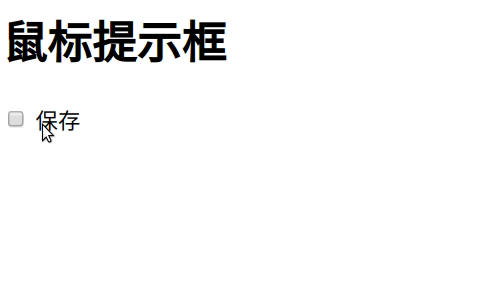
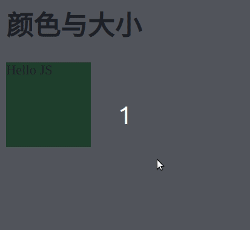
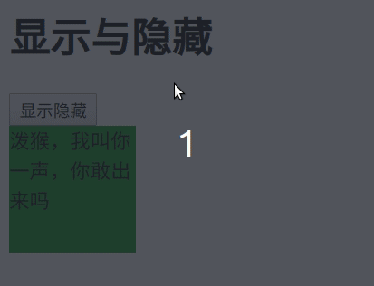
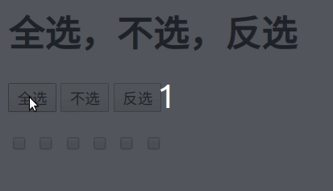
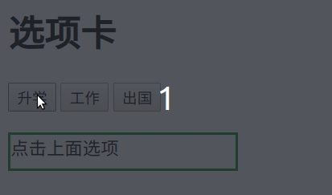

[toc]

## 前言

这几日看，CSRF/XSS，需要点JavaScript背景知识。以前没用过JS，顺道，简单过一遍。

我用了四分之一天来搜集资料。

半天看文字版的教程，有个概念，参考：[JavaScript 教程](https://wangdoc.com/javascript/)、[现代 JavaScript 教程](https://zh.javascript.info/)

今天开始倍速刷视频： [视频来源](https://www.bilibili.com/video/BV1LW411Q7qV?from=search&seid=5909464841773375812)

环境：vs code的open in browser插件 + chrome浏览器

**首先先有个感性认识。**

<br>

## JavaScript初探
### 1. 鼠标提示框
用JavaScript修改样式属性：当鼠标在checkbox里面的时候，display: none;当鼠标离开checkbox里面的时候，display: block。

**需要注意的是，这里修改是设置行间样式，而且JS在标签里面。**

```html
<!DOCTYPE html>
<html>
    <head>
        <style>
            #div1 {width: 200px;height: 30px;background: cornsilk; border: black; display: none;}
        </style>
    </head>

    <body>
        <h1>鼠标提示框</h1>
        <input type="checkbox" onmouseover="document.getElementById('div1').style.display='block'"
               onmouseout="document.getElementById('div1').style.display='none'"> 保存
        <div id="div1">不要在陌生的电脑上保存</div>
    </body>
</html>
```



### 2. 改变颜色和大小
鼠标悬浮，方框改变颜色和大小。

**把标签里面的JS内容，提取出来，放在函数中。**

```html
<!DOCTYPE html>
<html>
    <head>
        <style>
            #div1 {width: 100px;height: 100px;background:green; border: black;}
        </style>
        <script>
            function colorSzie(background,width,height){
                var div_style = document.getElementById('div1');
                div_style.style.background = background;
                div_style.style.width = width;
                div_style.style.height = height;
            }
        </script>
    </head>

    <body>
        <h1>颜色与大小</h1>
        
        <div id="div1" onmouseover="colorSzie('red','200px','200px')"
                onmouseout="colorSzie('green','100px','100px')">Hello JS</div>
    </body>
</html>
```



### 3. 显示隐藏
操作：点击操作，显示则隐藏，隐藏则显示。

**在函数的基础上，增加if语句。**

```html
<!DOCTYPE html>
<html>
    <head>
        <style>
            #div1 {width: 100px;height: 100px;background:green; border: black;display: block;}
        </style>
        <script>
            function showHide(){
                var div_show_hide = document.getElementById("div1");
                if(div_show_hide.style.display == 'none'){
                    div_show_hide.style.display = 'block';
                }else{
                    div_show_hide.style.display = 'none';
                }
            }
        </script>
    </head>

    <body>
        <h1>显示与隐藏</h1>
        
        <input type="button" value="显示隐藏" onclick="showHide()">
        <div id="div1">泼猴，我叫你一声，你敢出来吗</div>
    </body>
</html>
```



### 4. 全选，不选，反选
**将标签中的事件提取出来，放在<script>中，当加载完成再执行**。**将行为、样式、结构分离。**
提取行间事件&&window.onload。

```html
<!DOCTYPE html>
<html>
    <head>
        <style>
        </style>
        <script>
            window.onload = function(){
                select_buttons = document.getElementById('div1');
                buttons = select_buttons.getElementsByTagName('input');
                select_checkboxs = document.getElementById('div2');
                checkboxs = select_checkboxs.getElementsByTagName('input');
                
                // 当然分开写也是很好的
                for(var i = 0; i < buttons.length; i++){
                    buttons[i].onclick = function(){
                        // if(buttons[i].value == '全选') 不可以这样写，这里i是buttons.length+1，不知道为什么
                        if(this.value == '全选'){
                            for(var j=0; j<checkboxs.length; j++){
                                checkboxs[j].checked=true;
                            }
                        }else if(this.value == '不选'){
                            for(var j=0; j<checkboxs.length; j++){
                                checkboxs[j].checked=false;
                            }
                        }else if(this.value == '反选'){
                            for(var j=0; j<checkboxs.length; j++){
                                checkboxs[j].checked=!checkboxs[j].checked;
                            }
                        }
                    }
                }
            }
        </script>
    </head>

    <body>
        <h1>全选，不选，反选</h1>
        <div id="div1">
            <input class = "class1" type="button" value="全选">
            <input class = "class1" type="button" value="不选">
            <input class = "class1" type="button" value="反选">
        </div>
        <br>
        <div id="div2">
            <input type="checkbox">
            <input type="checkbox">
            <input type="checkbox">
            <input type="checkbox">
            <input type="checkbox">
            <input type="checkbox">
        </div>
    </body>
</html>
```





### 5. 选项卡按钮

根据不同的选项,框框中填充不同的内容。

```html
<!DOCTYPE html>
<html>
    <head>
        <style>
            #div1 .class1 {width: 200px;height: 30px;border: solid green;}
        </style>
        <script>
            window.onload = function(){
                var upper = ["111","222","333"];
                var selects = document.getElementById('div1');
                var selects_input = selects.getElementsByTagName('input');
                var selects_div = selects.getElementsByTagName('div')[0];

                for(var i=0; i < selects_input.length; i++){
                    selects_input[i].index = i; //增加一个新的对象元素
                    selects_input[i].onclick = function(){
                        // alert(i)，内部不能用i，i都是selects_input.length，不知道为甚
                        selects_div.innerHTML = upper[this.index];
                    }
                }
            }
        </script>
    </head>

    <body>
        <h1>选项卡</h1>
        <div id="div1">
            <input type="button" value="升学">
            <input type="button" value="工作">
            <input type="button" value="出国">
            <br><br>
            <div class="class1">点击上面选项</div>
        </div>
    </body>
</html>
```



## 总结

在开始熟悉JavaScript之前，用示例展示，有很直观的印象，这很好。

在前段进行简单的交互：首先是哪个标签需要修改，然后找到该标签，进行修改。