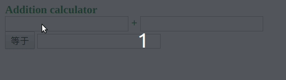

## 0. 前言

总体参考文章：[重新介绍 JavaScript（JS 教程）--MDN](https://developer.mozilla.org/zh-CN/docs/Web/JavaScript/A_re-introduction_to_JavaScript)

速刷视频：[JavaScript从入门到精通](https://www.bilibili.com/video/BV1LW411Q7qV?p=6)

<br>

## 1. JavaScript的组成

JavaScript的组成：ECMAScript，DOM，BOM。

* ECMAScript是JavaScript的核心定义主要包含以下:语法、类型、语句、关键字、保留字、操作符、对象。
* 文档对象模型(Document Object Model,  DOM)，是针对于xml，但经过扩展用于HTML的应用程序接口。DOM把整个页面以”家谱“的形式一个或者多个节点。
* 浏览器对象模型(Browser Object Model, BOM)，处理浏览器窗口和框架。

<br>

## 2. 变量

### 2.1 变量类型

变量类型：

- [`Number`](https://developer.mozilla.org/zh-CN/docs/Web/JavaScript/Reference/Global_Objects/Number)（数字）

- [`String`](https://developer.mozilla.org/zh-CN/docs/Web/JavaScript/Reference/String)（字符串）

- [`Boolean`](https://developer.mozilla.org/zh-CN/docs/Web/JavaScript/Reference/Boolean)（布尔）

- [`Symbol`](https://developer.mozilla.org/zh-CN/docs/Web/JavaScript/Reference/Global_Objects/Symbol)（符号）（ES2015 新增）

- [`Object`](https://developer.mozilla.org/zh-CN/docs/Web/JavaScript/Reference/Global_Objects/Object)（对象）  
- [`Function`](https://developer.mozilla.org/zh-CN/docs/Web/JavaScript/Reference/Function)（函数）
  - [`Array`](https://developer.mozilla.org/zh-CN/docs/Web/JavaScript/Reference/Array)（数组）
- [`Date`](https://developer.mozilla.org/zh-CN/docs/Web/JavaScript/Reference/Date)（日期）
  - [`RegExp`](https://developer.mozilla.org/zh-CN/docs/Web/JavaScript/Reference/RegExp)（正则表达式）
  
- [`null`](https://developer.mozilla.org/zh-CN/docs/Web/JavaScript/Reference/Global_Objects/null)（空）

- [`undefined`](https://developer.mozilla.org/zh-CN/docs/Web/JavaScript/Reference/Global_Objects/undefined)（未定义）

> 根据语言规范，JavaScript 采用“遵循 IEEE 754 标准的双精度 64 位格式”（"double-precision 64-bit format IEEE 754 values"）表示数字。——在JavaScript（除了[`BigInt`](https://developer.mozilla.org/zh-CN/docs/Web/JavaScript/Reference/Global_Objects/BigInt)）当中，**并不存在整数/整型(Integer)。**

类型转换：parseInt()，isNaN()，parseFloat()

小练习：页面求和计算器（注意NaN的处理）（当然，不严谨，如果输入的是数字字母组合）。

```html
<!DOCTYPE html>
<html>
    <head>
        <style>
            #calculator {color: green;font-weight: bold;}
        </style>
        <script>
            window.onload = function(){
                // var oCalculator = document.getElementById('calculator');
                // 上面这个触发不是针对按钮，范围内点击都会触发。
                // console.log(typeof(oCalculator))
                // console.log(oCalculator)
                // console.log(Object.key(oCalculator))
                // var addend1 = oCalculator.getElementsById('addend1').value;
                // var addend2 = oCalculator.getElementById('addend2').value;
                // var result = oCalculator.getElementById('result').value;
                // 上面那样用不行，提示该对象中，没有这个方法。。
                // 在提取出来的标签对象中，再提取一次标签不行？
                var oCalculator_equal = document.getElementById('equal');
                oCalculator_equal.onclick = function(){
                    //忘了进行NaN判断提示了
                    var addend1 = document.getElementById('addend1').value;
                    var addend2 = document.getElementById('addend2').value;
                    var result = document.getElementById('result');
                    result.value = (parseFloat(addend1) + parseFloat(addend2));
                }
            }
        </script>
    </head>

    <body>
        <div id="calculator">
            Addition calculator<br>
            <input id="addend1" type="text">
            +
            <input id="addend2" type="text">
            <br>
            <input id="equal" type="button" value="等于">
            <input id="result" type="text">
        </div>
    </body>
</html>
```




### 2.2 命名规范

[JS 命名规范](https://www.w3cschool.cn/ezrjc/ezrjc-vnwz25v0.html)

| JavaScript变量起名类型  | 变量命名前缀 | 举例                |
| ----------------------- | ------------ | ------------------- |
| Array 数组              | a            | aList，aGroup       |
| Boolean 逻辑            | b            | bChecked，bHasLogin |
| Function 函数           | f            | fGetHtml，fInit     |
| Integer 数字            | n            | nPage，nTotal       |
| Object 对象             | o            | oButton，oDate      |
| Regular Expression 正则 | r            | rDomain，rEmail     |
| String 字符             | s            | sName，sHtml        |

## 3. 运算符

> JavaScript的算术操作符包括 `+`、`-`、`*`、`/` 和 `%` ——求余（[与模运算相同](https://developer.mozilla.org/zh-CN/docs/Web/JavaScript/Reference/Operators/Arithmetic_Operators#求余_())）。赋值使用 `=` 运算符，此外还有一些复合运算符，如 `+=` 和 `-=`，它们等价于 `x = x *operator* y`。

## 4. 程序控制流程

JavaScript 的控制结构与其他类 C 语言类似。详细见[重新介绍 JavaScript（JS 教程）--MDN](https://developer.mozilla.org/zh-CN/docs/Web/JavaScript/A_re-introduction_to_JavaScript)

## 5. 函数

**学习 JavaScript 最重要的就是要理解对象和函数两个部分。** 

一个 JavaScript 函数可以包含 0 个或多个已命名的变量。函数体中的表达式数量也没有限制。你可以声明函数自己的局部变量。`return` 语句在返回一个值并结束函数。如果没有使用 `return` 语句，或者一个没有值的 `return` 语句，JavaScript 会返回 `undefined`。

已命名的参数更像是一个指示而没有其他作用。如果调用函数时没有提供足够的参数，缺少的参数会被 `undefined` 替代。


### 5.1 不定长参数

不定长参数：arguments  

小练习：求和函数

```javascript
add = function(){
    var result = 0;
    for(var i=0; i<arguments.length; i++){
        result += arguments[i];
    }
    return result;
}
alert(add(3,4,5));
/*****************************************/
function avg(...args) {
  var sum = 0;
  for (let value of args) {
    sum += value;
  }
  return sum / args.length;
}
avg(2, 3, 4, 5); // 3.5
```


### 5.2 当前类型

[JS获取样式](https://www.cnblogs.com/luoxuw/p/11471117.html)


### 5.3 内嵌函数和闭包

可以参考[小甲鱼python的闭包介绍](https://www.bilibili.com/video/BV1AW411i7G8?from=search&seid=9671816314338181222)。


## 6. 总结

编程语言似乎都是这一套：变量；变量之间运算的运算符；运算内容(语句)多了之后，通过控制流进行控制；语句模块化就有了函数；至于对象也是数据类型的一种，是复合数据类型。