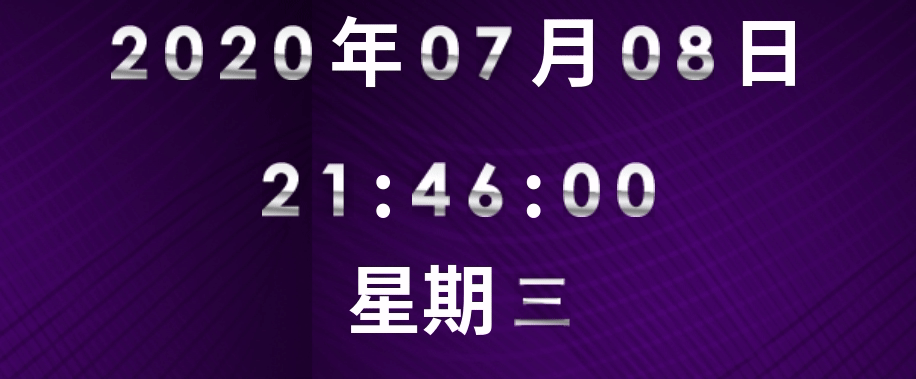
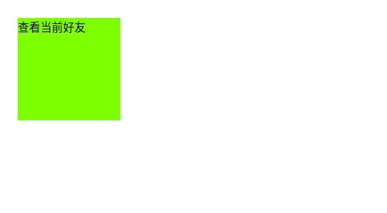

[toc]

## 定时器

参考视频：[JavaScript从入门到精通 --- 定时器](https://www.bilibili.com/video/BV1LW411Q7qV?p=10)

代码详细：[github](https://github.com/da1234cao/programming-language-entry-record/tree/master/JavaScript)

**应用：网页图片间隔自动切换。**

[setInterval](https://developer.mozilla.org/zh-CN/docs/Web/API/Window/setInterval)方法**重复调用一个函数或执行一个代码段**，在每次调用之间具有固定的时间延迟。它返回一个ID，该ID是唯一标识(该ID是一个number)，因此您可以稍后通过调用[clearInterval](https://developer.mozilla.org/zh-CN/docs/Web/API/window/clearInterval)来删除它。

[setTimeout](https://developer.mozilla.org/zh-CN/docs/Web/API/Window/setTimeout) 方法设置一个定时器，该定时器在**定时器到期后执行一个函数或指定的一段代码**。返回值`timeoutID`是一个正整数，表示定时器的编号。这个值可以传递给[`clearTimeout()`](https://developer.mozilla.org/zh-CN/docs/Web/API/WindowOrWorkerGlobalScope/clearTimeout)来取消该定时器。

需要注意的是`setTimeout`和`setInterval`共用一个编号池，技术上，`clearTimeout`和 `clearInterval`可以互换。但是，为了避免混淆，不要混用取消定时函数。

小练习：数码时钟，延时提示框，无缝滚动

<br>

## 数码时钟

获取当前时间，在页面显示。

```html
<!DOCTYPE html>
<html>
    <head>
        <meta charset="UTF-8">
        <title>数字时钟</title>
        <link rel="stylesheet" href="index.css" />
        <!-- <script type="text/javascript" src="index.js"></script> -->
        
        <script>
            window.onload = function(){
                // var time = "012345";
                setClock();//先执行下，消耗一秒，等待定时器
                setTime();
                setDate()
                setInterval(setClock,1000);
                setInterval(setTime,1000*60*60*24);
                setInterval(setDate,1000*60*60*24);
            }

            function setTime(){
                var date = new Date();

                var time = timeToStr(date.getFullYear())+timeToStr(date.getMonth()+1)+timeToStr(date.getDate());
                var oclock = document.getElementById('time');
                var images = oclock.getElementsByTagName('img');

                for(var i = 0; i < images.length; i++){
                    images[i].src = "./images/"+time[i]+".png";
                }
            }

            function setClock(){
                var date = new Date();

                var time = timeToStr(date.getHours())+timeToStr(date.getMinutes())+timeToStr(date.getSeconds());
                var oclock = document.getElementById('clock');
                var images = oclock.getElementsByTagName('img');

                for(var i = 0; i < images.length; i++){
                    images[i].src = "./images/"+time[i]+".png";
                }
            }

            function setDate(){
                var date_image = ['seven','one','two','three','four','five','six'];
                var date = new Date();

                var time = date.getDay();
                var oclock = document.getElementById('date');
                var images = oclock.getElementsByTagName('img');

                for(var i = 0; i < images.length; i++){
                    images[i].src = "./images/"+date_image[time]+".png";
                }
            }

            function timeToStr(num){
                if(num<10 && num>=0){
                    return '0'+ num;
                }else{
                    return ''+num;
                }
            }
        </script>

    </head>

    <body>
        <div id="time">
            
            
            
            
            年
            
            
            月
            
            
            日
        </div>
        <br>
        <div id="clock">
            
            
            :
            
            
            :
            
            
        </div>
        <div id="date">
            星期 
        </div>
    </body>
</html>
```



## 延时提示框

鼠标悬浮出现提示框。

```html
<!DOCTYPE html>
<html>
    <head>
        <style>
            div { float: left; margin: 10px;}
            #div1 {width: 100px; height: 100px; background-color: chartreuse;}
            #div2 {width: 150px; height: 150px; background-color: yellow; display: none;}
        </style>

        <script>
            window.onload = function(){

                var odiv1 = document.getElementById("div1");
                var odiv2 = document.getElementById('div2');
                var timer=null;

                odiv1.onmouseover = function(){
                    clearTimeout(timer);
                    display_div2();
                } 
                odiv1.onmouseout = function(){
                    timer = setTimeout(disappear_div2,500);//延时1秒后执行
                    // console.log(typeof(timer));
                    // console.log(timer);
                } 
               
                odiv2.onmouseover = function(){
                    clearTimeout(timer);
                    display_div2();
                }
                odiv2.onmouseout = function(){
                    timer = setTimeout(disappear_div2,500);
                }
                
                function display_div2(){
                    odiv2.style.display = 'block';
                }

                function disappear_div2(){
                    odiv2.style.display = 'none';
                }
            }
        </script>

    </head>

    <body>
        <div id="div1">查看当前好友</div>
        <div id="div2">
            你的好友列表<br>
                小草<br>
                中草<br>
                大草<br>
        </div>
    </body>

</html>
```



## 无缝滑动

图片无缝循环滑动

```html
<!DOCTYPE html>
<html>
    <head>
        <style>
            * { padding: 0; margin: 0; }
            #left_right {width: 50%; margin: 50px auto; text-align: center;}
            #div1 {margin: 100px auto;position: relative;width: 768px;height: 156px; overflow: hidden;}
            #div1 ul {position: absolute; top: 0; left: 0;}
            #div1 ul li {float: left;width: 250px;height: 150px;margin: 3px; text-align: center;list-style: none;}
        </style>
        <script>
            window.onload = function(){
                var odiv = document.getElementById('div1');
                var oul = odiv.getElementsByTagName('ul')[0];
                var oli = oul.getElementsByTagName('li');//由于上面li内容翻倍，所以ul的长度也得翻倍。
                oul.innerHTML = oul.innerHTML + oul.innerHTML;
                // oul.style.width = oli.length*oli[0].offsetWidth + 'px';
                oul.style.width = oul.offsetWidth*2 + 'px'; //ta的大小有li的个数决定。。

                var speed = -3;
                var timer = null;
                timer = setInterval(move,30);
            
                function move(){
                    if(oul.offsetLeft < -oul.offsetWidth/2){
                        oul.style.left = '0';
                    }
                    oul.style.left = oul.offsetLeft + speed + 'px';
                    if(oul.offsetLeft > 0){
                        oul.style.left = -oul.offsetWidth/2 + 'px';
                    }
                }

                odiv.onmouseover = function(){
                    clearInterval(timer);
                }
                odiv.onmouseout = function(){
                    timer = setInterval(move,30);
                }

                oleft_right = document.getElementById('left_right');
                obuttons = oleft_right.getElementsByTagName('input');
                obuttons[0].onclick = function(){
                    if(this.value = "向左")
                        speed = -3;
                }
                obuttons[1].onclick = function(){
                    if(this.value = "向右")
                        speed = 3;
                }
            }


        </script>
    </head>
    <body>
        <div id='left_right'>
            <input type="button" value="向左">
            <input type="button" value="向右">
        </div>
        <div id='div1'>
            <ul>
                <li></li>
                <li></li>
                <li></li>
            </ul>
       </div>
    </body>
</html>
```


避免gif过大，减小帧数，增大分辨率下采样，所以图片有点糊。