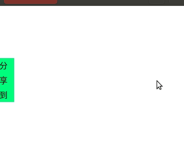
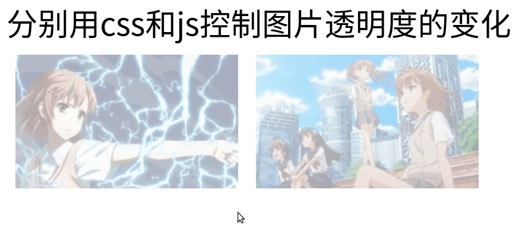
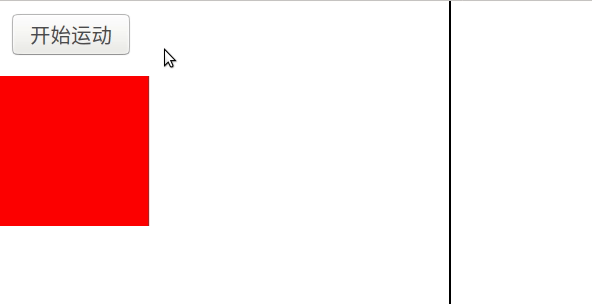
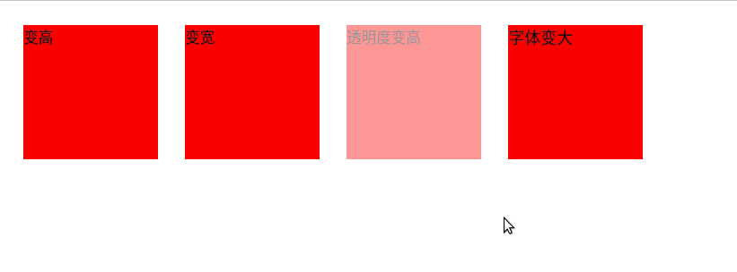

[toc]

## JS单物体运动

在[JavaScript定时器](https://blog.csdn.net/sinat_38816924/article/details/107216345) 的基础上，定时修改物体的位置属性，物体便能移动。

当物体移动到指定位置的时候，关闭定时器，物体移动结束。

代码来源视频：[代码来源视频](https://www.bilibili.com/video/BV1LW411Q7qV?p=15&spm_id_from=333.788.b_6d756c74695f70616765.15)

代码详细：[github](https://github.com/da1234cao/programming-language-entry-record/tree/master/JavaScript)

<br>

## JS物体运动基础

代码实现：点击按钮，方框匀速抵达指定位置。见下方gif。

这个代码还有很多可以改进的地方（见下方），后面实例中会不断改进。

* 目标位置300应当抽出来作为参数。
* speed为正，预先定为正(负)，无法动态指定方法。
* 当speed=5不是300的整数的时候，无法精确定位到300px位置停下。

```html
<!DOCTYPE html>
<html>
    <head>
        <style>
            #div1 {
                width: 100px; height: 100px; background-color: red;
                position: absolute; top: 50px; left: 0px;
            }
        </style>

        <script>
            window.onload = function(){
                var oinput1 = document.getElementById('input1');
                var odiv1 = document.getElementById('div1');

                var speed = 5;
                var timer = null;

                oinput1.onclick = function(){
                    clearInterval(timer); //避免多次点击创建多个计时器，清除上一次创建的计时器
                    timer = setInterval(startMove, 30);
                }

                function startMove(){
                    // 移动和停止是两个互斥事件，分开
                    if(odiv1.offsetLeft >= 300)
                        clearInterval(timer);
                    else
                        odiv1.style.left = odiv1.offsetLeft + speed + 'px';
                }
            }
        </script>
    </head>

    <body>
        <input id='input1' type="button" value="开始移动">
        <div id='div1'>
        </div>
        <div style="width: 2px;height: 400px;background-color: black;position: absolute;left: 400px;"></div>
    </body>
</html>
```


## 分享侧边栏

代码实现：鼠标悬浮，代码侧边栏移动出；鼠标离开，代码侧边栏回去。过程见下方gif。

下面代码在上面基础版本的基础上作出一些改动。

* 目标位置作为target参数，可以传递进入函数。
* 可以根据target的位置与当前位置，判断使用speed速度的正负。
* 使用绝对值进行判断，解决了最后一次移动无法精确定为的问题。

```html
<!DOCTYPE html>
<html>
    <head>
        <style>
            #div1 {
                width: 150px; height: 200px; background-color: sandybrown;
                line-height: 60px; font-size: 50px;
                position: absolute; left: -150px;
            }
            #div1 span {
                width: 20px; height: 60px; background-color: springgreen;
                line-height: 20px; font-size: 10px;
                position: absolute; right: -20px;top: 70px; 
            }
        </style>

        <script>
            window.onload = function(){
                var odiv1 = document.getElementById('div1');
                
                odiv1.onmouseover = function(){
                    startMove(0);
                }
                odiv1.onmouseout = function(){
                    startMove(-150);
                }
            }

            var timer = null; //如果把这个timer放在函数里面将会发生有意思的事情
            function startMove(target){
                /**
                * 参数target为left属性值
                * startMove从offsetLeft位置移动到target
                */
                var odiv1 = document.getElementById('div1');
                var speed = 10;
                // var timer = null; //如果把这个timer放在函数里面将会发生有意思的事情

                //根据offset和target自动判断位置方向
                var target = parseInt(target);
                if(odiv1.offsetLeft > target)
                    speed = -speed;

                if(odiv1.offsetLeft != target){ //这是后加的一行，避免创造不必要的定时器
                    clearInterval(timer);
                    timer = setInterval(function() {
                        //用等号作为判断条件是很不好的，比如上面speed=7，就比较麻烦
                        // 下面abs是为了解决，少一步不够，多一步超了
                        // if(odiv1.offsetLeft == target){ 
                        if(Math.abs(odiv1.offsetLeft - target)<Math.abs(speed)){
                            clearInterval(timer); //用结束标志进行判断，方便点
                            odiv1.style.left = target + 'px';

                        }else{
                            odiv1.style.left = odiv1.offsetLeft + speed + 'px';
                        }
                    }, 30);
                }
            
            }

        </script>

    </head>

    <body>
        <div id='div1'>
            qq<br>微信<br>微博
            <span>分享到</span>
        </div>
    </body>
</html>
```



## 图片透明度改变

代码实现：鼠标悬浮，图片透明度改变。

物体运动的思路，也可以应用到图片透明度的动态改变。

下面使用了CSS和JS两种方法实现。

```html
<!DOCTYPE html>
<html>
    <head>
        <style>
            #div1 {
                width: 250px;height: 150px;background-image: url('./images/1.jpg'); 
                float:left; margin: 10px; 
                opacity: 0.4;
            }
            #div1:hover{opacity: 1.0;}
            #div2 {
                width: 250px;height: 150px;background-image: url('./images/2.jpg'); 
                float:left;margin: 10px;
                opacity: 0.4;
            }
        </style>

        <script>
            window.onload = function(){
                var odiv2 = document.getElementById('div2');
                odiv2.onmouseover = function(){
                    opacity_target(1.0);
                }
                odiv2.onmouseout = function(){
                    opacity_target(0.4);
                }
            }

            var timer = null;
            function opacity_target(target){
                var odiv2 = document.getElementById('div2');
                var opacity = parseFloat(getComputedStyle(odiv2,null).opacity);
                var speed = 0.1;
                if(target < opacity)
                    speed = -speed;

                // alert(typeof(getComputedStyle(odiv2,null).opacity));
                // alert(getComputedStyle(odiv2,null).opacity);
                
                clearInterval(timer);
                timer = setInterval(function() {
                    //浮点数不好比较，都将其转换成整数
                    // if(parseInt(opacity*10) == parseInt(target*10))
                    if(Math.abs(opacity - target) < Math.abs(speed)){
                        clearInterval(timer);
                        odiv2.style.opacity = target;
                    }else{
                        opacity = opacity + speed;
                        odiv2.style.opacity = opacity;
                    }
                }, 30);
            }

        </script>
    </head>

    <body>
        <span style="text-align: left;font-size: 35px;">分别用css和js控制图片透明度的变化</span>
        <br>
        <div id='div1'></div>
        <div id='div2'></div>
    </body>
</html>
```



## 缓冲运动

上面物体运动的speed为常量，即物体匀速运动。

根据target的距离，动态改变speed大小，即为变速运动。

缓冲运动：target的距离越大，speed越大；target的距离越小，speed越小；

控制速度最小也有1px/间隔，所以最后必然精确到达。

```html
<!DOCTYPE HTML>
<html>
<head>
<meta charset="utf-8">
<title>无标题文档</title>
<style>
#div1 {width:100px; height:100px; background:red; position:absolute; left:0; top:50px;}
#div2 {width:1px; height:300px; position:absolute; left:300px; top:0; background:black;}
</style>
<script>
var timer = null;
function startMove(target)
{
	var target = parseFloat(target)
	var oDiv=document.getElementById('div1');
	// oDiv.timer = null //给对象添加一个属性，用自己对象的timer

	// clearInterval(this.timer);  //避免多次点击?不能
	clearInterval(timer);
	timer =  setInterval(function (){
		var speed=(target-oDiv.offsetLeft)/10;
		//speed=Math.floor(speed);
		speed=speed>0?Math.ceil(speed):Math.floor(speed);
		
		if(speed == 0)
			clearInterval(this.timer)
		else
			oDiv.style.left=oDiv.offsetLeft+speed+'px';
		
		// document.title=oDiv.offsetLeft+','+speed;
	}, 30);
}
</script>
</head>

<body>
<input type="button" value="开始运动" onclick="startMove('200px')" />
<div id="div1"></div>
<div id="div2"></div>
</body>
</html>
```



## timer与重复点击按钮

1. 上面缓冲运动中，var为全局变量。所以再次点击按钮的时候，重新触发函数，在再次设置定时器前，将timer对应的计时器关闭。所以重复点击不会出问题。即，同一个“事件”，使用同一个timer(var为全局变量)，不会出问题。
2. 上面缓冲运动中，注释部分，好像不行。因为再次点击按钮的时候，获得新的oDiv对象。该对象中有新的oDiv.timer。所以clearInterval(this.timer)，没啥用。对上一个oDiv对象，没有影响。【我不知道这里对不对，因为JS创建对象的机制，是否单线程运行啥的，我目前还不知道，也没有去search】


## 多物体运动

下面是一个简单的运动框架。可以设置将对象(obj)的属性(property),修改成指定值(target)。

但是还有不足。

* 无法完成链式运动。即，它只能修改物体的一个属性，无法修改属性后保持，继续修改下一个属性。
* 无法同时修改两个值。因为参数的设定，使得其一次只能修改一个属性。
* 要修复上述两个缺点，可以参考：[JS运动事件中级](https://www.bilibili.com/video/BV1LW411Q7qV?p=19)

```js
// base_move.js
function startMove(obj,property,target){
    /**
    * 将对象(obj)的属性(property),修改成指定值(target)
    */
    target = parseFloat(target);

    //透明度属性设置
    if(property == 'opacity'){
        var opacity = parseFloat(getComputedStyle(obj,null).opacity);
        var speed = 0.1;
        if(target < opacity)
            speed = -speed;
        
        clearInterval(obj.timer);
        obj.timer = setInterval(function() {
            //浮点数不好比较，都将其转换成整数
            // if(parseInt(opacity*10) == parseInt(target*10))
            if(Math.abs(opacity - target) < Math.abs(speed)){
                clearInterval(timer);
                obj.style.opacity = target;
            }else{
                opacity = opacity + speed;
                obj.style.opacity = opacity;
            }
        }, 30);
    }

    //非透明度属性设置
    if(property != 'opacity'){
        var step_speed = 8;
        clearInterval(obj.timer);
        obj.timer = setInterval(function(){
            var speed = (target - parseFloat(getComputedStyle(obj,null)[property]))/step_speed;
            speed = speed>0? Math.ceil(speed):Math.floor(speed);
            if(speed == 0){
                clearInterval(obj.timer);
            }else{
                obj.style[property] = parseFloat(getComputedStyle(obj,null)[property]) + speed + 'px';
            }
        },30)
    }
    
}
```

```html
<!DOCTYPE html>
<html>
    <head>
        <script type="text/javascript" src="./base_move.js" ></script>
        <style>
            .class1 {
                width: 100px;height: 100px;background-color: red;
                float: left; margin: 10px;
            }
            
        </style>
            
        <script>
            window.onload = function(){
                var odiv1 = document.getElementById('div1');
                odiv1.onmouseover = function(){
                    startMove(this,'height','200px');
                }
                odiv1.onmouseout = function(){
                    startMove(this,'height','100px');
                }

                var odiv2 = document.getElementById('div2');
                odiv2.onmouseover = function(){
                    startMove(this,'width','200px');
                }
                odiv2.onmouseout = function(){
                    startMove(this,'width','100px');
                }

                var odiv3 = document.getElementById('div3');
                odiv3.onmouseover = function(){
                    startMove(this,'opacity','1.0');
                }
                odiv3.onmouseout = function(){
                    startMove(this,'opacity','0.4');
                }

                var odiv4 = document.getElementById('div4');
                odiv4.onmouseover = function(){
                    startMove(this,'font-size','20px');
                }
                odiv4.onmouseout = function(){
                    startMove(this,'font-size','12px');
                }

                // 边框要单独写个if处理，这里不实现
                var odiv5 = document.getElementById('div5');
                odiv5.onmouseover = function(){
                    //style中没有单独的border-width属性，要配合使用
                    // odiv5.style.border-width = '20px'; 
                    odiv5.style.border = '20px solid'
                    // startMove(this,'border-width','20px');
                }
                odiv5.onmouseout = function(){
                    startMove(this,'border-width','5px');
                }

            }
        </script>
    </head>

    <body>
        <div class="class1" id='div1'>变高</div>
        <div class="class1" id='div2'>变宽</div>
        <div class="class1" id='div3' style="opacity: 0.4;">透明度变高</div>
        <div class="class1" id='div4'>字体变大</div>
        <!-- <div class="class1" id='div5' style="border: 5px solid;">边框变粗</div> -->
    </body>
</html>
```

