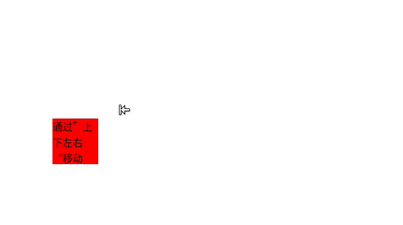
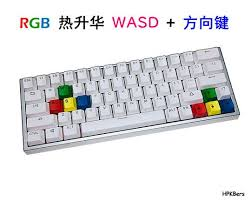
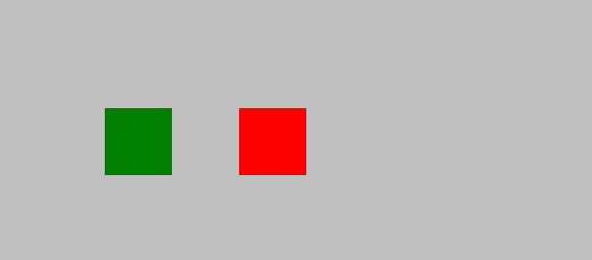
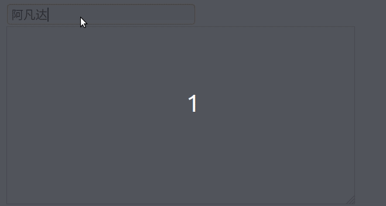

[toc]

## 0. 前言

视频参考：[JavaScript从入门到精通](https://www.bilibili.com/video/BV1LW411Q7qV?p=23)

代码参考：[github](https://github.com/da1234cao/programming-language-entry-record/tree/master/JavaScript)

<br>

## 1. JS事件概念

在Web中,  [事件](https://developer.mozilla.org/zh-CN/docs/Learn/JavaScript/Building_blocks/Events)在浏览器窗口中被触发并且通常被绑定到窗口内部的特定部分 — 可能是一个元素、一系列元素、被加载到这个窗口的 HTML 代码或者是整个浏览器窗口。举几个可能发生的不同事件：

- 用户在某个元素上**点击鼠标**或悬停光标。
- 用户在**键盘中按下某个按键**。
- 用户调整浏览器的大小或者关闭浏览器窗口。
- 一个网页停止加载。
- 提交表单。
- 播放、暂停、关闭视频。
- 发生错误。

<br>

## 2. JS事件案例

### 2.1 显示鼠标轨迹

鼠标移动：`onmousemove`

鼠标的位置（相对于可视部分）：`(clientX，clientY)`

代码实现：div跟随鼠标轨迹。

```htm
<!DOCTYPE html>
<html>
    <head>
        <style>
            div {width: 10px;height: 10px;background-color: red;position:absolute;}
        </style>

        <script>
            document.onmousemove = function(){
                var odivs = document.getElementsByTagName('div');

                //后一个div跟着前一个走
                for(var i = odivs.length-1; i > 0; i--){
                    odivs[i].style.left = odivs[i-1].offsetLeft + 'px';
                    odivs[i].style.top = odivs[i-1].offsetTop + 'px';
                }

                //第一个跟着鼠标走
                var pos = getPost();
                // alert(pos.x + ',' + pos.y);
                odivs[0].style.left = pos.x + 'px';
                odivs[0].style.top = pos.y + 'px';
            }

            function getPost(){
                var scollleft = document.documentElement.scrollLeft;
                var scrollTop = document.documentElement.scrollTop;//火狐

                return {x:event.clientX+scollleft, y:event.clientY+scrollTop};
            }
            
        </script>

    </head>

    <body>
        <div></div>
        <div></div>
        <div></div>
        <div></div>
        <div></div>
        <div></div>
        <div></div>
        <div></div>
        <div></div>
        <div></div>
        <div></div>
        <div></div>
        <div></div>
        <div></div>
        <div></div>
        <div></div>
        <div></div>
        <div></div>
        <div></div>
        <div></div>
        <div></div>
        <div></div>
        <div></div>
        <div></div>
        <div></div>
        <div></div>
        <div></div>
        <div></div>
        <div></div>
        <div></div>
        <div></div>
        <div></div>
    </body>
</html>
```

铛铛铛～


### 2.2按键间顿控制方块

按键：`onkeydown` 、`onkeyup`

代码实现：上下左右控制div。

缺点：长按有卡顿。

```html
<!DOCTYPE html>
<html>
    <head>
        <style>
            div {
                width: 50px;height: 50px;background-color: red;
                position: absolute;left: 200px;top: 200px;
            }
        </style>

        <script>
            window.onkeydown = function(){
                // alert(event.keyCode);
                // 左键：37；右键：39；上键：38；下键：40；回车：13

                var odiv = document.getElementsByTagName('div')[0];
                switch(event.keyCode){
                    case 37:
                        odiv.style.left = odiv.offsetLeft - 10 + 'px';
                        break;
                    case 38:
                        odiv.style.top = odiv.offsetTop - 10 + 'px';
                        break;
                    case 39:
                        odiv.style.left = odiv.offsetLeft + 10 + 'px';
                        break;
                    case 40:
                        odiv.style.top = odiv.offsetTop + 10 + 'px';
                        break;
                }

            }
        </script>
    </head>

    <body>
        <div></div>
    </body>
</html>
```



### 2.3 按键流畅控制方块

按键：`onkeydown` 、`onkeyup`

代码实现：上下左右控制div。

解决长按有卡顿的缺点。代码来源：[js解决键盘长按输入时会有停顿的问题](https://blog.csdn.net/Polaris_tl/article/details/102495333)

分析卡顿长按有卡顿的原因：按下(长按)，先认为按下一次，避免用户连击误输入，待会再认为按下下一次。

改变策略：针对不等待长按的再次输入。所以：按下之后改变状态，抬起之后还原状态；采用定时查看执行的方式处理(类似与CPU与外设)。

```html
<!DOCTYPE html>
<html>
<head>
    <style>
        #div1 {
          width: 100px;
          height: 100px;
          background: red;
          position: absolute;
        }
      </style>
      
      <script>
        window.onload = function () {
          var oDiv = document.getElementById("div1");
          var direction = {
            left: false,
            top: false,
            right: false,
            bottom: false
          }; //上下左右
      
          setInterval(function () {
            if (direction.left) {
              oDiv.style.left = oDiv.offsetLeft - 5 + 'px';
            } else if (direction.top) {
              oDiv.style.top = oDiv.offsetTop - 5 + 'px';
            } else if (direction.right) {
              oDiv.style.left = oDiv.offsetLeft + 5 + 'px';
            } else if (direction.bottom) {
              oDiv.style.top = oDiv.offsetTop + 5 + 'px';
            }
          }, 1);
      
          document.onkeydown = function (ev) {
            var oEvent = ev || event;
            //← 37 ↑38 →39 ↓40
            switch (oEvent.keyCode) {
              case 37:
                direction.left = true;
                break;
              case 38:
                direction.top = true;
                break;
              case 39:
                direction.right = true;
                break;
              case 40:
                direction.bottom = true;
                break;
            }
      
            document.onkeyup = function () {
              direction = {
                left: false,
                top: false,
                right: false,
                bottom: false
              };
            }
          }
        }
      </script>
      
      <body style="background-color: silver;">
        <div id="div1"></div>
      </body>
      

</html>  
```


### 2.4 按键流畅控制多个方块 --失败

上面的缺点是，所有的按键都为document的事件。无法同时控制两个物体。

比如双人小游戏中："wasd"按键与"上下左右"按键。



结果失败，失败原因如下。

* 我希望将元素(受按键控制的方块)与对应的按键作为参数；**实现不同的元素绑定不同的按键。**
* 但是`div.onkeydown`这个事件没法触发，所以我不得不采用 `document.onkeydown`
* 因而后一个对`document.onkeydown`的设置会覆盖前一个对`document.onkeydown`的设置。
* 所以下面的框架：**绑定单个物体与指定按键按键。而非绑定多个物体与其指定按键按键。**

```html
<!DOCTYPE html>
<html>
    <head>
        <style>
            #div1 {
                width: 50px;height: 50px;background-color: red;
                position: absolute;left: 300px;top: 200px;
            }
            #div2 {
                width: 50px;height: 50px;background-color: green;
                position: absolute;left: 200px;top: 200px;
            }
        </style>

        <script>
            window.onload = function(){
                var direction_red = {
                    left: 37,
                    top: 38,
                    right: 39,
                    down: 40
                }; //上键：38；下键：40；左键：37；右键：39；回车：13

                var direction_green = {
                    left: 65,
                    top: 87,
                    right: 68,
                    down: 83
                }; //上下左右w:87; s:83; a:65; d:68;

                
                var odiv1 = document.getElementById('div1');
                var odiv2 = document.getElementById('div2');

                // setInterval(function(){
                //     startMove(odiv1,direction_red);
                // },30)
                // setInterval(function(){
                //     startMove(odiv2,direction_green);
                // },30)
                startMove(odiv1,direction_red);
                startMove(odiv2,direction_green);
                
            }
            
            function startMove(obj,direction_color){
                var speed = 3;
                var direction = {
                    left: false,
                    top: false,
                    right: false,
                    down: false
                }; //上下左右

                clearInterval(obj.timer);
                obj.timer = setInterval(function () {
                    if (direction.left) {
                        obj.style.left = obj.offsetLeft - speed + 'px';
                    } else if (direction.top) {
                        obj.style.top = obj.offsetTop - speed + 'px';
                    } else if (direction.right) {
                        obj.style.left = obj.offsetLeft + speed + 'px';
                    } else if (direction.down) {
                        obj.style.top = obj.offsetTop + speed + 'px';
                    }
                }, 1);

				// obj.onkeydown = function(){
                document.onkeydown = function(){
                    switch (event.keyCode) {
                        case direction_color.left:
                            // alert(direction_color.left)
                            direction.left = true;
                            break;
                        case direction_color.top:
                            direction.top = true;
                            break;
                        case direction_color.right:
                            direction.right = true;
                            break;
                        case direction_color.down:
                            direction.down = true;
                            break;
                    }
                }
                document.onkeyup = function(){
                    direction = {
                        left: false,
                        top: false,
                        right: false,
                        down: false
                    };
                }
                
            }

        </script>
    </head>

    <body style="background-color: silver;">
        <div id='div1'></div>
        <div id='div2'></div>
    </body>
</html>
```



### 2.5 组合按键

输入完成：ctrl键+回车键

```html
<!DOCTYPE HTML>
<html>
<head>
<meta charset="utf-8">
<script>
window.onload = function(){
    var oTxt1 = document.getElementById('txt1');
    var oTxt2 = document.getElementById('txt2');

    oTxt1.onkeydown = function(){
        if(event.keyCode == 13 && event.ctrlKey){
            oTxt2.value += oTxt1.value + '\n' + '\n';
            oTxt1.value = '';
        }
    }
}
</script>
</head>

<body>
<input id="txt1" type="text" /><br>
<textarea id="txt2" rows="10" cols="40"></textarea>
</body>
</html>
```


