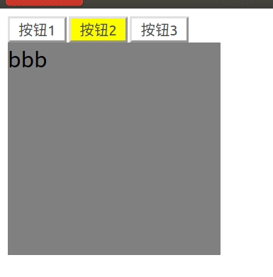

[TOC]

## JS对象

[视频资料 -- bilibili](https://www.bilibili.com/video/BV1LW411Q7qV?p=29)

[详细代码 --github](https://github.com/da1234cao/programming-language-entry-record/tree/master/JavaScript)

下面内容涉及两部分：将一个面向过程的代码用面向对象的方式重写，简单的面向对象的继承

<br>

## 选项卡--面向过程

```html
<!DOCTYPE html>
<html>
    <head>
        <style>
            #div1 input {background-color: white;}
            #div1 input.active {background-color: yellow;}
            #div1 div {width: 200px;height: 200px;background-color: gray;display: none; font-size: 20px;}
        </style>
    </head>

    <script>
        window.onload = function(){
            var oDiv1 = document.getElementById('div1');
            var aButs = oDiv1.getElementsByTagName('input');
            var aDivs = oDiv1.getElementsByTagName('div');

            for(var i = 0; i < aButs.length; i++){
                //给该按钮添加一个属性
                aButs[i].index = i;

                //给每一个按钮添加事件
                aButs[i].onclick = function(){
                    //点击任何一个按钮，先让所有按钮的颜色为白色，所有div都隐藏
                    for(var j = 0; j < aButs.length; j++){
                        aButs[j].className = "";
                        aDivs[j].style.display = 'none';
                    }
                    //让该按钮变成设定的颜色
                    this.className = "active";
                    aDivs[this.index].style.display = 'block';
                }
            }
        }

    </script>

    <body>
        <div id='div1'>
            <input class="active" type="button" value="按钮1">
            <input type="button" value="按钮2">
            <input type="button" value="按钮3">
            <div style="display: block;">aaa</div>
            <div>bbb</div>
            <div>ccc</div>
        </div>
    </body>
</html>
```


## 选项卡--面向对象

属性放在构造函数里面；方法放在原型里面；注意this的使用；

```html
<!DOCTYPE html>
<html>
    <head>
        <style>
            #div1 input {background-color: white;}
            #div1 input.active {background-color: yellow;}
            #div1 div {width: 200px;height: 200px;background-color: gray;display: none; font-size: 20px;}
        </style>
    </head>

    <script>
        window.onload = function(){
            var oDiv1 = document.getElementById('div1');
            var switchTable = new SwitchTable(oDiv1);
            switchTable.click();//开启，类似于start
        }
            

        function SwitchTable(oDiv){
            //属性放在构造函数内
            this.aButs = oDiv.getElementsByTagName('input');
            this.aDivs = oDiv.getElementsByTagName('div');
        }

        SwitchTable.prototype.click = function(){
            /*传入的oDiv包含相等个数的选项和选项卡*/
            if(this.aButs.length != this.aDivs.length)
                alert("选项和选项卡不等");

            var _this = this;
            for(var i = 0; i < this.aButs.length; i++){
                //在下面的函数里面i=this.aButs.length+1,所以在外面多一个标记
                this.aButs[i].index = i; 

                this.aButs[i].onclick = function(){
                    //在这个函数里面 ，this指向aButs[i],而不是oDiv，所以使用_this
                    _this.clearStyle(); 
                    this.className = 'active';
                    _this.aDivs[this.index].style.display = 'block';
                } 
            }
        };

        SwitchTable.prototype.clearStyle = function(){
            for(var j = 0; j < this.aButs.length; j++){
                this.aButs[j].className = "";
                this.aDivs[j].style.display = 'none';
            }
        };
    </script>

    <body>
        <div id='div1'>
            <input class="active" type="button" value="按钮1">
            <input type="button" value="按钮2">
            <input type="button" value="按钮3">
            <div style="display: block;">aaa</div>
            <div>bbb</div>
            <div>ccc</div>
        </div>
    </body>
</html>
```



## 简单的面向对象的继承

```html
<!DOCTYPE HTML>
<html>
    <head>
        <meta charset="utf-8">
        <title>无标题文档</title>
        <script>
            // 对象A
            function A()
            {
                this.abc=12;
            }

            A.prototype.show=function ()
            {
                alert("A的方法");
            };

            //对象B继承A
            function B()
            {
                //this->new B()
                A.call(this);
            }

            //B.prototype=A.prototype;
            for(var i in A.prototype)
            {
                B.prototype[i]=A.prototype[i];
            }

            //重写
            B.prototype.show=function ()
            {
                alert("B的方法");
            };    
            //添加
            B.prototype.fn=function ()
            {
                alert('abc');
            };

            var objA=new A();
            objA.show();
            var objB=new B();
            objB.show();
            // objA.fn(); //无
        </script>
    </head>

    <body>
    </body>
    
</html>

```

