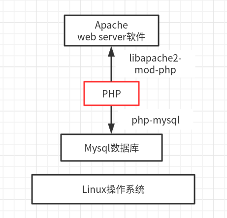
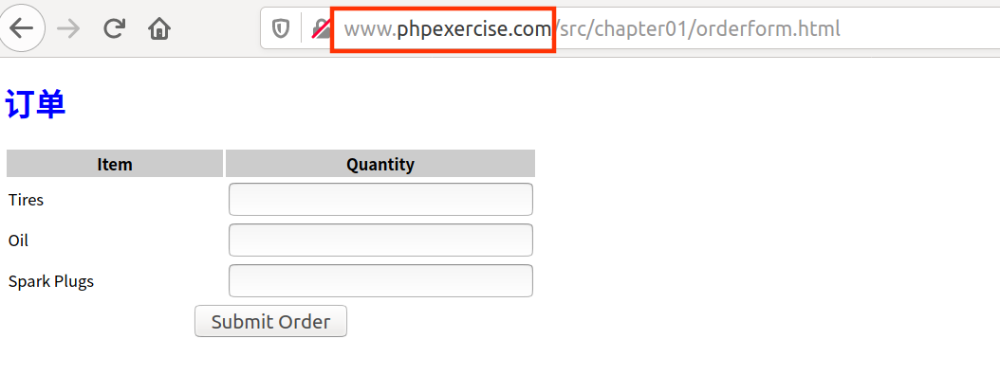
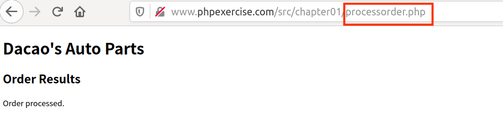

LAMP按照下面的顺序，进行安装配置。

1. 数据库mysql的安装：[在腾讯云 Ubuntu18.04 安装配置 MySQL 5.7（踩坑警告⚠️）](https://zhuanlan.zhihu.com/p/77765825)
2. 总体环境准备：[在Ubuntu18.04上安装Linux, Apache, MySQL, PHP (LAMP)](https://luomuxiaoxiao.com/?p=707)
3. 不同的场景使用不同的虚拟主机：[如何在Ubuntu 18.04上设置Apache虚拟主机](https://www.myfreax.com/how-to-set-up-apache-virtual-hosts-on-ubuntu-18-04/)
4. 当我们的站点目录不在/www/var下的时候，配置权限：[修改目录权限](https://www.bilibili.com/read/cv4497283/)
5. 当然，上面内容也可以通过脚本安装： [teddysun /lamp](https://github.com/teddysun/lamp)
6. 了解更多内容，比如LNMP，可以参考《linux就该这么学》最后一章的视频等



```she
# /etc/apache2/sites-available/php-exercise.conf
# 新增练习PHP的站点
<VirtualHost *:80>
        ServerName www.phpExercise.com
        DocumentRoot /home/dacao/exercise/programming-language-entry-record/PHP
</VirtualHost>

# 创建一个从虚拟主机文件到sites-enabled目录的符号链接
sudo a2ensite php-exercise.conf

# 重启服务，暂时是不行的，显示403Forbidden，因为权限还没有配置
sudo systemctl restart apache2.service

# /etc/apache2/apache2.conf
# 参考/var/www，增添一个站点的权限
<Directory /home/dacao/exercise/programming-language-entry-record/PHP>
        Options Indexes FollowSymLinks
        AllowOverride None
        Require all granted
</Directory>

# /etc/hosts添加
# 练习PHP的站点
127.0.0.1      www.phpExercise.com
```

```shell
# 如果，短时间内不使用这些功能，则关闭这些服务，保持电脑流畅体验
sudo systemctl stop mysql.service
sudo systemctl disable  mysql.service
sudo systemctl stop apache2.service
sudo systemctl disable apache2.service

# 我不知道下面两个服务是干什么的。。
systemctl status phpsessionclean.service  ---inactive
systemctl status phpsessionclean.timer    ---active
```


**配置成功并使用**





