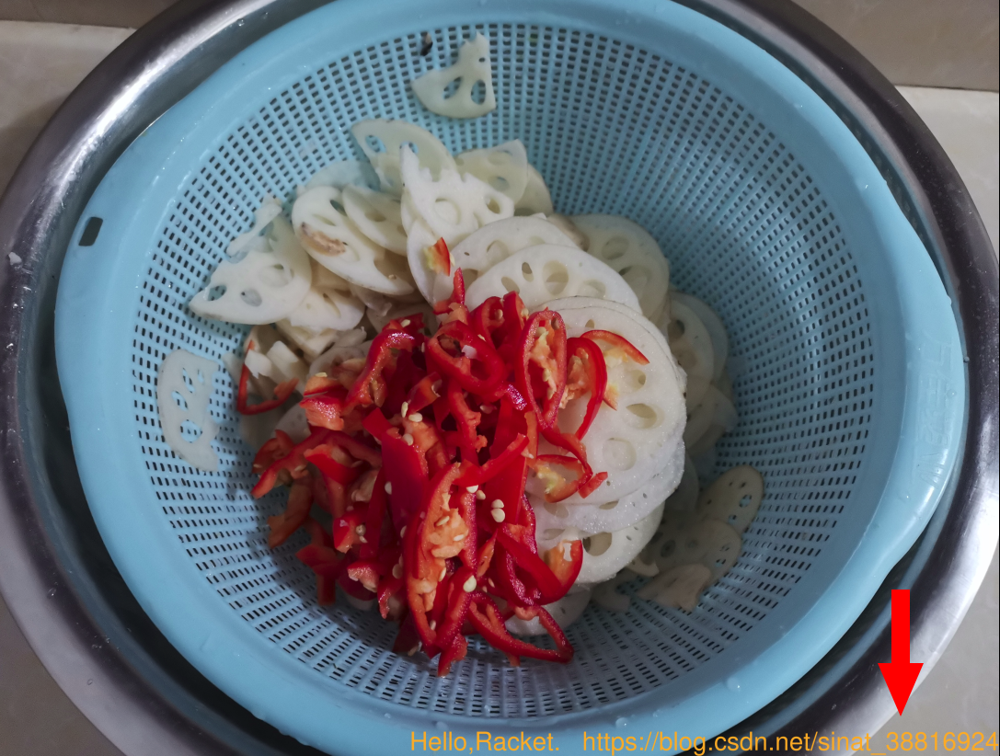

[toc]

## 前言

在开始下面内容之前，需要了解[Quick: An Introduction to Racket with Pictures](https://blog.csdn.net/sinat_38816924/article/details/121221896)、[Racket语言简单使用](https://blog.csdn.net/sinat_38816924/article/details/121244936)

开始的时候，我打算给图片添加一个图片水印。在实现的过程中，我可以叠加图片，但是我不会调整水印图片的透明度。所以，实现失败。

图片水印有实现难度，添加文字logo则简单许多。本文实现了，使用racket语言，给图片添加文字logo。但是，程序仍有许多改进的地方。比如，无法处理通过命令行传入的字符串中的转移符号；没有实现根据图片大小，相应的调整log大小；程序没有参数检查等等。

本文参考：[照片裁剪-racket](https://tyrchen.github.io/racket-book/practical-racket.html#%28part._practical-crop%29)

<br>

## 具体代码实现

```racket
#lang racket

; 代码参考：https://tyrchen.github.io/racket-book/practical-racket.html#%28part._practical-crop%29

(require 2htdp/image racket/cmdline
         (only-in racket/draw read-bitmap))

;读取图片
(define (imageBit image_filename)
  (read-bitmap image_filename))

;创建字体logo
; str = "Hello,Racket\nhttps://blog.csdn.net/sinat_38816924"
(define (textLogo str)
  (text str 100 "orange"))

;将文字logo添加到图片右下角
(define (imageToBox text_logo image)
  (overlay/align "right" "bottom" text_logo image))

; 新图片重命名
(define (normalizeName image_filename log_str)
  "logo.png")

; 命令行启动程序
(command-line
 #:args (image_filename log_str)
 (let* ([image (imageBit image_filename)]
        [text_log (textLogo log_str)]
        [new_image (imageToBox text_log image)])
  (save-image new_image
             (normalizeName image_filename log_str))))
```

<br>

## 实现结果

```shell
# 命令行运行：程序名 需要添加文字logo的图片名 添加的logo文字
racket 照片裁剪.rkt "../image/lotus_root.jpg" "Hello,Racket.   https://blog.csdn.net/sinat_38816924"
```



<br>

## 相关链接

[2.3 Images: "image.rkt"](https://docs.racket-lang.org/teachpack/2htdpimage.html#%28def._%28%28lib._2htdp%2Fimage..rkt%29._text%29%29)

[3.9 Local Binding: let, let*, letrec, ...](https://docs.racket-lang.org/reference/let.html#%28form._%28%28quote._~23~25kernel%29._let%2A-values%29%29)

[15.9` `Command-Line Parsing](https://docs.racket-lang.org/reference/Command-Line_Parsing.html#%28form._%28%28lib._racket%2Fcmdline..rkt%29._command-line%29%29)

