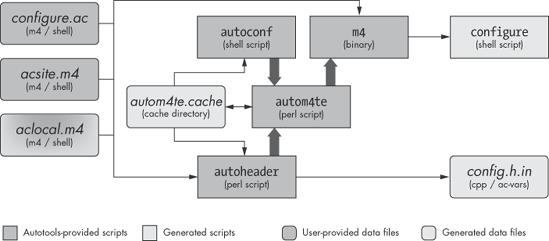
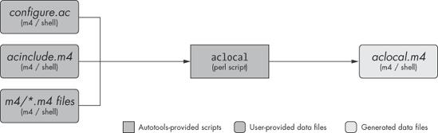
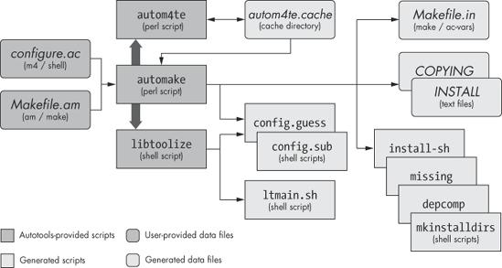
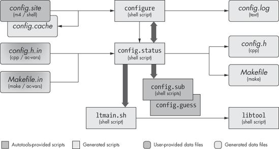
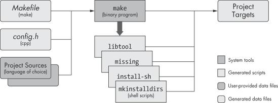

[toc]

## 前言

来源：[AUTOTOOLS - John Calcote](https://nostarch.com/autotools.htm) or [AUTOTOOLS -- 亚马逊](https://www.amazon.cn/dp/B003WUYEL6/ref=sr_1_1?__mk_zh_CN=%E4%BA%9A%E9%A9%AC%E9%80%8A%E7%BD%91%E7%AB%99&dchild=1&keywords=autotools&qid=1616146359&sr=8-1)

这里简单整理下这本书的前言和第一章Autotools简介。

 

 

## 导读

---

通过反复实验试错来学习，非常消耗时间。官方文档是个节约时间的利器。但是，很多时候，官方文档又臭又长，缺少示例代码，没有上下文环境等。互联网的发展，使得我们可以通过看教程视频，阅读博客等方法，快速理解官方文档中不清楚的地方。另外，当一个内容的学习曲线比较陡峭的时候，系统有条理的阅读该方面评价最好的书籍，在构建自己知识体系的同时，也是节约时间的好方法。[ps：希望这些经典的书籍都有配套的精品视频]

这本书或许是介绍autotools的一本好书。本书采用做菜的思路来讲解autotools。首先介绍了调味料(基础知识)，然后介绍了各种烹饪技术。 最后，提出了烹饪奇观的主要食谱。 掌握了每个菜谱后，读者便会进行直观的小飞跃，我称它们为顿悟。 最终，掌握Autotools是不可避免的。

 

### 为什么使用Autotools

开源软件使得，编译构建步骤转移到用户手中。为了简单，可以使用make。但是不同的环境，需要脚本配置。这些脚本配置维护让开发者头疼。且，只有少数开发者掌握不同环境之间的区别。所以Autotools工具诞生了。Autotools旨在创建可以正常运行的配置脚本和makefile，并在大多数情况下以及在大多数系统上，甚至在软件包维护者最初未考虑（甚至没有想到）的系统上，提供大量重要的最终用户功能。

 

### 谁应该读这本书

本书面向希望成为Autotools专家的开源软件包维护者。 有关该主题的现有材料仅限于GNU Autotools手册和一些基于Internet的教程。 多年来，大多数实际问题都在Autotools邮件列表中得到了回答，但是邮件列表的教学效率很低，因为一次又一次地给出了对相同问题的相同答案。 本书提供了一种烹饪书样式的方法，涵盖了在实际项目中发现的实际问题。[这本书出版于2010年，10年了]

[我看这本书的原因：我遇到一个程序，它使用printf打印一个堆缓冲区溢出的变量，程序signal abort。我调试了下程序，看到printf对应的栈帧调用的是__printf函数。我到glibc中看了下，确是如此。在我的印象中，编译打包成库的时候，会去除前面的下划线。为了阅读glibc的编译过程，验证我的印象，我来翻看这本533页的书籍。。]

 

### 这本书是如何组织的

本书从high-level概念过渡到mid-level用例和示例，然后以更高级的细节和示例结束。 就像我们正在学习算术一样，我们将从一些基本的数学（代数和三角学）开始，然后继续分析几何和微积分。

1. Chapter 1：整体俯瞰Autotools。描述文件之间的交互。
2. Chapter 2：介绍开源软件项目的结构和组织。本章还详细介绍了GNU编码标准(GCS)和文件系统层次结构标准(FHS)，它们在GNU Autotools的设计中都起着至关重要的作用。有了这些概念，您将更好地了解Autotools设计师做出的体系结构决策背后的理论。
3. Chapter 3 and Chapter 4：介绍了GNU Autoconf工程师设计的框架，以减轻创建和维护可移植的功能性项目配置脚本的负担。  GNU Autoconf软件包提供了使用项目维护人员提供的几行信息来创建复杂的配置脚本的基础。
4. Chapter 5：讨论将Jupiter项目Makefile.in模板转换为Automake Makefile.am文件。
5. Chapter 6 and Chapter 7：展示了如何使用Libtool构建共享库-Libtool是共享库功能的独立抽象，可以与其他Autotools一起使用。
6. Chapter 8 and Chapter 9 ：显示了现有的，相当复杂的开源项目（FLAIM）从使用手工构建系统到使用Autotools构建系统的转变。 本示例将帮助您了解如何自动 autoconfiscate现有的项目。
7. Chapter 10 ：概述了M4宏处理器的功能，这些功能与对Autoconf的深入了解有关。
8. Chapter 11：汇总了有关Autoconf问题的技巧，窍门和可重用的解决方案。

本书清单中显示的大多数示例都可以从http://www.nostarch.com/autotools.htm下载。

 

### 其他

使用Autotools的人群：编写Unix或者Linux系统的开源软件的人。

不应该使用Autotools的场景：windows环境编程。

语言的选择： C/C++/Objective C/Fortran/Fortran 77/Erlang

用户角度构建程序三部曲：./config、make、make install

 

## GUN AUTOTOOLS 简介

---

如本书前言所述，GNU Autotools的目的是使最终用户（而不是维护者）的工作更加轻松。 尽管如此，从长远来看，使用Autotools会使您作为项目维护者的工作更加轻松，尽管可能并非出于您怀疑的原因。 鉴于其提供的功能，Autotools框架非常简单。  Autotools的真正目的是双重的：它可以满足用户的需求，并且可以使您的项目具有极高的可移植性，甚至可以移植到从未测试，安装或构建过代码的系统上。

在本书中，我经常会用到Autotools一词。 我用这个术语来表示以下三个GNU软件包，它们被社区认为是GNU构建系统的一部分：

**Autoconf**：用于生成项目的配置脚本。

**Automake**：用于简化创建一致且功能齐全的makefile的过程。

**Libtool**：为共享库的可移植创建提供了一种抽象

 

### Autoconf

开发者，写一个简单的基于宏语言的脚本。Autoconf将会根据它生成完美的配置脚本。

自动生成的配置脚本提供了一组通用选项，这些选项对于在POSIX系统上运行的所有可移植软件项目都很重要。 这些选项包括修改标准位置的选项（第2章中将详细介绍的概念），以及configure.ac文件中定义的特定于项目的选项（将在第3章中讨论）。

autoconf的包提供了如下几个程序：

1. autoconf：它的主要任务是确保当前的Shell包含执行M4宏处理器所需的功能脚本的其余部分解析命令行参数并执行autom4te。
2. autoheader：从configure.ac中的各种构造生成与C / C ++兼容的头文件模板。 该文件通常称为config.h.in。
   当最终用户执行configure时，配置脚本将从config.h.in生成config.h。
3. autom4te：它主要由Autotools内部使用。 正常运行的唯一标志是autom4te.cache目录。
4. autoreconf：您可以将autoreconf视为一种智能的Autotools引导实用程序。 如果所有的配置在configure.ac文件，则可以运行autoreconf以正确的顺序执行所需的所有工具，以便正确生成configure。
5. autoscan：自动扫描程序会为新项目生成默认的configure.ac文件。
6. autoupdate：autoupdate实用程序用于更新configure.ac或模板（.in）文件，以匹配当前版本的Autotools支持的语法。
7. ifnames： ifnames该实用程序旨在帮助维护人员确定将哪些内容放入configure.ac和Makefile.am文件中，以使其可移植。

总的来说：autoconf和autoheader程序可以由用户直接执行，也可以由autoreconf间接执行。 他们使用autom4te 维护缓存信息，从项目的configure.ac文件和各种具有Autoconf风格的M4宏定义文件中获取输入。  autoconf 生成一个名为configure的配置脚本，这是一个非常可移植的Bourne Shell脚本，使您的项目能够提供许多有用的配置功能。  autoheader根据configure.ac中的某些宏定义生成config.h.in模板。

Figure 1-1. A data flow diagram for autoconf and autoheader

 

### Automake

Automake的工作是将项目构建过程的**简化规范转换为样板化**的makefile语法，该语法始终在第一次就可以正常运行，并提供所有预期的标准功能。  Automake会创建支持GNU编码标准（在第2章中讨论）中定义的准则的项目。(比如make all, make install, make clean等)

automake的包提供了如下几个程序：

1. automake：automake程序从高级构建规范文件（名为Makefile.am）生成标准的Makefile模板（名为Makefile.in）。 这些Makefile.am输入文件本质上只是常规的makefile。 如果只在Makefile.am文件中放入几个必需的Automake定义，则会得到一个Makefile.in文件，其中包含几百行参数化的make脚本。   

   如果在Makefile.am文件中添加其他make语法，则Automake会将此代码移动到生成的Makefile.in文件中功能最正确的位置。 实际上，您可以编写Makefile.am文件，以便它们包含的所有内容都是普通的make脚本，并且生成的makefile可以正常工作。 此传递功能使您能够扩展Automake的功能以适合您项目的特定要求。

2. aclocal：在GNU Automake手册中，由于在Autoconf中缺少一定的灵活性，aclocal实用程序被记录为临时解决方法。  Automake通过添加大量宏来扩展Autoconf，但在设计Autoconf时并没有考虑到这种可扩展性。

   将用户定义的宏放在alocal.m4文件中。该文件与configure.ac在相同的目录。在configure.ac中添加m4_include语句，使得Autofonf在处理configure.ac的时候，包含alocal.m4中的内容。

   开发人员现在应该指定一个包含一组M4宏文件的目录。 当前的建议是在项目根目录中创建一个名为m4的目录，并将宏作为单个.m4文件添加到其中。  Autoconf处理configure.ac之前，此目录中的所有文件都将收集到aclocal.m4中。

   

   
Figure 1-2. A data flow diagram for aclocal

### Libtool

 Libtool支持数十种平台，不仅提供了一组Autoconf宏来隐藏makefile中库命名的差异，而且还提供了可选的动态加载程序库，可以将其添加到程序中。

1. libtool (program)：(libtool软件包附带的)libtool shell脚本是libtoolize为项目生成的自定义脚本的通用版本。
2. libtoolize (program)：libtoolize shell脚本使您的项目准备使用Libtool。 它生成通用libtool脚本的自定义版本，并将其添加到您的项目目录中。 
3. ltdl (static and shared libraries) & ltdl.h (header file)：libtool软件包还提供了ltdl库和关联的头文件，这些文件提供了跨平台的一致的运行时共享库管理器。

Automake和Libtool都是标准的可插入选项，可以通过几个简单的宏调用将它们添加到configure.ac。

Figure 1-3. A data flow diagram for automake and libtool

 

## 构建自己的包

---

上面介绍Autotools是站在开发人员的视角。这里介绍的是用户的构建视角。

 

### 运行configure

配置脚本，将从Makefile.in中生成makefile文件。(Makefile.in)是由automake创建的。

config.h头文件从config.h.in中生成出来。config.h.in是autoheader生成。

Automake不直接生成makefile而是生成makefile.in。使得用户先运行configure之后，才能运行make。**运行configure,可以将平台特征和用户指定的可选功能直接插入makefile中**。

Figure 1-4. A data flow diagram for configure

如configure.ac中所指定，configure旨在确定用户系统上可用的平台特性和功能。 获得此信息后，它将生成config.status，其中包含所有检查结果，然后执行此脚本。  config.status脚本又使用其中嵌入的检查信息来生成特定于平台的config.h和makefile以及configure.ac中指定用于实例化的任何其他文件。

双头长箭头所示，config.status也可以调用configure。config.status与--recheck选项一起使用时，config.status将使用与最初生成config.status相同的命令行选项来调用configure。

configure脚本还会生成一个名为config.log的日志文件，如果在用户系统上执行configure失败，它将包含非常有用的信息。 作为维护者，您可以使用此信息进行调试。

重新生成config.h和makefiles的时候，执行config.status当然可以。因为环境没有变，状态之间检查过来。configure和configure.status的命令参数相同。

 

### 运行make

为了使Autotools不受make版本限制而报各种错误。make运行了几个生成的脚本。它们确实是make流程的辅助工具。 生成的makefile包含在适当条件下执行这些脚本的命令。 这些脚本是Autotools的一部分，它们随软件包一起提供或由配置脚本生成。

Figure 1-5. A data flow diagram for make

## 附录

如果第一次接触Autotools，直接看上面内容，估计挺懵。可以先看些网上的blog。

[Autotools发展史 -- 知乎 -- 涛哥](https://zhuanlan.zhihu.com/p/50271928)

[Autotools 入门教程 -- 不灭的焱](http://php-note.com/1441.html)