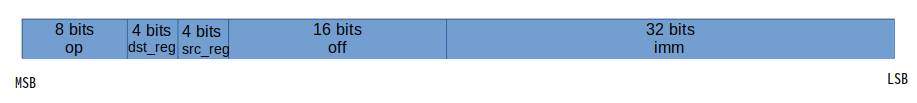

[toc]

# 摘要

了解ebpf的指令系统。阅读一个使用ebpf指令集编程的示例。

<br>

# ebpf指令系统

参考：[eBPF opcode encoding -- Linux document](https://www.kernel.org/doc/html/latest/networking/filter.html#ebpf-opcode-encoding) | [Instruction Set -- cilium document](https://docs.cilium.io/en/v1.9/bpf/#instruction-set)

BPF 是一个通用的 RISC 指令集，最初是为了用 C 的子集编写程序而设计的，这些程序可以通过编译器后端（例如 LLVM）编译成 BPF 指令，以便内核稍后可以通过将内核 JIT 编译器转换为原生操作码，以实现内核内部的最佳执行性能。

<br>

## 寄存器

eBPF 由 11 个 64 位寄存器、一个程序计数器和一个 512 字节的大 BPF 堆栈空间组成。寄存器被命名为`r0`- `r10`。操作模式默认为 64 位。64位的寄存器也可作32 位子寄存器使用，它们只能通过特殊的 ALU（算术逻辑单元）操作访问，使用低32位，高32位使用零填充。

寄存器的使用约定如下：

| 寄存器 |                             使用                             |
| :----: | :----------------------------------------------------------: |
|   r0   | 包含 BPF 程序退出值的寄存器。退出值的语义由程序类型定义。此外，当将执行交还给内核时，退出值作为 32 位值传递。 |
| r1-r5  | 保存从 BPF 程序到内核辅助函数的参数。其中r1寄存器指向程序的上下文(例如，网络程序可以将网络数据包 ( `skb`)的内核表示作为输入参数)。 |
| r6-r9  |                          通用寄存器                          |
|  r10   |  唯一的只读寄存器，包含用于访问 BPF 堆栈空间的帧指针地址。   |

其他：在加载和存储指令中，寄存器 R6 是一个隐式输入，必须包含指向 sk_buff 的指针。寄存器 R0 是一个隐式输出，它包含从数据包中获取的数据。

<br>

## 指令格式

 

代码实现如下：

```c
struct bpf_insn {
	__u8	code;		/* opcode */
	__u8	dst_reg:4;	/* dest register */
	__u8	src_reg:4;	/* source register */
	__s16	off;		/* signed offset */
	__s32	imm;		/* signed immediate constant */
};
```

<br>

## 指令类型

其中的op字段，如下：

```shell
+----------------+--------+--------------------+
|       5 bits            |   3 bits           |
|       xxxxxx            | instruction class  |
+----------------+--------+--------------------+
(MSB)                                      (LSB)
```

op字段的低3位，决定指令类型。指令类型包含：加载与存储指令、运算指令、跳转指令。[顺便提下：ebpf中一个字是四个字节大小，32 bits]

| cBPF 类       | eBPF 类        |
| ------------- | -------------- |
| BPF_LD 0x00   | BPF_LD 0x00    |
| BPF_LDX 0x01  | BPF_LDX 0x01   |
| BPF_ST 0x02   | BPF_ST 0x02    |
| BPF_STX 0x03  | BPF_STX 0x03   |
| BPF_ALU 0x04  | BPF_ALU 0x04   |
| BPF_JMP 0x05  | BPF_JMP 0x05   |
| BPF_RET 0x06  | BPF_JMP32 0x06 |
| BPF_MISC 0x07 | BPF_ALU64 0x07 |

* `BPF_LD`, `BPF_LDX`: 两个类都用于加载操作。`BPF_LD`用于加载双字。后者是从 cBPF 继承而来的，主要是为了保持 cBPF 到 BPF 的转换效率，因为它们优化了 JIT 代码。
* `BPF_ST`, `BPF_STX`: 两个类都用于存储操作，用于将数据从寄存器到存储器中。
* `BPF_ALU`, `BPF_ALU64`: 分别是32位和64位下的ALU操作。
* `BPF_JMP`和`BPF_JMP32`：跳转指令。JMP32的跳转范围是32位大小(一个 word)

<br>

### 运算和跳转指令

当 BPF_CLASS(code) == BPF_ALU 或 BPF_JMP 时，op字段可分为三部分，如下所示：

```shell
+----------------+--------+--------------------+
|   4 bits       |  1 bit |   3 bits           |
| operation code | source | instruction class  |
+----------------+--------+--------------------+
(MSB)                                      (LSB)
```

其中的第四位，可以为0或者1，在linux中，使用如下宏定义：

```c
BPF_K     0x00
BPF_X     0x08
// #define BPF_CLASS(code) ((code) & 0x07)
```

在 eBPF 中，这意味着：

```c
BPF_SRC(code) == BPF_X - use 'src_reg' register as source operand
BPF_SRC(code) == BPF_K - use 32-bit immediate as source operand
// #define BPF_SRC(code)   ((code) & 0x08)
```

* 如果 BPF_CLASS(code) == BPF_ALU 或 BPF_ALU64 [在 eBPF 中]，则 BPF_OP(code) 是以下之一：

  ```shell
  BPF_ADD   0x00
  BPF_SUB   0x10
  BPF_MUL   0x20
  BPF_DIV   0x30
  BPF_OR    0x40
  BPF_AND   0x50
  BPF_LSH   0x60
  BPF_RSH   0x70
  BPF_NEG   0x80
  BPF_MOD   0x90
  BPF_XOR   0xa0
  BPF_MOV   0xb0  /* eBPF only: mov reg to reg */
  BPF_ARSH  0xc0  /* eBPF only: sign extending shift right */
  BPF_END   0xd0  /* eBPF only: endianness conversion */
  ```

* 如果 BPF_CLASS(code) == BPF_JMP 或 BPF_JMP32 [ in eBPF ]，则 BPF_OP(code) 是以下之一：

  ```shell
  BPF_JA    0x00  /* BPF_JMP only */
  BPF_JEQ   0x10
  BPF_JGT   0x20
  BPF_JGE   0x30
  BPF_JSET  0x40
  BPF_JNE   0x50  /* eBPF only: jump != */
  BPF_JSGT  0x60  /* eBPF only: signed '>' */
  BPF_JSGE  0x70  /* eBPF only: signed '>=' */
  BPF_CALL  0x80  /* eBPF BPF_JMP only: function call */
  BPF_EXIT  0x90  /* eBPF BPF_JMP only: function return */
  BPF_JLT   0xa0  /* eBPF only: unsigned '<' */
  BPF_JLE   0xb0  /* eBPF only: unsigned '<=' */
  BPF_JSLT  0xc0  /* eBPF only: signed '<' */
  BPF_JSLE  0xd0  /* eBPF only: signed '<=' */
  ```

<br>

### 加载和存储指令

当 BPF_CLASS(code) == BPF_LD 或 BPF_ST 时，op字段可分为三部分，如下所示：

```shell
+--------+--------+-------------------+
| 3 bits | 2 bits |   3 bits          |
|  mode  |  size  | instruction class |
+--------+--------+-------------------+
(MSB)                             (LSB)
```

其中的size在linux中的有如下宏定义：

```c
BPF_W   0x00    /* word=4 byte */
BPF_H   0x08    /* half word */
BPF_B   0x10    /* byte */
BPF_DW  0x18    /* eBPF only, double word */
```

mode在linux中的有如下宏定义：

```c
BPF_IMM     0x00  /* used for 32-bit mov in classic BPF and 64-bit in eBPF */
BPF_ABS     0x20
BPF_IND     0x40
BPF_MEM     0x60
BPF_LEN     0x80  /* classic BPF only, reserved in eBPF */
BPF_MSH     0xa0  /* classic BPF only, reserved in eBPF */
BPF_ATOMIC  0xc0  /* eBPF only, atomic operations */
```

<br>

# ebpf指令集编程

eBPF编程有三种方式：BPF指令集编程、BPF C编程、BPF前端(BCC、bpftrace)。

为了演示指令，我们阅读一段指令集方式编程的代码。

<br>

## 代码

代码来源：[sample/bpf/sock_example.c](https://elixir.bootlin.com/linux/latest/source/samples/bpf/sock_example.c)

代码逻辑：

1. popen()函数通过创建管道、fork和来打开进程调用shell。由于管道的定义是单向的，因此类型参数只能指定读或写，不能同时指定两者；

   这里，使用IPv4，ping主机5次，结果可以读取。

2. 创建一个`BPF_MAP_TYPE_ARRAY`[类型](https://blog.csdn.net/sinat_38816924/article/details/115607570#t13)的map。

3. 使用eBPF指令集进行编程，指令存放在prog中。关于这些指令代码的阅读，见下一节。

4. 将这些指令加载到内核中，指令程序的[类型](https://blog.csdn.net/sinat_38816924/article/details/115607570#t14)为BPF_PROG_TYPE_SOCKET_FILTER。

5. [open_raw_sock](https://elixir.bootlin.com/linux/latest/source/samples/bpf/sock_example.h)返回一个原生套接字。通过该套接字，可以直接读取lo网络接口数据链路层的数据。

6. 附加eBPF程序到套接字(用作过滤器)。

7. 打印map中的一些信息。

```c
/* eBPF example program:
 * - creates arraymap in kernel with key 4 bytes and value 8 bytes
 *
 * - loads eBPF program:
 *   r0 = skb->data[ETH_HLEN + offsetof(struct iphdr, protocol)];
 *   *(u32*)(fp - 4) = r0;
 *   // assuming packet is IPv4, lookup ip->proto in a map
 *   value = bpf_map_lookup_elem(map_fd, fp - 4);
 *   if (value)
 *        (*(u64*)value) += 1;
 *
 * - attaches this program to loopback interface "lo" raw socket
 *
 * - every second user space reads map[tcp], map[udp], map[icmp] to see
 *   how many packets of given protocol were seen on "lo"
 */
#include <stdio.h>
#include <unistd.h>
#include <assert.h>
#include <linux/bpf.h>
#include <string.h>
#include <stdlib.h>
#include <errno.h>
#include <sys/socket.h>
#include <arpa/inet.h>
#include <linux/if_ether.h>
#include <linux/ip.h>
#include <stddef.h>
#include <bpf/bpf.h>
#include "bpf_insn.h"
#include "sock_example.h"

char bpf_log_buf[BPF_LOG_BUF_SIZE];

static int test_sock(void)
{
	int sock = -1, map_fd, prog_fd, i, key;
	long long value = 0, tcp_cnt, udp_cnt, icmp_cnt;

	map_fd = bpf_create_map(BPF_MAP_TYPE_ARRAY, sizeof(key), sizeof(value),
				256, 0);
	if (map_fd < 0) {
		printf("failed to create map '%s'\n", strerror(errno));
		goto cleanup;
	}

	struct bpf_insn prog[] = {
		BPF_MOV64_REG(BPF_REG_6, BPF_REG_1),
		BPF_LD_ABS(BPF_B, ETH_HLEN + offsetof(struct iphdr, protocol) /* R0 = ip->proto */),
		BPF_STX_MEM(BPF_W, BPF_REG_10, BPF_REG_0, -4), /* *(u32 *)(fp - 4) = r0 */
		BPF_MOV64_REG(BPF_REG_2, BPF_REG_10),
		BPF_ALU64_IMM(BPF_ADD, BPF_REG_2, -4), /* r2 = fp - 4 */
		BPF_LD_MAP_FD(BPF_REG_1, map_fd),
		BPF_RAW_INSN(BPF_JMP | BPF_CALL, 0, 0, 0, BPF_FUNC_map_lookup_elem),
		BPF_JMP_IMM(BPF_JEQ, BPF_REG_0, 0, 2),
		BPF_MOV64_IMM(BPF_REG_1, 1), /* r1 = 1 */
		BPF_RAW_INSN(BPF_STX | BPF_XADD | BPF_DW, BPF_REG_0, BPF_REG_1, 0, 0), /* xadd r0 += r1 */
		BPF_MOV64_IMM(BPF_REG_0, 0), /* r0 = 0 */
		BPF_EXIT_INSN(),
	};
	size_t insns_cnt = sizeof(prog) / sizeof(struct bpf_insn);

	prog_fd = bpf_load_program(BPF_PROG_TYPE_SOCKET_FILTER, prog, insns_cnt,
				   "GPL", 0, bpf_log_buf, BPF_LOG_BUF_SIZE);
	if (prog_fd < 0) {
		printf("failed to load prog '%s'\n", strerror(errno));
		goto cleanup;
	}

	sock = open_raw_sock("lo");

	if (setsockopt(sock, SOL_SOCKET, SO_ATTACH_BPF, &prog_fd,
		       sizeof(prog_fd)) < 0) {
		printf("setsockopt %s\n", strerror(errno));
		goto cleanup;
	}

	for (i = 0; i < 10; i++) {
		key = IPPROTO_TCP;
		assert(bpf_map_lookup_elem(map_fd, &key, &tcp_cnt) == 0);

		key = IPPROTO_UDP;
		assert(bpf_map_lookup_elem(map_fd, &key, &udp_cnt) == 0);

		key = IPPROTO_ICMP;
		assert(bpf_map_lookup_elem(map_fd, &key, &icmp_cnt) == 0);

		printf("TCP %lld UDP %lld ICMP %lld packets\n",
		       tcp_cnt, udp_cnt, icmp_cnt);
		sleep(1);
	}

cleanup:
	/* maps, programs, raw sockets will auto cleanup on process exit */
	return 0;
}

int main(void)
{
	FILE *f;

	f = popen("ping -4 -c5 localhost", "r");
	(void)f; //为什么代码中有这一行？

	return test_sock();
}
```

<br>

## eBPF指令编程代码阅读

我们把这部分代码领出来，单独阅读下。

```c
	struct bpf_insn prog[] = {
		BPF_MOV64_REG(BPF_REG_6, BPF_REG_1), /* R6 = R1*/
		BPF_LD_ABS(BPF_B, ETH_HLEN + offsetof(struct iphdr, protocol) /* R0 = ip->proto */),
		BPF_STX_MEM(BPF_W, BPF_REG_10, BPF_REG_0, -4), /* *(u32 *)(fp - 4) = r0 */
		BPF_MOV64_REG(BPF_REG_2, BPF_REG_10),
		BPF_ALU64_IMM(BPF_ADD, BPF_REG_2, -4), /* r2 = fp - 4 */
		BPF_LD_MAP_FD(BPF_REG_1, map_fd),
		BPF_RAW_INSN(BPF_JMP | BPF_CALL, 0, 0, 0, BPF_FUNC_map_lookup_elem),
		BPF_JMP_IMM(BPF_JEQ, BPF_REG_0, 0, 2),
		BPF_MOV64_IMM(BPF_REG_1, 1), /* r1 = 1 */
		BPF_RAW_INSN(BPF_STX | BPF_XADD | BPF_DW, BPF_REG_0, BPF_REG_1, 0, 0), /* xadd r0 += r1 */
		BPF_MOV64_IMM(BPF_REG_0, 0), /* r0 = 0 */
		BPF_EXIT_INSN(),
	};
```

1. `BPF_MOV64_REG(BPF_REG_6, BPF_REG_1),`

   ```c
   /* Short form of mov, dst_reg = src_reg */
   
   #define BPF_MOV64_REG(DST, SRC)					\
   	((struct bpf_insn) {					\
   		.code  = BPF_ALU64 | BPF_MOV | BPF_X,		\
   		.dst_reg = DST,					\
   		.src_reg = SRC,					\
   		.off   = 0,					\
   		.imm   = 0 })
   ```

   可以看到，这条指令是将源寄存器R1的值移动到R6寄存器中。其中，R1指向数据包的起始地址。

2. `BPF_LD_ABS(BPF_B, ETH_HLEN + offsetof(struct iphdr, protocol)),`

   ```c
   /* Direct packet access, R0 = *(uint *) (skb->data + imm32) */
   
   #define BPF_LD_ABS(SIZE, IMM)					\
   	((struct bpf_insn) {					\
   		.code  = BPF_LD | BPF_SIZE(SIZE) | BPF_ABS,	\
   		.dst_reg = 0,					\
   		.src_reg = 0,					\
   		.off   = 0,					\
   		.imm   = IMM })
   ```

   在加载和存储指令中，寄存器 R6 是一个隐式输入，寄存器 R0 是一个隐式输出。(？我要这dst_reg和src_reg有何用？)
   
   可以需要明白数据包的格式，可以参考：[MAC首部 IP首部 TCP首部介绍](https://blog.csdn.net/sinat_38816924/article/details/107558223)
   
   根据偏移量，读取IP协议类型，例如，TCP 的协议号为 6，UDP 的协议号为 17，ICMP 的协议号为 1。其中，协议字段占8位。
   
   所以，这条指令表示，将IP协议放入R0寄存器。

3. `BPF_STX_MEM(BPF_W, BPF_REG_10, BPF_REG_0, -4), /* *(u32 *)(fp - 4) = r0 */`

   ```c
   /* Memory store, *(uint *) (dst_reg + off16) = src_reg */
   
   #define BPF_STX_MEM(SIZE, DST, SRC, OFF)			\
   	((struct bpf_insn) {					\
   		.code  = BPF_STX | BPF_SIZE(SIZE) | BPF_MEM,	\
   		.dst_reg = DST,					\
   		.src_reg = SRC,					\
   		.off   = OFF,					\
   		.imm   = 0 })
   ```

   R10是唯一的只读寄存器，包含用于访问 BPF 堆栈空间的帧指针地址。(关于栈帧结构可以参考：[gdb调试之栈帧信息](https://blog.csdn.net/sinat_38816924/article/details/106086366))

   所以这里，将R0寄存器中的内容(上一步保存了协议类型)，保存到栈中。需要注意的是，这里是BPF_W，只保存了R0寄存器中的第32位。

4. `BPF_MOV64_REG(BPF_REG_2, BPF_REG_10),`、`BPF_ALU64_IMM(BPF_ADD, BPF_REG_2, -4),`

   因为栈向下生长了。所以这里使用了R2寄存器指向栈顶。

   至于`BPF_ALU64_IMM`的宏展开，这里不列出了，自行在[samples/bpf/bpf_insn.h](https://elixir.bootlin.com/linux/latest/source/samples/bpf/bpf_insn.h)中查看。

   这些宏展开数字在[include/uapi/linux/bpf.h](https://elixir.bootlin.com/linux/latest/source/include/uapi/linux/bpf.h)中查看。

   **这样，上面的指令展开，便是一个64位的二进制数，是不是很神奇~**

5. `BPF_LD_MAP_FD(BPF_REG_1, map_fd),`

   这条指令比较有意思，我们看下。

   ```c
   /* BPF_LD_IMM64 macro encodes single 'load 64-bit immediate' insn */
   #define BPF_LD_IMM64(DST, IMM)					\
   	BPF_LD_IMM64_RAW(DST, 0, IMM)
   
   #define BPF_LD_IMM64_RAW(DST, SRC, IMM)				\
   	((struct bpf_insn) {					\
   		.code  = BPF_LD | BPF_DW | BPF_IMM,		\
   		.dst_reg = DST,					\
   		.src_reg = SRC,					\
   		.off   = 0,					\
   		.imm   = (__u32) (IMM) }),			\
   	((struct bpf_insn) {					\
   		.code  = 0, /* zero is reserved opcode */	\
   		.dst_reg = 0,					\
   		.src_reg = 0,					\
   		.off   = 0,					\
   		.imm   = ((__u64) (IMM)) >> 32 })
   
   #ifndef BPF_PSEUDO_MAP_FD
   # define BPF_PSEUDO_MAP_FD	1
   #endif
   
   /* pseudo BPF_LD_IMM64 insn used to refer to process-local map_fd */
   #define BPF_LD_MAP_FD(DST, MAP_FD)				\
   	BPF_LD_IMM64_RAW(DST, BPF_PSEUDO_MAP_FD, MAP_FD)
   ```

   可以看到，这条指令是将map_fd的值，保存到R1寄存器中。这时候，我们可能会好奇，这中间有src_reg什么事情？

   上面我们可以看到，如果只是单纯将一个立即数保存到寄存器中，则src_reg=0；如果这个立即数表示是一个map_fd，则则src_reg=1；

   这样我们便可以区分指令中的立即数是否表示一个map_fd。后面[replace_map_fd_with_map_ptr](https://elixir.bootlin.com/linux/v5.6/source/kernel/bpf/verifier.c#L8194)函数会用到这个性质。

   另外我试着组合了下.code  = 0；.code  = BPF_LD | BPF_W | BPF_IMM。这确实没有含义？。

6. `BPF_RAW_INSN(BPF_JMP | BPF_CALL, 0, 0, 0, BPF_FUNC_map_lookup_elem),`

   ```c
   /* Raw code statement block */
   
   #define BPF_RAW_INSN(CODE, DST, SRC, OFF, IMM)			\
   	((struct bpf_insn) {					\
   		.code  = CODE,					\
   		.dst_reg = DST,					\
   		.src_reg = SRC,					\
   		.off   = OFF,					\
   		.imm   = IMM })
   ```

   <font color=red>其中`BPF_FUNC_map_lookup_elem`的宏展开为1。至于跳转到1的位置，在JIT后是bpf_map_lookup_elem这个函数，则是后续的问题了</font>。

   这里，可以从宏的名称看出是是跳转到bpf_map_lookup_elem函数位置。

7. `BPF_JMP_IMM(BPF_JEQ, BPF_REG_0, 0, 2),`

   ```c
   /* Conditional jumps against immediates, if (dst_reg 'op' imm32) goto pc + off16 */
   
   #define BPF_JMP_IMM(OP, DST, IMM, OFF)				\
   	((struct bpf_insn) {					\
   		.code  = BPF_JMP | BPF_OP(OP) | BPF_K,		\
   		.dst_reg = DST,					\
   		.src_reg = 0,					\
   		.off   = OFF,					\
   		.imm   = IMM })
   ```

   这条指令表示，R0寄存器等于0，则向下跳过两个指令。

   R0寄存器这里存储的是协议号，根据[IP协议号列表](https://zh.wikipedia.org/wiki/IP%E5%8D%8F%E8%AE%AE%E5%8F%B7%E5%88%97%E8%A1%A8)可知，但IP数据包中的协议为“IPv6逐跳选项”，则向下跳过两个指令。

8. `BPF_MOV64_IMM(BPF_REG_1, 1), /* r1 = 1 */`、`BPF_RAW_INSN(BPF_STX | BPF_XADD | BPF_DW, BPF_REG_0, BPF_REG_1, 0, 0), /* xadd r0 += r1 */`

   xadd-交换相加。初始是R0=协议号，R1=1；结果是R0=1，R1=协议号+1。

   <font color=red>其中R1寄存器存放的是map_fd的值。后面该如何标识这个寄存器存储的是map_fd?</font>

9. `BPF_MOV64_IMM(BPF_REG_0, 0),`

   R0是包含 BPF 程序退出值的寄存器。设置返回值，R0=0

10. `BPF_EXIT_INSN()`

    ```c
    /* Program exit */
    
    #define BPF_EXIT_INSN()						\
    	((struct bpf_insn) {					\
    		.code  = BPF_JMP | BPF_EXIT,			\
    		.dst_reg = 0,					\
    		.src_reg = 0,					\
    		.off   = 0,					\
    		.imm   = 0 })
    ```

<br>

## 运行这个程序

如果你想运行下这个程序，可以拉下源码，然后编译运行下。

拉取当前linux内核版本对应的源码，可以参考：[ubuntu获取源码方式](https://blog.csdn.net/sinat_38816924/article/details/115498707)

```shell
sudo apt source linux
```

接着编译下sample/bpf目录下的bpf程序，可以参考：[运行第一个bpf程序](https://blog.csdn.net/sinat_38816924/article/details/115556650#t6)

```shell
make M=samples/bpf
```

运行程序，输出如下。(PS：我的lo在转发浏览器数据)（ping一次发送四个ICMP包？）

```shell
➜  bpf sudo ./sock_example
TCP 0 UDP 0 ICMP 0 packets
TCP 28 UDP 0 ICMP 4 packets
TCP 60 UDP 0 ICMP 4 packets
TCP 100 UDP 0 ICMP 8 packets
TCP 134 UDP 0 ICMP 12 packets
TCP 166 UDP 0 ICMP 16 packets
TCP 228 UDP 0 ICMP 16 packets
TCP 302 UDP 0 ICMP 16 packets
TCP 334 UDP 0 ICMP 16 packets
TCP 366 UDP 0 ICMP 16 packets
```

