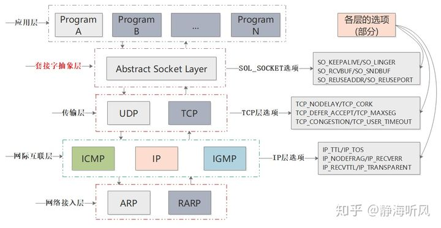
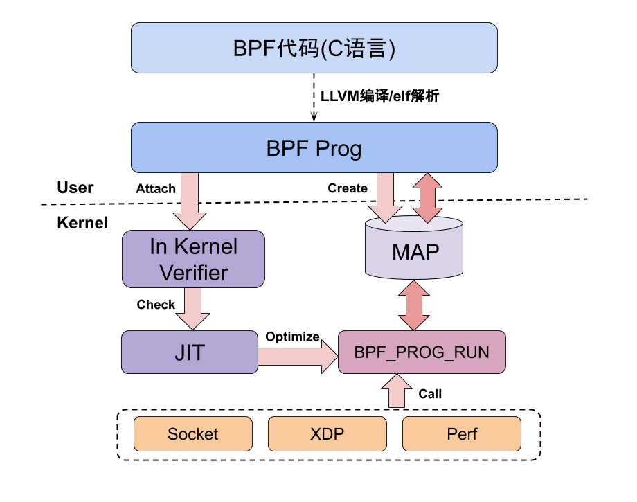
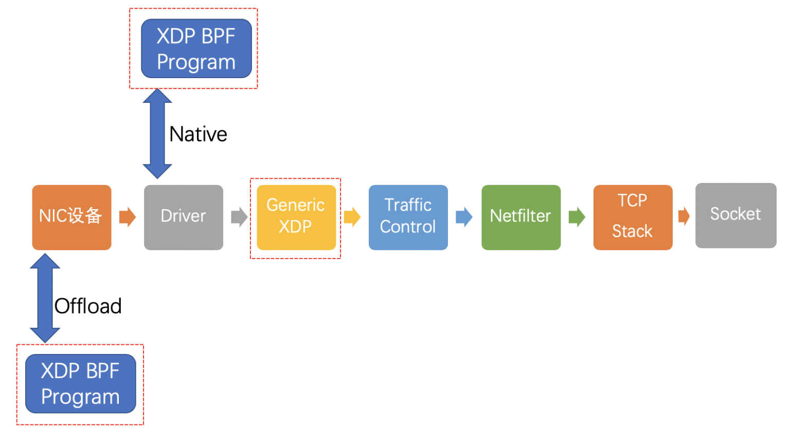

[toc]

# 前言

**来源**：[Linux Observability with BPF](https://www.oreilly.com/library/view/linux-observability-with/9781492050193/)

这里整理下该书第六章：Linux Networking and BPF

这一章，书上整理的并不是很好。有个缺点在于：书中想要展示“BPF程序如何在Linux内核网络栈中网络数据路径的不同阶段与 Socket Buffer 数据结构进行交互”；<font color=red>但是书中并没有介绍网络数据路径，也没有介绍这些BPF Hook在网络路径中的什么位置</font>。目前，我模糊知道不同情况下过滤位置。

<br>

# 摘要

介绍了三种在linux网络中使用BPF程序。两种用于监听，一种用于流量控制。

* tcpdump监听
* 原始套接字的数据包筛选监听。[将BPF_PROG_TYPE_SOCKET_FILTER类型的BPF程序及其map，附加到network interface对应(创建)的原始套接字上]
* TC BPF程序进行流量控制

<br>

# tcpdump监听

## 监听

官网：[tcpdump & libpcap](https://www.tcpdump.org/)

tcpdump是一个强大的命令行报分析工具。libpcap是以个可移植的C/C++网络流量捕获库。

至于tcpdump和libpcap之间有什么关系，我在官网没找见描述。我在[tcpdump -- wiki](https://zh.wikipedia.org/wiki/Tcpdump)看到：tcpdump 需要使用libpcap这个捕捉数据的库。

关于tcpdump，我用过一次：[MAC首部 IP首部 TCP首部介绍](https://blog.csdn.net/sinat_38816924/article/details/107558223)

关于libpcap，我用过一次：[数据包嗅探原理介绍](https://blog.csdn.net/sinat_38816924/article/details/107486376#t9)。

我们看一条tcpdump进行过滤的命令。这里没有指定网卡，默认监听第一块网卡。

```shell
sudo tcpdump -n 'ip and tcp port 8080'
```

* -n：不要将地址（即主机地址、端口号等）转换为name。
* 'ip and tcp port 8080'：匹配Boolean expression“IPv4，使用tcp协议，源端口或者目标端口为8080”；打印匹配的packets的内容。

按照这本书上的说法：Linux上的pcap过滤器已编译为BPF程序！而且由于tcpdump使用pcap过滤器进行过滤，这意味着每次使用过滤器执行tcpdump时，实际上是在编译和加载BPF程序来过滤数据包。

此时，我们来看下`ip and tcp port 8080`对应的BPF程序是什么内容。

tcpdump有一个`-d`选项：Dump the compiled packet-matching code in a human readable form to standard output and stop.

我们运行查看下输出是什么内容。

```shell
➜  sudo tcpdump -d 'ip and tcp port 8080'
(000) ldh      [12]
(001) jeq      #0x800           jt 2	jf 12
(002) ldb      [23]
(003) jeq      #0x6             jt 4	jf 12
(004) ldh      [20]
(005) jset     #0x1fff          jt 12	jf 6
(006) ldxb     4*([14]&0xf)
(007) ldh      [x + 14]
(008) jeq      #0x1f90          jt 11	jf 9
(009) ldh      [x + 16]
(010) jeq      #0x1f90          jt 11	jf 12
(011) ret      #262144
(012) ret      #0
```

<br>

## 套接字介绍

[UNIX网络编程](https://www.amazon.cn/dp/B01HZFHH6W/ref=sr_1_1?__mk_zh_CN=%E4%BA%9A%E9%A9%AC%E9%80%8A%E7%BD%91%E7%AB%99&dchild=1&keywords=UNIX%E7%BD%91%E7%BB%9C%E7%BC%96%E7%A8%8B&qid=1618838986&sr=8-1)，肯定是使用套接字很好的书籍。我看过前五章，记录在[这](https://blog.csdn.net/sinat_38816924/category_9811371.html)。

> [浅谈Linux下Socket选项设置](https://zhuanlan.zhihu.com/p/87305364)
>
> TCP/IP协议栈是Linux内核的重要组成部分和网络编程的基石。为满足应用层需求，系统对TCP/IP层进行细节屏蔽和抽象，<font color=red>Socket层就相当于TCP/IP和应用层之间的中间层</font>。

 

需要补充介绍的是[原始套接字](https://zh.wikipedia.org/wiki/%E5%8E%9F%E5%A7%8B%E5%A5%97%E6%8E%A5%E5%AD%97)。原始套接字（raw socket）是一种网络套接字，允许直接发送/接收**IP协议数据包**而不需要任何传输层协议格式。<font color=red>有了原始套接字， 进程可以读写内核不处理其协议字段的IPv4数据报</font>。

注意，我重点加粗了**IP协议数据包**。后面我们介绍的(BPF)原始套接字的数据包筛选，那个数据包包含MAC首部。不知道为啥不同。

<br>

## 阅读Linux Socket Filtering aka Berkeley Packet Filter (BPF)

官网：[Linux Socket Filtering aka Berkeley Packet Filter (BPF)](https://www.kernel.org/doc/html/latest/networking/filter.html#networking-filter)

在这一章中，linux套接字过滤(Linux Socket Filtering,LSF)是BPF(Berkeley Packet Filter)的别名。LSF来源于BPF。但是这里，两者过滤机制相同。我们平常说的bpf是ebpf，功能范围更大一些。

BPF允许用户空间程序将过滤器附加到任何套接字上。您只需创建过滤器代码，然后通过SO_ATTACH_FILTER选项将其发送到内核，如果您的过滤器代码通过了内核检查，(还需要JIT过程)您就开始在该套接字上过滤数据。

您还可以通过SO_DETACH_FILTER选项从套接字分离过滤器。这可能不会使用太多，因为当您关闭带有过滤器的插槽时，会自动删除该过滤器。另一种较不常见的情况是，在您有另一个过滤器仍在运行的同一套接字上添加另一个过滤器：内核负责删除旧过滤器，并将新过滤器放置在该位置，前提是您的过滤器已通过检查，否则，如果失败，旧的过滤器将保留在该套接字上。

**此结构的最大用户可能是libpcap。发出诸如tcpdump -i em1 port 22之类的高级过滤器命令，命令会通过libpcap内部编译器生成，该内部编译器生成最终可以通过SO_ATTACH_FILTER加载到内核的结构**。

尽管我们在这里仅谈论套接字，但是Linux中的BPF在更多地方得到了使用。There’s xt_bpf for netfilter, cls_bpf in the kernel qdisc layer, SECCOMP-BPF, and lots of other places such as team driver, PTP code, etc where BPF is being used.

[Original BPF paper]( http://www.tcpdump.org/papers/bpf-usenix93.pdf)

### 过滤器结构

用户空间应用程序所在的头文件是<linux/filter.h>，其中包含以下相关结构：

```c
struct sock_filter {    /* Filter block */
        __u16   code;   /* Actual filter code */
        __u8    jt;     /* Jump true */
        __u8    jf;     /* Jump false */
        __u32   k;      /* Generic multiuse field */
};
```

这样的结构被组装成一个由4个元组组成的数组，其中包含一个code，jt，jf和k值。jt和jf是要用于提供的代码的跳转偏移量；k用于所提供code的generic value：

```c
struct sock_fprog {                     /* Required for SO_ATTACH_FILTER. */
        unsigned short             len; /* Number of filter blocks */
        struct sock_filter __user *filter;
};
```

我们看一个示例。

```c
#include <sys/socket.h>
#include <sys/types.h>
#include <arpa/inet.h>
#include <linux/if_ether.h>
/* ... */

/* From the example above: tcpdump -i em1 port 22 -dd */
struct sock_filter code[] = {
        { 0x28,  0,  0, 0x0000000c },
        { 0x15,  0,  8, 0x000086dd },
        { 0x30,  0,  0, 0x00000014 },
        { 0x15,  2,  0, 0x00000084 },
        { 0x15,  1,  0, 0x00000006 },
        { 0x15,  0, 17, 0x00000011 },
        { 0x28,  0,  0, 0x00000036 },
        { 0x15, 14,  0, 0x00000016 },
        { 0x28,  0,  0, 0x00000038 },
        { 0x15, 12, 13, 0x00000016 },
        { 0x15,  0, 12, 0x00000800 },
        { 0x30,  0,  0, 0x00000017 },
        { 0x15,  2,  0, 0x00000084 },
        { 0x15,  1,  0, 0x00000006 },
        { 0x15,  0,  8, 0x00000011 },
        { 0x28,  0,  0, 0x00000014 },
        { 0x45,  6,  0, 0x00001fff },
        { 0xb1,  0,  0, 0x0000000e },
        { 0x48,  0,  0, 0x0000000e },
        { 0x15,  2,  0, 0x00000016 },
        { 0x48,  0,  0, 0x00000010 },
        { 0x15,  0,  1, 0x00000016 },
        { 0x06,  0,  0, 0x0000ffff },
        { 0x06,  0,  0, 0x00000000 },
};

struct sock_fprog bpf = {
        .len = ARRAY_SIZE(code),
        .filter = code,
};

// 从数据链路接收所有帧
sock = socket(PF_PACKET, SOCK_RAW, htons(ETH_P_ALL));
if (sock < 0)
        /* ... bail out ... */

ret = setsockopt(sock, SOL_SOCKET, SO_ATTACH_FILTER, &bpf, sizeof(bpf));
if (ret < 0)
        /* ... bail out ... */

/* ... */
close(sock);
```

<br>

### BPF指令集

在tools/bpf/下有一个名为bpf_asm的小型帮助程序工具，可用于编写上一部分中提到的示例场景的低级过滤器。此处提到的类似Asm的语法已在bpf_asm中实现，并将用于进一步的说明（原理是相同的，而不是直接处理可读性较低的操作码）。语法是根据[Original BPF paper](http://www.tcpdump.org/papers/bpf-usenix93.pdf)论文紧密建模的。

BPF体系结构包含以下基本元素：

| Element | Description                                                  |
| ------- | ------------------------------------------------------------ |
| A       | 32 bit wide accumulator                                      |
| X       | 32 bit wide X register                                       |
| M[]     | 16 x 32 bit wide misc registers aka “scratch memory store”, addressable from 0 to 15 |

程序会被bpf_asm翻译成上一节`struct sock_filter code`那样。

```
op:16, jt:8, jf:8, k:32
```

元素op是16位宽的操作码，具有特定的指令编码。jt和jf是两个8位宽的跳转目标，一个用于条件“如果为真则跳转”，另一个用于条件为“如果否则跳转”。最终，元素k包含杂项参数，具体取决于op中的给定指令，可以用不同的方式对其进行解释。

指令集由 load, store, branch, alu, miscellaneous and return instructions组成，这些指令也以bpf_asm语法表示。下表列出了所有可用的bpf_asm指令。在linux/filter.h中定义的底层操作码代表什么：

| Instruction | Addressing mode | Description           |
| ----------- | --------------- | --------------------- |
| ld          | 1, 2, 3, 4, 12  | Load word into A      |
| ldi         | 4               | Load word into A      |
| ldh         | 1, 2            | Load half-word into A |
| ldb         | 1, 2            | Load byte into A      |
| ldx         | 3, 4, 5, 12     | Load word into X      |
| ldxi        | 4               | Load word into X      |
| ldxb        | 5               | Load byte into X      |
| st          | 3               | Store A into M[]      |
| stx         | 3               | Store X into M[]      |
| jmp         | 6               | Jump to label         |
| ja          | 6               | Jump to label         |
| jeq         | 7, 8, 9, 10     | Jump on A == <x>      |
| jneq        | 9, 10           | Jump on A != <x>      |
| jne         | 9, 10           | Jump on A != <x>      |
| jlt         | 9, 10           | Jump on A < <x>       |
| jle         | 9, 10           | Jump on A <= <x>      |
| jgt         | 7, 8, 9, 10     | Jump on A > <x>       |
| jge         | 7, 8, 9, 10     | Jump on A >= <x>      |
| jset        | 7, 8, 9, 10     | Jump on A & <x>       |
| add         | 0, 4            | A + <x>               |
| sub         | 0, 4            | A - <x>               |
| mul         | 0, 4            | A * <x>               |
| div         | 0, 4            | A / <x>               |
| mod         | 0, 4            | A % <x>               |
| neg         |                 | !A                    |
| and         | 0, 4            | A & <x>               |
| or          | 0, 4            | A \| <x>              |
| xor         | 0, 4            | A ^ <x>               |
| lsh         | 0, 4            | A << <x>              |
| rsh         | 0, 4            | A >> <x>              |
| tax         |                 | Copy A into X         |
| txa         |                 | Copy X into A         |
| ret         | 4, 11           | Return                |

The next table shows addressing formats from the 2nd column:

| Addressing mode | Syntax      | Description                                     |
| --------------- | ----------- | ----------------------------------------------- |
| 0               | x/%x        | Register X                                      |
| 1               | [k]         | BHW at byte offset k in the packet              |
| 2               | [x + k]     | BHW at the offset X + k in the packet           |
| 3               | M[k]        | Word at offset k in M[]                         |
| 4               | #k          | Literal value stored in k                       |
| 5               | 4*([k]&0xf) | Lower nibble * 4 at byte offset k in the packet |
| 6               | L           | Jump label L                                    |
| 7               | #k,Lt,Lf    | Jump to Lt if true, otherwise jump to Lf        |
| 8               | x/%x,Lt,Lf  | Jump to Lt if true, otherwise jump to Lf        |
| 9               | #k,Lt       | Jump to Lt if predicate is true                 |
| 10              | x/%x,Lt     | Jump to Lt if predicate is true                 |
| 11              | a/%a        | Accumulator A                                   |
| 12              | extension   | BPF extension                                   |

Possible BPF extensions are shown in the following table:

| Extension  | Description                                      |
| ---------- | ------------------------------------------------ |
| len        | skb->len                                         |
| proto      | skb->protocol                                    |
| type       | skb->pkt_type                                    |
| poff       | Payload start offset                             |
| ifidx      | skb->dev->ifindex                                |
| nla        | Netlink attribute of type X with offset A        |
| nlan       | Nested Netlink attribute of type X with offset A |
| mark       | skb->mark                                        |
| queue      | skb->queue_mapping                               |
| hatype     | skb->dev->type                                   |
| rxhash     | skb->hash                                        |
| cpu        | raw_smp_processor_id()                           |
| vlan_tci   | skb_vlan_tag_get(skb)                            |
| vlan_avail | skb_vlan_tag_present(skb)                        |
| vlan_tpid  | skb->vlan_proto                                  |
| rand       | prandom_u32()                                    |

<br>

## 分析BPF代码

我们来看下`ip and tcp port 8080`对应的BPF指令含义。

```shell
➜  sudo tcpdump -d 'ip and tcp port 8080'
(000) ldh      [12]
(001) jeq      #0x800           jt 2	jf 12
(002) ldb      [23]
(003) jeq      #0x6             jt 4	jf 12
(004) ldh      [20]
(005) jset     #0x1fff          jt 12	jf 6
(006) ldxb     4*([14]&0xf)
(007) ldh      [x + 14]
(008) jeq      #0x1f90          jt 11	jf 9
(009) ldh      [x + 16]
(010) jeq      #0x1f90          jt 11	jf 12
(011) ret      #262144
(012) ret      #0
```

看懂这个含义，需要了解数据包的结构：[MAC首部 IP首部 TCP首部介绍](https://blog.csdn.net/sinat_38816924/article/details/107558223)

下面，我们一行一行看。

0. ldh      [12]

   将以太网帧的类型字段(2个字节)，加载到A累加寄存器。

1. jeq #0x800 jt 2 jf 12

   检查以太网帧类型是不是0x800[IPv4的标识符]。True,跳到2；False,则跳到12

2. ldb      [23]

   加载一个字节到A累加寄存器中。将IP首部中的协议

3. jeq #0x6 jt 4 jf 12

   TCP的协议号为6。判断是否为TCP协议。

4. ldh [20]

   加载两个字节:标志位+片偏移

5. jset     #0x1fff          jt 12	jf 6

   片段偏移量中存在数据，跳到12。否则跳到6。[ip数据包没有分片，则接着向下执行。]

6. ldxb     4*([14]&0xf)

   将一个字节加载到X寄存器。将IP首部字节长度加载到寄器。

7. ldh      [x + 14]

   此时x是ip首部长度，14是MAC首部长度。现在来到TCP首部，加载两个字节，源端口

8. jeq      #0x1f90          jt 11	jf 9

   0x1f90的十进制是8080；即源端口是8080，跳转11；否则跳9.

9. ldh      [x + 16] 、jeq      #0x1f90          jt 11	jf 12

   这两行是检查目标端口是否为8080。是的话跳11.不是的话，跳12.

10. ret      #262144

    所以如果对于IPv4，使用tcp协议，源端口或者目标端口是8080，则返回262144。表示要截取262144个字节数。这是默认值，可以使用tcpdump -s修改。

<br>

## 小结

tcpdump程序，借助libpcap进行监听。tcpdump发出的命令行命令，通过libpcap转换成BPF代码，使用SO_ATTACH_FILTER可以附加到任何套接字上。

<font color=red>套接字的位置在TCP/IP和用户程序之间。但是原始套接字不是在TCP/IP和用户程序之间。原始套接字没有被内核处理</font>。

没有tcpdump之前，如果想在用户空间监听IP信息，必须把数据包从内核空间复制到用户空间。[这里我感觉数据包和原始套接字等价]

 

如上图所示，tcpdump原理是将包过滤的表达式编译成特定伪机器码后, 由Kernel中的虚拟机执行; 每当网卡中有数据包过来时, 将其拷贝发送给BPF模块, 由BPF根据对应的过滤条件将过滤后的包发送给用户进程。这样监听的性能得到大大的提高。

<font color=red>此时的tcpdump(libpcap)用于监听。监听的时候，根据监听需要，过滤数据包。但是它并没有干扰原来的数据流向。如果不是处于监听的目的，而是为了流量控制，则需要[TC](https://davidlovezoe.club/wordpress/archives/952)和[XDP](https://davidlovezoe.club/wordpress/archives/937) </font>。

’<br>

# 原始套接字的数据包筛选监听

BPF_PROG_TYPE_SOCKET_FILTER[程序类型](https://blog.csdn.net/sinat_38816924/article/details/115607570#t14)允许您将BPF程序附加到套接字。这种程序还具有访问和处理map的能力。这些程序类型，在[linux内核文档](https://www.kernel.org/doc/html/latest/bpf/index.html)中没有写。官方权威的查看方法，我暂时不知道。[可能代码的注释中有？]

## 代码

这一节的代码，我看明白代码的作用。时间关系，我没有尝试去运行。这里代码的编译运行方式和[运行第一个bpf程序](https://blog.csdn.net/sinat_38816924/article/details/115556650)相同。

我这里仅仅粘贴下代码。可以参考书上的解释，或者参考[ebpf 研究之原始套接字数据包过滤](https://blog.csdn.net/Longyu_wlz/article/details/112393252)

```c
// bpf_program.c文件

#include <linux/bpf.h>
#include <linux/if_ether.h>
#include <linux/if_packet.h>
#include <linux/in.h>
#include <linux/ip.h>
#include <linux/string.h>
#include <linux/tcp.h>
#include <linux/types.h>
#include <linux/udp.h>

#ifndef offsetof
#define offsetof(TYPE, MEMBER) ((size_t) & ((TYPE *)0)->MEMBER)
#endif

#define SEC(NAME) __attribute__((section(NAME), used)) 

struct bpf_map_def {
  unsigned int type;
  unsigned int key_size;
  unsigned int value_size;
  unsigned int max_entries;
  unsigned int map_flags;
};

static int (*bpf_map_update_elem)(struct bpf_map_def *map, void *key,
                                  void *value, __u64 flags) = (void *)
    BPF_FUNC_map_update_elem;
static void *(*bpf_map_lookup_elem)(struct bpf_map_def *map, void *key) =
    (void *)BPF_FUNC_map_lookup_elem;

unsigned long long load_byte(void *skb,
                             unsigned long long off) asm("llvm.bpf.load.byte");

struct bpf_map_def SEC("maps") countmap = {
    .type = BPF_MAP_TYPE_ARRAY,
    .key_size = sizeof(int),
    .value_size = sizeof(int),
    .max_entries = 256,
};

SEC("socket")
int socket_prog(struct __sk_buff *skb) {
  int proto = load_byte(skb, ETH_HLEN + offsetof(struct iphdr, protocol));
  int one = 1;
  int *el = bpf_map_lookup_elem(&countmap, &proto);
  if (el) {
    (*el)++;
  } else {
    el = &one;
  }
  bpf_map_update_elem(&countmap, &proto, el, BPF_ANY);
  return 0;
}

char _license[] SEC("license") = "GPL";

```

```c
// load.c文件

#include <arpa/inet.h>
#include <assert.h>
#include <bpf/bpf.h>
#include <bpf/bpf_load.h>
#include <bpf/sock_example.h>
#include <errno.h>
#include <linux/bpf.h>
#include <linux/if_ether.h>
#include <stddef.h>
#include <stdio.h>
#include <stdlib.h>
#include <string.h>
#include <sys/socket.h>
#include <unistd.h>

char bpf_log_buf[BPF_LOG_BUF_SIZE];

int main(int argc, char **argv) {
  int sock = -1, i, key;
  int tcp_cnt, udp_cnt, icmp_cnt;

  char filename[256];
  snprintf(filename, sizeof(filename), "%s", argv[1]);

  if (load_bpf_file(filename)) {
    printf("%s", bpf_log_buf);
    return 1;
  }

  sock = open_raw_sock("lo");

  if (setsockopt(sock, SOL_SOCKET, SO_ATTACH_BPF, prog_fd,
                 sizeof(prog_fd[0]))) {
    printf("setsockopt %s\n", strerror(errno));
    return 0;
  }

  for (i = 0; i < 10; i++) {
    key = IPPROTO_TCP;
    assert(bpf_map_lookup_elem(map_fd[0], &key, &tcp_cnt) == 0);

    key = IPPROTO_UDP;
    assert(bpf_map_lookup_elem(map_fd[0], &key, &udp_cnt) == 0);

    key = IPPROTO_ICMP;
    assert(bpf_map_lookup_elem(map_fd[0], &key, &icmp_cnt) == 0);

    printf("TCP %d UDP %d ICMP %d packets\n", tcp_cnt, udp_cnt, icmp_cnt);
    sleep(1);
  }
}
```

<br>

## 小结

本节的BPF程序和上一节的BPF程序，都是附加在套接字上，进行监听目的的过滤。但是本节的BPF程序具有访问和处理map的能力。是ebpf的能力。

上一节是bpf，这一节是ebpf：[BPF与eBPF](http://sniffer.site/2019/11/07/BPF%E4%B8%8EeBPF/)

 

<br>

# TC BPF程序

<font color=red>上面介绍的都是监听。这里介绍的是流量控制</font>。

> TC全称「Traffic Control」，直译过来是「流量控制」

可以使用netfilter进行网络流量的过滤，可以参考我之前简单整理的内容：[使用netfilter自行构建一个简单的防火墙](https://blog.csdn.net/sinat_38816924/article/details/107649007#t4)

[TC可以比netfilter更早的进行流量控制](https://davidlovezoe.club/wordpress/archives/937)

 

关于tc的简单使用，可以参考：[你的第一个TC BPF 程序](https://davidlovezoe.club/wordpress/archives/952)

这里是书上的tc演示代码：[tc-flow-bpf-cls](https://github.com/da1234cao/programming-language-entry-record/tree/master/bpf/%E5%8F%82%E8%80%83%E4%BB%A3%E7%A0%81/code/chapter-6/tc-flow-bpf-cls)