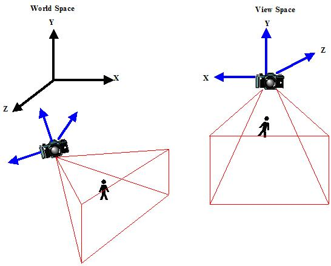
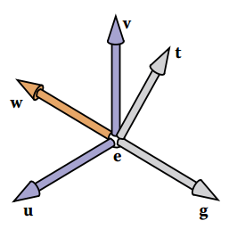
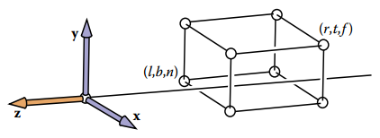
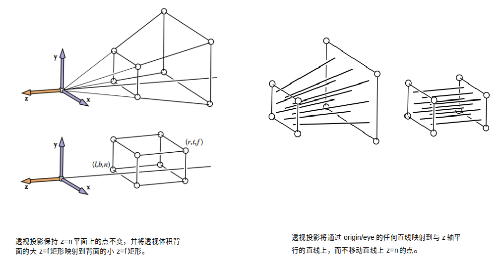
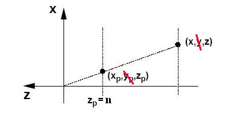

[toc]

## 摘要

介绍了相机变换、正交投影和透视投影。

 

## 相机变换

背景要求：我们需要明白坐标是是如何转换的，可以参考：[坐标变换](https://blog.csdn.net/sinat_38816924/article/details/118229002#t6)

我们希望能够改变三维视角，朝任何方向看。所谓的**相机变换**，就是以相机作为坐标原点的一个参考系。所以，从世界空间变换到相机空间，就是**把物体从世界坐标系，变换到相机为原点的相机坐标系**。如下图所示（[via](https://blog.csdn.net/popy007/article/details/5120158)）：左半部分是小人在世界空间中的位置，右半部分是小人变换到相机空间后的位置。。

 

有许多约定用于指定相机的位置和方向。我们将使用下面的表示：

* 相机的位置e（the eye position e）。
* 相机看向的方向g（the gaze direction g）。
* 相机的向上方向t（the view-up vector t）。

 

因为向量t和向量g不一定垂直。我们使用e、g、t，构建一个以e为原点的右手坐标系uvw，即相机的坐标系。

其中，$w = -\dfrac{g}{\Vert g \Vert}$，$u=\dfrac{t \times w}{\Vert t \times w \Vert}$，$v = w \times u$ 。

根据[坐标变换](https://blog.csdn.net/sinat_38816924/article/details/118229002#t6)，易得到，**世界坐标系xyz中任意一点P，在相机坐标系uvw中坐标表示**。

$\begin{bmatrix} u_p\\v_p\\w_p\\1 \end{bmatrix} = \begin{bmatrix}x_u&y_u&z_u&0\\x_v&y_v&z_v&0\\x_w&y_w&z_w&0\\0&0&0&1\end{bmatrix} \begin{bmatrix}1&0&0&-x_e\\0&1&0&-y_e\\0&0&1&-z_e\\0&0&0&1\end{bmatrix} \begin{bmatrix}x_p\\y_p\\z_p\\1\end{bmatrix} \tag{1}$

 

## 正交投影变换

**正交投影**：**把一个长方体盒子，投影到以原点为中心，边长为2的正方体($[-1,1]^3$)中**。

盒子的位置和体积信息如下：

 

$$x=l\equiv left \ plane$$

$$x=r\equiv right \ plane$$

$$y=b\equiv bottom \ plane$$

$$y=t\equiv top \ plane$$

$$z=n\equiv near \ plane$$

$$z=f\equiv far \ plane$$

其中需要注意的是，由于规定是视线沿着$-z$轴，所以$0>n>f$ 。

**正交投影**的操作也很简单，**先平移到原点，再缩放**。如有不明白可参考：[计算机图形学中的矩阵转换](https://blog.csdn.net/sinat_38816924/article/details/118229002)

$M_{ortho} = \begin{bmatrix} \dfrac{2}{r-l}&0&0&0\\ 0&\dfrac{2}{t-b}&0&0\\ 0&0&\dfrac{2}{n-f}&0\\ 0&0&0&1 \end{bmatrix} \begin{bmatrix} 1&0&0&-\dfrac{r+l}{2}\\ 0&1&0&-\dfrac{t+b}{2}\\ 0&0&1&-\dfrac{n+f}{2}\\ 0&0&0&1  \end{bmatrix} = \begin{bmatrix} \dfrac{2}{r-l}&0&0&-\dfrac{r+l}{r-l}\\ 0&\dfrac{2}{t-b}&0&-\dfrac{t+b}{t-b}\\ 0&0&\dfrac{2}{n-f}&-\dfrac{n+f}{n-f}\\ 0&0&0&1 \end{bmatrix} \tag{2}$

 

## 透视投影

### 目标要求

**透视投影：将一个台形投影到以原点为中心，边长为2的正方体($[-1,1]^3$)中**。

**这个操作分为两步**：第一步将台形投影到长方体中；第二步将长方体使用上面的正交投影，投影到$[-1,1]^3$中。

这个长方体有下面的要求：

1. 近平面上的点，投影前后位置不变。

2. 远平面上的点，投影前后，z轴位置不变。

3. 投影前后，台形中的点的(z)前后相对位置，在长方体中保持不变。

 

这里，我解释下为什么这个长方体有这些要求。

第一点解释：投影前后，宽(l,r)和高(d,t)的位置不变。即，透视投影第一步的变换矩阵，和，第二步正交投影的变换矩阵，操作的是相机坐标系下相同的值。只有这样，两个矩阵才能左乘叠加运算。**因为，透视投影第一步和正交投影均是在相机坐标系下的矩阵变换操作**。而**要想将这两步联合起来，必须要求这两个变换矩阵中的参数，在透视投影第一步之后，仍然不变，即要求宽和高的位置不变**。

第二点解释：理由同上，要求长(n,f)不变。

第三点解释：投影之后，仍然保留物体的相对深度信息。

 

### 变换矩阵推导

这个推导过程来自：[perspective projection-53:28-GAMES101](https://www.bilibili.com/video/BV1X7411F744?p=4)

[透视投影的标准模型](https://blog.csdn.net/Goncely/article/details/5397729)：设视点E位于原点，视平面P垂直于Z轴，且四边分别平行于x轴和y轴。如下图所示，我们将该模型称为透视投影的标准模型，其中视椎体的近截面离视点的距离为n，远截面离视点的距离为f，且一般取近截面为视平面。下面推导透视投影标准模型的变换方程。

 

设位于视椎体内的任意一点$X (x, y, z)$ 在视平面的透视投影为$Xp (x_p, y_p, z_p)$，从点$X$和$X_p$做$Z$轴的垂线，并分别在$X-Z$平面和$Y-Z$平面投影，下图是在$X-Z$平面上的投影结果。

  

根据三角形相似原理 ， 可得 ：$x_p=\dfrac{nx}{z}$

同理，在$Y-Z$平面投影，可得：$y_p=\dfrac{ny}{z}$

因为**投影之后，变成长方体。宽和高相等，但z轴方向上暂时不知道**。所以，$\begin{bmatrix}x\\y\\z\\1\end{bmatrix}$ 投影之后的的点为$\begin{bmatrix}x_p\\y_p\\?\\1\end{bmatrix}$ = $\begin{bmatrix}\dfrac{nx}{z}\\\dfrac{ny}{z}\\？\\1\end{bmatrix}$

分母上出现z，无法使用线性变换。我们使用齐次坐标的性质，所有元素乘以z，仍然是相同的点。

所以，$\begin{bmatrix}x\\y\\z\\1\end{bmatrix}$ **投影之后的的点**为$\begin{bmatrix}x_p\\y_p\\?\\1\end{bmatrix}$ = $\begin{bmatrix}\dfrac{nx}{z}\\\dfrac{ny}{z}\\？\\1\end{bmatrix}$ = $\begin{bmatrix}nx\\ny\\?\\z\end{bmatrix}$

目前，我们可以根据上面变换，得到部分变换矩阵，即 $\begin{bmatrix} n&0&0&0\\0&n&0&0\\A&B&C&D\\0&0&1&0 \end{bmatrix}$ 。其中A、B、C、D是四个未知的值。

根据上一节中的要求可知：近平面上任意一点$\begin{bmatrix}x\\y\\n\\1\end{bmatrix}$ 和远平面上一点$\begin{bmatrix}0\\0\\f\\1\end{bmatrix}$ ，经过上面的变换矩阵，仍然是原来的点不变。

所以：
$$
\left\{
\begin{array}{lr} 
\begin{bmatrix}n&0&0&0\\0&n&0&0\\A&B&C&D\\0&0&1&0\end{bmatrix} \begin{bmatrix}x\\y\\n\\1\end{bmatrix} = \begin{bmatrix}x\\y\\n\\1\end{bmatrix}  \\  

\begin{bmatrix} n&0&0&0\\0&n&0&0\\A&B&C&D\\0&0&1&0 \end{bmatrix} \begin{bmatrix}0\\0\\f\\1\end{bmatrix} = \begin{bmatrix}0\\0\\f\\1\end{bmatrix}
\end{array} 
\notag
\right.
$$
计算下得到：
$$
\left\{  
             \begin{array}{lr}  
             Ax+By+Cn+D=n^2  \\  
             Cf+D=f^2
             \end{array}  
             \notag
\right.
$$
**得**：$A=0,B=0,C=n+f,D=-fn$

此时，我们得到透视投影第一步，将台形投影到要求长方形中的，变换矩阵：$\begin{bmatrix} n&0&0&0\\0&n&0&0\\0&0&n+f&-nf\\0&0&1&0 \end{bmatrix}$ 

再左乘第二步的正交投影矩阵，得到**完整的透视投影矩阵如下**：

$\begin{bmatrix} \dfrac{2}{r-l}&0&0&-\dfrac{r+l}{r-l}\\ 0&\dfrac{2}{t-b}&0&-\dfrac{t+b}{t-b}\\ 0&0&\dfrac{2}{n-f}&-\dfrac{n+f}{n-f}\\ 0&0&0&1 \end{bmatrix} \begin{bmatrix} n&0&0&0\\0&n&0&0\\0&0&n+f&-nf\\0&0&1&0 \end{bmatrix} = \begin{bmatrix} \dfrac{2n}{r-l}&0&\dfrac{l+r}{l-r}&0\\ 0&\dfrac{2n}{t-b}&\dfrac{b+t}{b-t}&0\\ 0&0&\dfrac{f+n}{n-f}&\dfrac{2fn}{f-n}\\ 0&0&0&1 \end{bmatrix} \tag{3}$ 

 

## 附录

### 齐次坐标

齐次坐标在透视投影的含义是什么？上面，我仅仅使用了齐次坐标进行推导，但是我并不能够明白齐次坐标的含义。

可以参考：[齐次坐标 -- wiki](https://zh.wikipedia.org/wiki/%E9%BD%90%E6%AC%A1%E5%9D%90%E6%A0%87) | [什么是齐次坐标?](https://zhuanlan.zhihu.com/p/258437902)

 

### 验证透视投影的相对深度信息是否保留

上面将透视投影分为两步进行操作：投影到指定要求的长方体中；再进行正交投影；

第二步是不会影响物体的相对深度信息的。我们看下，第一步如何影响物体的深度信息。

第一步的变化矩阵为：$\begin{bmatrix} n&0&0&0\\0&n&0&0\\0&0&n+f&-nf\\0&0&1&0 \end{bmatrix}$ 。则台形内的点$\begin{bmatrix}x\\y\\z\\1\end{bmatrix}$，进过变换矩阵为$\begin{bmatrix}nx\\ny\\(n+f)z-nf\\z\end{bmatrix}$ = $\begin{bmatrix}\dfrac{nx}{z}\\\dfrac{ny}{z}\\(n+f)-\dfrac{nf}{z}\\1\end{bmatrix}$ 

所以，深度为$z$的点，第一步变换投影之后深度为$(n+f)-\dfrac{nf}{z}$，其中$0>n>f$。这是一个z的增函数，所以第一步保留了相对深度信息。

可得，上面的透视投影变换矩阵，保留了相对深度信息。

 

### 参考

[perspective projection-53:28-GAMES101](https://www.bilibili.com/video/BV1X7411F744?p=4)

[3D数学-透视投影](https://zhuanlan.zhihu.com/p/181696883)

《Fundamentals of Computer Graphics》Chapter 7: Viewing

