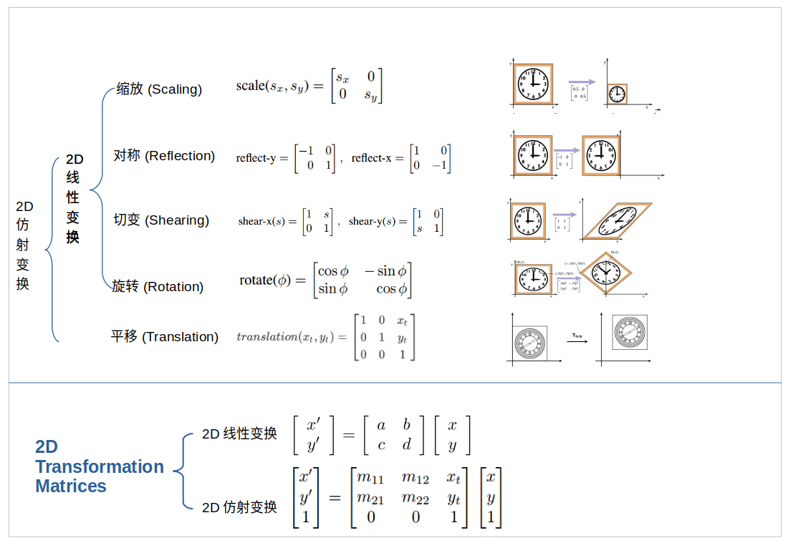
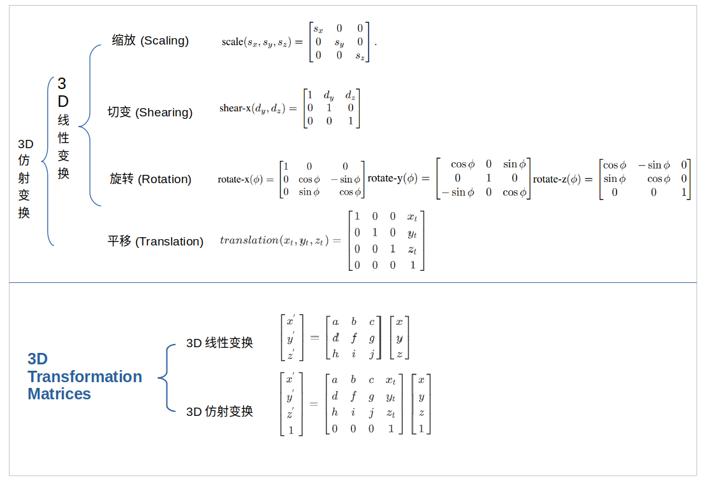
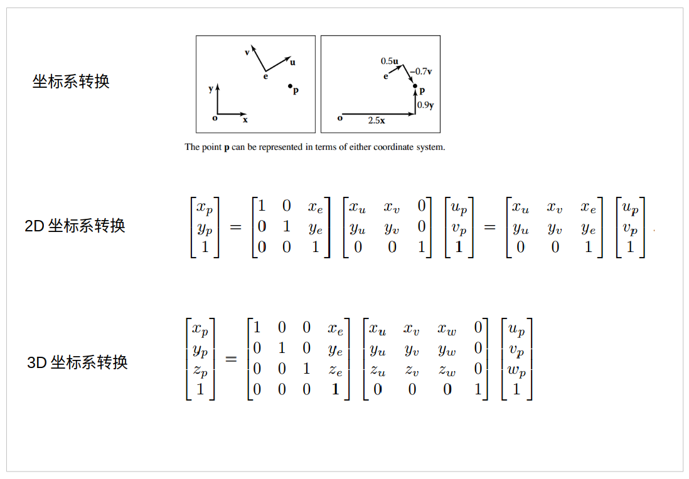
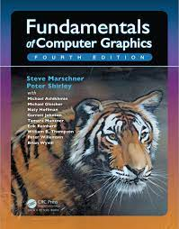

[toc]

## 前言

刷的视频：[GAMES101:现代计算机图形学入门](http://games-cn.org/intro-graphics/)  | 翻看的书籍：《Fundamentals of Computer Graphics》

这篇博客整理**计算机图形学中的矩阵转换**：2D/3D的平移与仿射变换、绕任意轴旋转的罗德里格旋转公式、坐标变换

参考：GAMES101的P1~P3.5 |《Fundamentals of Computer Graphics》的第1,2,5,6章节。

 

## 数学背景

[计算机图形学](https://zh.wikipedia.org/wiki/%E8%AE%A1%E7%AE%97%E6%9C%BA%E5%9B%BE%E5%BD%A2%E5%AD%A6)这个术语描述了使用计算机来创建和操作图像。

关于计算机图形学介绍(什么是计算机图形学)，可以参考：[overview of computer graphics](https://www.bilibili.com/video/BV1X7411F744?p=1) | [什么是计算机图形学? ](http://staff.ustc.edu.cn/~lgliu/Resources/SummerSchool/USTC-summer-school.html) | 《Fundamentals of Computer Graphics》第一章 计算机图形学介绍

数学在计算机中的应用有很多，可以参考：[数学在计算机图形学中的应用](http://staff.ustc.edu.cn/~lgliu/Resources/SummerSchool/USTC-summer-school.html) | 《Fundamentals of Computer Graphics》第二章 杂项数学 | 《Fundamentals of Computer Graphics》第五章 线性代数

根据视频内容，这里仅提及集合、向量和矩阵。

* 集合和映射：[高等数学 —— 映射与函数 —— 集合](https://blog.csdn.net/weixin_37490221/article/details/82808237)
* 向量的加、减、点乘、叉乘：[向量概述](https://zhuanlan.zhihu.com/p/143222979) | [机器学习的数学基础：向量篇](https://www.hahack.com/math/math-vector/#fn2) | [向量--wiki](https://zh.wikipedia.org/wiki/%E5%90%91%E9%87%8F)
* 矩阵的加、减、乘、求逆：[矩阵概述](https://zhuanlan.zhihu.com/p/144717539) | [伴随法求逆矩阵](https://www.shuxuele.com/algebra/matrix-inverse-minors-cofactors-adjugate.html) | [机器学习的数学基础：矩阵篇](https://www.hahack.com/math/math-matrix/)

 

## 矩阵变换 

### 2D/3D的平移与仿射变换

我把二维和三维的矩阵变换，分别撺掇到一张图里面。这里略去矩阵的由来，详见“前言”中的书籍和视频。

 

 

 

### 绕任意轴旋转的罗德里格旋转公式

这里补充一个[罗德里格旋转公式](https://en.wikipedia.org/wiki/Rodrigues%27_rotation_formula)：在给定转轴和旋转角度后，旋转一个向量的有效算法

如果，你想看这个公式的推导过程，可以参考这个视频：[罗德里格旋转公式的推导](https://www.bilibili.com/video/BV1yW41177Y8?p=3)

$\mathbf{R}(\mathbf{n}, \alpha)=\cos (\alpha) \mathbf{I}+(1-\cos (\alpha)) \mathbf{n} \mathbf{n}^{T}+\sin (\alpha) \underbrace{\left(\begin{array}{ccc}0 & -n_{z} & n_{y} \\n_{z} & 0 & -n_{x} \\-n_{y} & n_{x} & 0\end{array}\right)}_{\mathbf{N}}$

 

### 坐标变换

将上面矩阵转换的内容应用下，易得到**坐标变换**：同一个点在不同坐标系下的转换。

其实也不是特别容易得到，哈哈哈。我解释下。

问题描述：空间中有一个点P；空间中有两个坐标系，分别是xy和uv；这两个坐标系都能看到这一点，所以有不同的表示方法；已知P点在uv坐标系中的表示，如何推出P点在xy中的表示？

我们先考虑一个我们熟悉的生活例子。假设周围环境为禁止状态；路上的公交车速度是30km/h；车中坐着一个人；请问人相对于周围环境的速度？很简单嘛，人相对于周围环境的速度的速度是30km/h。

**类似思考，我们再来看坐标转换的问题。如果我们知道如何从xy变换得到uv，并把这个变换矩阵附加到P点上，则能得到P点在xy中的坐标表示**。

如果你还不明白。可以这样想，uv相对于xy叠了一层buff。但是P点在uv中是感受不到这层buff的。但是相对于xy，P点是存在这层buff的。而，P点相对与xy的这层buff，等于uv相对于xy的buff。（这里的buff就是变换矩阵）

**所以，我们先要得到xy到uv的变换矩阵。P点的uv坐标，左乘这个变换矩阵，就得到了P点的yx坐标**。

得到这个变换矩阵分为两步：先旋转，在平移。所以，如下图所示：

 

**如果已知P点的xyz坐标，求解uvw的坐标，只需要将上面的转换方程取逆即可**。其中旋转矩阵是正交矩阵，它的逆矩阵等于对称阵；而平移矩阵，在平移的位置加上负号就好；由于是两个矩阵乘积的逆，所以两个逆矩阵互换下位置。如下图所示：

$\left[\begin{array}{c}u_{p} \\v_{p} \\w_{p} \\1\end{array}\right]=\left[\begin{array}{cccc}x_{u} & y_{u} & z_{u} & 0 \\x_{v} & y_{v} & z_{v} & 0 \\x_{w} & y_{w} & z_{w} & 0 \\0 & 0 & 0 & 1\end{array}\right]\left[\begin{array}{cccc}1 & 0 & 0 & -x_{e} \\0 & 1 & 0 & -y_{e} \\0 & 0 & 1 & -z_{e} \\0 & 0 & 0 & 1\end{array}\right]\left[\begin{array}{c}x_{p} \\y_{p} \\z_{p} \\1\end{array}\right]$

 

## 附录

该附录中记录有趣而又不是与本博客特别相关的内容。

 

### 如何快速入门学习

反复打磨形成优质的书籍 + 大佬讲解形成优质的视频 = 一条可以高效学习的道路。

一年前，我总结了[如何读一本计算机书](https://blog.csdn.net/sinat_38816924/article/details/105906056)：为什么阅读这本书籍、为什么选这本书籍、如何读一本书。

今天，我总结下，如何快速入门学习：

1. 首先是找学习资源：优质的视频和优质的书籍。

2. 刷视频：看视频遇到不明白的地方暂停，通过博客或其他站点的视频来解决迷惑，然后接着刷直到视频结束。
3. 在视频内容基本明白之后，翻阅书籍中相应的章节。
4. 完成相应的练习。
5. 将理解的树状知识点结构整理成博客。
6. 2至5步循环，直到视频结束。此时应当有一点点入门的知识框架。

 

### 虎书封面的由来

我们时常看到计算机的相关书籍，采用动物作为封面。这是O’Reilly出版社的原因，可以参考：[为什么许多计算机相关书籍都以动物做封面？](https://blog.csdn.net/qq_45946755/article/details/104796146)

我看了下《Fundamentals of Computer Graphics》书中的出版商是[Taylor & Francis](https://china.taylorandfrancis.com/about-us/#)，不是O’Reilly。

那这本书，为什么采用“水中的老虎”作为cover？该书在前言，说明了原因。

 

封面中这只老虎的艺术图片名叫“Tiger in the Water”。它是J. W. Baker的作品。可惜的是，我在[J. W. Baker - Artist](http://www.jwbart.com/)中，没有找到这幅作品。

> “艺术是最深刻的讲故事的方式——一幅画可以与许多观看它的人进行个人交流——艺术有能力准确地传达观众的需求无论是灵感、内省，还是看着令人赏心悦目的事物的简单快乐。”

选这张图片作为书的封面，是参考了 Alain Fournier(1943–2000) 于1998年在康奈尔大学的一个研讨会上的精彩演讲。他精彩演讲的内容是老虎的动作。 他总结了自己的观点：尽管在过去的35年中，计算机图形学的建模和渲染有了巨大的改进，但我们仍然没有达到可以自动(不需要艺术家/专家仔细手动调整的方式)模拟在河中游泳的老虎的所有精彩细节的地步。

**坏消息是我们还有很长的路要走**。

**好消息是我们还有很长的路要走**。

1
