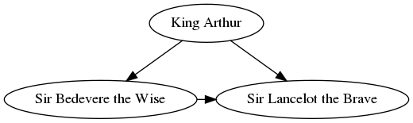
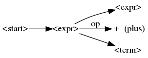

[toc]

## 前言

---

前两天，我尝试使用plantuml绘制uml图：[UML图的使用](https://blog.csdn.net/sinat_38816924/article/details/113416980)。

今天，尝试绘制[DOT语言](https://zh.wikipedia.org/wiki/DOT%E8%AF%AD%E8%A8%80) 描述的图。这样可以使用代码的方式生成图，是不是很cool。

从而，对于一些计算机程序图形，可以告别使用[processon](https://www.processon.com/)。

<br>

## 摘要

---

首先介绍DOT语言。

接着，演示使用plantuml和python这两个工具渲染DOT语言描述的图。(好像都是使用的[graphviz](https://pypi.org/project/graphviz/))

最后讲解下[fuzzing book中使用DOT语言，图像化展示分析树的实现代码](https://www.fuzzingbook.org/html/GrammarFuzzer.html#Representing-Derivation-Trees)。

本质：DOT语言描述图＋渲染

<br>

## DOT语言

---

详见：[DOT语言 -- wiki](https://zh.wikipedia.org/wiki/DOT%E8%AF%AD%E8%A8%80) | [DOT语言入门和特性 -- graphviz文档](http://www.graphviz.org/documentation/)

> **DOT语言是一种文本图形描述语言**。它提供了一种简单的描述图形的方法，并且可以为人类和计算机程序所理解。DOT语言文件通常是具有.gv或是.dot的文件扩展名。 

<font color=red>【重点】</font>第二个链接中翻阅这两篇：[The DOT Language](http://www.graphviz.org/doc/info/lang.html) |[Node, Edge and Graph Attributes](http://www.graphviz.org/doc/info/attrs.html)。

大概了解：DOT语言的定义、子图的使用、字符编码。

大概了解下，节点、边、图的属性查找。

> By default, DOT assumes the UTF-8 character encoding.
>
> DOT语言默认使用UTF-8编码。
>
> In quoted strings in DOT, the only escaped character is double-quote ("). That is, in quoted strings, the dyad \" is converted to "; all other characters are left unchanged. In particular, \\ remains \\. Layout engines may apply additional escape sequences.
>
> 在DOT中，双引号中的内容，除了“，都不需要转译。除了它，其他字符都是原样输出。但是布局引擎可以应用额外的转义序列。(确实如此，我尝试了)

<br>

## 渲染DOT语言描述的图

---

### plantuml工具渲染

[plantuml -- DOT](https://plantuml.com/zh/dot)

> DOT diagrams are usually formatted as `@startdot...@enddot`. 

```dot
// 代码来源：https://en.wikipedia.org/wiki/DOT_(graph_description_language)
@startuml plantuml_render_dot
digraph foo {
  node [style=rounded]
  node1 [shape=box]
  node2 [fillcolor=yellow, style="rounded,filled", shape=diamond]
  node3 [shape=record, label="{ a | b | c }"]

  node1 -> node2 -> node3
}
@enduml
```

　

```dot
    // 代码来源：http://www.graphviz.org/doc/info/shapes.html#record
    @startdot plantuml_render_dot_2
    digraph structs {
        node [shape=record];
        struct1 [label="<f0> left|<f1> mid&#92; dle|<f2> right"];
        struct2 [label="<f0> one|<f1> two"];
        struct3 [label="hello&#92;nworld |{ b |{c|<here> d|e}| f}| g | h"];
        struct1:f1 -> struct2:f0;
        struct1:f2 -> struct3:here;
    }
    @enddot
```

 

确实牛皮。

### python工具渲染

<font color=red> 【重点】</font> [graphviz PyPI](https://pypi.org/project/graphviz/)

> This package facilitates the creation and rendering of graph descriptions in the [DOT](https://www.graphviz.org/doc/info/lang.html) language of the [Graphviz](https://www.graphviz.org) graph drawing software ([master repo](https://gitlab.com/graphviz/graphviz/)) from Python.

```python
# 代码来源：https://pypi.org/project/graphviz/
    
from graphviz import Digraph

dot = Digraph(comment='The Round Table')
dot.node('A', 'King Arthur')
dot.node('B', 'Sir Bedevere the Wise')
dot.node('L', 'Sir Lancelot the Brave')
dot.edges(['AB', 'AL'])
dot.edge('B', 'L', constraint='false')
print(dot.source)
# dot.render('test-output/round-table.gv', view=True,format='png')
dot
```

```python
// The Round Table
digraph {
	A [label="King Arthur"]
	B [label="Sir Bedevere the Wise"]
	L [label="Sir Lancelot the Brave"]
	A -> B
	A -> L
	B -> L [constraint=false]
}
```


 

<br>

## fuzzing book中的DOT

---

来源：[Representing Derivation Trees](https://www.fuzzingbook.org/html/GrammarFuzzer.html#Representing-Derivation-Trees)

数据的存储结构。

节点&边：(SYMBOL_NAME, CHILDREN)。
- SYMBOL_NAME是节点名，str结构；
- CHILDREN是孩子节点，list结构。CHILDREN可以是一些特殊的值
    - None ，一个非终结符的占位符。
    - [] ，表示该节点没有孩子，当前节点是终结符。

```python
derivation_tree = ("<start>",
                   [("<expr>",
                     [("<expr>", None),
                      (" + ", []),
                         ("<term>", None)]
                     )])
```

要使用DOT语言，将上面的数据结构，绘制成下图。

　

<br>

1. **第一步**：导入需要的包。

	```python
	from graphviz import Digraph
	import re
	```

2. **第二步**：将字符串中的特殊字符转译。

	需要注意的是，DOT语言中，除了`”`，都不需要使用`\`转译。

	> http://www.graphviz.org/doc/info/lang.html
	>
	> all other characters are left unchanged.

	但是，使用py的graphviz，需要转译。

	> https://graphviz.readthedocs.io/en/stable/manual.html#backslash-escapes
	>
	> The Graphviz layout engine supports a number of [escape sequences]	(https://www.graphviz.org/doc/info/attrs.html#k:escString) such as `\n`, `\l`, 	`\r`

	```python
	def dot_escape(s):
	    """Return s in a form suitable for dot"""
	    s = re.sub(r'([^a-zA-Z0-9" ])', r"\\\1", s)
	    return s
	```

3. **第三步**：转换编码。

   其实，这里不需要将UTF-8编码转换成ASIIC码。因为DOT语言默认采用UTF-8编码。

   但鉴于这个转码函数，写的很漂亮，这里采用下转码。

   ```python
   # Escaping unicode characters into ASCII for user-facing strings
   def unicode_escape(s, error="backslashreplace"):
       def ascii_chr(byte):
           if 0 <= byte <= 127:
               return chr(byte)
           return r"\x%02x" % byte
   
       bytes = s.encode('utf-8', error)
       # if not isinstance(bytes[0],int):
       #     assert("unicode_esapce_function type error")
   return "".join(map(ascii_chr, bytes))
   ```
* s.encode('utf-8')将str类型的字符串转换成bytes对象。
  
     > [str.encode()](https://docs.python.org/zh-cn/3/library/stdtypes.html#str.encode)的返回值是“Return an encoded version of the string as a bytes object.”
     >
  > [bytes 对象](https://docs.python.org/zh-cn/3/library/stdtypes.html#bytes)是由单个字节构成的不可变序列。
  
* ascii_chr函数，将单个字节大于127的使用两位的十六进制字符串表示。
  
  这里就涉及到，为什么是这样转换。即如何不出错的将UTF-8编码转换成ASIIC码？
  
     > [字符编码笔记：ASCII，Unicode 和 UTF-8](http://www.ruanyifeng.com/blog/2007/10/ascii_unicode_and_utf-8.html)
     >
  > 要看明白上面的链接介绍。便会明白：变长的UTF-8编码，大于127的没一个字节，都是以１开头。所以，ascii_chr函数这样转换
  
* r"str"，表示[原始字符串](https://docs.python.org/zh-cn/3/reference/lexical_analysis.html#literals)。字符串和字节串都可以加前缀 `'r'` 或 `'R'`，称为 *原始字符串*，原始字符串把反斜杠当作原义字符，不执行转义操作。
  
* py中的map函数
  
     > [map(function, iterable, ...)](https://docs.python.org/3/library/functions.html#map)
     >
     > Return an iterator that applies *function* to every item of *iterable*, yielding the results.


4.  **第四步**：设置点、边、图的属性

   采用类似于“左根右”的遍历方式，给节点编号(id)。

   ```python
   def extract_node(node, id):
       symbol, children, *annotation = node
       return symbol, children, ''.join(str(a) for a in annotation)
   
   def default_node_attr(dot, nid, symbol, ann):
       dot.node(repr(nid), dot_escape(unicode_escape(symbol)))
   
   def default_edge_attr(dot, start_node, stop_node):
       dot.edge(repr(start_node), repr(stop_node))
   
   def default_graph_attr(dot):
       dot.attr('node', shape='plain')
   ```


5. **第五步**：遍历图，生成DOT图，并渲染

   ```python
   def display_tree(derivation_tree,
                    log=False,
                    extract_node=extract_node,
                    node_attr=default_node_attr,
                    edge_attr=default_edge_attr,
                    graph_attr=default_graph_attr):
   
       # If we import display_tree, we also have to import its functions
       from graphviz import Digraph
   
       counter = 0
   
       def traverse_tree(dot, tree, id=0):
           (symbol, children, annotation) = extract_node(tree, id)
           node_attr(dot, id, symbol, annotation)
   
           if children:
               for child in children:
                   nonlocal counter
                   counter += 1
                   child_id = counter
                   edge_attr(dot, id, child_id)
                   traverse_tree(dot, child, child_id)
   
       dot = Digraph(comment="Derivation Tree")
       graph_attr(dot)
       traverse_tree(dot, derivation_tree)
       if log:
           print(dot)
       return dot
   ```

   ```python
   dot = display_tree(derivation_tree,log=True)
   # dot.render('test-output/derivation_tree.gv', view=True,format='png')
   dot
   ```

   ```python
   // Derivation Tree
   digraph {
   	node [shape=plain]
   	0 [label="\<start\>"]
   	0 -> 1
   	1 [label="\<expr\>"]
   	1 -> 2
   	2 [label="\<expr\>"]
   	1 -> 3
   	3 [label=" \+ "]
   	1 -> 4
   	4 [label="\<term\>"]
   }
   'test-output/derivation_tree.gv.png'
   ```
	


6. **第六步** ：给边或点，补上点注释。

   ```python
   def display_annotated_tree(tree, a_nodes, a_edges, log=False):
       def graph_attr(dot):
           dot.attr('node', shape='plain')
           dot.graph_attr['rankdir'] = 'LR'
   
       def annotate_node(dot, nid, symbol, ann):
           if nid in a_nodes:
               dot.node(repr(nid), "%s (%s)" % (dot_escape(unicode_escape(symbol)), a_nodes[nid]))
           else:
               dot.node(repr(nid), dot_escape(unicode_escape(symbol)))
   
       def annotate_edge(dot, start_node, stop_node):
           if (start_node, stop_node) in a_edges:
               dot.edge(repr(start_node), repr(stop_node),
                        a_edges[(start_node, stop_node)])
           else:
               dot.edge(repr(start_node), repr(stop_node))
   
       return display_tree(tree, log=log,
                    node_attr=annotate_node,
                    edge_attr=annotate_edge,
                    graph_attr=graph_attr)
   ```

   

