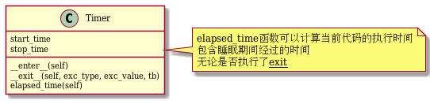

[toc]

## 前言

---

[《The Fuzzing Book》](https://www.fuzzingbook.org/html/00_Table_of_Contents.html) 或许是一本模糊测试导论性质书籍。里面的代码用以辅助理解概念。

由于书本内容挺多，我仅仅挑选当下需要的章节学习。

书中代码是通过类的方式进行构建，章节之间的依赖，通过类的继承实现。

尴尬的是，我看到后面章节的时候，前面章节类的结构忘记了。

恰好，我知道[UML](https://zh.wikipedia.org/wiki/%E7%BB%9F%E4%B8%80%E5%BB%BA%E6%A8%A1%E8%AF%AD%E8%A8%80)这个概念。用UML结构来记录类之间的关系。

下面简单记录[UML类图](https://zh.wikipedia.org/wiki/%E9%A1%9E%E5%88%A5%E5%9C%96)的学习&实践过程。

<br>

## 简单了解UML类图

---

两个入门示例：[看懂UML类图和时序图](https://design-patterns.readthedocs.io/zh_CN/latest/read_uml.html) | [UML类图入门，看完基本懂了怎么画图了](http://www.uml.org.cn/oobject/201905073.asp)

这个似乎详细写，但我暂时没看：[UML Tutorial](https://www.tutorialspoint.com/uml/index.htm)

<font color=red>下面，我们简单搬运下链接中的内容</font> 

请看以下这个类图，类之间的关系是我们需要关注的：


- 车的类图结构为\<\<abstract\>\>，表示车是一个抽象类；
- 它有两个继承类：小汽车和自行车；它们之间的关系为实现关系，使用带空心箭头的虚线表示；
- 小汽车为与SUV之间也是继承关系，它们之间的关系为泛化关系，使用带空心箭头的实线表示；
- 小汽车与发动机之间是组合关系，使用带实心箭头的实线表示；
- 学生与班级之间是聚合关系，使用带空心箭头的实线表示；
- 学生与身份证之间为关联关系，使用一根实线表示；
- 学生上学需要用到自行车，与自行车是一种依赖关系，使用带箭头的虚线表示；

好多箭头，记不得；可以参考下图标识。


<br>

## fuzzing book中的UML图实现

---

### 软件测试介绍

[软件测试简介](https://blog.csdn.net/sinat_38816924/article/details/110664084)

```uml
@startuml 1_introduce_software_test

class Timer{
    start_time
    stop_time
    __enter__(self)
    __exit__(self, exc_type, exc_value, tb)
    elapsed_time(self)
}
note right of Timer
    elapsed_time函数可以计算当前代码的执行时间
    包含睡眠期间经过的时间
    无论是否执行了__exit__
end note

@enduml
```

 

### 模糊测试介绍

[模糊测试简介](https://blog.csdn.net/sinat_38816924/article/details/110880475)

```uml
@startuml 2_break_thing_with_random_input

class Runner{
    PASS = "PASS"
    FAIL = "FAIL"
    UNRESOLVED = "UNRESOLVED"
    __init__(self)
    (inp, self.UNRESOLVED) run(self,inp)
}
note right of Runner
    Runner为基类（不是抽象类）
    使用inp作为输入
    返回结果和三种结果状态中的一种
    此时init和run方法啥也没干
end note


class ProgramRunner{
    program
    __init__(self,program)
    run_process(self,inp="")
    (result,outcome) run(self,inp="")
}
Runner <|-- ProgramRunner
note right of ProgramRunner
    ProgramRunner类继承Runner类
    init方法读取将要运行的程序名
    run方法读取输入，并调用run_process,将输入传递给run_process
    run_process使用子进程运行程序
end note


class Fuzzer{
    __init__(self)
    string fuzz(self)
    (result,outcome) run(self,runner=Runner())
    (result,outcome)[] runs(self,runner=PrintRunner(),trials)
}
Fuzzer ..> Runner
note right of Fuzzer
    Fuzzer是一个基础类
    fuzz方法生成测试的输入内容
    run方法使用Runner类生成的一个对象来运行被测试程序；
        被测试的程序使用fuzz方法生成的内容作为输入
    runs方法多次调用run方法，调用次数为trials
end note

class RandomFuzzer{
    __init__(self, min_length, max_length,char_start, char_range)
    string fuzz(self)
}
RandomFuzzer --|> Fuzzer
note right of RandomFuzzer
    RandomFuzzer继承Fuzzer类
    init方法读取参数：随机字符串的最小长度、最大长度、字符的开始值、字符的最大值
    fuzz根据参数的限制，随机生成字符串
end note
@enduml

```


### 代码覆盖率简介

[代码覆盖率简介](https://blog.csdn.net/sinat_38816924/article/details/111070878)

```uml
@startuml 3_code_coverage
class Coverage{
    _trace[]
    origin_trace_function
    __init__self
    __enter__(self)
    traceit(self,frame,event,arg)
    __exit__(self,exc_type, exc_value, tb)
    trace(self)
    coverage(self)
}
note right of Coverage
    这个类写的很好
    _trace[]用来存储代码运行过程中的函数名和行号
    _trace[]属性在__init__方法中添加
    __enter__方法，获取当前trace函数存入origin_trace_function
                  settrace为traceit
    traceit方法，在原来trace函数的基础上，添加记录函数名和行号到_trace[]
    __exit__方法，还原使用原来的trace函数
    <b>trace方法</b>,返回_trace[]
    <b>coverage方法</b>，返回set(_trace[])
end note
@enduml
```


<br>

## 其他

1. [使用PlantUML绘制UML](https://plantuml.com/zh/)

   我使用的是`vscode`中的`plantuml`插件；插件介绍需要安装`java`和`graphviz`；

   我尝试直接运行`sudo apt install plantuml` ；之后在`vscode`中可以自由的使用`plantmul`了。

2. 遗憾的是，我对面向对象这一套并不熟悉。这在某种程度上限制了我对UML工具的使用。

   python包中既包含类，也包含单个的函数。我暂时不知道如何使用一个packet同时包含类和函数的UML表示方法。目前仅仅知道点类图的画法，作为工具，palntuml还是很好用的。