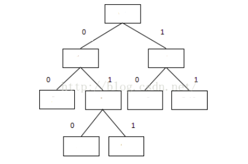

[toc]

## 前言

来源：[Concolic Fuzzing](https://www.fuzzingbook.org/html/ConcolicFuzzer.html)

建议阅读原文，我这里仅仅整理下思路：[fuzzing仓库](https://github.com/da1234cao/programming-language-entry-record/tree/master/fuzzing)

**建议**先阅读这篇文章：[SMT简介](https://blog.csdn.net/sinat_38816924/article/details/114178382)

 

## 整体描述

AFL可以通过插桩的方式，记录代码覆盖率，并使测试趋向于发现新路径。这个过程是覆盖率引导的模糊测试，而非覆盖率控制的模糊测试。如果已知执行路径(覆盖率=set(执行路径))，能否提供某个输入，并确保其可以执行某条没有执行的路径呢？

比如上图，方框表示代码块，连线表示路径。假设我们已知，某个输入的执行路径是011；那么，我们是否可以提供一个输入，确保其可以至少执行包含00这条路径。

可以的，[动态符号执行](https://en.wikipedia.org/wiki/Concolic_testing)，可以做到。[这里](https://blog.csdn.net/sinat_38816924/article/details/114178382#t5)已经介绍过，所以不在介绍。

下面，我们考虑的内容是**如何实现动态符号执行**。我们以整数为例，进行说明。

首先，我们需要考虑的是，如何将符号和具体的值绑定在一起。和python中int类相似，我们创建一个zInt类。zInt类需要包含三个属性：整数属性，符号属性，具体int值属性。此时，当传入一个int的形式实数的时候，我们的代码自动将int的对象包装成zInt的对象。当然，这个自动过程，需要按照需求完成[\_\_call\_\_](https://docs.python.org/zh-cn/3/reference/datamodel.html?highlight=__call__#object.__call__)方法。

接着，我们需要考虑zInt类型的方法。首先需要考虑的是加减(乘除)的二元运算。当两个zInt对象相加的时候，符号与符号相加，具体值之间相加，类似于复数的操作；当zInt对象和int值相加的时候，我们需要先对int使用z3.IntVal()进行转换。这种方式，架起符号和具体值之间操作的桥梁。类似的，需要完成比较操作等方法。

和zInt类似，我们还需要完成对bool类型，string类型等包装。

当上面的数据结构准备完成之后，我们将具体的实参传入。实参会自动转化成我们包装的对应的类。在顺序执行过程中，如果和这行实参相关，会使用符号和具体值同时在计算。当遇到分支结构的时候，执行True分支路径，保存当前False分支路径。当该路径执行完成之后，则已经保存了很多False分支路径。此时，我们对False分支，使用求解器进行求解，如果满足约束，则可以得到新的输入。重复这个过程，直到所有False分支路都被执行。

至此，动态符号执行完成。但是动态符号执行，有时候会遇到无论如何也满足不了的约束。

比如对于使用语法生成的字符串输入，在动态符号执行时，遇到`Not(str.substr(str.substr(db_select_s_str_1, 7, 29), 23, 6) =="inventory")`。从字符串的第七的位置取长度为29的子串。然后再从该子串的第23的位置，取长度为6的子串。使得最后的子串等于"inventory"。由于长度不相等，这是无论如何也无法满足的。因为动态符号执行每次到这里都是失败，这可能导致程序无法深入的测试。

如果该输入由语法生成，那么我们可以在语法中加入，直接生成"inventory"的条件。

但是，程序是相对静止，数据是多变的。人工手动修改语法并不是一个好的办法。那如何自动实现这个功能？

我们举例讲解。

对于一个这样的字符串“'select I/k-z-A(z)/W(q,S) from G.2fN0'”，程序的比较中，需要最后一部分为'inventory'。

第一步：我们通过语法分析，得知“G.2fN0”是由文法规则中的‘<table>’推导出来的。

第二步：对z3字符串表达式分析，并收集所有与原始实参的子字符串的直接字符串比较。得知，“inventory”要和字符串从30位置开始，长度为6的子字符串（“G.2fN0”）比较。

第三步：结合第一步和第二部，我们在语法中，添加可以直接从'\<table\>' 推导出来'inventory'的规则。

这样，便可以在语法生成输入的模糊测试中，通过分析动态符号执行过程中的约束条件，自动完善语法，提高测试效率。