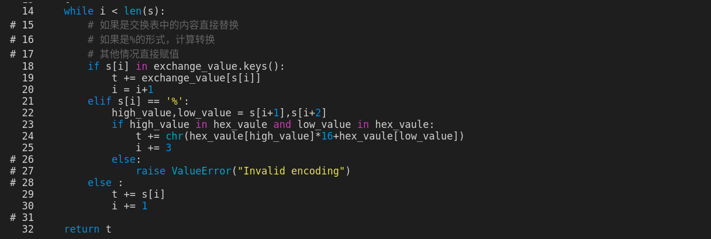
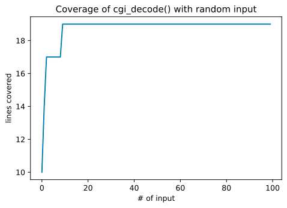
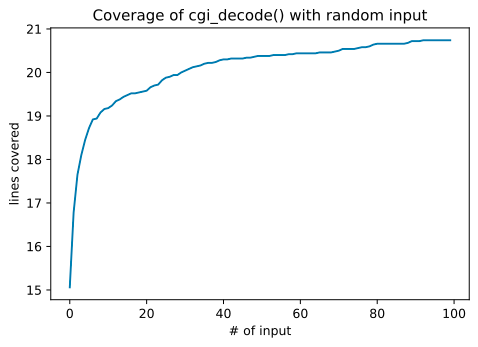

[toc]

## 0. 前言

来源：[Code Coverage](https://www.fuzzingbook.org/html/Coverage.html)

建议阅读原文，我这里仅仅整理下思路。我敲的相关代码见：[fuzzing仓库](https://github.com/da1234cao/programming-language-entry-record/tree/master/fuzzing)

背景要求：[软件测试简介](https://blog.csdn.net/sinat_38816924/article/details/110664084) | [模糊测试简介](https://blog.csdn.net/sinat_38816924/article/details/110880475)

> 在前一章中，我们介绍了基本的模糊——即生成测试程序的随机输入。我们如何衡量这些测试的有效性?一种方法是检查发现的错误的数量(和严重性);但是如果bug很少，我们需要一个代理来检测发现bug的可能性。在本章中，我们将介绍代码覆盖率的概念，以度量在测试运行期间实际执行程序的哪些部分。对于试图覆盖尽可能多的代码的测试生成器来说，度量这样的覆盖率也是至关重要的。

<br>

## 1. 摘要

黑盒测试是功能性测试。白盒测试是结构测试。为了查看白盒测试过程中，哪些代码被测试(哪些代码没有被测试)，在执行代码的时候进行跟踪。通过跟踪，我们可以知道代码的覆盖率详情。为此，本文实现了一个Coverage class 来记录代码执行过程中的覆盖率。本文在模糊测试中应用了代码覆盖率，发现随着测试次数的增加，覆盖率逐渐趋于一个最大值。这个覆盖率最大值和白盒测试的最覆盖率值接近，从而证明在本例中使用模糊测试可以取得和白盒测试等价的结果。

<br>

## 2. 被测试程序

我们首先介绍一个简单的Python函数，它对一个cgi编码的字符串进行解码。CGI编码用于URL(即网址)，对URL中无效的字符进行编码，如空格和某些标点符号。(我不知道这里的CGI是什么|我在google中没找见)

* 空格被替换成`+`
* 其他无效字符被'%xx'(%ASSIC)替换，其中xx是等效的两位数十六进制字符。

比如`Hello%2c+world%21`对应的是 `Hello, world!` 。

```python
def cgi_decode(s):
    # 对使用cgi的url解码
    hex_vaule = {
        '0': 0, '1': 1, '2': 2, '3': 3, '4': 4,
        '5': 5, '6': 6, '7': 7, '8': 8, '9': 9,
        'a': 10, 'b': 11, 'c': 12, 'd': 13, 'e': 14, 'f': 15,
        'A': 10, 'B': 11, 'C': 12, 'D': 13, 'E': 14, 'F': 15,
    }

    exchange_value = {'+':' '}

    i = 0
    t = ''
    while i < len(s):
        # 如果是交换表中的内容直接替换
        # 如果是%的形式，计算转换
        # 其他情况直接赋值
        if s[i] in exchange_value.keys():
            t += exchange_value[s[i]]
            i = i+1
        elif s[i] == '%':
            high_value,low_value = s[i+1],s[i+2]
            if high_value in hex_vaule and low_value in hex_vaule:
                t += chr(hex_vaule[high_value]*16+hex_vaule[low_value])
                i += 3
            else:
                raise ValueError("Invalid encoding")
        else :
            t += s[i]
            i += 1
    
    return t
```

<br>

## 3. 黑盒测试与白盒测试

参考内容： [黑盒测试 -- wiki](https://zh.wikipedia.org/wiki/%E9%BB%91%E7%9B%92%E6%B5%8B%E8%AF%95) | [白盒测试](https://zh.wikipedia.org/wiki/%E7%99%BD%E7%9B%92%E6%B5%8B%E8%AF%95)

> 黑盒测试，软件测试的主要方法之一，也可以称为功能测试、数据驱动测试或基于规格说明的测试。测试者不了解程序的内部情况，不需具备应用程序的代码、内部结构和编程语言的专门知识。只知道程序的输入、输出和系统的功能，这是从用户的角度针对软件界面、功能及外部结构进行测试，而不考虑程序内部逻辑结构。测试案例是依应用系统应该做的功能，照规范、规格或要求等设计。测试者选择有效输入和无效输入来验证是否正确的输出。 

```python
# 使用黑盒测试，测试上面cgi_decode函数
assert cgi_decode("a+b") == "a b"
assert cgi_decode("a%21b") == "a!b"
assert cgi_decode("abc") == "abc"

try:
    cgi_decode("%?")
    raise False
except:
    pass
```

> **白盒测试**（white-box testing）又称透明盒测试（glass box testing）、结构测试（structural testing）等，软件测试的主要方法之一，也称结构测试、逻辑驱动测试或基于程序本身的测试。测试应用程序的内部结构或运作，而不是测试应用程序的功能（即黑盒测试）。在白盒测试时，以编程语言的角度来设计测试案例。测试者输入资料验证资料流在程序中的流动路径，并确定适当的输出，类似测试电路中的节点。测试者了解待测试程序的内部结构、算法等信息，这是从程序设计者的角度对程序进行的测试。 

很好的是，上面的测试也符合白盒测试的定义。

<br>

## 4. 执行的轨迹

参考内容：[sys.settrace(tracefunc)](https://docs.python.org/zh-cn/3/library/sys.html#sys.settrace)

白盒测试的一个不错的功能是，它实际上可以自动评估是否涵盖了某些程序功能。 为此，**人们需要一个特殊的功能来记录哪些代码执行**了，哪些代码没有执行，即跟踪代码的轨迹。 测试之后，这些信息可以传递给程序员，然后程序员可以专注于编写涵盖尚未发现的代码的测试。

下面代码是跟踪执行上面的`cgi_decode`函数。最后输出结果：当相应行的代码没有执行，前面加上`#`；如果相应行的代码已执行，前面加上空格。

```python
# 存储覆盖率情况
coverage = []

# 保存执行代码的行号
def traceit(frame,event,arg):
    if event == "line":
        global coverage
        function_name = frame.f_code.co_name
        lineno = frame.f_lineno
        coverage.append(lineno)
    return traceit

import sys
def cgi_decode_traced(s):
    global coverage
    coverage = [] # 原来内容清空
    sys.settrace(traceit) # 打开
    t = cgi_decode(s)
    sys.settrace(None) # 关闭
    return t

# 获取object源码的txt
import inspect
cgi_decode_code = inspect.getsource(cgi_decode)

# 是自定义的内容，让输出更好看；详细代码见附录
# 如果相应行的代码没有执行，前面加上#
# 如果相应行的代码已执行，前面加上空格
cgi_decode_lines = [""] + cgi_decode_code.splitlines()
coverage = set(coverage)
for lineno in range(1,len(cgi_decode_lines)):
    if lineno not in coverage:
        print('# ', end="")
    else:
        print('  ', end="")
    print(f"{lineno} ",end="")
    syntax_highlighting.print_content(cgi_decode_lines[lineno],'.py')
```



<br>

## 5. 一个覆盖率类

上面将covergae作为全局变量不好处理；咋办呢？放在对象里面就好；

```python
class Coverage(object):
    # 代码写的很好:
    # 如果原来的代码已经settrace,在原来trace函数的基础上，添加获取覆盖率的代码；退出之后，仍然使用原来的trace函数
    # 如果原来的代码没有settrace,我们设置的trace仅获取代码覆盖率；退出之后，trace函数的位置设置为None
    def traceit(self,frame,event,arg):
        if self.origin_trace_function is not None:
            self.origin_trace_function(frame,event,arg)
        if event == "line":
            function_name = frame.f_code.co_name
            lineno = frame.f_lineno
            self._trace.append((function_name, lineno))
        return self.traceit
    
    def __init__(self):
        self._trace = []

    def __enter__(self):
        self.origin_trace_function = sys.gettrace()
        sys.settrace(self.traceit)
        return self
    
    def __exit__(self,exc_type, exc_value, tb):
        sys.settrace(self.origin_trace_function)
    
    def trace(self):
        return self._trace
    
    def coverage(self):
        return set(self.trace())
```

我们的base line 是最大的代码覆盖率。其他的测试结果和最大覆盖率比较，观察有哪些代码没有测试到。

```python
# cgi_decode的最大覆盖率
with Coverage() as cov_max:
    cgi_decode('+')
    cgi_decode('%20')
    cgi_decode('abc')
    try:
        cgi_decode('%?a')
    except:
        pass
```

```python
# 测试下上面的Coverage class
with Coverage() as cov:
    cgi_decode("Hello%2c+world%21")
print(cov.coverage())
```

```python
# 比较下最大覆盖率和上面的cov对象的覆盖率
cov_max.coverage() - cov.coverage()
```

```shell
{('cgi_decode', 27)}
```

<br>

## 6. 基于模糊测试的代码覆盖率

使用模糊的方式生成随机输入，不断的测试代码，观察代码覆盖率的变化。

```python
from fuzzingbook.fuzzingbook_utils import Fuzzer

# 生成trails个随机字符串
def hundred_inputs(trails):
    population = []
    for i in range(trails):
        population.append(Fuzzer.fuzzer())
    return population

# 使用popolation中的字符串作为输入，对function进行测试测试，返回覆盖率相关信息
def population_coverage(population, function):
    cumulative_coverage = []
    all_coverage = set()

    for s in population:
        with Coverage() as cov:
            try:
                function(s)
            except:
                pass
        all_coverage |= cov.coverage()
        cumulative_coverage.append(len(all_coverage))
    
    return all_coverage,cumulative_coverage
```

```python
all_coverage, cumulative_coverage = population_coverage(hundred_inputs(100), cgi_decode)
```

如果对python画图不了解，可以参考：[python画图](https://blog.csdn.net/sinat_38816924/article/details/106169996)

```python
# 通过折线图查看基于模糊测试的覆盖率变化情况
import matplotlib.pyplot as plt 

plt.plot(cumulative_coverage)
plt.title("Coverage of cgi_decode() with random input")
plt.xlabel("# of input")
plt.ylabel("lines covered")

plt.show()
```

  

上面的仅仅跑一轮；多跑几轮，求平均值。可以看到，大概测试90次之后，覆盖率不再增加。

```python
runs = 100 # 跑100轮
trails = 100 # 没轮跑100次

sum_coverage = [0]*trails

for run in range(runs):
    all_coverage, cumulative_coverage = population_coverage(hundred_inputs(trails), cgi_decode)
    assert len(cumulative_coverage) == trails
    for i in range(len(cumulative_coverage)):
        sum_coverage[i] += cumulative_coverage[i]

for i in range(trails):
    sum_coverage[i] /= runs
```

```python
plt.plot(sum_coverage)
plt.title("Coverage of cgi_decode() with random input")
plt.xlabel("# of input")
plt.ylabel("lines covered")

plt.show()
```

  

<br>

## 7. 其他

### 7.1 被测试代码中的错误

很明显的是，上面fuzz的过程中，如果出现error，直接pass,并没有对错误的处理方式，比如保存错误输入。

但是很明显这个代码是有问题的。

比如输入这样的输入：'82 202*&<1&($34\'"/\'.<5/!8"\'5:!4))%;'

### 7.2 语句覆盖与分支覆盖

上面使用的是语句覆盖；分支覆盖和它有有区别的。比如下面这样的语句。对于语句覆盖而言，当条件为真的时候，执行覆盖了所有语句。
但是对于分支覆盖而言，还需要条件为假的情况；实现过程，可以在上面Coverage class的过程中，将记录语句改成记录分支。

```python
if CONDITION:
    do_a()
something_else()
```

### 7.3 语法高亮

为了让输出更加好看。

```python
# syntax_highlighting.py
# Jupyter notebook里面的语法高亮模块
# 难道python终端没有语法高亮？

# 参考:
# [ipython](https://ipython.org/)
# [pygments](https://pygments.org/docs/)

# [How can I check if code is executed in the IPython notebook?]
# (https://stackoverflow.com/questions/15411967/how-can-i-check-if-code-is-executed-in-the-ipython-notebook/54967911#54967911)

from IPython import get_ipython

def __isnotebook():
    try:
        shell = get_ipython().__class__.__name__
        if shell == 'ZMQInteractiveShell':
            return True   # Jupyter notebook or qtconsole
        elif shell == 'TerminalInteractiveShell':
            return False  # Terminal running IPython
        else:
            return False  # Other type (?)
    except NameError:
        return False      # Probably standard Python interpreter


# check for rich output
def __rich_output():
    __rich_output = __isnotebook()
    return __rich_output

# print file with syntax highlighing
def print_file(filename,lexer=None):
    content = open(filename,"rb").read().decode('utf-8')
    print_content(content,filename,lexer)

def print_content(content,filename=None,lexer=None):
    from pygments import highlight,lexers,formatters,styles
    if __rich_output():
        if lexer is None:
            if filename is None:
                lexer = lexers.guess_lexer(content)
            else:
                lexer = lexers.get_lexer_for_filename(filename)
        # colorful_content = highlight(content,lexer,formatters.TerminalFormatter(bg="dark",linenos=True))
        colorful_content = highlight(content,lexer,formatters.TerminalFormatter())
        print(colorful_content,end="")
    else:
        print(content,end="")
```

