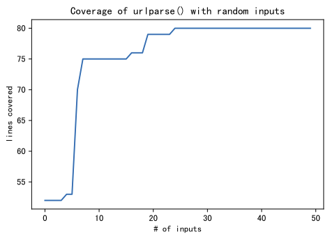
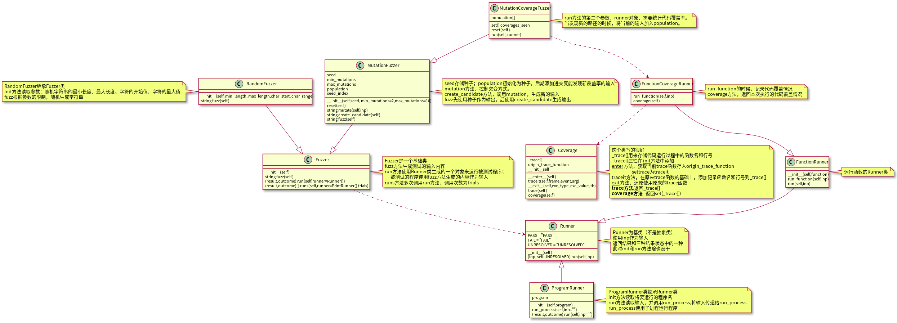

[toc]

## 0. 前言

---

看论文[The Art, Science, and Engineering of Fuzzing: A Survey](https://ieeexplore.ieee.org/document/8863940) 遇到一个名词：**动态符号执行**。

> The term white-box fuzzing was introduced by Godefroid [87] in 2007 and refers to dynamic symbolic execution (DSE), which is a variant of symbolic execution [39], [126], [108]. 
>
> 白盒模糊测试一词是Godefroid [87]在2007年提出的，指<font color=red>动态符号执行</font>（DSE），它是符号执行的一种变体[39]，[126]，[108]。

我阅读了下这篇：[符号执行入门](https://zhuanlan.zhihu.com/p/26927127) 	

> 符号执行的概念早在1975年[4]就提出了，但是真正得到实用，却是在一种方式提出之后，即混合实际执行和符号执行，称为concolic execution，是真正意义上的动态符号执行。
>
> Concolic执行维护一个实际状态和一个符号化状态：实际状态将所有变量映射到实际值，符号状态只映射那些有非实际值的变量。Concolic执行首先用一些给定的或者随机的输入来执行程序，收集执行过程中条件语句对输入的符号化约束，然后使用约束求解器去推理输入的变化，从而将下一次程序的执行导向另一条执行路径。简单地说来，就是在已有实际输入得到的路径上，对分支路径条件进行取反，就可以让执行走向另外一条路径。这个过程会不断地重复，加上系统化或启发式的路径选择算法，直到所有的路径都被探索，或者用户定义的覆盖目标达到，或者时间开销超过预计。

不怎么明白符号测试，所以，我打算看下[Symbolic Fuzzing](https://www.fuzzingbook.org/html/SymbolicFuzzer.html) 。而它需要挺多的前置要求。

所以，我不得不一个一个完成。第一个需要完成的是[Mutation-Based Fuzzing](https://www.fuzzingbook.org/html/MutationFuzzer.html)

我希望可以简单的理解符号测试的基本概念，然后跳过夯实基础，直接可以使用符号测试的工具。

来源：[Mutation-Based Fuzzing](https://www.fuzzingbook.org/html/MutationFuzzer.html)

建议阅读原文，我这里仅仅整理下思路。我敲的相关代码见：[fuzzing仓库](https://github.com/da1234cao/programming-language-entry-record/tree/master/fuzzing)

背景要求：[模糊测试简介](https://blog.csdn.net/sinat_38816924/article/details/110880475)| [代码覆盖率](https://blog.csdn.net/sinat_38816924/article/details/111070878) 

<br>

## 1. 摘要

---

模糊测试中随机生成的字符串大概率是无效的。这导致很多时间被浪费在无效的测试输入中。

我们可以采用合法有效的输入进行初期的测试。这些有效的输入，我们称之为种子。

我们对种子进行突变，将其中的bit(s)进行突变(翻转、删除、增加)。由于突变的部分相对于某个种子的整体，变化较小。那么突变之后的种子，也很可能是合法的。

种子突变的越多，不合法的可能性越大。那么如何控制突变呢？这里引入基于覆盖率引导的模糊测试。当突变生成中输入可以发现新路径的时候，我们将该输入放入仓库中。其中，仓库使用种子进行初始化。这样，突变会向覆盖率增大的方向突变。覆盖率越大，触发crash的可能性越大。

<br>

## 2. 被测试程序

---

URL由多个元素构成。

```shell
scheme://netloc/path?query#fragment
```

- `scheme` is the protocol to be used, including `http`, `https`, `ftp`, `file`...
- `netloc` is the name of the host to connect to, such as `www.google.com`
- `path` is the path on that very host, such as `search`
- `query` is a list of key/value pairs, such as `q=fuzzing`
- `fragment` is a marker for a location in the retrieved document, such as `#result`

下面代码用以检查的URL的合法性。

如果是URL通过随机的字符串来生成，那么生成的字符串大多数是无效的。

因而使用随机生成字符串作为输入的模糊测试，将会非常低效。

下文将会介绍，使用覆盖率引导的模糊测试。

```python
from urllib.parse import urlparse

def http_program(url):
    """检查url的合法性"""
    supported_schemes = ["http","https"]
    result = urlparse(url)
    if result.scheme not in supported_schemes:
        raise ValueError("scheme must be one of " + repr(supported_schemes))
    if result.netloc == '':
        raise ValueError("url netloc must not be empty")
    return True

def is_valid_url(url):
    try:
        http_program(url)
        return True
    except ValueError:
        return False
```

<br>

## 3. 突变

---

因为以前数学建模的时候接触过点遗传算法的概念。所以，看到这里甚是熟悉。

下面实现了随机删除、插入、翻转。

```python
import random

def delete_random_character(s):
    """在原字符串的基础上随机删除一个字符，并返回；原字符串不变"""
    if s == "":
        return s
    pos = random.randint(0,len(s)-1)
    return s[:pos] + s[pos+1:]

def insert_random_character(s):
    """在原字符串的基础上随机插入一个字符，并返回；原字符串不变"""
    pos = random.randint(0,len(s)-1)
    # randint 左右闭区间，randrange左闭右开
    # randrange()功能相当于 choice(range(start, stop, step))
    random_char = chr(random.randrange(32,127)) 
    return s[:pos] + random_char + s[pos:]

def flip_random_character(s):
    """在原字符串的基础上随机翻转一个bit，并返回；原字符串不变"""
    if s == "":
        return s
    pos = random.randint(0,len(s)-1)
    c = s[pos]
    bit = 1 << random.randint(0,6) # 注意这里只有七个位置可能翻转
    new_c = chr(ord(c)^bit)
    return  s[:pos] + new_c + s[pos+1:]

def mutate(s):
    """随机选择一个突变方式"""
    mutators = [
        delete_random_character,
        insert_random_character,
        flip_random_character
    ]
    # print(type(mutators[0])) # 这里面存储的是函数类型，有意思
    matator = random.choice(mutators)
    return matator(s)
```

<br>

## 4. 突变的模糊测试

---

在Fuzzer类的基础上，fuzz方法使用突变的方式，生成字符串。

```python
from fuzzingbook.fuzzingbook_utils.Fuzzer import Fuzzer

class MutationFuzzer(Fuzzer):
    def __init__(self,seed, min_mutations=2,max_mutations=10):
        self.seed = seed
        self.min_mutations = min_mutations
        self.max_mutations = max_mutations
        self.reset()
    
    def reset(self):
        self.population = self.seed
        self.seed_index = 0
    
    def mutate(self,inp):
        return mutate(inp)
    
    # 从仓库中随机选择一个进行突变；
    # 仓库使用种子进行初始化（__init__中完成）
    # 这里并没有将突变生成的内容放入population
    def create_candidate(self):
        candidate = random.choice(self.population)
        trails = random.randint(self.min_mutations,self.max_mutations)
        for i in range(trails):
            candidate = self.mutate(candidate)
        return candidate
    
    def fuzz(self):
        if self.seed_index < len(self.seed):
            # 使用种子
            self.inp = self.seed[self.seed_index]
            self.seed_index += 1
        else:
            # 使用突变生成的内容
            self.inp = self.create_candidate()
        return self.inp
```

<br>

## 5. 基于突变的覆盖率引导的模糊测试

---

模糊测试的输入，仍然使用上面突变的方式生成。

这里需要解决的是，如何判断突变生成的输入，是否发现了新的路径。

下面是在继承Runner类的类的一个对象中，统计覆盖率。

```python
class MutationCoverageFuzzer(MutationFuzzer):
    def reset(self):
        super().reset()
        self.coverages_seen = set()
        # Now empty; we fill this with seed in the first fuzz runs
        self.population = []

    def run(self, runner):
        """Run function(inp) while tracking coverage.
           If we reach new coverage,
           add inp to population and its coverage to population_coverage
        """
        result, outcome = super().run(runner)
        new_coverage = frozenset(runner.coverage())
        if outcome == Runner.PASS and new_coverage not in self.coverages_seen:
            # We have new coverage
            self.population.append(self.inp)
            self.coverages_seen.add(new_coverage)
    
        return result
```

<br>

## 6. 测试程序

现在可以开始着手测试上面的URL代码了。

首先，我们需要一个类，这个类可以运行上面的URL代码，并统计覆盖率。

```python
from fuzzingbook.fuzzingbook_utils.Fuzzer import Runner
from fuzzingbook.fuzzingbook_utils.Coverage import Coverage,population_coverage

class FunctionRunner(Runner):
    def __init__(self,function):
        self.function = function
    
    def run_function(self,inp):
        return self.function(inp)
    
    def run(self,inp):
        try:
            result = self.run_function(inp)
            outcome = self.PASS
        except Exception:
            result = None
            outcome = self.FAIL
        return result,outcome
 
class FunctionCoverageRunner(FunctionRunner):
    def run_function(self,inp):
        with Coverage() as cov:
            try:
                result = super().run_function(inp)
            except Exception as exc:
                self._coverage = cov.coverage()
                raise exc
        self._coverage = cov.coverage()
        return result
    
    def coverage(self):
        return self._coverage
```

测试下

```python
http_runner = FunctionCoverageRunner(http_program)
seed_input = "http://www.google.com/search?q=fuzzing"
mutation_fuzzer = MutationCoverageFuzzer(seed=[seed_input])
mutation_fuzzer.runs(http_runner, trials=10000)
mutation_fuzzer.population
```

看下结果

```python
all_coverage, cumulative_coverage = population_coverage(
    mutation_fuzzer.population, http_program)

import matplotlib.pyplot as plt
plt.plot(cumulative_coverage)
plt.title('Coverage of urlparse() with random inputs')
plt.xlabel('# of inputs')
plt.ylabel('lines covered')
```

 

## 附录

类的UML图代码见[仓库](https://github.com/da1234cao/programming-language-entry-record/tree/master/fuzzing/UML)

(导出来的图像清晰度不够)（svg help）

