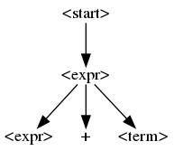
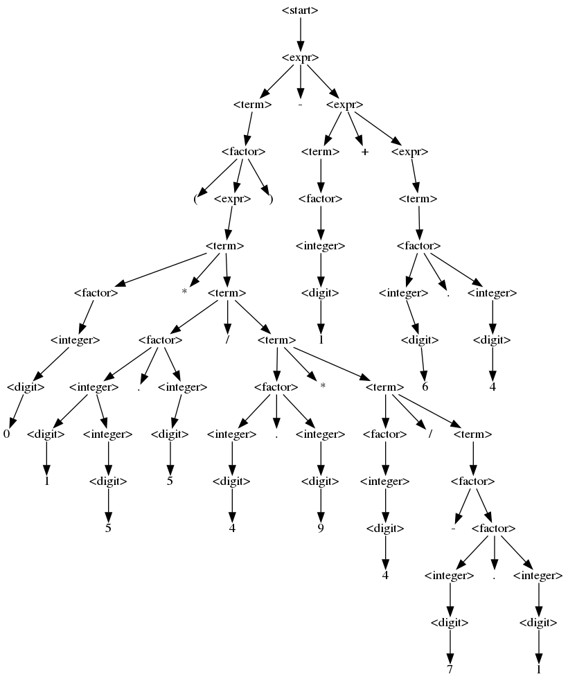

[toc]

## 前言

来源：[Efficent  Grammars Fuzzing](https://www.fuzzingbook.org/html/GrammarFuzzer.html)

建议阅读原文，我这里仅仅整理下思路。我敲的相关代码见：[fuzzing仓库](https://github.com/da1234cao/programming-language-entry-record/tree/master/fuzzing)

由于代码越来越长，此后不再搬运书中的代码。同样，我认为这本书是导论级的书籍，重点在于知识点的理解。因而，重点放在思路描述上。当然，代码非常重要，代码是一种工程能力，详细代码见原文或者仓库。

<br>

## 整体描述

上一章，[使用文法的模糊测试](https://blog.csdn.net/sinat_38816924/article/details/113532069) ,在从开始符号推导出最后由终结符组成的字符串中，使用字符串替换的方式处理。这导致，结果的生成效率特别低。上一章的`simple_grammar_fuzzer`函数，还存在无限循环问题、生成的字符串过程无法控制问题。

本文采用树状结构，存储语法树。树状结构，在语法树的生长过程中，相对于字符串匹配替换，更加高效。在语法树的不同生长时期，采用不同的扩展方式。语法树的生长初期，尽可能大范围的拓展节点，直到树中包含，至少`min_nonterminals`个非终结符。接着，语法树进入生长中期，使用随机的方式拓展节点。此阶段，最多包含`max_nonterminals`个非终结符。最后，语法树进入生长末期，在拓展的时候，尽可能小范围的拓展节点。这些策略，解决了无限循环和字符串的生成过程无法控制等问题。

为了实现上述想法，本文采用了以下设计思路。

1. 数据的存储结构如下所示。

   节点&边：(SYMBOL_NAME, CHILDREN)。
   - SYMBOL_NAME是节点名，str结构；
   - CHILDREN是孩子节点，list结构。CHILDREN可以是一些特殊的值
       - None ，一个非终结符的占位符。
       - [] ，表示该节点没有孩子，当前节点是终结符。

   ```python
   # 比如
   derivation_tree = ("<start>",
                      [("<expr>",
                        [("<expr>", None),
                         (" + ", []),
                            ("<term>", None)]
                        )])
   ```

   表示如下形状的语法树。

    

2. 控制非终结符的扩展大小。

   非终结符(symbol)的扩展可选是一组表达式(expansions)，其中的一个表达式简称为expansion。首先计算某个symbol对应的expansions中，每个expansion的最小代价(代价，即从当前节点扩展出来的叶子节点都为终结符，以该节点为根节点，构成的子树，所有的边数之和。) 。代价组成的数组为costs。当需要大范围扩展的时候，从costs中选出max_cost对应的expansion进行扩展。当需要随机扩展的时候，从expansions中随机选择expansion进行扩展。当需要收尾，使叶子节点逐渐转换成终结符时，从costs中选出min_cost对应的expansion 进行扩展

3. 语法树的生成。

   根据文法，从START_SYMBOL开始扩展。初期大范围扩展节点，中期随机扩展节点，末期以最快的速度将所有的叶子节点转换成终结符。

4. fuzz函数输出文法生成的字符串。

   当语法树的叶子节点都为终结符时，所有的叶子节点串成串，即为生成的字符串。

另外，为了直观显示，本文也实现了图形化显示语法树的代码，详见：[graphviz的初次使用](https://blog.csdn.net/sinat_38816924/article/details/113621425)

最后，展示下实现效果。

```python
f = GrammarFuzzer(EXPR_GRAMMAR)
f.fuzz()
```

```python
'(0 * 15.5 / 4.9 * 4 / -7.1) - 1 + 6.4'
```

 