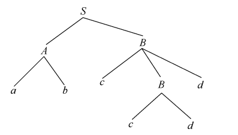
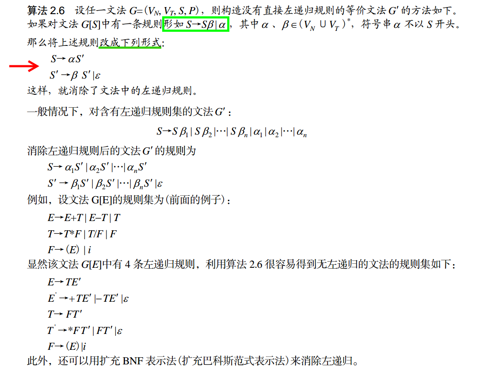
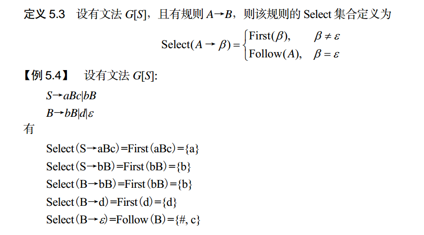
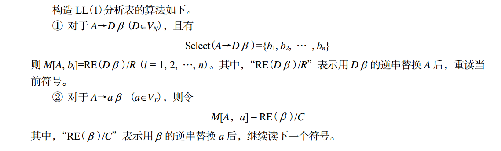
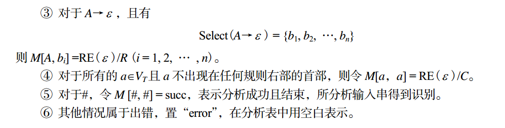
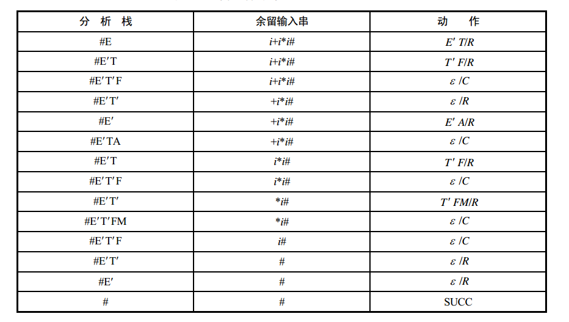

[toc]

## 前言

---

在模糊测试中，可以使用语法分析。[这里](https://www.fuzzingbook.org/html/Parser.html)是相关的介绍与实现。

> 使用文法可以生成相应语言的字符串。反过来，给定字符串，可以将该字符串分解为语法树的组成部分(这些组成部分对应于用于生成该字符串的派生树的语法部分)。
> 通过语法分析，将有效的种子输入，分解&解析成对应的语法树组成部分。这允许我们变异、交叉和重新组合它们的部分，以便生成新的有效的、稍加更改的输入(即fuzz)。

上述内容需要《编译原理》作为基础支撑，我暂时跳过。这里简单介绍下使用LL(K)方法进行语法分析。

**本章来源1**：[《编译原理简明教程》(第二版)](https://book.douban.com/subject/7154632/) ，第五章 语法分析——自顶向下分析方法。（这本书的质量很是一般。以本章为例，很多时候只讲操作，不讲解为什么这样操作。导致某些时候，知其然，不知其所以然。当然，对于一本简明教程，也不能要求那么高。）

**本章来源2**：[自顶向下语法分析  -- chor -- 掘金](https://juejin.cn/post/6844904152212979719#heading-10)

<br>

## 摘要

---

语法分析是编译过程的核心部分，其基本任务是：根据语言的语法规则分析源程序的语法结构，并在分析过程中，对源程序进行语法检查，若语法没有错误，则给出正确的语法结构，为语义分析和代码生成做准备。目前，语法分析方法多种多样，大致可分为自顶向下和自底向上两大类。本文主要介绍自顶向下的分析方法中的LL(K)分析法。

本文先简单介绍自顶向下的分析方法。我们会指出这种方法存在的两个个问题：左递归问题，回溯问题。

针对左递归问题，可以通过文法的实用限制和扩充的 BNF 方法得到解决。针对回溯问题可以通过左提公共终结符和First集合来进行确定性选择，以避免回溯。同时介绍Follow集合，从而可以判断其下面的非终结符能否产生当前需要的终结符，以排除当前字符串出错的可能。另外，First 集和 Follow 集不能有交集，否则会带来不确定性。

而LL(1)文法是满足上面三个条件(文法不存在左递归、没有回溯，相同非终结符的 First集合和Follow集合没有交集)的文法。我们会用示例演示LL(1)文法的工作过程。

<br>

## 自顶向下的分析方法

---

顾名思义，自顶向下(top-down)分析就是从文法的开始符号出发，向下推导，如果能推出给定的符号串，那么表示该符号串是符合语言语法的句子， 否则不符合语言的语法。下面举例说明。

设有文法 G[S]：
$$
\begin{array}{l}S \rightarrow A B \\A \rightarrow a b \\B \rightarrow c d \mid c B d\end{array}
$$
分析符号串 abccdd 是否是符合文法 G[S]的句子。

从语法树建立的角度来看，为了自顶向下地构造 abccdd 语法树，首先按文法的识别符号产生根 节点 S，然后用 S 的规则发展这棵树，其末端节点按从左向右的 顺序如果是给定的句子，则句子得到识别，说明该句子符合文法， 否则不符合文法。如图所示，从 S 开始建立语法树，末端节 点从左向右 abccdd 得到了识别，证明了 abccdd 是给定文法所定义的句子。



上述自顶向下地为输入符号串 abccdd 建立语法树的过程，实 际上也是设法建立一个最左推导序列， 以便通过一步一步推导将输 入串推导出来。显然，对于输入串 abccdd 可以通过如下的推导过 程将其推导出来：
$$
S \Rightarrow A B \Rightarrow a b B \Rightarrow a b c B d \Rightarrow a b c c d d
$$
可见， abccdd 是由文法产生的句子，符合该文法。

<br>

## 自定向下分析方法的问题与解决方法

---

### 左递归问题与解决方法

如果一个文法存在非终结符 P 使得 P ⇒ Pa，那么这个文法就是含有左递归的。它的意思其实是说，当我们试图用 P 的右部去替换 P 这个非终结符的时候，替换得到的结果再次含有 P，若此时无法匹配输入的字符，则我们不得不对 P 进行又一轮的替换，反反复复，陷入了无限循环，始终没有找到递归的出口。

#### 直接左递归

直接左递归（Immediate left recursion）以下面的句型规则出现：

$$
A \rightarrow A \alpha \mid \beta
$$

#### 间接左递归

间接左递归(indirect left recursion)最简单的形式如下：
$$
\begin{array}{l}A \rightarrow B \alpha \mid C \\B \rightarrow A \beta \mid D\end{array}
$$
这规则可能产生$A \Rightarrow B \alpha \Rightarrow A \beta \alpha \Rightarrow \ldots$ 这种生成。

#### 直接左递归的消除方法1



#### 直接左递归的消除方法2 -- 扩充的BNF表示法

扩充的BNF表示法是在BNF表示法的基础上发展起来的，它与BNF表示法具有相同的表法能力，不仅在结构上更加清晰、简单，而且还可以消除文法的左递归。

* {ω}表示符号串ω可以重复出现任意次；
* [ω]表示符号串ω可出现 0 次或 1 次，即ω可有可无；
* $(\cdots) \text { 表示提因子 }, \text { 例如, } \mathrm{A} \rightarrow \alpha \beta_{1}\left|\alpha \beta_{2}\right| \cdots \mid \alpha \beta_{n}, \text { 可用扩充 } \mathrm{BNF} \text { 表示成 } \mathrm{A} \rightarrow \alpha\left(\beta_{1}\left|\beta_{2}\right| \cdots \mid \beta_{n}\right)$

例如，$E→T|E+T$ 可以表示成$E→T\{+T\}$。

#### 间接左递归的消除

解决思路：将间接左递归转换成直接左递归，然后消除递归。
$$
\begin{array}{l}A \rightarrow B \alpha \mid C \\B \rightarrow A \beta \mid D\end{array}
$$
这里将第一条产生式代入第二条产生式。得到，$A \rightarrow A \beta \alpha \mid D \alpha \mid  C$

接着，我们使用直接左递归的消除方法，得到，$A \rightarrow(\beta \alpha|D \alpha| C) A^{\prime} \text { 和 } A^{\prime} \rightarrow \beta \alpha A^{\prime} \mid \epsilon$ 和 $A^{\prime} \rightarrow \beta \alpha A^{\prime} \mid \epsilon$

<br>

### 回溯问题与解决方法

#### 回溯问题

比方说对于文法 `{Z → cAd,A → ab|a}` 以及输入符号串 `S = cad`，当 A 面对输入符号 a 的时候，到底应该用 `A → ab|a` 的第一个还是第二个右部去替换呢？看起来好像都可行，但若选取了第一个右部，则后面会发现 b 无法匹配 d，所以这个选取是错误的。我们需要**回溯**到 A 产生子树之前，令其产生 a 子树而不是 ab 子树。设想产生式的右部如果是 `ab|ac|ad|...|az`，是不是意味着我们需要做更多的尝试/回溯呢？这会大大降低语法分析的效率，而这是我们不希望看到的。所以有必要消除回溯。

在这之前，我们先考虑如何更加准确地判断某个文法是否存在回溯的情况。这里我们要引入一个 **First 集**的概念。

#### First集合

设有文法 G[S]，字汇表为 V，则符号串β 的终结首符号集定义为
$$
\operatorname{First}(\beta)=\left\{\alpha \mid \beta \stackrel{*}{\Rightarrow} a y, a \in V_{T}, y \in V^{*}\right\}
$$
特别地，当符号串β 为空串时，则有
$$
\text { First }(\beta)=\varnothing
$$
下面看一个例子。
设有表达式文法 G[E]：
$$
\begin{array}{l}E \rightarrow E+T \mid T \\T \rightarrow T^{*} F \mid F \\F \rightarrow(E) \mid i\end{array}
$$
则有
$$
\begin{array}{l}\text { First }(\mathrm{E}+\mathrm{T})=\{\mathrm{i},(\} \\\text { First }(\mathrm{T})=\{\mathrm{i},(\} \\\text { First }\left(\mathrm{T}^{\star} \mathrm{F}\right)=\{(, \mathrm{i}\} \\\text { First }(\mathrm{F})=\{\mathrm{i},(\} \\\text { First }((\mathrm{E}))=\{(\} \\\text { First }(\mathrm{i})=\{\mathrm{i}\}\end{array}
$$

#### 解决回溯问题

**如何判断无回溯** ：对于非终结符 A，它的每一个右部都会产生对应的 First 集，若这些集合两两不相交，即 `First(ai) ∩ First(aj) = Ø`，那么至少对于 A 而言，它是不存在回溯的。比如，`A → ab|cd|ef` ，每一个右部的 First 集两两之间都没有交集，那么 A 就是没有回溯的，当它面对一个输入符号（比方说 a，c，e）的时候，它可以确切地让一个右部去进行替换，而无需担心替换失败、需要回过头来选择其它右部的情况。

**如何克服回溯** ：不幸的是，大部分情况下，很多非终结符都存在回溯的情况。不过，我们可以通过提取左公因子来克服这种回溯。比如说产生式 `A → ab|ac|ad|...|az`，可以提取公因子 a，改写为  `A → a(b|c|d|...|z)`，再改写得到 `A → aX` 和 `X → (b|c|d|...|z)`。至少这个时候，对于 A 而言它已经不存在回溯的情况，毕竟它只有一个右部了。当然，对于 X，它依然可能存在回溯，比如说 b=mn，c = ml，诸如此类，若存在这种情况，我们就再次提取公因子。这样反复提取之后，我们可以确保所有非终结符的右部的 First 集都不存在交集，因此得以消除回溯。不过，这样的代价就是引入了大量的非终结符作为替换时的过渡。

<br>

### 空符号串

（只是follow集是个好东西。它可以判断之后的非终结符是否可以推到出当前的终结符，从而排除当前出错的可能。）

我们已经消除了左递归和回溯，这样文法是不是就真的确定了呢？其实不是，因为我们还得考虑空符号串的问题。简单地说，假设左部为非终结符 A 的产生式，它有一个右部是 `ε`，且 A 当前面对的输入符号为 a，那么到底要不要用  `ε` 去替换掉 A 呢？如果不使用  `ε`，至少说明了 A 存在其它右部足以处理输入符号 a，也许刚好就是 a，或者是以 a 开头的符号串；如果使用  `ε`，则意味着 A 放弃了处理 a 的任务，这其中隐含的意思是，**A 自己无法处理 a，但是它确信在语法树中，排在自己右边的非终结符足以处理 a**。不过，这样的非终结符是否确实存在？这时候，我们引入了另一个新的概念，即 Follow 集。

#### Follow 集合

设有文法 G[S]，非终结符 U 的 Follow 集合定义为
$$
\text { Follow }(U)=\left\{a \mid S \stackrel{*}{\rightarrow} \cdots U a \cdots, a \in V_{T} \cup\{\#\}\right\}
$$
如果紧跟在非终结符 U 后面的符号为空，则把 U 后面的符号看成特殊符号“ #”。

举个例子。

设有表达式文法 G[E]：
$$
\begin{array}{l}E \rightarrow E+T \mid T \\T \rightarrow T^{*} F \mid F \\F \rightarrow(E) \mid i\end{array}
$$
因为$E \Rightarrow E, E \Rightarrow E+T, E \stackrel{*}{\Rightarrow}(E)$ 所以 E 的向前看集为$Follow(E)=\{\#,+,)\}$

<br>

### select集合

这里顺带介绍下select集合。下面会用到。



<br>

## LL(1)文法

---

> 上面说了这么多东西，又要求文法不存在左递归、又要求没有回溯，还要求非终结符的 `First(A)` 和  `Follow(A)` 最好没有交集，那么是否存在某种文法可以满足所有这些条件呢？—— 有的，那就是 `LL(1)` 文法。 `LL(1)` 文法是确定的，只有基于这种确定的文法，我们才能进行确定的自顶向下分析。联系上面我们分析导致文法不确定的因素的过程，可以给出 `LL(1)` 文法的定义如下：
>
> - 必须不包含左递归
> - 对于每个非终结符，它的各个右部的 First 集两两不相交
> - 对于每个非终结符，如果它的 First 集包含 `ε` ，则它的 First 集和 Follow 集不相交
>
> 因为我们前面已经经过了分析，会发现这里要理解 `LL(1)` 文法的定义，相对容易很多，而且我们也知道它为什么要这么定义，对他的来龙去脉有一个清晰的理解。

LL(K)分析方法是一种不带回溯的确定的自顶向下分析技术。如此命名该分析方法的原因在于， 相应的语法分析将从左到右顺序扫描输入符号串，并在此过程中从文法的识别符号开始产生一个句子 的最左推导，每一步推导都需要向前查看 K 个输入符号才能唯一地确定所选用的规则，那么就将这种 分析方法称为 LL(K)分析方法。不过，由于 LL(K)文法及 LL(K)分析(K >1 时)在实际中极少使用，实际应用大多为 K=1 的情况，当 K=1 时，表示在分析过程中，每进行一步推导，只要向前查看一个输入符号，便能确定当前应选用的规则。这就是 LL(1)分析方法， LL(1)方法简单易懂，又比较实用。

### LL(1)分析方法的逻辑结构

分析方法的逻辑结构.png)


LL(1)分析方法的实现关键在于 LL(1)分析表， LL(1)分析表是指分析栈中的元素与输入串中元素的一种匹配关系，记为 M[x, a]，其中 x 为分析栈中元素， a 为输入符号。

例如，M[A, a]=“A→aBc”与 M[B, b] =“B→bB”表明可以有推导“A ⇒ aBc”和“B ⇒ bB”。即 a 和 b 分别是相当于 A 和 B 短语的首符号集。 M[A, b]不是一个重写规则，正是由于 b 不是相对于 A短语的首符号集。

了方便简明地构造所有 LL(1)文法的 LL(1)分析表，在详细介绍 LL(1)分析表构造之前，有如下三个约定：

* C 表示继续读下一个符号。
* R 表示重读当前符号，即不读下一个符号。
* RE( β )表示用β 的逆串替换栈顶符号。






### LL(1)分析方法举例

【例 5.6】 设有表达式文法 G[E]：

```shell
E→EAT | T
T→TMF | F
F→(E) | i
A→+|-
M→*|/
```

显然， G[E]文法是左递归文法，我们知道对于左递归文法，自顶向下分析将不能正常进行，即分析将会陷入死循环，推导无法进行下去，因此首先修改 G[E]文法，消除左递归。修改后的文法为
$$
\begin{array}{l}E \rightarrow T E^{\prime} \\E^{\prime} \rightarrow A T E^{\prime} \mid \varepsilon \\T \rightarrow F T^{\prime} \\T^{\prime} \rightarrow M F T^{\prime} \mid \varepsilon \\F \rightarrow(E) \mid i \\A \rightarrow+\mid- \\M \rightarrow * \mid /\end{array}
$$
首先求各规则的 Select 集。
$$
\begin{array}{l}\text { Select }\left(E \rightarrow T E^{\prime}\right)=\text { First }\left(T E^{\prime}\right)=\{(, i\} \\\text { Select }\left(E^{\prime} \rightarrow A T E^{\prime}\right)=\text { First }\left(A T E^{\prime}\right)=\{+,-\} \\\text { Select }\left(E^{\prime} \rightarrow \varepsilon\right)=\text { Follow } \left.\left(E^{\prime}\right)=\{\#,)\right\} \\\text { Select }\left(T \rightarrow F T^{\prime}\right)=\text { First }\left(F T^{\prime}\right)=\{(, i\} \\\text { Select }\left(T^{\prime} \rightarrow M F T^{\prime}\right)=\text { First }\left(M F T^{\prime}\right)=\{*, \beta \\\text { Select }\left(T^{\prime} \rightarrow \varepsilon\right)=\text { Follow } \left.\left(T^{\prime}\right)=\{+,-,), \#\right\} \\\text { Select }(F \rightarrow(E))=\operatorname{First}((E))=\{(\} \\\text { Select }(F \rightarrow i)=\text { First }(i)=\{i\} \\\text { Select }(A \rightarrow+)=\text { First }(+)=\{+\} \\\text { Select }(A \rightarrow-)=\operatorname{First}(-)=\{-\} \\\text { Select }\left(M \rightarrow^{*}\right)=\text { First }(*)=\{*\} \\\text { Select }(M \rightarrow /)=\text { First }(/)=\{/\}\end{array}
$$
由于在终结符中，右圆括号“)”不在任何规则的右部出现，于是根据 LL(1)分析表构造算法得到文法 G[E]的 LL(1)分析表，如下表所示。
$$
\begin{array}{|c|c|c|c|c|c|c|c|}\hline & i & + & - & * & / & ( & ) & \# \\\hline E & E^{\prime} T / R & & & & & E^{\prime} T / R & & \\\hline E^{\prime} & & E^{\prime} T A / R & E^{\prime} T A / R & & & & \varepsilon / R & \varepsilon / R \\\hline T & T^{\prime} F / R & & & & & T^{\prime} F / R & & \\\hline T^{\prime} & & \varepsilon / R & \varepsilon / R & T^{\prime} F M / R & T^{\prime} F M / R & & \varepsilon / R & \varepsilon / R \\\hline F & \varepsilon / \mathrm{C} & & & & & & & \\\hline A & & \varepsilon / \mathrm{C} & \varepsilon / \mathrm{C} & & & & & \\\hline M & & & & \varepsilon / C & \varepsilon / C & & & \\\hline) & & & & & & & \varepsilon / \mathrm{C} & \\\hline \# & & & & & & & & \mathrm{SUCC} \\\hline\end{array}
$$
对于输入符号串“i+i*i”的分析过程如下表所示。



可见符号串“i+i*i”符合文法。

<br>

## 相关的代码实现

略，附上两个(我没看的)链接。

[Parsing Inputs -- fuzzing book](https://www.fuzzingbook.org/html/Parser.html)

[一起来写个简单的解释器（1）](http://www.opython.com/1376.html)