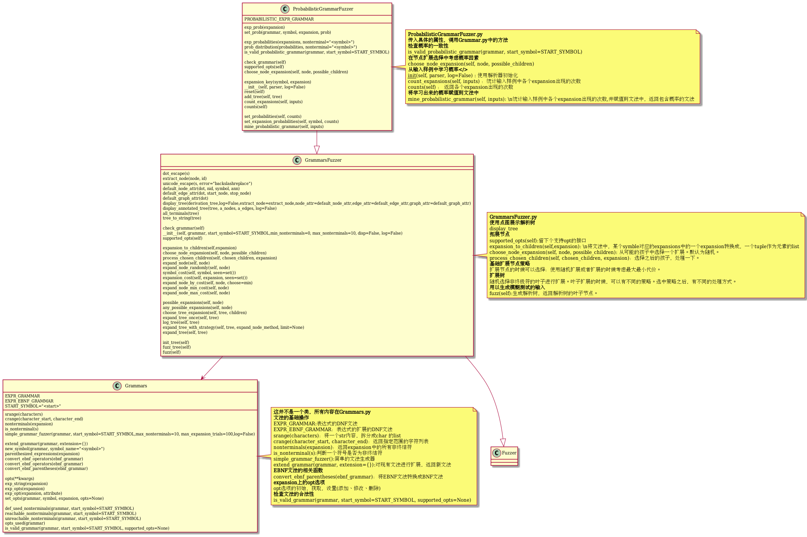

[toc]

## 前言

来源：[Probabilistic Grammar Fuzzing](https://www.fuzzingbook.org/html/ProbabilisticGrammarFuzzer.html)

建议阅读原文，我这里仅仅整理下思路。我敲的相关代码见：[fuzzing仓库](https://github.com/da1234cao/programming-language-entry-record/tree/master/fuzzing)

<br>

## 整体描述

[本福特定律](https://zh.wikipedia.org/wiki/%E6%9C%AC%E7%A6%8F%E7%89%B9%E5%AE%9A%E5%BE%8B)说明一堆从实际生活得出的数据中，以1为首位数字的数的出现概率约为总数的三成，接近直觉得出之期望值1/9的3倍。而，如果我们使用语法来生成数字，1为首位数字的数的出现概率会和其他数字相同，**这是和现实不相符合的**。

在[文法的模糊测试](https://blog.csdn.net/sinat_38816924/article/details/113697082)，我们通过扩展使用的代价来有选择的使用某些expansion进行扩展。在扩展初期，使用最大代价进行扩展；扩展中期，使用随机扩展；扩展末期，使用最小扩展。这些策略是从代价的角度，进行有选择的扩展。此时，我们需要的是从概率的角度进行扩展。(这两者并不冲突，可以相互兼容)

为了满足上面需求，我们在文法中添加一个位置，用于存储概率。**通用性起见，我们添加一个opt，内部使用字典存储不同的选项**。比如下面的表达式的文法。

```python
PROBABILISTIC_EXPR_GRAMMAR = {
    "<start>":
        ["<expr>"],

    "<expr>":
        [("<term> + <expr>", opts(prob=0.1)),
         ("<term> - <expr>", opts(prob=0.2)),
         "<term>"],

    "<term>":
        [("<factor> * <term>", opts(prob=0.1)),
         ("<factor> / <term>", opts(prob=0.1)),
         "<factor>"
         ],

    "<factor>":
        ["+<factor>", "-<factor>", "(<expr>)",
            "<leadinteger>", "<leadinteger>.<integer>"],

    "<leadinteger>":
        ["<leaddigit><integer>", "<leaddigit>"],

    # Benford's law: frequency distribution of leading digits
    "<leaddigit>":
        [("1", opts(prob=0.301)),
         ("2", opts(prob=0.176)),
         ("3", opts(prob=0.125)),
         ("4", opts(prob=0.097)),
         ("5", opts(prob=0.079)),
         ("6", opts(prob=0.067)),
         ("7", opts(prob=0.058)),
         ("8", opts(prob=0.051)),
         ("9", opts(prob=0.046)),
         ],

    # Remaining digits are equally distributed
    "<integer>":
        ["<digit><integer>", "<digit>"],

    "<digit>":
        ["0", "1", "2", "3", "4", "5", "6", "7", "8", "9"],
}
```

在数学中，数字有配套的加减乘除，集合也有些配套的运算。**上面文法中添加的opt，也应有配套的处理方式**。从opt的角度，有增加、修改、删除、查看操作。当存在概率属性的时候，要检查概率是否合法——概率和是否小于等于1。

**当概率属性拥有配套操作且合法的时候，需要在扩展节点的时候考虑概率因素**。这也是本文的目的之一。

* 扩展初期，使用最大代价的expansion进行扩展；我们从最大代价相同的expansion的list中，使用概率作为随机选择的权重，进行随机选择。
* 扩展中期，使用随机的expansion进行扩展；我们从中，选择使用概率作为随机选择的权重，进行随机选择。
* 扩展后期，使用最小代价的expansion进行扩展；我们从最小代价相同的expansion的list中，使用概率作为随机选择的权重，进行随机选择。

**当我们在语句的推导过程中，可以控制概率的时候，接下来，我们需要考虑，如何合理的设置概率**。经验是个好东西，我们可以从现有的输入中**学习经验**。通过语法分析的方式，将输入字符串转化成语法分析树。统计所有树中各个expansion出现的概率。当获取到这些概率之后，我们使用上面的opt的配套操作，将现在的文法修改成附带概率的文法。

当我们可以从输入中学习概率之后，有下面三个**应用场景**。

* 第一个场景是直接从样本中创建概率分布，并在测试生成过程中使用这些分布。这有助于将测试生成集中在那些最常用的特性上，从而将客户遇到失败的风险降到最低。
* 第二个场景，我们也可以测试不常见的特性。也就是说，在我们的使用示例中很少出现的特性。这是安全测试中常见的场景，其中关注的是不常见的(可能是不太知名的)特性，因为更少的用户意味着报告的bug更少，因此有更多的bug有待发现和利用。
* 第三个场景，我们也可以从输入的子集中学习集中于该子集中出现的特性(或者相反地，避免其特性)。例如，如果我们知道，有一些包含感兴趣的功能的输入子集(例如，因为它特别重要，或者因为它最近被更改了)。我们可以从这个子集中学习，并将测试生成集中在它的特性上。

<br>

## 附录

类的UML图代码见[仓库](https://github.com/da1234cao/programming-language-entry-record/tree/master/fuzzing/UML)

