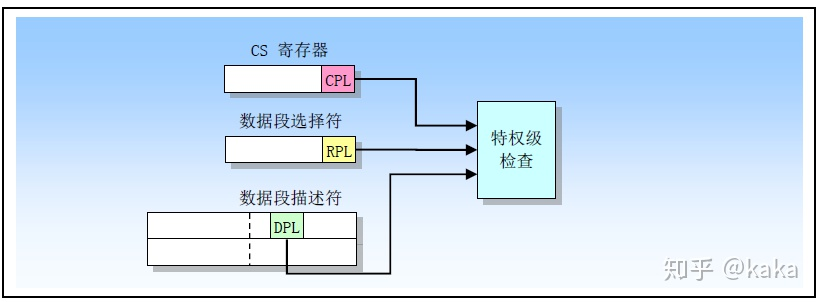
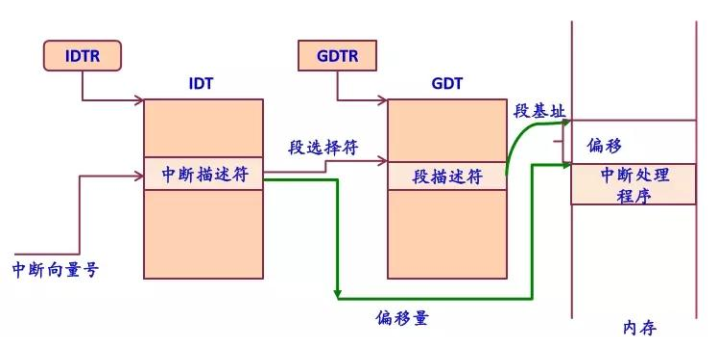

[toc]

# 前言


# 中断的概念

参考1：[漫画-Linux中断子系统综述](https://zhuanlan.zhihu.com/p/55561945)

这是我当年学习操作系统时候的中断，如果不嫌弃，可以翻一翻：[真象还原之中断](https://blog.csdn.net/sinat_38816924/article/details/97958623)

## 中断的概念

【来源：《深入理解linux内核》第四章。】

中断( Interrupt)通常被定义为一个事件，该事件改变处理器执行的指令顺序。这样的事件与CPU芯片内外部硬件电路产生的电信号相对应。

中断通常分为同步( synchronous)中断和异步( asynchronous)中断:

* 同步中断是当指令执行时由CPU控制单元产生的，之所以称为同步，是因为只有在一条指令终止执行后CPU才会发出中断。

* 异步中断是由其他硬件设备依照CPU时钟信号随机产生的。

在 Intel微处理器手册中，把同步和异步中断分别称为异常( exception)和中断( Interrupt)。我们也采用这种分类，当然有时我们也用术语“中断信号”指这两种类型(同步及异步)。

中断是由间隔定时器和I/O设备产生的，例如，用户的一次按键会引起一个中断。另一方面，异常是由程序的错误产生的，或者是由内核必须处理的异常条件产生的。第一种情况下，内核通过发送一个每个unix程序员都熟悉的信号来处理异常。第二种情况下，内核执行恢复异常需要的所有步骤，例如缺页，或对内核服务的一个请求(通过条int或 sysenter指令)。

PS：每个能够发出中断请求的硬件设备控制器都有一条IRQ(Interrupt ReQuest)的输出线。所有现有的IRQ线都与一个可编程中断控制器( Programmable
Interrpt Controner， PIC)的硬件电路的输入引脚相连。为了充分发挥SMP体系结构的并行性，能够把中断传递给系统中的每个CPU至关重要。基于此理由，Inte从 PentiumⅢ开始引入了一种I/O高级可编程控制器(I/O Advanced Programmable Interrupt Controller, I/O APIC)的新组件，用以代替老式的8259A可编程中断控制器。新近的主板为了支持以前的操作系统都包括两种芯片。

[via](https://blog.csdn.net/sinat_38816924/article/details/84641219)

 

<br>

## 查看当前系统中的中断

参考：[/proc/interrupts 文件](https://blog.51cto.com/noican/1355357) | [/proc/irq 目录](https://blog.csdn.net/yiyeguzhou100/article/details/51746031) | [SMP IRQ 亲和性](https://www.kernel.org/doc/html/latest/translations/zh_CN/core-api/irq/irq-affinity.html?highlight=proc%20interrupts)

[我没找见这两个文件的官方文档。]

```shell
➜  cat /proc/interrupts
          CPU0       CPU1       CPU2       CPU3       
  0:          6          0          0          0   IO-APIC   2-edge      timer
  8:          0          1          0          0   IO-APIC   8-edge      rtc0
  9:          0          0          0          0   IO-APIC   9-fasteoi   acpi
 16:          0          0         31          0   IO-APIC  16-fasteoi   ehci_hcd:usb1, ath9k
 18:          0          0          0          0   IO-APIC  18-fasteoi   i801_smbus
 23:        126          0          0        237   IO-APIC  23-fasteoi   ehci_hcd:usb2
 24:          0          0          0          0   PCI-MSI 16384-edge      PCIe PME
 25:          0          0          0          0   PCI-MSI 458752-edge      PCIe PME
 26:          0          0          0          0   PCI-MSI 466944-edge      PCIe PME
 ....
PIN:          0          0          0          0   Posted-interrupt notification event
NPI:          0          0          0          0   Nested posted-interrupt event
PIW:          0          0          0          0   Posted-interrupt wakeup event
```

```shell
➜  cd /proc/irq
➜  ls
0  1  10  11  12  13  14  15  16  18  2  23  24  25  26  27  28  29  3  30  31  32  33  34  35  36  4  5  6  7  8  9  default_smp_affinity
```

**我想知道，我的键盘使用的是哪个中断**？

```shell
➜  lsusb
...
Bus 003 Device 004: ID 413c:2107 Dell Computer Corp. Dell USB Entry Keyboard
...
Bus 003 Device 032: ID 0b05:185f ASUSTek Computer, Inc. UT220 Pro wireless/WT300
```

可以看到，我的Dell键盘和ASUS鼠标挂载在第三个usb控制器上，它们的设备号分是004，032。

我知道`/proc/interrupts`中和USB相关的中断，包含“hci”关键字：[USB 中OHCI、UHCI、EHCI、XHCI controller解释](https://blog.csdn.net/shenjin_s/article/details/89947758)

```shell
➜  cat /proc/interrupts | grep hci
 16:          0          0         31          0   IO-APIC  16-fasteoi   ehci_hcd:usb1, ath9k
 23:        126          0          0        268   IO-APIC  23-fasteoi   ehci_hcd:usb2 # usb2.0
 28:     221758      85204      85634    5089889   PCI-MSI 327680-edge      xhci_hcd # usb3.0
 30:      25490    7855655     222968     370042   PCI-MSI 512000-edge      ahci[0000:00:1f.2] # 和硬盘相关，咱不管它
```

此时，只要判断我键盘的接口是usb2.0，还是3.0，即可判断出键盘对应的中断是哪个了？

常识可知，usb3.0的接口是蓝色的，usb2.0的口是黑色的。但是，我用的这台电脑全是黑色的。。

不怕，我们敲击键盘，发现只有中断28的中断次数有增加。所以，我大概率推测：**当前键盘挂载的usb控制器对应的中断是28号**。

**28号中断描述（1）**：

* 在四个核中，分别处理了221758、85204、85634、5089889次。
* 中断控制器的名字是PCI-MSI：[PCI/PCIE 总线概述(6)—MSI和MSI-X中断机制 -- 雾](https://example61560.wordpress.com/2016/06/30/pcipcie-%E6%80%BB%E7%BA%BF%E6%A6%82%E8%BF%B06/)
* irq的名字是327680-edge。edge是边沿触发。
* 驱动程序注册该irq时使用的名字xhci_hcd。(xhci:eXtensible Host Controller Interface; hed:host controller driver)

**28号中断描述（2）**：

* 我当前的系统已开启[irqbalance](https://github.com/Irqbalance/irqbalance)，用于帮助平衡所有系统 CPU 上的中断产生的 CPU 负载。

  ```shell
  systemctl status irqbalance
  ```

  一个没有开启irqbalance的例子：[开启irqbalance提升服务器性能](https://www.huaweicloud.com/articles/444f3df55a2fbc487bad51bbeba11f64.html)

* 具有亲和力的CPU核是0,2。

  ```shell
  ➜  cat smp_affinity_list
  0,2
  
  # 也可以通过smp_affinity，获得。
  # 5=0101
  # 0101&1111=0101,从右到左，指定是0,2号cpu核
  ➜ cat smp_affinity
  5
  ```

<br>

# 中断描述符表

## 中断描述符表的结构

参考：[32位下中中断描述符表](https://github.com/freelancer-leon/notes/blob/master/kernel/irq.md) | [64位下的中断描述符表](https://blog.csdn.net/shadow20080578/article/details/45583733)

[idt_descr](https://elixir.bootlin.com/linux/v5.6/source/arch/x86/kernel/idt.c#L168)：中断描述符表(Interrupt Description Table, IDT)的大小，其中每一项是2*sizeof(unsigned long)=16bytes大小；中断描述符表的起始地址。这个表初始化之后，为只读属性。

```c
/* Must be page-aligned because the real IDT is used in a fixmap. */
gate_desc idt_table[IDT_ENTRIES] __page_aligned_bss;

struct desc_ptr idt_descr __ro_after_init = {
	.size		= (IDT_ENTRIES * 2 * sizeof(unsigned long)) - 1,
	.address	= (unsigned long) idt_table,
};
```

[gate_struct](https://elixir.bootlin.com/linux/v5.6/source/arch/x86/include/asm/desc_defs.h#L77)：IDT的表项格式。

```c
typedef struct gate_struct gate_desc;

struct gate_struct {
	u16		offset_low; // 中断函数的函数地址低16位
	u16		segment;    // 段选择子
	struct idt_bits	bits; // 一些属性，占两个字节=16位
	u16		offset_middle; // 中断函数地址中16位
#ifdef CONFIG_X86_64
	u32		offset_high; // 中断函数的函数地址高32位
	u32		reserved;   // 保留未使用
#endif
} __attribute__((packed));

struct idt_bits {
	u16		ist	: 3,
			zero	: 5,
			type	: 5, // 门描述符的种类
			dpl	: 2, // 描述符特权级
			p	: 1;
} __attribute__((packed));
```

 

之后，idt_descr指针被加载到idtr寄存器。-- 待验证

<br>

## 操作系统底层特权级机制

参考：[操作系统底层特权级机制详述](http://www.codebelief.com/article/2018/01/operating-system-privilege-mechanism-detailed-explanation/)

- DPL：Descriptor Privilege Level，描述符特权级，位于描述符的属性字段。
- RPL：Request Privilege Level，请求特权级，位于选择符中的 RPL 字段。
- CPL：Current Privilege Level，当前特权级，位于代码段寄存器（CS）的低两位。

 CPL 比较容易理解，我们需要用它来判断当前正在执行的代码处于哪个特权级，这样才能对它的行为做出限制。

DPL 表示描述符的特权级，我们根据它来判断程序是否有足够权限对相关的段进行某些操作。

RPL 就是请求者的特权级别。我们要访问某个数据段、跳转到某个代码段、调用某个例程，都可以视为请求，而发出这个请求的就称为请求者。

可能你问：发出请求的不就是当前程序吗？既然当前程序是请求者，直接用 CPL 就可以表示了，为什么要多一个 RPL？

通常情况下，请求者就是当前程序本身，此时 RPL = CPL。但并非所有情况都是如此，例如由于 I/O 特权级的限制，用户程序（特权级为 3）不能自己访问硬盘，但可以通过调用门借助系统例程来完成访问。当执行系统例程进行 I/O 操作时，当前程序就是系统例程，而请求者就是用户程序，CPL = 0，而 RPL = 3。

引入 RPL 是为了帮助处理器在遇到一条将选择子传送到段寄存器的指令时，能够区分真正的请求者是谁。

**从低特权级升到到特权级，需要门。调用门就像一个中间者一样，我们可以通过它来转移到更高特权级的目标代码段**。(这个应该是通过硬件实现的，但是怎么实现的，我不知道。)

[via](https://zhuanlan.zhihu.com/p/143002272)

 

<br>

## X86中的中断处理

来源：[中断处理机制](https://gitee.com/ljrcore/linuxmooc/blob/master/%E3%80%8ALinux%E5%86%85%E6%A0%B8%E5%88%86%E6%9E%90%E4%B8%8E%E5%BA%94%E7%94%A8%E3%80%8B%E8%AF%BE%E4%BB%B6/%E7%AC%AC%E4%BA%94%E7%AB%A0%20%E4%B8%AD%E6%96%AD/%E7%AC%AC5%E7%AB%A0%EF%BC%88%E4%BA%8C%EF%BC%89%E4%B8%AD%E6%96%AD%E5%A4%84%E7%90%86%E7%90%86%E6%9C%BA%E5%88%B6.pdf)

 

IDTR中存储着中断描述符表的起始地址。GDTR中存储着段描述符表的地址。

上图显示了通过中断向量号，找到对应的中断处理函数的过程。

需要注意的是段描述符中的DPL。虽然在linux中基地址都为零，但不意味着段描述符没啥作用。它起着特权级检查的作用。这也是上一节介绍特权级机制的原因。当特权级检查通过之后，通过[linux内存寻址](https://blog.csdn.net/sinat_38816924/article/details/117432485)，即可找到对应的处理函数。

<br>

# 中断的使用

参考：[Linux generic IRQ handling](https://www.kernel.org/doc/html/latest/core-api/genericirq.html?highlight=interrupts) | [驱动申请中断API](http://www.wowotech.net/irq_subsystem/request_threaded_irq.html) 

对上面的硬件，能力有限，不再追究。仅想知道如何使用中断。这也是**linux内核中通用中断处理模块的作用**，与硬件无关。

## 示例代码

代码来源：[中断下半部的代码分析及应用](https://gitee.com/ljrcore/linuxmooc/tree/master/《Linux内核分析与应用》动手实践源码/5.6动手实践－中断下半部的代码分析及应用)

代码中的模块可以给irq号中断，添加一个中断服务例程。

```c
# include <linux/kernel.h>
# include <linux/init.h>
# include <linux/module.h>
# include <linux/interrupt.h>

static int irq;
static char * devname;

module_param(irq,int,0644);
module_param(devname,charp,0644);

struct myirq
{
	int devid;
};

struct myirq mydev={1119};

static struct tasklet_struct mytasklet;
 
//中断下半部处理函数
static void mytasklet_handler(unsigned long data)
{
	printk("I am mytasklet_handler");
}

//中断处理函数
static irqreturn_t myirq_handler(int irq,void * dev)
{
	static int count=0;
	printk("count:%d\n",count+1);
	printk("I am myirq_handler\n");
	printk("The most of the interrupt work will be done by following tasklet\n");
	tasklet_init(&mytasklet,mytasklet_handler,0);	
	tasklet_schedule(&mytasklet);	
	count++;
	return IRQ_HANDLED;
}


//内核模块初始化函数
static int __init myirq_init(void)
{
	printk("Module is working...\n");
	if(request_irq(irq,myirq_handler,IRQF_SHARED,devname,&mydev)!=0)
	{
		printk("%s request IRQ:%d failed..\n",devname,irq);
		return -1;
	}
	printk("%s request IRQ:%d success...\n",devname,irq);
	return 0;
}

//内核模块退出函数
static void __exit myirq_exit(void)
{
	printk("Module is leaving...\n");
	free_irq(irq,&mydev);
	tasklet_kill(&mytasklet);
	printk("Free the irq:%d..\n",irq);
}

MODULE_LICENSE("GPL");
module_init(myirq_init);
module_exit(myirq_exit);
```

<br>

## 为中断线添加一个处理程序

```c
request_irq(irq,myirq_handler,IRQF_SHARED,devname,&mydev)
```

[request_irq](https://elixir.bootlin.com/linux/v5.6/source/include/linux/interrupt.h#L156)：为中断线添加一个处理程序

```c
/**
 * request_irq - Add a handler for an interrupt line
 * @irq:	The interrupt line to allocate
 * @handler:	Function to be called when the IRQ occurs.
 *		Primary handler for threaded interrupts
 *		If NULL, the default primary handler is installed
 * @flags:	Handling flags
 * @name:	Name of the device generating this interrupt
 * @dev:	A cookie passed to the handler function
 *
 * This call allocates an interrupt and establishes a handler; see
 * the documentation for request_threaded_irq() for details.
 */
static inline int __must_check
request_irq(unsigned int irq, irq_handler_t handler, unsigned long flags,
	    const char *name, void *dev)
{
	return request_threaded_irq(irq, handler, NULL, flags, name, dev);
}
```

[request_threaded_irq](https://elixir.bootlin.com/linux/v5.6/source/kernel/irq/manage.c#L2013)：分配中断线。

```c
int request_threaded_irq(unsigned int irq, irq_handler_t handler,
			 irq_handler_t thread_fn, unsigned long irqflags,
			 const char *devname, void *dev_id)
{
    ...
    desc = irq_to_desc(irq); //通过irq找到desc结构
    ...
    action = kzalloc(sizeof(struct irqaction), GFP_KERNEL); // 申请存放中断例程的空间
    ...
    //由于是共享IRQ，所以新的例程被追加在原理IRQ例程之后 // 雾：http://bricktou.cn/kernel/irq/manage__setup_irq.html
    retval = __setup_irq(irq, desc, action);
    ...
}
```

[irq_to_desc](https://elixir.bootlin.com/linux/v5.6/source/kernel/irq/irqdesc.c#L351)：因为我的系统设置过`CONFIG_SPARSE_IRQ`参数，所以采用基数查找iqr号对应的[irq_desc](https://elixir.bootlin.com/linux/v5.6/source/include/linux/irqdesc.h#L56)结构。如果没有定义该参数，通用软件层次，则以irq_desc[NR_IRQS]数组的形式存在。

```c
struct irq_desc *irq_to_desc(unsigned int irq)
{
	return radix_tree_lookup(&irq_desc_tree, irq);
}
EXPORT_SYMBOL(irq_to_desc);
```

<br>

## 释放一个使用request_irq分配的中断

```c
free_irq(irq,&mydev);
```

[free_irq](https://elixir.bootlin.com/linux/v5.6/source/kernel/irq/manage.c#L1893)：释放一个使用request_irq分配的中断

```c
const void *free_irq(unsigned int irq, void *dev_id)
{
    ...
    action = __free_irq(desc, dev_id); // 释放一个使用request_irq分配的中断
    ...
    kfree(action); // 释放内存空间
    ...
}
```

<br>

## 中断执行

上面两步是设置中断。当中断到来之时，它是如何执行的呢？

一般而言，查到的资料是\_\_do\_IRQ()函数，是所有中断的入口。

但是[do-irq-entry-point -- linux document](https://www.kernel.org/doc/html/latest/core-api/genericirq.html?highlight=interrupts#do-irq-entry-point) 写到：

> The original implementation __do_IRQ() was an alternative entry point for all types of **interrupts**. It no longer exists.
>
> This handler turned out to be not suitable for all interrupt hardware and was therefore reimplemented with split functionality for edge/level/simple/percpu **interrupts**. This is not only a functional optimization. It also shortens code paths for interrupts.

所以我们这里不去关心，如何通过中断号执行对应的中断服务例程。

<br>

## 中断的deferable task

参考：[tasklet机制 -- 雾](http://www.wowotech.net/irq_subsystem/tasklet.html)

> 对于中断处理而言，linux将其分成了两个部分，一个叫做中断handler（top half），是全程关闭中断的，另外一部分是deferable task（bottom half），属于不那么紧急需要处理的事情。在执行bottom half的时候，是开中断的。有多种bottom half的机制，例如：softirq、tasklet、workqueue

```c
tasklet_init(&mytasklet,mytasklet_handler,0);	
tasklet_schedule(&mytasklet);	

tasklet_kill(&mytasklet);
```

* tasklet_init来初始化该tasklet。
* 为了调度一个tasklet执行，我们可以使用tasklet_schedule这个接口。
* tasklet_kill来卸载tasklet。

<br>

# 参考

[中断子系统 -- [蜗窝科技]](http://www.wowotech.net/sort/irq_subsystem)
