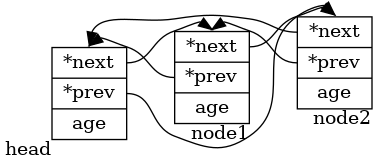
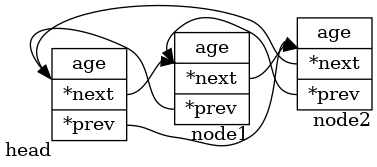

[toc]

# 前言

看linux内核源码，绕不开linux内核双链表结构。

本文将简介内核中的双链表结构。因为[bpf系统调用中插入了LSM的hook](https://elixir.bootlin.com/linux/v5.6/source/kernel/bpf/syscall.c#L3383)，所以我们需要简单看下哈希表结构。

本文参考的内核代码：[linux-v5.6](https://elixir.bootlin.com/linux/v5.6/source)

参考视频：[1.3linux内核的双链表结构](https://www.xuetangx.com/learn/XIYOU08091001441/XIYOU08091001441/5882092/video/9099223) | [1.4源码分析--内核中的](https://www.xuetangx.com/learn/XIYOU08091001441/XIYOU08091001441/5882092/video/9099224)

参考博客： [Linux内核链表——看这一篇文章就够了](https://www.cnblogs.com/yangguang-it/p/11667772.html) | [LINUX中哈希表的原理与应用](http://kerneltravel.net/blog/2020/hash_list_szp/)

本文出现的代码详细见仓库：[linux/code/list](../code/list)

<br>

# 内核双链表结构

内核中的双链表结构，只有指针域，没有数据域。使用的时候，双链表结构被嵌入到其他结构中。

**struct list_head**：[via](https://elixir.bootlin.com/linux/v5.6/source/include/linux/types.h#L176)

```c
struct list_head {
	struct list_head *next, *prev;
};
```

以数据结构的方式看源码是很无聊的，**我们以示例的形式介绍内核中的双链表结构**。

因为双链表结构是在内核中使用，我们可以使用模块的方式将代码导入。

或许也可以选择将内核使用的双链表结构，移植到用户空间。因为它仅仅是数据结构而已。**网上找到一份用户空间的list.h**：[list.h在用户态下的应用](https://www.cnblogs.com/muahao/p/8109733.html)

<br>

## 简单使用1

### 示例代码


```c
#include <stdio.h>
#include <stdlib.h>
#include "list.h"
struct person
{
    struct list_head list;
    int age;
};

int main(int argc,char **argv)
{
    int i;
    struct person *p;
    struct person person1;
    struct list_head *pos;

    INIT_LIST_HEAD(&person1.list);
    
    for (i = 0;i < 5;i++) {
        p = (struct person *)malloc(sizeof(struct person ));
        p->age=i*10;
        list_add(&p->list,&person1.list);
    }
    
    list_for_each(pos, &person1.list) {
        printf("age = %d\n",((struct person *)pos)->age);
    }
    
    return 0;
}
```

我们将双链表结构嵌套到person结构体中使用。代码中的数据结构如下图所示。

 

<br>

### 相关源码

此时，我们再来看看`INIT_LIST_HEAD`、`list_add`、`list_for_each`的源码。

**INIT_LIST_HEAD**：[via](https://elixir.bootlin.com/linux/v5.6/source/include/linux/list.h#L26)

可以看到INIT_LIST_HEAD将list_head结构中的next、prev指针都指向了自己。

```c
/**
 * INIT_LIST_HEAD - Initialize a list_head structure
 * @list: list_head structure to be initialized.
 *
 * Initializes the list_head to point to itself.  If it is a list header,
 * the result is an empty list.
 */
static inline void INIT_LIST_HEAD(struct list_head *list)
{
	WRITE_ONCE(list->next, list);
	list->prev = list;
}
```

WRITE_ONCE：[via](https://elixir.bootlin.com/linux/v5.6/source/include/linux/compiler.h#L284)。可以参考：[Linux内核中的READ_ONCE和WRITE_ONCE宏](https://blog.csdn.net/Roland_Sun/article/details/107365134)

> READ_ONCE和WRITE_ONCE宏只能保证读写操作不被编译器优化掉，造成多线程执行中出问题。

```c
#define WRITE_ONCE(x, val) \
({							\
	union { typeof(x) __val; char __c[1]; } __u =	\
		{ .__val = (__force typeof(x)) (val) }; \
	__write_once_size(&(x), __u.__c, sizeof(x));	\
	__u.__val;					\
})

// 便于阅读将上面的结构重新排版下
#define WRITE_ONCE(x, val) 
({	
    // 定义一个联合体，并创建一个联合体变量，并给其赋值
    // __c就可以当做这个联合体的指针来使用了
	union { 
        typeof(x) __val; 
        char __c[1]; 
    } __u = { .__val = (__force typeof(x)) (val) }; 

	__write_once_size(&(x), __u.__c, sizeof(x));	
	__u.__val;					
})

static __always_inline void __write_once_size(volatile void *p, void *res, int size)
{
	switch (size) {
	case 1: *(volatile __u8 *)p = *(__u8 *)res; break;
	case 2: *(volatile __u16 *)p = *(__u16 *)res; break;
	case 4: *(volatile __u32 *)p = *(__u32 *)res; break;
	case 8: *(volatile __u64 *)p = *(__u64 *)res; break;
	default:
		barrier();
		__builtin_memcpy((void *)p, (const void *)res, size);
		barrier();
	}
}
```

**list_add**：[via](https://elixir.bootlin.com/linux/v5.6/source/include/linux/list.h#L77)

通过代码可以看出，这个是头插法。

```c
/**
 * list_add - add a new entry
 * @new: new entry to be added
 * @head: list head to add it after
 *
 * Insert a new entry after the specified head.
 * This is good for implementing stacks.
 */
static inline void list_add(struct list_head *new, struct list_head *head)
{
	__list_add(new, head, head->next);
}

/*
 * Insert a new entry between two known consecutive entries.
 *
 * This is only for internal list manipulation where we know
 * the prev/next entries already!
 */
static inline void __list_add(struct list_head *new,
			      struct list_head *prev,
			      struct list_head *next)
{
	if (!__list_add_valid(new, prev, next))
		return;

	next->prev = new;
	new->next = next;
	new->prev = prev;
	WRITE_ONCE(prev->next, new);
}
```

**list_for_each**：[via](https://elixir.bootlin.com/linux/v5.6/source/include/linux/list.h#L547)

这里单纯的是双链表的遍历。

```c
/**
 * list_for_each	-	iterate over a list
 * @pos:	the &struct list_head to use as a loop cursor.
 * @head:	the head for your list.
 */
#define list_for_each(pos, head) \
	for (pos = (head)->next; pos != (head); pos = pos->next)
```

<br>

## 简单使用2

### 错误的示例代码

这次嵌入链表结构的时候，我们并没有将链表结构嵌入在开头。

```c
#include <stdio.h>
#include <stdlib.h>

#include "list.h"

struct person
{
    int age;
    struct list_head list;
};

int main(int argc,char **argv)
{
    int i;
    struct person *p;
    struct person person1;
    struct list_head *pos;

    INIT_LIST_HEAD(&person1.list);

    for (i = 0;i < 5;i++) {
        p = (struct person *)malloc(sizeof(struct person ));
        p->age=i*10;
        list_add(&p->list,&person1.list);
    }

    list_for_each(pos, &person1.list) {
        printf("age = %d\n",((struct person *)pos)->age);
    }

    return 0;
}
```

运行，输出错误结构。

```shell
age = -692075768
age = -692075800
age = -692075832
age = -692075864
age = 2145063752
```

错误原因也很简单。因为`((struct person *)pos)->age`这样的强制转换不对。此时的list指向的位置，不在整个结构体的开头。

 

那怎么整？如果可以将遍历的指针在取值的时候，先向前偏移age大小个位置，再强制转化。那问题就解决了。

<br>

### 正确的示例代码

list.h提供了`list_entry`用于解决上面的问题。list_entry的源码，在下面一小节展开。

```c
#include <stdio.h>
#include <stdlib.h>

#include "list.h"

struct person
{
    int age;
    struct list_head list;
};

int main(int argc,char **argv)
{
    int i;
    struct person *p;
    struct person person1;
    struct list_head *pos;

    INIT_LIST_HEAD(&person1.list);

    for (i = 0;i < 5;i++) {
        p = (struct person *)malloc(sizeof(struct person ));
        p->age=i*10;
        list_add(&p->list,&person1.list);
    }

    list_for_each(pos, &person1.list) {
        p = list_entry(pos,struct person,list);
        printf("age = %d\n",p->age);
    }

    return 0;
}
```

<br>

### 相关源码

**list_entry**：[via](https://elixir.bootlin.com/linux/v5.6/source/include/linux/list.h#L486)

```c
/**
 * list_entry - get the struct for this entry
 * @ptr:	the &struct list_head pointer.
 * @type:	the type of the struct this is embedded in.
 * @member:	the name of the list_head within the struct.
 */
#define list_entry(ptr, type, member) \
	container_of(ptr, type, member)
```

**container_of**：[via](https://elixir.bootlin.com/linux/v5.6/source/include/linux/kernel.h#L978)

先进行类型检查；然后根据偏移量，计算出结构的开始位置。

 

```c
/**
 * container_of - cast a member of a structure out to the containing structure
 * @ptr:	the pointer to the member.
 * @type:	the type of the container struct this is embedded in.
 * @member:	the name of the member within the struct.
 *
 */
#define container_of(ptr, type, member) ({				\
	void *__mptr = (void *)(ptr);					\
	BUILD_BUG_ON_MSG(!__same_type(*(ptr), ((type *)0)->member) &&	\
			 !__same_type(*(ptr), void),			\
			 "pointer type mismatch in container_of()");	\
	((type *)(__mptr - offsetof(type, member))); })


/**
 * BUILD_BUG_ON_MSG - break compile if a condition is true & emit supplied
 *		      error message.
 * @condition: the condition which the compiler should know is false.
 *
 * See BUILD_BUG_ON for description.
 */
#define BUILD_BUG_ON_MSG(cond, msg) compiletime_assert(!(cond), msg)

/* Are two types/vars the same type (ignoring qualifiers)? */
#define __same_type(a, b) __builtin_types_compatible_p(typeof(a), typeof(b))

#undef offsetof
#ifdef __compiler_offsetof
#define offsetof(TYPE, MEMBER)	__compiler_offsetof(TYPE, MEMBER)
#else
#define offsetof(TYPE, MEMBER)	((size_t)&((TYPE *)0)->MEMBER)
#endif
```

<br>

### 正确的示例代码跟进

上面，我们使用list_entry修正指针位置，从而遍历双链表。内核也提供了相应的遍历函数。

```c
#include <stdio.h>
#include <stdlib.h>

#include "list.h"

struct person
{
    int age;
    struct list_head list;
};

int main(int argc,char **argv)
{
    int i;
    struct person *p;
    struct person person1;
    struct list_head *pos;

    INIT_LIST_HEAD(&person1.list);

    for (i = 0;i < 5;i++) {
        p = (struct person *)malloc(sizeof(struct person ));
        p->age=i*10;
        list_add(&p->list,&person1.list);
    }

    list_for_each_entry(p, &person1.list,list){
        printf("age = %d\n",p->age);
    }

    return 0;
}
```

<br>

### 相关源码

**list_for_each_entry**：[via](https://elixir.bootlin.com/linux/v5.6/source/include/linux/list.h#L594)

可以看到，其实现是包装使用了list_entry。

```c
/**
 * list_for_each_entry	-	iterate over list of given type
 * @pos:	the type * to use as a loop cursor.
 * @head:	the head for your list.
 * @member:	the name of the list_head within the struct.
 */
#define list_for_each_entry(pos, head, member)				\
	for (pos = list_first_entry(head, typeof(*pos), member);	\
	     &pos->member != (head);					\
	     pos = list_next_entry(pos, member))


/**
 * list_first_entry - get the first element from a list
 * @ptr:	the list head to take the element from.
 * @type:	the type of the struct this is embedded in.
 * @member:	the name of the list_head within the struct.
 *
 * Note, that list is expected to be not empty.
 */
#define list_first_entry(ptr, type, member) \
	list_entry((ptr)->next, type, member)


/**
 * list_last_entry - get the last element from a list
 * @ptr:	the list head to take the element from.
 * @type:	the type of the struct this is embedded in.
 * @member:	the name of the list_head within the struct.
 *
 * Note, that list is expected to be not empty.
 */
#define list_last_entry(ptr, type, member) \
	list_entry((ptr)->prev, type, member)
```

<br>

## 简单使用3

### 示例代码

下面展示在遍历的时候，进行元素删除。

```c
#include <stdio.h>
#include <stdlib.h>

#include "list.h"

struct person
{
    int age;
    struct list_head list;
};

int main(int argc,char **argv)
{
    int i;
    struct person *p;
    struct person person1;
    struct list_head *pos;

    INIT_LIST_HEAD(&person1.list);

    for (i = 0;i < 5;i++) {
        p = (struct person *)malloc(sizeof(struct person ));
        p->age=i*10;
        list_add(&p->list,&person1.list);
    }

    // 方式一
    // list_for_each_entry(p, &person1.list,list){
    //     if(p->age == 30){
    //         list_del(&p->list);
    //         break;
    //     }
    // }

    // 方式二
    // list_for_each_entry(p, &person1.list,list){
    //     if(p->age == 30){
    //         struct person *tmp = list_next_entry(p, list);
    //         list_del(&p->list);
    //         p = tmp;
    //     }
    // }

    // 方式三
    struct person *n;
    list_for_each_entry_safe(p,n, &person1.list,list){
        if(p->age == 30){
            list_del(&p->list);
            free(p);
        }
    }

    list_for_each_entry(p, &person1.list,list){
        printf("age = %d\n",p->age);
    }

    return 0;
}
```

如果在链表遍历的时候，删除元素。需要先保存下后续遍历节点的位置。

我们可以使用`list_for_each_entry`进行遍历，在删除之前，保存后续节点的位置。

我们也可以使用内核提供的`list_for_each_entry_safe`。它的原理便是如此，即保存后续节点位置。

<br>

### 相关源码

**list_for_each_entry_safe**：[via](https://elixir.bootlin.com/linux/v5.6/source/include/linux/list.h#L681)

添加一个临时节点指针，用于保存后续节点位置。

```c
/**
 * list_for_each_entry_safe - iterate over list of given type safe against removal of list entry
 * @pos:	the type * to use as a loop cursor.
 * @n:		another type * to use as temporary storage
 * @head:	the head for your list.
 * @member:	the name of the list_head within the struct.
 */
#define list_for_each_entry_safe(pos, n, head, member)			\
	for (pos = list_first_entry(head, typeof(*pos), member),	\
		n = list_next_entry(pos, member);			\
	     &pos->member != (head); 					\
	     pos = n, n = list_next_entry(n, member))
```

<br>

# 哈希表结构

哈希表的介绍见：[散列表](https://blog.csdn.net/sinat_38816924/article/details/111995848)

内核中的哈希表，这篇博客整理的挺好：[LINUX中哈希表的原理与应用](http://kerneltravel.net/blog/2020/hash_list_szp/)

<font color=red>本节内容，从上面链接进行复制</font>

<br>

## 哈希表的定义

散列表（Hash table，也叫哈希表），是根据键（Key）而直接访问在内存储存位置的数据结构。也就是说，它通过计算一个关于键值的函数，将所需查询的数据映射到表中一个位置来访问记录，这加快了查找速度。这个映射函数称做散列函数，存放记录的数组称做散列表。

通过哈希函数使用关键字计算存储地址的时候，不可避免的会产生冲突，通常处理冲突的方法有：开放定地址法（线性探测、平方探测）、单独链表法、双散列、再散列。linux中使用了其中的单独链表法，即利用了我们上面介绍的双向链表实现，将散列到同一个存储位置的所有元素保存在一个链表中。

hlist_head | hlist_node ：[via](https://elixir.bootlin.com/linux/v5.6/source/include/linux/types.h#L180)

```c
struct hlist_head {
	struct hlist_node *first;
};
struct hlist_node {
	struct hlist_node *next, **pprev;
};
```

可以看到哈希表包含两个数据结构，一个是哈希链表节点hlist_node，另一个是哈希表头hlist_head。可以看到哈希节点hlist_node和内核普通双向链表的节点唯一的区别就在于，前向节点pprev是个两级指针。同时并没有使用hlist_node作为哈希表头，而是重新定义了hlist_head结构体，这是因为哈希链表并不需要双向循环，为了节省空间使用一个指针first指向该哈希表的第一个节点就可以了。整个哈希表结构如下图所示，其中ppre是个二级指针，它指向前一个节点的第一个指针变量，例如node1的ppre指向mylist的first指针，node2的ppre指向node1的next指针。

之所以使用ppre二级指针是为了避免在首节点之后插入删除节点和在其他位置插入删除节点实现逻辑的不同，读者可以将ppre改成一级指针指向前一个节点，就可以发现实现逻辑的不同。

 

<br>

## 哈希表的声明和初始化宏

INIT_HLIST_NODE：[via](https://elixir.bootlin.com/linux/v5.6/source/include/linux/list.h#L765)

初始化宏都是建立一个hlist_head结构体，并把first成员设置为NULL。

初始化hlist_node结构体，把两个成员变量赋值为NULL。

```c
/*
 * Double linked lists with a single pointer list head.
 * Mostly useful for hash tables where the two pointer list head is
 * too wasteful.
 * You lose the ability to access the tail in O(1).
 */

#define HLIST_HEAD_INIT { .first = NULL }
#define HLIST_HEAD(name) struct hlist_head name = {  .first = NULL }
#define INIT_HLIST_HEAD(ptr) ((ptr)->first = NULL)
static inline void INIT_HLIST_NODE(struct hlist_node *h)
{
	h->next = NULL;
	h->pprev = NULL;
}
```

<br>

## 在哈希表中增加节点

hlist_add_head：[via](https://elixir.bootlin.com/linux/v5.6/source/include/linux/list.h#L845)

```c
static inline void hlist_add_head(struct hlist_node *n, struct hlist_head *h)

static inline void hlist_add_before(struct hlist_node *n,
					struct hlist_node *next)

static inline void hlist_add_behind(struct hlist_node *n,
				    struct hlist_node *prev)

static inline void hlist_add_fake(struct hlist_node *n)
```

hlist_add_head是把一个哈希链表的节点插入到哈希链表的头节点的后边，也就是头插法。传入了哈希表头h和待插入的节点n，首先得到hlist_head的first成员，就是后边的节点的指针，这个节点可能是NULL，然后新插入的节点的next指向first后边的节点，如果first不为空，也就是后边有节点存在，head的后边的节点的pprev成员就指向新插入的节点的next成员的地址，head的first就指向新插入的节点，新插入节点的pprev成员指向head的first成员的地址。

```c
/**
 * hlist_add_head - add a new entry at the beginning of the hlist
 * @n: new entry to be added
 * @h: hlist head to add it after
 *
 * Insert a new entry after the specified head.
 * This is good for implementing stacks.
 */
static inline void hlist_add_head(struct hlist_node *n, struct hlist_head *h)
{
	struct hlist_node *first = h->first;
	WRITE_ONCE(n->next, first);
	if (first)
		WRITE_ONCE(first->pprev, &n->next);
	WRITE_ONCE(h->first, n);
	WRITE_ONCE(n->pprev, &h->first);
}
```

每次插入一个节点后，哈希表的存储情况如下图所示。

 

<br>

## 遍历哈希表

hlist_for_each：[via](https://elixir.bootlin.com/linux/v5.6/source/include/linux/list.h#L947)

```c
#define hlist_for_each(pos, head) \
	for (pos = (head)->first; pos ; pos = pos->next)

#define hlist_for_each_safe(pos, n, head) \
	for (pos = (head)->first; pos && ({ n = pos->next; 1; }); \
	     pos = n)
```

<br>

# 附录

## dot_image

双链表介绍中的图片，使用dot language表示。详细如下。

```DOT


@startdot hello_list
digraph R {
    rankdir=LR
    node [shape=record];

    node1 [xlabel="head"] [label="<f0> *next|<f1> *prev|<f2> age"];
    node2 [xlabel="node1"] [label="<f0> *next|<f1> *prev|<f2> age"];
    node3 [xlabel="node2"] [label="<f0> *next|<f1> *prev|<f2> age"];

    node1:f0 -> node2:n;
    node2:f0 -> node3:n;
    node3:f0 -> node1:n;
    node1:f1 -> node3:n;
    node2:f1 -> node1:n;
    node3:f1 -> node2:n;
}
@enddot


@startdot hello_list_error
digraph R {
    rankdir=LR;
    node [shape=record];

    node1 [xlabel="head"] [label="<f0> age|<f1> *next|<f2> *prev"];
    node2 [xlabel="node1"] [label="<f0> age|<f1> *next|<f2> *prev"];
    node3 [xlabel="node2"] [label="<f0> age|<f1> *next|<f2> *prev"];

    node1:f1 -> node2:f1:nw;
    node2:f1 -> node3:f1:nw;
    node3:f1 -> node1:f1:nw;
    node1:f2 -> node3:f1:nw;
    node2:f2 -> node1:f1:nw;
    node3:f2 -> node2:f1:nw;
}
@enddot


@startdot hello_list_error_fix
digraph R {
    // 直线
    splines=false;
    node [shape=record];

    __mptr [shape=plaintext]
    ptr [shape=plaintext]
    node1 [label="<f0> data|<f1> member"]

    __mptr -> node1:f0:nw
    ptr -> node1:f1:nw 
    __mptr -> ptr [label="offset"] [dir=back]

    {rank=same;ptr;__mptr}
}
@enddot

```

