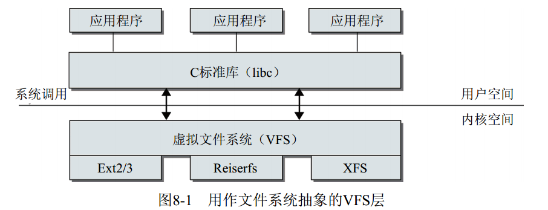

[toc]

## 摘要

了解操作系统中，文件系统的结构。

了解虚拟文件系统中相关的数据结构。

给系统添加一个简易的自定义的文件系统。

<br>

## 文件系统设计

这个我可能只是知道一个大概。可以自行参考：《现代操作系统》第四章。

我以前整理过的一篇博客：[从文件系统的角度区分硬链接与软连接](https://blog.csdn.net/sinat_38816924/article/details/103464069)

> 为支持各种本机文件系统，且在同时允许访问其他操作系统的文件， Linux内核在用户进程（或C标准库）和文件系统实现之间引入了一个抽象层。该抽象层称之为虚拟文件系统（ Virtual File System），简称VFS。

 

<br>

## VFS的相关数据结构

可以参考：[Linux内核学习笔记（一）虚拟文件系统（VFS）](https://www.huliujia.com/blog/81d31574c9a0088e8ae0c304020b4b1c4f6b8fb9/)

OR

1. [VFS四大对象之一 struct super_block](https://cloud.tencent.com/developer/article/1053842?from=10680)

    > 超级块代表了整个文件系统，超级块是文件系统的控制块，有整个文件系统信息，一个文件系统所有的inode都要连接到超级块上，可以说，一个超级块就代表了一个文件系统。

2. [VFS四大对象之二 struct inode](https://cloud.tencent.com/developer/article/1053852?from=10680)

   > 保存的其实是实际的数据的一些信息，这些信息称为“元数据”(也就是对文件属性的描述)。例如：文件大小，设备标识符，用户标识符，用户组标识符，文件模式，扩展属性，文件读取或修改的时间戳，链接数量，指向存储该内容的磁盘区块的指针，文件分类等等。

3. [VFS四大对象之三 struct dentry](https://cloud.tencent.com/developer/article/1053871?from=article.detail.1053852)

   > 目录项：目录项是描述文件的逻辑属性，只存在于内存中，并没有实际对应的磁盘上的描述，更确切的说是存在于内存的目录项缓存，为了提高查找性能而设计。注意不管是文件夹还是最终的文件，都是属于目录项，所有的目录项在一起构成一颗庞大的目录树。例如：open一个文件/home/xxx/yyy.txt，那么/、home、xxx、yyy.txt都是一个目录项，VFS在查找的时候，根据一层一层的目录项找到对应的每个目录项的inode，那么沿着目录项进行操作就可以找到最终的文件。

4. [VFS四大对象之四-struct file](https://cloud.tencent.com/developer/article/1053876?from=article.detail.1053852)

   > **文件对象**：注意文件对象描述的是进程已经打开的文件。因为一个文件可以被多个进程打开，所以一个文件可以存在多个文件对象。但是由于文件是唯一的，那么inode就是唯一的，目录项也是定的！
   >
   > 进程其实是通过文件描述符来操作文件的，注意每个文件都有一个32位的数字来表示下一个读写的字节位置，这个数字叫做文件位置。

我补充两个参考链接：[Overview of the Linux Virtual File System](https://www.kernel.org/doc/html/latest/filesystems/vfs.html) | [vfsmount对象](https://zhuanlan.zhihu.com/p/102251964) | [Linux查看分区文件系统类型总结](https://www.cnblogs.com/kerrycode/p/9445608.html)

**我不咋知道这几个结构。有一个比较旧结构图可以参考**，来源：[文件系统数据结构关系图](https://gitee.com/ljrcore/linuxmooc/tree/master/%E3%80%8ALinux%E5%86%85%E6%A0%B8%E5%88%86%E6%9E%90%E4%B8%8E%E5%BA%94%E7%94%A8%E3%80%8B%E8%AF%BE%E4%BB%B6/%E7%AC%AC%E5%85%AB%E7%AB%A0%20%E6%96%87%E4%BB%B6%E7%B3%BB%E7%BB%9F)

 

<br>

## 一个简易的自定义的文件系统

来源：[myfs](https://gitee.com/ljrcore/linuxmooc/tree/master/%E3%80%8ALinux%E5%86%85%E6%A0%B8%E5%88%86%E6%9E%90%E4%B8%8E%E5%BA%94%E7%94%A8%E3%80%8B%E5%8A%A8%E6%89%8B%E5%AE%9E%E8%B7%B5%E6%BA%90%E7%A0%81/8.5%E5%8A%A8%E6%89%8B%E5%AE%9E%E8%B7%B5%EF%BC%8D%E7%BC%96%E5%86%99%E4%B8%80%E4%B8%AA%E6%96%87%E4%BB%B6%E7%B3%BB%E7%BB%9F/myfs)

代码逻辑：

1. 注册文件系统：[register_filesystem](https://www.kernel.org/doc/html/latest/filesystems/vfs.html#registering-and-mounting-a-filesystem)

   > 传递的 struct file_system_type 描述了您的文件系统。当请求将文件系统挂载到命名空间中的目录时，VFS 将为特定文件系统调用适当的 mount() 方法。New vfsmount referring to the tree returned by ->mount() will be attached to the mountpoint，**因此当路径名解析到达挂载点时，它将跳转到该 vfsmount 的根目录**。

2. 为文件系统申请必备的数据结构：kern_mount

3. 该文件系统中的文件使用自定义的方式访问(open,write)文件。

**没有自顶向下的阅读下open，write之类的函数，感受不到VFS**。**这里应该也没有关于一个文件系统内部该如何组织构建**。

~~暂时跳过。后期，我应该会阅读关于bpf文件系统的代码。~~

下面的模块编译完成之后，安装模块。接着将其挂载到当前的某个路径下，这样系统就可以访问到该文件系统了。

```c
# include <linux/module.h>
# include <linux/fs.h>
# include <linux/dcache.h>
# include <linux/pagemap.h>
# include <linux/mount.h>
# include <linux/init.h>
# include <linux/namei.h>
//current_fsuid函数：
//current_fsgid函数：
# include <linux/cred.h>
//加入misc机制
# include <linux/kfifo.h>


//每个文件系统需要一个MAGIC number
# define MYFS_MAGIC 0X64668735
# define MYFS "myfs"

static struct vfsmount * myfs_mount;
static int myfs_mount_count;

DEFINE_KFIFO(mydemo_fifo,char,64);

int g_val;


//*****************************************************************************
//									底层创建函数
//*****************************************************************************
static struct inode * myfs_get_inode(struct super_block * sb, int mode, dev_t dev)
{
	struct inode * inode = new_inode(sb);

	if(inode)
	{
		inode -> i_mode = mode;
		//@i_uid：user id
		inode->i_uid  = current_fsuid();
		//@i_gid：group id组标识符
		inode->i_gid  = current_fsgid();
		//@i_size：文件长度
		inode -> i_size = VMACACHE_SIZE;
		//@i_blocks：指定文件按块计算的长度
		inode -> i_blocks = 0;
		//@i_atime：最后访问时间
		//@i_mtime：最后修改时间
		//@i_ctime：最后修改inode时间
		inode -> i_atime = inode->i_mtime = inode->i_ctime = current_time(inode);

		switch(mode & S_IFMT)
		{
			default:
				init_special_inode(inode,mode,dev);
				break;
			case S_IFREG:
				printk("creat a file\n");
				break;
			case S_IFDIR:
				printk("creat a content\n");
				//inode_operations
				inode -> i_op = &simple_dir_inode_operations;
				//file_operation	
				inode -> i_fop = &simple_dir_operations;
				//@：文件的链接计数，使用stat命令可以看到Links的值，硬链接数目
				//inode -> i_nlink++;
				inc_nlink(inode);
				break;			
		}
	}
	return inode;
}


//把创建的inode和dentry连接起来
static int myfs_mknod(struct inode * dir, struct dentry * dentry, int mode, dev_t dev)
{
	struct inode * inode;
	int error = -EPERM;

	if(dentry -> d_inode)
		return -EPERM;

	//从所属文件的超级块中获取inode
	inode = myfs_get_inode(dir->i_sb, mode, dev);
	if(inode)
	{
		d_instantiate(dentry,inode); // 为 dentry 填写 inode 信息
		dget(dentry); //引用计数+1？
		error = 0;

	}
	return error;
}

//************************************************************************
//							创建目录，文件
//************************************************************************

static int myfs_mkdir(struct inode * dir, struct dentry * dentry, int mode)
{
	int res;

	res = myfs_mknod(dir, dentry, mode|S_IFDIR, 0);
	if(!res)
	{
		inc_nlink(dir);

	}
	return res;
}

static int myfs_creat(struct inode * dir, struct dentry * dentry, int mode)
{
	return myfs_mknod(dir, dentry, mode|S_IFREG, 0);
}


//************************************************************************
//							　　　注册信息
//************************************************************************

/*

*/
static int myfs_fill_super(struct super_block *sb, void *data, int silent)
{
	//这个结构体如下：
	//struct tree_descr { const char *name; const struct file_operations *ops; int mode; };
	static struct tree_descr debug_files[] = {{""}};

	return simple_fill_super(sb,MYFS_MAGIC,debug_files);
}


/*
这个函数是按照内核代码中的样子改的，是struct dentry *类型，这里是一个封装，这里可以返回好几种函数：
　－　mount_single：挂载一个在所有挂载之间共享实例的文件系统
　－　mount_bdev：挂载驻留在块设备上的文件系统　
　－　mount_nodev：挂载不受设备支持的文件系统
*/

static struct dentry *myfs_get_sb(struct file_system_type *fs_type, int flags,
		       const char *dev_name, void *data)
{
	return mount_single(fs_type, flags, data, myfs_fill_super);
}


/*********************************************************************
								文件操作部分
*********************************************************************/
//对应于打开aufs文件的方法
static int myfs_file_open(struct inode *inode, struct file *file)
{
	printk("已打开文件");

	return 0;
}
//对应于读取的aufs文件的读取方法
static ssize_t myfs_file_read(struct file *file, char __user *buf, size_t count, loff_t *ppos)
{
	int actual_readed;
	int ret;

	ret = kfifo_to_user(&mydemo_fifo,buf, count, &actual_readed);
	if(ret)
		return -EIO;

	printk("%s,actual_readed=%d,pos=%lld\n",__func__,actual_readed,*ppos);

	return actual_readed;
}
//对应于写入的aufs文件的写入方法
static ssize_t myfs_file_write(struct file *file, const char __user *buf, size_t count, loff_t *ppos)
{	
	unsigned int actual_write;
	int ret;

	ret = kfifo_from_user(&mydemo_fifo, buf, count, &actual_write);
	if(ret)
		return -EIO;

	printk("%s: actual_write=%d,ppos=%lld\n",__func__,actual_write,*ppos);

	return actual_write;

}


/**
 * owner:指向module的指针，仅当文件系统类型是以模块方式注册时，owner才有效
 * name：文件系统类型的名称，例如“ext2”、“iso9660”、“msdos”等
 * mount：应挂载此文件系统的新实例时调用的方法
 * kill_sb：删除内存中的super block，在卸载文件系统时使用
 * fs_supers：同名文件系统可能存在多个实例，它们的超级块都插入到该链表中
*/
static struct file_system_type my_fs_type = {
	.owner 		= THIS_MODULE,
	.name 		= MYFS,
	.mount 		= myfs_get_sb,
	.kill_sb 	= kill_litter_super 
};


static struct file_operations myfs_file_operations = {
    .open = myfs_file_open,
    .read = myfs_file_read,
    .write = myfs_file_write,
};


//*****************************************************************************
//					
//*****************************************************************************


static int myfs_creat_by_name(const char * name, mode_t mode,
				struct dentry * parent, struct dentry ** dentry)
{
	int error = 0;

	if(!parent)
	{
		if(myfs_mount && myfs_mount -> mnt_sb)
		{
			parent = myfs_mount->mnt_sb->s_root;// 根目录的dentry
		}
	}

	if(!parent)
	{
		printk("can't find a parent");
		return -EFAULT;
	}

	*dentry = NULL;

	/**
	 * d_inode - Get the actual inode of this dentry
	 * lookup_one_len函数首先在父目录下根据名字查找dentry结构，如果存在同名的dentry结构就返回指针，如果不存在就创建一个dentry
	*/
	inode_lock(d_inode(parent));
	*dentry = lookup_one_len(name,parent,strlen(name));
	if(!IS_ERR(*dentry))
	{
		if((mode & S_IFMT) == S_IFDIR)
		{
			error = myfs_mkdir(parent->d_inode, *dentry, mode);
		}
		else
		{
			error = myfs_creat(parent->d_inode, *dentry, mode);
		}
	}
	//error是０才对
	if (IS_ERR(*dentry)) {
		error = PTR_ERR(*dentry);
	}
	inode_unlock(d_inode(parent));

	return error;
}


struct dentry * myfs_creat_file(const char * name, mode_t mode,
				struct dentry * parent, void * data,
				struct file_operations * fops)
{
	struct dentry * dentry = NULL;
	int error;

	printk("myfs:creating file '%s'\n",name);

	error = myfs_creat_by_name(name, mode, parent, &dentry);

	if(error)
	{
		dentry = NULL;
		goto exit;
	}

	if(dentry->d_inode)
	{
		if(data)
			dentry->d_inode->i_private = data;
		if(fops)
			dentry->d_inode->i_fop = fops;
	}

exit:
	return dentry;
}

struct dentry * myfs_creat_dir(const char * name, struct dentry * parent)
{
	//使用man creat查找
	//@S_IFREG：表示一个目录
	//@S_IRWXU：user (file owner) has read,  write,  and  execute　permission
	//@S_IRUGO：用户读｜用户组读｜其他读
	return myfs_creat_file(name, S_IFDIR|S_IRWXU|S_IRUGO, parent, NULL, NULL);
}


//*************************************************************************
//								模块注册退出
//*************************************************************************	

static int __init myfs_init(void)
{
	int retval;
	struct dentry * pslot;

	//注册文件系统
	retval = register_filesystem(&my_fs_type);

	if(!retval)
	{
		//创建super_block根dentry的inode
		myfs_mount = kern_mount(&my_fs_type);
		//如果装载错误就卸载文件系统
		if(IS_ERR(myfs_mount))
		{
			printk("--ERROR:aufs could not mount!--\n");
			unregister_filesystem(&my_fs_type);
			return retval;
		}
	}

	pslot = myfs_creat_dir("First", NULL);
	//@S_IFREG：表示一个文件
	//@S_IRUGO：用户读｜用户组读｜其他读
	// pslot是即将创建的父目录的dentry
	myfs_creat_file("one", S_IFREG|S_IRUGO|S_IWUSR, pslot, NULL, &myfs_file_operations);
	myfs_creat_file("two", S_IFREG|S_IRUGO|S_IWUSR, pslot, NULL, &myfs_file_operations);

	pslot = myfs_creat_dir("Second", NULL);
	myfs_creat_file("one", S_IFREG|S_IRUGO|S_IWUSR, pslot, NULL, &myfs_file_operations);
	myfs_creat_file("two", S_IFREG|S_IRUGO|S_IWUSR, pslot, NULL, &myfs_file_operations);

	return retval;
}

static void __exit myfs_exit(void)
{
	//退出函数中卸载super_block根dentry的inode
	simple_release_fs(&myfs_mount,&myfs_mount_count);
	//卸载文件系统
	unregister_filesystem(&my_fs_type);
	//aufs_mount = NULL;
}

module_init(myfs_init);
module_exit(myfs_exit);
MODULE_LICENSE("GPL");
```

