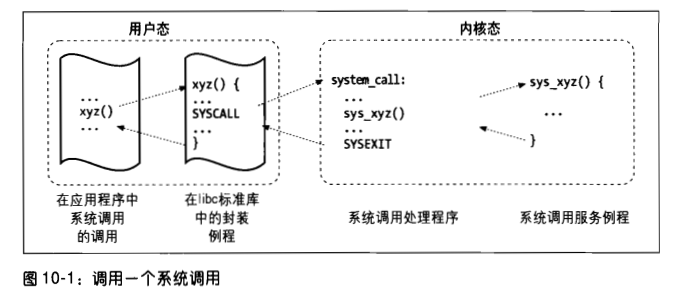
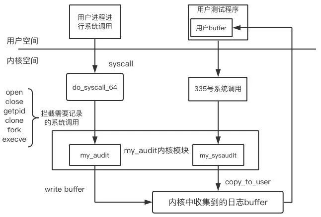
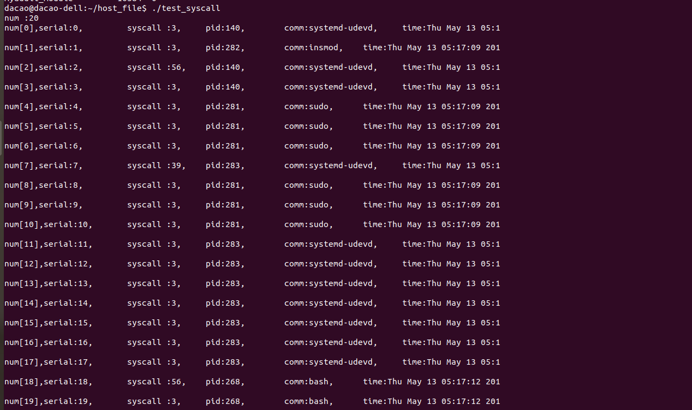
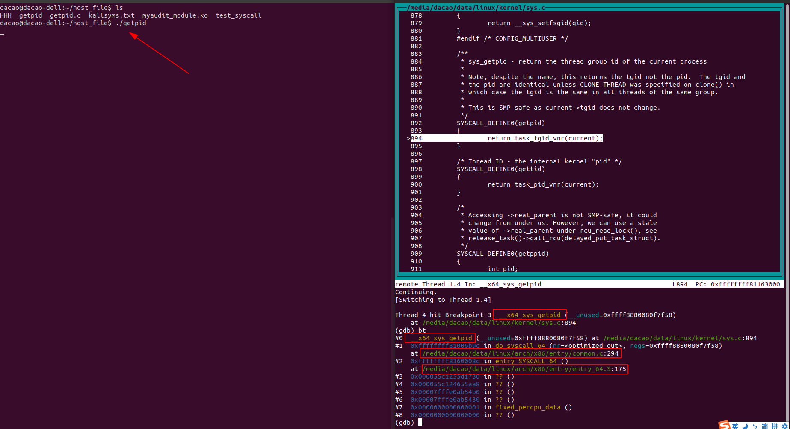

[toc]

# 摘要

通过[《深入理解linux内核》](https://book.douban.com/subject/2287506/)这本书的第十章 系统调用，我们了解系统调用原理。

通过[《linux内核分析与应用》](https://www.xuetangx.com/course/XIYOU08091001441/5882092?channel=learn_title)这门网课的第六章 系统调用，我们实验操作添加一个日志收集的系统调用。

为了看到系统调用的流程，我们使用gdb调试了内核。

<br>

# 系统调用原理简介

<font color=red>本节来源</font>：[《深入理解linux内核》](https://book.douban.com/subject/2287506/)第十章 系统调用。我原文搬运下。

本章将详细讨论linux内核是如何实现这些由用户态进程向内核发出的系统调用。

<br>

## POSIX API 和 系统调用

让我们先强调一下应用编程接口(API)与系统调用之不同。前者只是一个函数定义，说明了如何获得一个给定的服务;而后者是通过软中断向内核态发出一个明确的请求。

Unix系统给程序员提供了很多API的库函数。libc的标准C库所定义的一些API引用了封装例程( wrapper routine)(其唯一目的就是发布系统调用)。通常情况下，每个系统调用对应一个封装例程，而封装例程定义了应用程序使用的API。

反之则不然，顺便说一句，一个API没必要对应一个特定的系统调用。首先，API可能直接提供用户态的服务(例如一些抽象的数学函数，根本没必要使用系统调用)。其次，个单独的API函数可能调用几个系统调用。此外，几个API函数可能调用封装了不同功能的同一系统调用。例如， Linux的libc库函数实现了malloc()、calloc()和free()
等 POSIX API，这几个函数分配和释放所请求的内存，并都利用brk()系统调用来扩大或缩小进程的堆(heap)(参见第九章中的“堆的管理”一节)。

**POSIX 标准针对API而不针对系统调用。判断一个系统是否与 POSIX兼容要看它是否提供了一组合适的应用程序接口，而不管对应的函数是如何实现的。事实上，一些非Uuix系统被认为是与 POSIX兼容的，因为它们在用户态的库函数中提供了传统Unx能提供的所有服务**。

**从编程者的观点看，API和系统调用之间的差别是没有关系的：唯一相关的事情就是函数名、参数类型及返回代码的含义。然而，从内核设计者的观点看，这种差别确实有关系，因为系统调用属于内核，而用户态的库函数不属于内核**。

**大部分封装例程返回一个整数，其值的含义依赖于相应的系统调用。返回值-1通常表示内核不能满足进程的请求。系统调用处理程序的失败可能是由无效参数引起的，也可能是因为缺乏可用资源，或硬件出了问题等等。在libc库中定义的 errno变量包含特定的出错码**。

每个出错码都定义为一个常量宏(产生一个相应的正整数值)。 POSIX 标准指定了很多出错码的宏名。在基于80x86系统的 Linux 中，在一个名为 include/asm-i386/erno.h 的头文件中定义了这些宏。为了使各种Unix系统上的C程序具有可移植性，在标准的C库头文件 /asr/include/errno.h 中也包含了 include/asm-i386/erno.h 头文件。其他的系统有它们自己专门的头文件子目录。

<br>

## 系统调用处理程序及服务例程

当用户态的进程调用一个系统调用时，CPU切换到内核态并开始执行一个内核函数。正如我们在下一节将要看到的那样，在80x86体系结构中，可以用两种不同的方式调用Linux的系统调用。两种方式的最终结果都是跳转到所谓系统调用处理程序( system callhandler)的汇编语言函数。

因为内核实现了很多不同的系统调用，因此进程必须传递一个名为系统调用号( system call number)的参数来识别所需的系统调用，ea×寄存器就用作此目的。正如我们将在本章的“参数传递”一节所看到的，当调用一个系统调用时通常还要传递另外的参数。

所有的系统调用都返回一个整数值。这些返回值与封装例程返回值的约定是不同的。在内核中，正数或0表示系统调用成功结束，而负数表示一个出错条件。在后一种情况下，这个值就是存放在 errno 变量中必须返回给应用程序的负出错码。内核没有设置或使用errno变量，而封装例程从系统调用返回之后设置这个变量。

<font color=red>系统调用处理程序与其他异常处理程序的结构类似，执行下列操作</font>：

* 在内核态栈保存大多数寄存器的内容（这个操作对所有的系统调用都是通用的，并用汇编语言编写）。
* 调用名为系统调用服务例程( system call service routine)的相应的C函数来处理系统调用。
* 退出系统调用处理程序:用保存在内核栈中的值加载寄存器，CPU从内核态切换回到用户态（所有的系统调用都要执行这一相同的操作，该操作用汇编语言代码实）。

xyz()系统调用对应的服务例程的名字通常是sys_xyz()。不过也有一些例外。

图10-1显示了调用系统调用的应用程序、相应的封装例程、系统调用处理程序及系统调用服务例程之间的关系。箭头表示函数之间的执行流。占位符" SYSCALL"和“ SYSEXIT“是真正的汇编语言指令，它们分别把CPU从用户态切换到内核态和从内核态切换到用户态。

  

为了把系统调用号与相应的服务例程关联起来，内核利用了一个系统调用分派表( dispatch table)。这个表存放在sys_ call table数组中，有 NR_syscolls个表项(在Linux2.6.ll内核中是289):第n个表项包含系统调用号为n的服务例程的地址。

NR syscalls宏只是对可实现的系统调用最大个数的静态限制，并不表示实际已实现的系统调用个数。实际上，分派表中的任意一个表项也可以包含 sys_nlsyscall()函数的地址，这个函数是“未实现”系统调用的服务例程，它仅仅返回出错码 -ENOSYS。

<br>

## 进入和退出系统调用

本地应用(注1)可以通过两种不同的方式调用系统调用:

* 执行int \$0x80汇编语言指令。在 Linux内核的老版本中，这是从用户态切换到内核态的唯一方式。
* 执行 sysenter汇编语言指令。在 Intel PentiumⅡ微处理器芯片中引入了这条指令，现在 Linux2.6内核支持这条指令。

同样，内核可以通过两种方式从系统调用退出，从而使CPU切换回到用户态：

* 执行iret汇编语言指令。
* 执行 sy sexit汇编语言指令，它和 sysenter指令同时在 Intel PentiumⅡ微处理器中引入。

但是，支持进入内核的两种不同方式并不像看起来那么简单，因为:

* 内核必须既支持只使用int\$0x80指令的旧函数库，同时支持也可以使用 sysenter指令的新函数库
* 使用 sysenter指令的标准库必须能处理仅支持ints0x80指令的旧内核。
* 内核和标准库必须既能运行在不包含 sysenter指令的旧处理器上，也能运行在包含
  它的新处理器上。

在本章稍后“通过 sysenter指令发出系统调用”一节，我们将看到 Linux内核是如何解决这些兼容性问题的。

[*博客注：这里只搬运int \$0x80进入和退出系统调用的相关内容。sysenter过程我没看懂，所以不搬运*。]

<br>

### 通过int \$0x80指令发出系统调用

调用系统调用的传统方法是使用汇编语言指令int，在第四章“中断和异常的硬件处理“节曾讨论过这条指令。

向量128(十六进制0x80)对应于内核入口点。在内核初始化期间调用的函数trap_init()用下面的方式建立对应于向量128的中断描述符表表项：[*博客注：在内核初始化时期，向中断描述符表的0x80表项填入下面的门描述符*]

`set_system_gate(0x80， &system_call)`该调用把下列值存入这个门描述符的相应字段（参见第四章中的“中断门、陷阱门及系统门“一节）：

* Segment Selector：内核代码段__ KERNEL_Cs的段选择符。
* Offset：指向 system _cal1()系统调用处理程序的指针。
* Type：置为15。表示这个异常是一个陷阱，相应的处理程序不禁止可屏蔽中断。
* DPL（描述符特权级）：置为3。这就允许用户态进程调用这个异常处理程序(参见第四章中的“中断和异常的硬件处理”一节）。

**因此，当用户态进程发出int \$0x80指令时，CPU切换到内核态并开始从地址 system_call处开始执行指令**。

<br>

#### system_call()函数

system_call()函数首先把系统调用号和这个异常处理程序可以用到的所有CPU寄存器保存到相应的栈中，不包括由控制单元已自动保存的ef1ags、cs、eip、ss和esp寄存器(参见第四章中的“中断和异常的硬件处理”一节)。在第四章的“I/O中断处理一节中已经讨论的SAVE_ALL宏，也在ds和es中装入内核数据段的段选择符：

```assembly
system call:
  pushl %eax
  SAVE_ALL
  movl Soxffffe000， %ebx /* or Oxfffffooo for 4-KB stack */
  andl %esp， %ebx
```

随后，这个函数在ebx中存放当前进程的 thread_info数据结构的地址，这是通过获得内核栈指针的值并把它取整到4KB或8KB的倍数而完成的(参见第三章中的“标识个进程”一节)。

接下来， system_call()函数检查 thread_info结构flag字段的TIF_SYSCALL_TRACE和TIF_SYSCALL_AUDIT标志之一是否被设置为1，也就是检查是否有某一调试程序正在跟踪执行程序对系统调用的调用。如果是这种情况，那么 system_call()函数两次调用 do_syscall_trace() 函数：一次正好在这个系统调用服务例程执行之前，一次在其之后(稍后对其进行说明)。这个函数停止 current，并因此允许调试进程收集关于current的信息

然后，对用户态进程传递来的系统调用号进行有效性检查。如果这个号大于或等于系统调用分派表中的表项数，系统调用处理程序就终止：

```assembly
  cmpl SNR_syscalls， %eax
  jb nobadsys
  movl $(-ENOSYS)， 24(%esp)
  jmp resume userspace
nobadsys:
```

如果系统调用号无效，该函数就把- ENOSYS值存放在栈中曾保存ea×寄存器的单元中(从当前栈顶开始偏移量为24的单元)。然后跳到 resume userspace(见下面)。这样，当进程恢复它在用户态的执行时，会在eax中发现一个负的返回码。

最后，调用与eax中所包含的系统调用号对应的特定服务例程：`call *sys _call_table(o， %eax， 4)`

因为分派表中的每个表项占4个字节，因此首先把系统调用号乘以4，再加上sys_ call table分派表的起始地址，然后从这个地址单元获取指向服务例程的指针，内核就找到了要调用的服务例程。

<br>

#### 从系统调用退出

当系统调用服务例程结束时， system_call()函数从eax获得它的返回值，并把这个返回值存放在曾保存用户态eax寄存器值的那个栈单元的位置上：`movl %eax， 24(%esp)`

因此，用户态进程将在eax中找到系统调用的返回码。

然后， system_call()函数关闭本地中断并检查当前进程的 thread info:结构中的标志：、

```assembly
cli
movl 8(%ebp)， %ecx
testw $0xffff， %cx
de restore_all
```

f1ags字段在 thread_info结构中的偏移量为8，掩码0xffff选择与表4-15中列出的所有标志(不包括TIF_POLLING NRFLAG)相对应的位。如果所有的标志都没有被设置函数就跳转到 restore all标记处，就像在第四章“从中断和异常返回”一节中所描述的: restore_all标记处的代码恢复保存在内核栈中的寄存器的值，并执行iret汇编语言指令以重新开始执行用户态进程(你可以參考如图4-6所示的流程图)。

只要有任何一种标志被设置，那么就要在返回用户态之前完成一些工作。如果TIF_SYSCALL_TRACE标志被设置， system_call()函数就第二次调用do_syscoll_trace()函数，然后跳转到 resume_userspace标记处。否则，如果TIF_SYSCALL_TRACE标志没有被设置，函数就跳转到 work_ pending标记处。

就像在第四章“从中断和异常返回”一节中所描述的，在 resume_userspace和work_ pending标记处的代码检査重新调度请求、虚拟8086模式、挂起信号和单步执行最终跳转到 restore_all标记处以恢复用户态进程的执行。

<br>

## 参数传递

与普通函数类似，系统调用通常也需要输入/输出参数，这些参数可能是实际的值(例如数值)，也可能是用户态进程地址空间的变量，甚至是指向用户态函数的指针的数据结构地址(参见第十一章“与信号处理相关的系统调用”一节)。

因为 system_call()和 sysenter_entry()函数是 Linux中所有系统调用的公共入口点因此每个系统调用至少有一个
即通过eax寄存器传递来的系统调用号。例如，如果一个应用程序调用fork()封装例程，那么在执行int \$0x80或sysenter汇编指令之前就把**eax寄存器置为2(即__NR_fork)**。因为这个寄存器的设置是由libc库中的封装例程进行的，因此程序员通常并不用关心系统调用号。

fork()系统调用并不需要其他的参数。不过，很多系统调用确实需要由应用程序明确地传递另外的参数。例如，mmap()系统调用可能需要多达6个额外参数(除了系统调用号以外)。普通C函数的参数传递是通过把参数值写入活动的程序栈(用户态栈或者内核态栈)实现的[*博客注：现在是通过寄存器传递*]。因为系统调用是一种横跨用户和内核两大陆地的特殊函数，所以既不能使用用户态栈也不能使用内核态栈。**更确切地说，在发出系统调用之前，系统调用的参数被写入CPU寄存器，然后在调用系统调用服务例程之前，内核再把存放在CPU中的参数拷贝到内核态堆栈中**，这是因为系统调用服务例程是普通的C函数。

为什么内核不直接把参数从用户态的栈拷贝到内核态的栈呢?首先，同时操作两个栈是比较复杂的。其次，寄存器的使用使得系统调用处理程序的结构与其他异常处理程序的结构类似。

然而，为了用寄存器传递参数，必须满足两个条件:

* 每个参数的长度不能超过寄存器的长度，即32位(注4)。

* 参数的个数不能超过6个(除了eax中传递的系统调用号)，因为80x86处理器的寄存器的数量是有限的。

第一个条件总能成立，因为根据 POSIX标准，不能存放在32位寄存器中的长参数必须通过指定它们的地址来传递。一个典型的例子就是 settimeofday()系统调用，它必须读一个64位的结构。

然而，确实存在多于6个参数的系统调用。在这样的情况下，用一个单独的寄存器指向进程地址空间中这些参数值所在的一个内存区。当然，编程者不用关心这个工作区。正如任何C调用一样，当调用封装例程时，参数被自动地保存在栈中。封装例程将找到合适的方式把参数传递给内核。

**用于存放系统调用号和系统调用参数的寄存器是(以字母递增的顺序)：eax(存放系统调用号)、ebx、ecx、edx、esi，edi以及ebp**。正如以前看到的一样， systemcall()和 sysenter_entry()使用**SAVE_ALL去把这些寄存器的值保存在内核态堆栈中**。因此当系统调用服务例程转到内核态堆栈时，就会找到 systemall(或 sysenter_entry()的返回地址，紧接着是存放在ebx中的参数(即系统调用的第一个参数)，存放在ecx中的参数等等(参见第四章中的“为中断处理程序保存寄存器的值”一节)。这种栈结构与普通函数调用的栈结构完全相同，因此，系统调用服务例程很容易通过使用C语言结构来引用它的参数。

让我们来看一个例子。处理wrie()系统调用的 sys write()服务例程的声明如下:
`int sys write (unsigned int fd， const char buf， unsigned int count)`

C编译器产生一个汇编语言函数，该函数期望在栈的顶部找到fd、buf和cunt参数，而这些参数位于返回地址(就是用来分别存放ebx、ecx和edx寄存器的那些位置)的下面。

在少数情况下，即使系统调用不使用任何参数，相应的服务例程也需要知道在发出系统调用之前CPU寄存器的内容。例如，实现了fork()的do_fork()函数需要知道有关寄存器的值，以便在子进程的 thread字段中复制它们(参见第三章的" thread字段”节)。在这些情况下，类型为pt_regs的一个单独参数允许服务例程访问由SAVE_ALL去保存在内核态堆栈中的值(参见第四章中的“ do_IR()函数”一节)：`int sys_fork (struct pt_regs regs)`

服务例程的返回值必须写入eax寄存器中。这是在执行“ return n;"指令时由C编译程序自动完成的。

<br>

### 验证参数

在内核打算满足用户的请求之前，必须仔细地检査所有的系统调用参数。检査的类型既依赖于系统调用，也依赖于特定的参数。让我们再回到前面引入的 write()系统调用：fd参数应该是描述一个特定文件的文件描述符，因此，sys_write()必须检査fd是否确实是以前已打开文件的一个文件描述符，是否允许进程向这个文件中写数据(参见第章中的“文件操作的系统调用”一节)。如果这些条件中有一个不成立，那么这个处理程序必须返回一个负数，在这种情况下的出错码为-EBADF。

而，有一种检查对所有的系统调用都是通用的。只要一个参数指定的是地址，那么内核必须检査它是否在这个进程的地址空间之内。有两种可能的方式来执行这种检查。[*博客注：这里仅搬运第二种粗略的检查，因为第一种我没看懂*。]

因此，如果不进行这种粗略检查，用户态进程就可能把属干内核地址空间的一个地址作为参数来传递，然后还能对内存中现有的任何页进行读写而不引起缺页异常对系统调用所传递地址的检查是通过 access_ok()宏实现的，它有两个分别为addr和size的参数。该宏检查addr到addr+size-1之间的地址区间，本质上等价于下面的C函数：

```c
int access_ok(const void * addr， unsigned long) addr{
    unsigned long a = (consigned long)addr;
	if (a+ size< a ||a+size> current_thread_info()->addr_limit.seg
		return 0;
	return 1   
}
```

该函数首先验证addr+size(要检査的最高地址)是否大于$2^{23}-1$;这是因为GNUC编译器(gcc)用32位数表示无符号长整型数和指针，这就等价于对溢出条件进行检查。该函数还检査addr+size是否超过 current的 thread_info结构的addr_limit.seg字段中存放的值。通常情况下，普通进程这个字段的值是PAGE_OFFSET，内核线程是0xffffffff。可以通过 get_fs和 set_fs宏动态地改变int access_ok(const void * addr， unsigned long) addr字段的值;这就允许内核绕过由 access_ok()执行的安全性检查，调用系统调用的服务例程，并直接把内核数据段的地址传递给它们。

函数 verify_area()执行与 access_ok()宏类似的检查，虽然它被认为是陈旧过时的，但在源代码中仍然被广泛使用。

<br>

## 内核封装例程

[*博客注：这小节参考下就好。看完后面的内容，这里自然可以清楚的知道*。]

尽管系统调用主要由用户态进程使用，但也可以被内核线程调用，内核线程不能使用库函数。为了简化相应封装例程的声明，Linux定义了7个从\_syscall0到\_syscall6的一组宏。

每个宏名字中的数字0~6对应着系统调用所用的参数个数（系统调用号除外）。也可以用这些宏来声明没有包含在libc标准库中的封装例程（例如，因为Linux系统调用还未受到库的支持）。然而，不能用这些宏来为超过6个参数（系统调用号除外）的系统调用或产生非标准返回值的系统调用定义封装例程。

每个宏严格地需要2+2×n个参数，n是系统调用的参数个数。前两个参数指明系统调用的返回值类型和名字，每一对附加参数指明相应的系统调用参数的类型和名字。因此，以fork()系统调用为例，其封装例程可以通过如下语句产生：\_syscall0(int,fork)而write()系统调用的封装例程可以通过如下语句产生：\_syscall3(int,write,int,fd,const char·,buf,unsigned int,count)。[*博客注：这里不搬运宏展开，详细见书上*]

<br>

# linux添加系统调用

<font color=red>来源</font>：《linux内核分析与应用》这门网课

视频地址：[学堂在线 -- linux内核分析与应用 -- 第六章系统调用](https://www.xuetangx.com/course/XIYOU08091001441/5882092?channel=learn_title)

实验文字地址：[基于最新Linux-5.0版本系统调用--日志收集系统](https://cloud.tencent.com/developer/article/1517844) or [系统调用](http://wwww.kerneltravel.net/journal/iv/syscall.htm)

实验提供的代码：[6.3系统调用--日志收集系统](https://github.com/linuxkerneltravel/linuxmooc/tree/master/%E3%80%8ALinux%E5%86%85%E6%A0%B8%E5%88%86%E6%9E%90%E4%B8%8E%E5%BA%94%E7%94%A8%E3%80%8B%E5%8A%A8%E6%89%8B%E5%AE%9E%E8%B7%B5%E6%BA%90%E7%A0%81/6.3%E7%B3%BB%E7%BB%9F%E8%B0%83%E7%94%A8%E6%97%A5%E5%BF%97%E6%94%B6%E9%9B%86%E7%B3%BB%E7%BB%9F)

下面我们进行实验。

## 环境准备

我使用qemu来运行实验环境，详细见：[linux内核实验环境搭建](https://blog.csdn.net/sinat_38816924/article/details/116571783)

1. 编译内核

   ```shell
   make defconfig
   make kvmconfig
   ```

   修改.config文件，在文件末尾添加这些内容。

   为什么修改(知道)这些参数：我使用make menuconfig加载上面生成的.config。然后在这个图形化界面中浏览参数，使用crtl+？来查看参数含义，并记录下来。将记录下来的参数补充在.config的末尾。

   ```shell
   CONFIG_DEBUG_KERNEL=y
   CONFIG_DEBUG_INFO=y
   CONFIG_GDB_SCRIPTS=y
   CONFIG_RANDOMIZE_BASE=n
   # CONFIG_FTRACE_SYSCALLS=y
   
   CONFIG_KGDB=y
   
   CONFIG_KCOV=y
   
   CONFIG_KASAN=y
   CONFIG_KASAN_INLINE=y
   ```

   ```shell
   # @echo  '  olddefconfig	  - Same as oldconfig but sets new symbols to their'
   # @echo  '  oldconfig	  - Update current config utilising a provided .config as base'
   make olddefconfig
   ```

2. 文件磁盘镜像的制作。[linux内核实验环境搭建](https://blog.csdn.net/sinat_38816924/article/details/116571783)。

   我的img制作小了。我应该给它一个20G。以后不同的kernel都使用这个镜像。

   一次制作，长久使用。

3. qemu启动

   ```bash
   #!/bin/bash
   
   bzImage_path="../5.6_debug/arch/x86/boot/bzImage"
   rfs_image_path="../debian.img"
   share_mnt_path="../share"
   
   read -e -i "$bzImage_path" -p "enter bzImage path : " bzImage_path 
   read -e -i "$rfs_image_path" -p "enter root file system image path : " rfs_image_path
   read -e -i "$share_mnt_path" -p  "enter the share image mnt path : " share_mnt_path
   
   
   qemu-system-x86_64 \
       -m 256M \
       -enable-kvm \
       -nographic -kernel $bzImage_path \
       -append 'root=/dev/sda console=ttyS0 rw nokaslr loglevel=3' \
       -drive file=$rfs_image_path,format=raw \
       -smp cores=2,threads=2  \
       -cpu kvm64,+smep,+smap  \
       -net nic \
       -net user \
       -fsdev local,security_model=passthrough,id=fsdev0,path=$share_mnt_path \
       -device virtio-9p-pci,fsdev=fsdev0,mount_tag=hostshare \
       -pidfile vm.pid \
       2>/dev/null
   ```

4. 共享文件夹的加载

   共享文件夹放入我们在主机上准备好的代码。

   ```shell
   sudo mount -t 9p -o trans=virtio hostshare /home/dacao/host_file/
   ```

<br>

## 添加系统调用

整体的日志收集系统调用，如下设计。

my_audit添加在do_syscall_64中，用于将收集到的信息，填充到一个内核缓冲区。

用户通过系统调用，将该内核缓冲区中的内容，读取到用户空间。

在系统调用时期，my_sysaudit在等待队列上睡眠，等待my_audit的唤醒。当没有系统调用的时候，my_aduit将缓冲区填满之后不再填充。

其中my_audit和my_sysaudit的具体实现，通过模块加载进入内核。

 

<br>

### 添加系统调用表项

在`arch/x86/entry/syscalls/syscall_64.tbl`中合适的位置，添加下面这一行。

合适的位置？？看下里面的代码结构，便可以知道哪里合适了。

```shell
439 common myaudit          __x64_sys_myaudit
```

<br>

### 添加系统调用函数

在`arch/x86/kernel/`目录下，添加`myaudit.c`文件。

```c
#include <linux/uaccess.h>
#include <linux/proc_fs.h>
#include <linux/init.h>
#include <linux/types.h>
#include <linux/sched.h>
#include <linux/syscalls.h>
#include <linux/kernel.h>
#include <asm/current.h>

void (*my_audit) (int,int) = 0;
int (*my_sysaudit)(u8,u8 *,u16,u8) = 0;

SYSCALL_DEFINE4(myaudit,u8,type,u8 *,us_buf,u16,us_buf_size,u8,reset)
{
        if (my_audit){
                printk("IN KENEL:my system call sys_myaudit() working\n");
                return (*my_sysaudit)(type,us_buf,us_buf_size,reset);

        } else
                printk("my_audit is not exist\n");
        return 1;

}

EXPORT_SYMBOL(my_audit);
EXPORT_SYMBOL(my_sysaudit);
```

1. [EXPORT_SYMBOL](https://lkw.readthedocs.io/en/latest/doc/04_exporting_symbols.html) ，大概是EXPORT_SYMBOL内定义的函数或者符号对全部内核代码公开，不用修改内核代码就可以在内核模块中直接调用。

   myaudit和my_sysaudit函数，后面通过模块方式导入。

2. [SYSCALL_DEFINEn](https://www.kernel.org/doc/html/latest/process/adding-syscalls.html?highlight=syscall_define)：您的新`xyzzy`系统调用的主要入口点将被调用 `sys_xyzzy()`，但是您使用适当的宏而不是显式地添加此入口点 。“ n”表示系统调用的参数数量，宏使用系统调用名称，后跟参数的“（类型，名称）”对作为参数。使用此宏可以使有关新系统调用的元数据可用于其他工具。`SYSCALL_DEFINEn()`

   所以，我们这里添加了一个sys_myaudit系统调用函数。关于这个宏的展开，有人整理过了，可以参考[详解Linux内核之syscall -- 3.3 系统调用函数的定义](http://sourcelink.top/2020/07/31/linux-syscall/)

3. 在`arch/x86/kernel/Makefile`中，添加编译条目。

   ```makefile
   # 在obj-y := process_$(BITS).o signal.o 被声明下面添加
   obj-y += myaudit.o  # 自己添加的系统调用。上面是:=,这里是+=。
   ```

<br>

### 系统调用函数声明

在`include/linux/syscalls.h`中末尾`\#endif`上面，添加声明。

```c
// 自行添加的系统调用
asmlinkage long sys_myaudit(u8,u8 *,u16,u8);
// 因为在arch/x86/entry/common.c中，我们使用myaudit进行了条件判断，所以我们得在这里添加声明
// extern表示在别处定义。这个函数，我们后面通过模块导入
extern void (*my_audit)(int,int);
```

<br>

### 在全体系统调用入口中添加条件

修改`arch/x86/entry/common.c`中`do_syscall_64`函数。

```c
#ifdef CONFIG_X86_64
__visible void do_syscall_64(unsigned long nr, struct pt_regs *regs)
{
	struct thread_info *ti;

	enter_from_user_mode();
	local_irq_enable();
	ti = current_thread_info();
	if (READ_ONCE(ti->flags) & _TIF_WORK_SYSCALL_ENTRY)
		nr = syscall_trace_enter(regs);

	if (likely(nr < NR_syscalls)) {
		nr = array_index_nospec(nr, NR_syscalls);
		regs->ax = sys_call_table[nr](regs);
        
////添加内容起始位置		
		if(nr==2||nr==3||nr==39||nr==56||nr==57||nr==59){ 
			if(my_audit)
				(*my_audit)(nr,regs->ax);
			else
				printk("my audit is not exits");
		}
////添加内容结束位置	
        
#ifdef CONFIG_X86_X32_ABI
	} else if (likely((nr & __X32_SYSCALL_BIT) &&
			  (nr & ~__X32_SYSCALL_BIT) < X32_NR_syscalls)) {
		nr = array_index_nospec(nr & ~__X32_SYSCALL_BIT,
					X32_NR_syscalls);
		regs->ax = x32_sys_call_table[nr](regs);
#endif
	}

	syscall_return_slowpath(regs);
}
#endif
```

为什么是修改`do_syscall_64`？这个，我们下一节使用gdb调试内核的时候便可以看到系统调用的流程：enter_64.S --> common.c --> 系统调用函数。

当系统调用号是2，3，39，56，57，59的时候，触发我们的myaudit函数。这也是为什么，我们在syscalls.h中进行声明的原因。

至于这些系统调用号对应哪些系统调用，自行到syscalls.h中查看。

<br>

### 添加内核模块

#### 内核模块内容

下面，我们使用内核模块，将myaudit和my_sysaudit函数的实现，加载到内核中。

内容保存在myaudit_module.c中。

```c
#include <linux/init.h>
#include <linux/module.h>
#include <linux/slab.h>
#include <linux/sched.h>
#include <linux/uaccess.h>

#define COMM_SIZE 16
#define AUDIT_BUF_SIZE 20

MODULE_LICENSE("GPL v2");

struct syscall_buf{
u32 serial;
u64 ts_sec;
u64 ts_micro;
u32 syscall;
u32 status;
pid_t pid;
uid_t uid;
u8 comm[COMM_SIZE];	
};

DECLARE_WAIT_QUEUE_HEAD(buffer_wait);

static struct  syscall_buf  audit_buf[AUDIT_BUF_SIZE];
static int current_pos = 0;
static u32 serial = 0;

void syscall_audit(int syscall,int return_status)
{	
	struct syscall_buf *ppb_temp;
	struct timespec64 nowtime;
	
	ktime_get_real_ts64(&nowtime);
	if(current_pos<AUDIT_BUF_SIZE){
		ppb_temp = &audit_buf[current_pos];
		ppb_temp->serial = serial++;
		ppb_temp->ts_sec = nowtime.tv_sec;
		ppb_temp->ts_micro = nowtime.tv_nsec;
		ppb_temp->syscall = syscall;
		ppb_temp->status = return_status;
		ppb_temp->pid = current->pid;
		ppb_temp->uid = current->tgid; 
		
		memcpy(ppb_temp->comm,current->comm,COMM_SIZE);
		if(++current_pos ==AUDIT_BUF_SIZE * 6/10)
			{
				printk("IN MODULE_AUDIT:yes,it near full\n");
				wake_up_interruptible(&buffer_wait);
			}
		}
	
}

int sys_audit(u8 type,u8 *us_buf,u16 us_buf_size,u8 reset)
{
	int ret = 0;
		if(!type){
			if(clear_user(us_buf,us_buf_size)){
				printk("Error:clear_user\n");
				return 0;
			}
			printk("IN MODULE_systemcall:starting...\n");
			ret = wait_event_interruptible(buffer_wait,current_pos >= AUDIT_BUF_SIZE *6/10);
			printk("IN MODULE_systemcall:over,current_pos is %d\n",current_pos);
			if(copy_to_user(us_buf,audit_buf,(current_pos)*sizeof(struct syscall_buf))){
				printk("Error:copy error\n");
				return 0;
			}
			ret = current_pos;
			current_pos = 0;

		}
		return ret;		
}

extern void(*my_audit)(int,int);
extern int (*my_sysaudit)(u8,u8*,u16,u8);
static int __init audit_init(void)
{
    // 将定义的函数，挂载到之前的钩子上。
    // 注意这个取放是有顺序的。my_audit是判断条件，要后挂先取。
	my_sysaudit = sys_audit; 
	my_audit = syscall_audit;
	printk("Exiting System Call Auditing\n");
	return;
}

module_init(audit_init);

static void __exit audit_exit(void)
{
	my_audit = NULL;
	my_sysaudit = NULL;
	printk("Exiting System Calling Auditing\n");
	return;
}

module_exit(audit_exit);
```

linux内核中的函数手册在那，我不知道。我直接google相关函数：[wait_event_interruptible 与 wake_up_interruptible函数](https://blog.csdn.net/Yeshangzhu/article/details/78051798)

1. my_audit函数，会将信息保存在一个内核缓冲区中。当缓冲区的容量到达6/10的时候，wake_up_interruptible唤醒等待队列中的进程。my_audit继续记录，当缓冲区满了之后，不再记录。
2. my_sysaudit函数，使用wait_event_interruptible在等待队列上睡眠。当被唤醒之后，读取缓冲区的内容，使用copy_to_user将内核中的内容复制到用户空间，并将游标清零。

<br>

#### 编译内核模块

这里是官网编译方式的介绍：[Building External Modules](https://www.kernel.org/doc/html/latest/kbuild/modules.html)

Makefile内容如下。

```makefile
obj-m += myaudit_module.o

LINUX_KER_PATH := /media/dacao/data/linux_image/5.6_debug

all:
	make -C $(LINUX_KER_PATH) M=$(CURDIR) modules

clean:
	make -C $(LINUX_KER_PATH) M=$(CURDIR) clean
```

<br>

#### 安装模块

```shell
# 安装模块
sudo insmod myaudit_module.ko

# 查看模块
lsmod

# 卸载模块
rmmod
```

<br>

### 测试系统调用

通过系统调用，将内核中收集的日志信息拷贝到用户空间。

```c
#include <stdlib.h>
#include <stdio.h>
#include <errno.h>
#include <signal.h>
#include <time.h>
#include <sys/resource.h>
#include <sys/syscall.h>
#include <sys/types.h>

#define COMM_SIZE 16

typedef unsigned char u8;
typedef unsigned int u32;
typedef unsigned long long u64;

struct syscall_buf{
	u32 serial;
	u64 ts_sec;
	u64 ts_micro;
	u32 syscall;
	u32 status;
	pid_t pid;
	uid_t uid;
	u8 comm[COMM_SIZE];
};

#define AUDIT_BUF_SIZE (20*sizeof(struct syscall_buf))

int main(int argc,char *argv[])
{	
	u8 col_buf[AUDIT_BUF_SIZE];
	unsigned char reset = 1;
	int num = 0;
	int i,j;
	struct syscall_buf *p;
	while(1){
		num = syscall(439,0,col_buf,AUDIT_BUF_SIZE,reset);
		printf("num :%d\n",num);
		p = (struct syscall_buf *)col_buf;
		for(i=0;i<num;i++){
			printf("num[%d],serial:%d,\t syscall :%d,\t pid:%d,\t comm:%s,\t time:%s\n",i,p[i].serial,p[i].syscall,p[i].pid,p[i].comm,ctime(&p[i].ts_sec));
		}
	}
	return 1;
}
```

<br>

## 结果

没啥问题，代码正常运行。

 

<br>

# linux内核的调试

这篇调试的入门很好：[深入理解Linux系统调用](https://www.cnblogs.com/chengjin96/p/12936511.html)

官网使用gdb调试内核：[Debugging kernel and modules via gdb](https://www.kernel.org/doc/html/latest/dev-tools/gdb-kernel-debugging.html) 

至于kgdb我没看明白：[Using kgdb, kdb and the kernel debugger internals](https://www.kernel.org/doc/html/v4.16/dev-tools/kgdb.html) 。youtube上有相关的介绍视频，自行搜索。

<br>

## qemu的启动

```shell
#!/bin/bash

bzImage_path="../5.6_debug/arch/x86/boot/bzImage"
rfs_image_path="../debian.img"
share_mnt_path="../share"

read -e -i "$bzImage_path" -p "enter bzImage path : " bzImage_path 
read -e -i "$rfs_image_path" -p "enter root file system image path : " rfs_image_path
read -e -i "$share_mnt_path" -p  "enter the share image mnt path : " share_mnt_path


qemu-system-x86_64 \
    -m 256M \
    -enable-kvm \
    -nographic -kernel $bzImage_path \
    -append 'root=/dev/sda rw console=ttyS0 loglevel=3 nokaslr' \
    -drive file=$rfs_image_path,format=raw \
    -smp cores=2,threads=2  \
    -cpu kvm64,+smep,+smap  \
    -net nic \
    -net user \
    -fsdev local,security_model=passthrough,id=fsdev0,path=$share_mnt_path \
    -device virtio-9p-pci,fsdev=fsdev0,mount_tag=hostshare \
    -pidfile vm.pid \
    -gdb tcp::1234 -S \
    2>/dev/null
```

<br>

## GDB调试系统调用

如果希望在linux中操作，gdb中使用c，让linux运行。

如果希望gdb中进行调试操作，ctrl+c中断，使用gdb调试就好。

<br>

下面，我们希望通过调试，观察getpid的系统调用流程。

```shell
# $ gdb 
# (gdb) file vmlinux           # vmlinux 位于目录 编译生成内核的目录 中
gdb vmlinux --tui
(gdb) target remote :1234    # 远程调试
(gdb) hb start_kernel     # 设置硬件断点:Linux的内核入口函数
(gdb) c   	
(gdb) break __x64_sys_getpid #给sys_getpid系统调用函数打断点
```

然后，我们运行一个使用getpid的函数。

```c
#include <syscall.h>
#include <unistd.h>
#include <stdio.h>
#include <sys/types.h>

int main(void) {
    long ID;
    ID = getpid();
    printf ("getpid()=%ld\n", ID);
    return 0;
}
```

 

后面慢慢调试就好，详细内容，可以参考：[深入理解Linux系统调用](https://www.cnblogs.com/chengjin96/p/12936511.html)

<br>