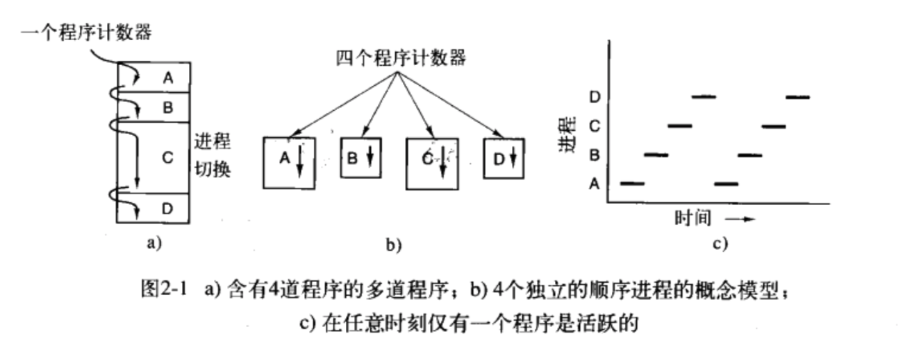
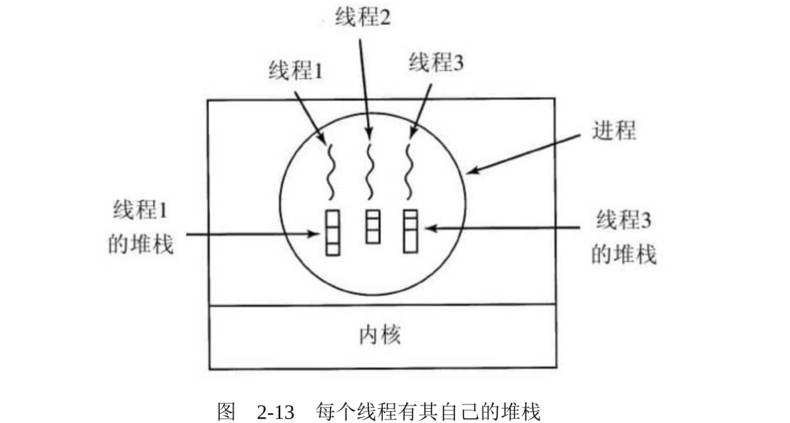
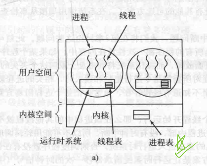
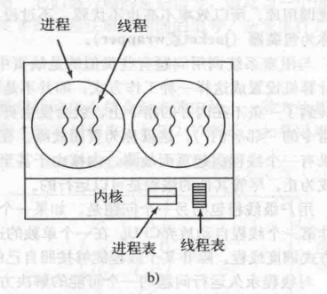
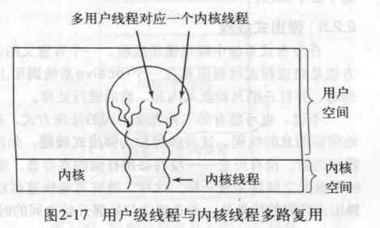
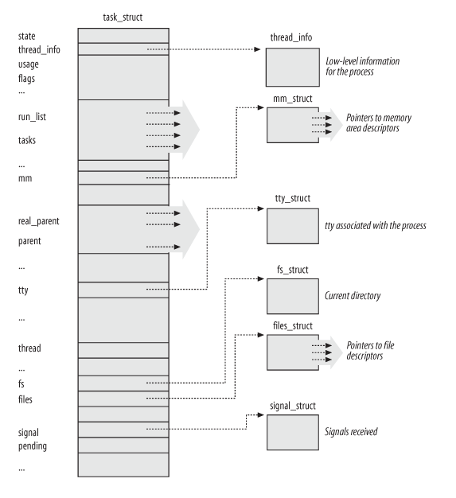
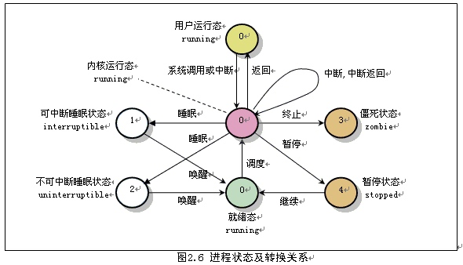
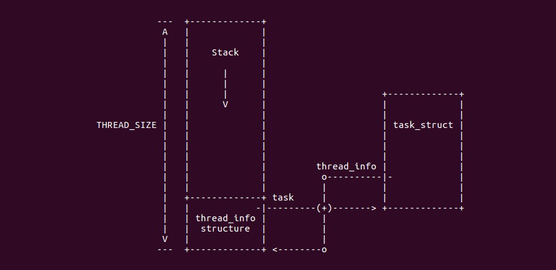

[toc]

# 前言

1. 我基本明白操作系统，进程和线程的概念。

2. 我基本明白linux这一操作系统，进程和线程都使用task_struct这一结构，作为控制块。
3. 但是，我不明白，linux中线程是如何共享资源。解决这个问题，需要更多的编程实践和底层源码的阅读。

这篇博客，简单总结下上面的1和2。

* 关于1：概念是抽象层次的。概念并不具象，但它是设计的指导。我们参考《现代操作系统》第二章 进程与线程。

* 关于2：linux中进程的具体实现。我们参考《linux内核设计与实现》第三章 进程管理、《深入理解linux内核》第三章 进程。

* 学习的过程中，实验是最快乐的事情。快乐不能缺席。实验来自：[《Linux内核分析与应用》动手实践源码](https://gitee.com/ljrcore/linuxmooc/tree/master/%E3%80%8ALinux%E5%86%85%E6%A0%B8%E5%88%86%E6%9E%90%E4%B8%8E%E5%BA%94%E7%94%A8%E3%80%8B%E5%8A%A8%E6%89%8B%E5%AE%9E%E8%B7%B5%E6%BA%90%E7%A0%81)

<br>

# 操作系统的进程与线程

<font color=red>本节来源</font>：《现代操作系统》第二章 进程与线程

进程是操作系统提供的最古老的也是最重要的抽象概念之一。即使可以使用的CPU只有一个，但它们也具有支持(伪)并发操作的能力，它们将一个单独的CPU变换成多个虚拟的CPU。没有进程的抽象，现代计算将不复存在。~~本章会通过大量的细节去探究进程~~，以及它们的第一个亲戚——线程。

<br>

## 进程

* 进程诞生的原因：一道程序在请求资源的时候等待，切换另一道程序来运行。尽最大能力使用CPU资源。
* 进程的模型：在某一瞬间，CPU只能运行某一个程序。但在1秒内，它可能运行了多个程序。
* 进程的创建：新进程都是由一个已经存在的进程执行一个用于创建进程的系统调用而创建的。
* 进程的终止：可能是正常退出，也可能是出错退出。
* 进程的层次结构：进程，进程组，会话
* 进程的状态：运行态、就绪态、阻塞态
* 进程的实现：操作系统维护着一张进程表，表项为进程控制块。表项包含进程状态的重要信息，包括程序计数器、堆栈指针、内存分配情况、打开文件的状态等。

 

<br>

## 线程

* 线程的必要性：进程之间无法共享地址空间和数据(线程比进程轻量级)；

* 线程模型：进程用于把资源集中到一起，线程则是CPU上被调度执行的实体。
* 线程的实现：用户空间实现线程，内核空间实现线程，混合线程。

  

## 用户线程

把整个线程包放在用户空间中，内核对线程包一无所知。从内核角度考虑，就是按正常的方式管理，即单线程进程。这种方法第一个也是最明显的优点是，用户级线程包可以在不支持线程的操作系统上实现。过去所有的操作系统都属于这个范围，即使现在也有一些操作系统还是不支持线程。

**在用户空间管理线程时，每个进程需要有其专用的线程表( thread table)，用来跟踪该进程中的线程**。这些表和内核中的进程表类似，不过它仅仅记录各个线程的属性，如每个线程的程序计数器、堆栈指针、寄存器和状态等。该线程表由运行时系统管理。当一个线程转换到就绪状态或阻塞状态时，在该线程表中存放重新启动该线程所需的信息，与内核在进程表中存放进程的信息完全一样。

当某个线程做了一些会引起在本地阻塞的事情之后，例如，等待进程中另一个线程完成某项工作，它调用一个运行时系统的过程，这个过程检查该线程是否必须进入阻塞状态。如果是，它在线程表中保存该线程的寄存器(即它本身的)，查看表中可运行的就绪线程，并把新线程的保存值重新装入机器的寄存器中。只要堆栈指针和程序计数器一被切换，新的线程就又自动投入运行。如果机器有一条保存所有寄存器的指令和另一条装入全部寄存器的指令，那么整个线程的切换可以在几条指令内完成。**进行类似于这样的线程切换至少比陷入内核要快一个数量级(或许更多)，这是使用用户级线程包的极大的优点**。

~~不过，线程与进程有一个关键的差别~~。在线程完成运行时，例如，在它调用 thread_yield时，pthread_ yield代码可以把该线程的信息保存在线程表中，进而，它可以调用线程调度程序来选择另一个要运行的线程。保存该线程状态的过程和调度程序都只是本地过程，所以启动它们比进行内核调用效率更高。另一方面，不需要陷入内核，不需要上下文切换，也不需要对内存高速缓存进行刷新，这就使得线程调度非常快捷。

用户级线程还有另一个优点。**它允许每个进程有自己定制的调度算法**。例如，在某些应用程序中那些有垃圾收集线程的应用程序就不用担心线程会在不合适的时刻停止，这是一个长处。用户级线程还具有较好的可扩展性，这是因为在内核空间中内核线程需要一些固定表格空间和堆栈空间，如果内核线数量非常大，就会出现问题。

尽管用户级线程包有更好的性能，但它也存在一些明显的问题。其**中第一个问题是如何实现阻塞系统调用**。假设在还没有任何击键之前，任个线程读取键盘让该线程实际进行该系统调用是不可接受的，因为这会停止所有的线程。使用线程的一个主要目标是，首先要允许每个线程使用阻塞调用，但是还要避免被阻塞的线程影响其他的线程。有了阻塞系统调用，这个目标不是轻易地能够实现的。

系统调用可以全部改成非阻塞的(例如，如果没有被缓冲的字符，对键盘的read操作以只返回0字节)，但是这需要修改操作系统，所以这个办法也不吸引人。而且，用户级线程的一个长处就是它可以在现有的操作系统上运行。另外，改变read操作的语义需要修改许多用户程序在这个过程中，还有一种可能的替代方案，就是如果某个调用会阻塞，就提前通知。在某些UNIX版本中，有一个系统调用select可以允许调用者通知预期的read是否会阻塞。若有这个调用，那么库过程read就可以被新的操作替代，首先进行select调用，然后只有在安全的情形下(即不条阻塞)才进行read调用。如果read调用会被阻塞，有关的调用就不进行，代之以运行另一个线程，到方下次有关的运行系统取得控制权之后，就可以再次检查看看现在进行read调用是否安全。这个处理方法需要重写部分系统调用库，所以效率不高也不优雅，不过没有其他的可选方案了。在系统调用周围从事检查的这类代码称为包装器( jacket或 wrapper)

**与阻塞系统调用问题有些类似的是缺页中断问题**，我们将在第3章讨论这些问题。此刻可以认为，把计算机设置成这样一种工作方式，即并不是所有的程序都一次性放在内存中，如果某个程序调用或者跳转到了一条不在内存的指令上，就会发生页面故障，而操作系统将到磁盘上取回这个丢失的指令(和该指令的“邻居们”)，这就称为页面故障。在对所需的指令进行定位和读入时，相关的进程就被阻塞。如果有一个线程引起页面故障、内核由于甚至不知道有线程存在，通常会把整个进程阻塞直到磁盘I/O完成为止，尽管其他的线程是可以运行的。

**用户级线程包的另一个问题是，如果一个线程开始运行，那么在该进程中的其他线程就不能运行，除非第一个线程自动放弃CPU**。在一个单独的进程内部，没有时钟中断，所以不可能用轮转调度(轮流)的方式调度线程。除非某个线程能够按照自己的意志进入运行时系统，否则调度程序就没有任何机会。

对线程永久运行问题的一个可能的解决方案是让运行时系统请求每秒一次的时钟信号(中断)，但是这样对程序也是生硬和无序的。不可能总是高频率地发生周期性的时钟中断，即使可能，总的开销也是可观的。而且，线程可能也需要时钟中断，这就会扰乱运行时系统使用的时钟。

**再者，也许针对用户级线程的最大负面争论意见是，程序员通常在经常发生线程阻塞的应用中才希望使用多个线程**。例如，在多线程web服务器里。这些线程持续地进行系统调用，而一旦发生内核陷阱进行系统调用，如果原有的线程已经阻塞，就很难让内核进行线程的切搀，和果要让内核消除这种情形，就要持续进行select系统调用，以便检查read系统调用是否安全。对于那些基本上是CPU密集型而且极少有阻塞的应用程序而言，使用多线程的目的又何在呢? 由于这样的做法并不能得到任{益处，所以没有人会真正提出使用多线程计算前n个素数或者下象棋等一类工作。

 

<br>

## 内核线程

现在考虑内核支持和管理线程的情形。此时，每个进程中也没有线程表。相反，**在内核中有用来记录系统中所有线程的线程表**。当某个线程希望创建一个
新线程或撤销一个已有线程时，它进行一个系统调用，这个系统调用通过对线程表的更新完成线程创建或撤销工作。

内核的线程表保存了每个线程的寄存器、状态和其他信息。这些信息和在用户空间中(在运行时系统中)的线程是一样的，但是现在保存在内核中。这些信息是传统内核所维护的每个单线程进程信息(即进程状态)的子集。另外，内核还维护了传统的进程表，以便跟踪进程的状态。所有能够阻塞线程的调用都以系统调用的形式实现，这与运行时系统过程相比，代价是相当可观的。**当一个线程阻塞时，内核根据其选择，可以运行筒一个进程中的另一个线程(若有一个就绪线程)或者运行另一个进程中的线程**。而在用户级线程中，运行时系统始终运行自己进程中的线程，直到内核剥夺它的CPU为止。

由于在内核中创建或撤销线程的代价比较大，某些系统采取“环保”的处理方式，回收其线程。当某个线程被撤销时，就把它标志为不可运行的，但是其内核数据结构没有受到影响。稍后，在必须创建个新线程时，就重新启动某个旧线程，从而节省了一些开销。在用户级线程中线程回收也是可能的，但是由于其线程管理的代价很小，所以没有必要进行这项工作。

内核线程不需要任何新的、非阻塞系统调用。另外，如果某个进程中的线程引起了页面故障，内核可以很方便地检查该进程是否有任何其他可运行的线程，如果有，在等待所需要的页面从磁盘读入时，就选择一个可运行的线程运行。这样做的主要缺点是系统调用的代价比较大，所以如果线程的操作(创建、终止等)比较多，就会带来很大的开销。

虽然使用内核线程可以解决很多问题，但是也不会解决所有的问题。**例如，当一个多线程进程创建新的进程时，会发生什么**?新进程是拥有与原进程相同数量的线程，还是只有一个线程?在很多情况下，最好的选择取决于进程计划下一步做什么。如果它要调用exec来启动一个新的程序，或许一个线程是正确的选择；但是如果它继续执行，则最好复制所有的线程。

另一个话题是信号。回忆一下，信号是发给进程而不是线程的，至少在经典模型中是这样的。当个信号到达时，应该由哪一个线程处理它?线程可以“注册”它们感兴趣的某些信号，因此当一个信号到达的时候，可把它交给需要它的线程。但是如果两个或更多的线程注册了相同的信号，会发生什么?这只是线程引起的问题中的两个，但是还有更多的问题。

 

<br>

## 混合实现

人们已经研究了各种试图将用户级线程的优点和内核级线程的优点结合起来的方法。一种方法是使用内核级线程，然后将用户级线程与某些或者全部内核线程多路复用起来，如果采用这种方法，编程人员可以决定有多少个内核级线程和多少个用户级线程彼此多路复用。这一模型带来最大的灵活度。

采用这种方法，内核只识别内核级线程，并对其进行调度。其中一些内核级线程会被多个用户级线程多路复用。如同在没有多线程能力操作系统中某个进程中的用户级线程一样，可以创建撤销和调度这些用户级线程。在这种模型中，每个内核级线程有一个可以轮流使用的用户级线程集合。

 

<br>

# Linux进程与线程

我们首先明白，linux中进程与线程的概念。

接着我们查看linux内核中进程(线程)的相关数据结构。

<br>

## Linux进程与线程的概念

“《linux内核设计与实现》第三章 进程管理”  中是这样介绍Linux线程的：

> 现在的操作系统中，包含多个线程的多线程程序司空见惯。稍后，你会看到，Linux系统的线程实现非常特别。它对线程和进程并不特别区分。对Linux而言，线程只不过是一种特殊的进程罢了。[有必要说明，这本书是基于Linux 2.6.34内核]

"《深入理解linux内核》第三章 进程" 中是这样介绍Linux线程的：

> POSIX兼容的pthread库使用Linux轻量级进程有三个例子，它们是Linux Threads，Native Posix Thread Library(NPTL)和IBM的下一代Posix线程包NGPT(Next Generation Posix Threading Package)

关于[轻量级进程 -- wiki](https://zh.wikipedia.org/wiki/%E8%BD%BB%E9%87%8F%E7%BA%A7%E8%BF%9B%E7%A8%8B)，在早期的Linux上，我感觉它是为了实现线程？ 

> 在计算机操作系统中，轻量级进程（英语：Light-weight process，LWP）是一种实现多任务的方法。与普通进程相比，LWP与其他进程共享所有（或大部分）它的逻辑地址空间和系统资源；与线程相比，LWP有它自己的进程标识符，并和其他进程有着父子关系；这是和类Unix操作系统的系统调用vfork()生成的进程一样的。另外，线程既可由应用程序管理，又可由内核管理，而LWP只能由内核管理并像普通进程一样被调度。Linux内核是支持LWP的典型例子。

跳过上面的轻量级进程，我们看看Linux Threads、NPTL、NGPT：[Linux线程发展](https://blog.csdn.net/mm_hh/article/details/72587207#t11)

所以，我现在使用的NPTL。其他两个可以略过。可以通过下面命令查看。【本博客这里存在一个缺陷，即，NPTL如何设计线程】

```shell
➜  getconf GNU_LIBPTHREAD_VERSION
NPTL 2.31
```

接着顺着上面的文章，接着往下走：[Linux的pid和tgid的区别](https://zhuanlan.zhihu.com/p/142836568)

> 熟悉Linux下C编程的同学都知道，每个进程都有自己的pid，每个线程都有自己的线程id（pthread_t类型)，但这是在用户空间的层面。而在内核层面中，线程其实也是进程。为了更好地区分这些概念，我们用任务/task来指代内核中的进程概念，而依旧用进程来指定用户空间层面的进程。所以当我说task的时候，指的是内核层面，而当我说进程的时候，指的就是用户空间层面的。
>
> 回到刚才说的地方，每个线程都是一个task，所以每个线程都有自己的一份struct task_sruct，而且每个线程都有自己独特的pid。那内核通过什么来知道这个线程属于哪个进程呢？答案是task_sruct.tgid。是的，一个进程就是一个线程组，所以每个进程的所有线程都有着相同的tgid。当程序开始运行时，只有一个主线程，这个主线程的tgid就等于pid。而当其他线程被创建的时候，就继承了主线程的tgid。这样，内核就可以通过tgid知道某个task属于哪个线程组，也就知道属于哪个进程了。当我们用ps命令或者getpid()等接口查询进程id时，内核返回给我们的也正是这个tgid。
>
> 所以什么是线程组？其实就是进程。

已经有博客给上面的观点，做了实验验证：[理解Linux的进程，线程，PID，LWP，TID，TGID](https://www.cnblogs.com/wipan/p/9488318.html)

 

<br>

## Linux中进程相关的部分数据结构

<font color=red>本节来源</font>：《深入理解linux内核》第三章 进程

### 进程描述符

为了管理进程，内核必须对毎个进程所做的事情进行清楚的描述。例如，内核必须知道进程的优先级，它是正在CPU上运行还是因某些事件而被阻塞，给它分配了什么样的地址空间，允许它访问哪个文件等等。这正是进程描述符( process descriptor)的作用。进程描述符都是 task_struct类型结构，它的字段包含了与一个进程相关的所有信
息。因为进程描述符中存放了那么多信息，所以它是相当复杂的。它不仅包含了很多进程属性的字段，而且一些字段还包括了指向其他数据结构的指针，依此类推。下图图示意性地描述了 Linux的进程描述符。

[task_struct结构代码](https://elixir.bootlin.com/linux/v5.6/source/include/linux/sched.h#L629)

 

<br>

### 进程状态

顾名思义，**进程描述符中的 state(exit_state)字段**描述了进程当前所处的状态。它由一组标志组成其中每个标志描述一种可能的进程状态。在当前的 Linux版本中，这些状态是互斥的，因此，严格意义上说，只能设置一种状态;其余的标志将被清除。下面是进程可能的状态:

* R (TASK_RUNNING)，可执行状态：进程要么在CPU上执行，要么准备执行。
* S (TASK_INTERRUPTIBLE)，可中断的睡眠状态：进程被挂起(睡眠)，直到某个条件变为真。产生一个硬件中断，释放进程正等待的系统资源，或传递一个信号都是可以唤醒进程的条件(把进程的状态放回到TASK_RUNNING)。
* D (TASK_UNINTERRUPTIBLE)，不可中断的睡眠状态：与可中断的等待状态类似，但有一个例外，把信号传递到睡眠进程不能改变它的状态。这种状态很少用到，但在一些特定的情况下(进程必须等待，直到一个不能被中断的事件发生)，这种状态是很有用的。例如，当进程打开一个设备文件，其相应的设备驱动程序开始探测相应的硬件设备时会用到这种状态。探测完成以前，设备驱动程序不能被中断，否则，硬件设备会处于不可预知的状态。
* T (TASK_STOPPED or TASK_TRACED)，暂停状态或跟踪状态：进程的执行被暂停。当进程接收到 SIGSTOP、 SIGTSTP、 SIGTTIN或 SIGTTOU信号后，进入暂停状态。进程的执行已由 debugger程序暂停。当一个进程被另一个进程监控时(例如debugger执行 ptrace()系统调用监控一个测试程序)，任何信号都可以把这个进程置于TASK_ TRACED状态。
* Z (TASK_DEAD - EXIT_ZOMBIE)，退出状态，进程成为僵尸进程：进程的执行被终止，但是，父进程还没有发布wait4()或 waitpid()系统调用来返回有关死亡进程的信息。发布wait()类系统调用前，内核不能丢弃包含在死进程描述符中的数据，因为父进程可能还需要它。
* X (TASK_DEAD - EXIT_DEAD)，退出状态，进程即将被销毁：最终状态:由于父进程刚发出wait4()或 waitpid()系统调用，因而进程由系统删除。为了防止其他执行线程在同一个进程上也执行wait()类系统调用(这是种竟争条件)，而把进程的状态由僵死( EXIT ZOMBIE)状态改为僵死撤消状态( EXIT DEAD)。

内核也使用 set task_ state和set_ current_ state宏:它们分别设置指定进程的状态和当前执行进程的状态。

[图片来源](https://jamal-jiang.github.io/2018/02/15/Linux%E8%BF%9B%E7%A8%8B%E7%8A%B6%E6%80%81/)

 

<br>

### 进程描述符处理

本节部分内容的其他来源：[thread_info 与内核栈 stack 关系](https://biscuitos.github.io/blog/TASK-thread_info_stack/)

进程是动态实体，其生命周期范围从几毫秒到几个月。因此，内核必须能够同时处理很多进程，并把进程描述符存放在动态内存中，而不是放在永久分配给内核的内存区。对每个进程来说， Linux都把两个不同的数据结构紧凑地存放在一个单独为进程分配的存储区域内：一个是内核态的进程堆栈，另一个是紧挨进程描述符的小数据结构thread_info，叫做线程描述符，这块存储区域的大小通常为8192个字节(两个页框)。考虑到效率的因素，内核让这8K空间占据连续的两个页框并让第一个页框的起始地址是$2^{13}$的倍数。当几乎没有可用的动态内存空间时，就会很难找到这样的两个连续页框，因为空闲空间可能存在大量碎片(见第八章“伙伴系统算法”一节)。因此，在80x86体系结构中，在编译时可以进行设置，以使内核栈和线程描述符跨越一个单独的页框(4096个字节)

在第二章“ Linux中的分段”一节中我们已经知道，内核态的进程访问处于内核数据段的栈，这个栈不同于用户态的进程所用的栈。因为内核控制路径使用很少的栈，因此只需要几千个字节的内核态堆栈。所以，对栈和 thread_info结构来说，8KB足够了。不过，当使用一个页框存放内核态堆栈和 thread into结构时，内核要采用一些额外的栈以防止中断和异常的深度嵌套而引起的溢出(见第四章)。

[thread_info结构代码](https://elixir.bootlin.com/linux/v5.6/source/include/linux/sched.h#L1643)：不用在意这是一个union结构，认为只能存在一个。根据union的内存分配规则，这里分配了(THREAD_SIZE)2018个unsigned long=8KB空间大小。union的空间如何使用，是程序的事情。

```c
union thread_union {
#ifndef CONFIG_ARCH_TASK_STRUCT_ON_STACK
	struct task_struct task;
#endif
#ifndef CONFIG_THREAD_INFO_IN_TASK
	struct thread_info thread_info;
#endif
	unsigned long stack[THREAD_SIZE/sizeof(long)];
};
```

 

为了获得当前在CPU上运行进程的描述符指针，内核要调用current宏。在多处理器系统上，有必要把current定义为一个数组。每个元素对应一个可用CPU。

不同架构，current实现不同。我们以x86举例。

1. 在asm-generic/current.h文件中，定义了框架无关的代码，便于代码的移植。；

    ```c
    // include/asm-generic/current.h
    
    /* SPDX-License-Identifier: GPL-2.0 */
    #ifndef __ASM_GENERIC_CURRENT_H
    #define __ASM_GENERIC_CURRENT_H
    
    #include <linux/thread_info.h>
    
    #define get_current() (current_thread_info()->task) 
    #define current get_current()
    
    #endif /* __ASM_GENERIC_CURRENT_H */
    ```
2. 在/boot/config-5.4.0-74-generic中，查看我当前系统的编译选项，CONFIG_THREAD_INFO_IN_TASK被定义为y。
    ```c
    // include/linux/thread_info.h
    
    #ifdef CONFIG_THREAD_INFO_IN_TASK
    /*
     * For CONFIG_THREAD_INFO_IN_TASK kernels we need <asm/current.h> for the
     * definition of current, but for !CONFIG_THREAD_INFO_IN_TASK kernels,
     * including <asm/current.h> can cause a circular dependency on some platforms.
     */
    #include <asm/current.h>
    #define current_thread_info() ((struct thread_info *)current)
    #endif
    ```

3. 此时的(struct thread_info *)current中的current是和当前框架相关的current。

   ```c
   // arch/x86/include/asm/current.h
   
   /* SPDX-License-Identifier: GPL-2.0 */
   #ifndef _ASM_X86_CURRENT_H
   #define _ASM_X86_CURRENT_H
   
   #include <linux/compiler.h>
   #include <asm/percpu.h>
   
   #ifndef __ASSEMBLY__
   struct task_struct;
   
   DECLARE_PER_CPU(struct task_struct *, current_task);
   
   static __always_inline struct task_struct *get_current(void)
   {
   	return this_cpu_read_stable(current_task);
   }
   
   #define current get_current()
   
   #endif /* __ASSEMBLY__ */
   
   #endif /* _ASM_X86_CURRENT_H */
   ```

4. 后面this_cpu_read_stable函数是如何读取当前CPU的current的值，便不往下看了。

<br>

### 进程/线程链表

建议先了解：[linux内核链表结构](https://blog.csdn.net/sinat_38816924/article/details/117125363)

task_struct中的list_head tasks结构，是进程链表中的节点元素。

task_struct中的list_head thread_group结构，是该进程的线程链表中的节点元素。

```c
// 遍历进程
#define next_task(p) \
	list_entry_rcu((p)->tasks.next, struct task_struct, tasks)

#define for_each_process(p) \
	for (p = &init_task ; (p = next_task(p)) != &init_task ; )

// 遍历线程(双重循环)：依次遍历每个进程的线程
// 后面的示例代码，会演示如何遍历线程
#define do_each_thread(g, t) \
	for (g = t = &init_task ; (g = t = next_task(g)) != &init_task ; ) do

#define while_each_thread(g, t) \
	while ((t = next_thread(t)) != g)

static inline struct task_struct *next_thread(const struct task_struct *p)
{
	return list_entry_rcu(p->thread_group.next,
			      struct task_struct, thread_group);
}
```

<br>

### 其他

数据结构是算法的基础。task_struct结构中，还有非常多的结构没有介绍。比如：优先级，实时调度，等待队列，进程关系，资源限制，进程切换，进程创建与撤销，信号等等。

《深入理解linux内核》书中的代码比较陈旧。在当前使用(5.6)内核上，验证那些机制，需要大量的时间。另一方面也需要深厚的能力。所以，暂时跳过。

<br>

# 实验

<font color=red>实验来源</font>：[《Linux内核分析与应用》动手实践源码](https://gitee.com/ljrcore/linuxmooc/tree/master/%E3%80%8ALinux%E5%86%85%E6%A0%B8%E5%88%86%E6%9E%90%E4%B8%8E%E5%BA%94%E7%94%A8%E3%80%8B%E5%8A%A8%E6%89%8B%E5%AE%9E%E8%B7%B5%E6%BA%90%E7%A0%81)

## 遍历进程

遍历进程，打印进程控制块中的一些结构。

```c
# include <linux/kernel.h>
# include <linux/module.h>
# include <uapi/linux/sched.h>
# include <linux/init_task.h>
# include <linux/init.h>
# include <linux/fdtable.h>
# include <linux/fs_struct.h>
# include <linux/mm_types.h>

MODULE_LICENSE("GPL");

//内核模块初始化函数
static int __init print_pid(void)
{
	struct task_struct *task, *p;
	struct list_head *pos;
	int count=0;
	printk("Printf process'message begin:\n");
	task = &init_task;
	
	//遍历进程链表
	list_for_each(pos,&task->tasks)
	{
		p = list_entry(pos,struct task_struct,tasks);
		count++;
		printk("\n\n");
		//static_prio:静态优先级；&(p->files)->count：共享打开文件表的个数；umask:创建文件时的默认权限
		printk("pid:%d; state:%lx; prio:%d; static_prio:%d; parent'pid:%d; count:%d; umask:%d;",	\
			p->pid,p->state,p->prio,p->static_prio,(p->parent)->pid,								\
			atomic_read((&(p->files)->count)),(p->fs)->umask);
		
		// 内核线程的mm为空。total_vm:分配的页数
		if((p->mm)!=NULL)
			printk("total_vm:%ld;",(p->mm)->total_vm);
	}
		
	printk("进程的个数：%d\n",count);	

	return 0;
}

//内核模块退出函数
static void __exit pid_exit(void)
{
	printk("exiting...\n");
}


module_init(print_pid);
module_exit(pid_exit);
```

```makefile
obj-m:=task_struct.o                          #产生task_struct模块的目标文件
#目标文件  文件  要与模块名字相同
CURRENT_PATH:=$(shell pwd)             #模块所在的当前路径
LINUX_KERNEL:=$(shell uname -r)        #linux内核代码的当前版本
LINUX_KERNEL_PATH:=/usr/src/linux-headers-$(LINUX_KERNEL)

all:
	make -C $(LINUX_KERNEL_PATH) M=$(CURRENT_PATH) modules    #编译模块
#[Tab]              内核的路径       当前目录编译完放哪  表明编译的是内核模块

clean:
	make -C $(LINUX_KERNEL_PATH) M=$(CURRENT_PATH) clean      #清理模块

```

不知道为什么，加载这个模块的时候会报错。我在网上有搜到这个错误。暂时跳过。

```shell
...
[   88.350771] BUG: kernel NULL pointer dereference, address: 0000000000000000
[   88.350774] #PF: supervisor read access in kernel mode
[   88.350775] #PF: error_code(0x0000) - not-present page
...
```

<br>

## 负载监控

定时查看系统负载。当超出负载时，打印线程栈。

阅读下面的代码，我们可能需要这些帮助信息：[系统平均负载分析](https://www.ffutop.com/posts/2019-09-16-load-average/)、[Linux内核高精度定时器](http://www.cxyzjd.com/article/wang_518/116536201)、[Linux中的RCU机制](https://zhuanlan.zhihu.com/p/89439043)

```c
/**
 * Boyou Xie's load monitor module
 *
 * Copyright (C) 2018 Baoyou Xie.
 *
 * Author: Baoyou Xie <baoyou.xie@gmail.com>
 *
 * License terms: GNU General Public License (GPL) version 2
 */

#include <linux/version.h>
#include <linux/module.h>
#include <linux/hrtimer.h>
#include <linux/ktime.h>
#include <linux/kallsyms.h>
#include <linux/sched.h>
#include <linux/tracepoint.h>
#include <linux/stacktrace.h>
#include <linux/sched/task.h> /*init_task 头文件*/
#include <linux/sched/signal.h> /*do_each_thread 头文件*/

#include "load.h"

struct hrtimer timer;

static unsigned long *ptr_avenrun;

#define FSHIFT		11		/* nr of bits of precision */
#define FIXED_1		(1<<FSHIFT)	/* 1.0 as fixed-point */
#define LOAD_INT(x) ((x) >> FSHIFT)
#define LOAD_FRAC(x) LOAD_INT(((x) & (FIXED_1-1)) * 100) /*等价与x除以2048且取2位小数的浮点运算 */

#define BACKTRACE_DEPTH 20

/*#if defined(UBUNTU_1604)
extern struct task_struct init_task;
#define next_task(p) \
	list_entry_rcu((p)->tasks.next, struct task_struct, tasks)
#define do_each_thread(g, t) \
	for (g = t = &init_task ; (g = t = next_task(g)) != &init_task ; ) do
#define while_each_thread(g, t) \
	while ((t = next_thread(t)) != g)
static inline struct task_struct *next_thread(const struct task_struct *p)
{
	return list_entry_rcu(p->thread_group.next,
			      struct task_struct, thread_group);
}
#endif*/
static void print_all_task_stack(void)
{
	struct task_struct *g, *p;
	unsigned long backtrace[BACKTRACE_DEPTH];
	struct stack_trace trace;

	memset(&trace, 0, sizeof(trace));
	memset(backtrace, 0, BACKTRACE_DEPTH * sizeof(unsigned long));
	trace.max_entries = BACKTRACE_DEPTH;
	trace.entries = backtrace;

    printk("!!!!!!!!!!!!!!!!!!!!!!!!!!!!!!!\n");
	printk("\tLoad: %lu.%02lu, %lu.%02lu, %lu.%02lu\n",
		LOAD_INT(ptr_avenrun[0]), LOAD_FRAC(ptr_avenrun[0]),
		LOAD_INT(ptr_avenrun[1]), LOAD_FRAC(ptr_avenrun[1]),
		LOAD_INT(ptr_avenrun[2]), LOAD_FRAC(ptr_avenrun[2]));
	printk("dump all task: balabala\n");

    rcu_read_lock(); 

	printk("dump running task.\n");
	do_each_thread(g, p) {
		if (p->state == TASK_RUNNING) {
			printk("running task, comm: %s, pid %d\n",
				p->comm, p->pid);
			memset(&trace, 0, sizeof(trace));
			memset(backtrace, 0, BACKTRACE_DEPTH * sizeof(unsigned long));
			trace.max_entries = BACKTRACE_DEPTH;
			trace.entries = backtrace;
			save_stack_trace_tsk(p, &trace);
			print_stack_trace(&trace, 0);
		}
	} while_each_thread(g, p);

	printk("dump uninterrupted task.\n");
	do_each_thread(g, p) {
		if (p->state & TASK_UNINTERRUPTIBLE) {
			printk("uninterrupted task, comm: %s, pid %d\n",
				p->comm, p->pid);
			memset(&trace, 0, sizeof(trace));
			memset(backtrace, 0, BACKTRACE_DEPTH * sizeof(unsigned long));
			trace.max_entries = BACKTRACE_DEPTH;
			trace.entries = backtrace;
			save_stack_trace_tsk(p, &trace);
			print_stack_trace(&trace, 0);
		}
	} while_each_thread(g, p);

	rcu_read_unlock();
}

static void check_load(void)
{
	static ktime_t last; // 这里是静态变量。函数退出该变量不会消亡
	u64 ms;
	int load = LOAD_INT(ptr_avenrun[0]); /* 最近1分钟的Load值 */

	if (load < 3)
		return;

	/**
	 * 如果上次打印时间与当前时间相差不到20秒，就直接退出
	 */
	ms = ktime_to_ms(ktime_sub(ktime_get(), last));
	if (ms < 20 * 1000)
		return;

	last = ktime_get();
	print_all_task_stack();
}

static enum hrtimer_restart monitor_handler(struct hrtimer *hrtimer)
{
	enum hrtimer_restart ret = HRTIMER_RESTART; // 定时器会被重启

	check_load();

	hrtimer_forward_now(hrtimer, ms_to_ktime(10)); // 重新设置超时时间

	return ret;
}

static void start_timer(void)
{
	/* hrtimers - 高分辨率内核定时器; CLOCK_MONOTONIC:单调时间，从系统启动这一刻起开始计时,不受系统时间被用户改变的影响； HRTIMER_MODE_PINNED：定时器绑定到CPU*/
	hrtimer_init(&timer, CLOCK_MONOTONIC, HRTIMER_MODE_PINNED);
	/*定时器到期回调函数*/
	timer.function = monitor_handler;
	/*(re)start an hrtimer on the current CPU:相对于现在的时间，定时10ms*/
	hrtimer_start_range_ns(&timer, ms_to_ktime(10),	0, HRTIMER_MODE_REL_PINNED);
}

static int load_monitor_init(void)
{
    ptr_avenrun = (void *)kallsyms_lookup_name("avenrun");// 获取到系统负载变量：包含三个unsigned long值的数组
	if (!ptr_avenrun)
		return -EINVAL;
        
    start_timer();
        
	printk("load-monitor loaded.\n");

	return 0;
}

static void load_monitor_exit(void)
{
	hrtimer_cancel(&timer);
    printk("load-monitor unloaded.\n");
}

module_init(load_monitor_init)
module_exit(load_monitor_exit)

MODULE_DESCRIPTION("Baoyou Xie's load monitor module");
MODULE_AUTHOR("Baoyou Xie <baoyou.xie@gmail.com>");
MODULE_LICENSE("GPL v2");
```

代码中使用了`save_stack_trace_tsk()`。对于x86架构，[save_stack_trace_tsk](https://elixir.bootlin.com/linux/latest/source/kernel/stacktrace.c#L250)，并没有实现这个函数。

