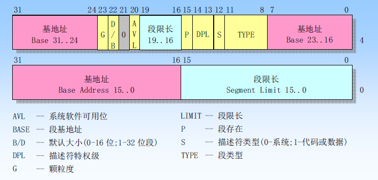
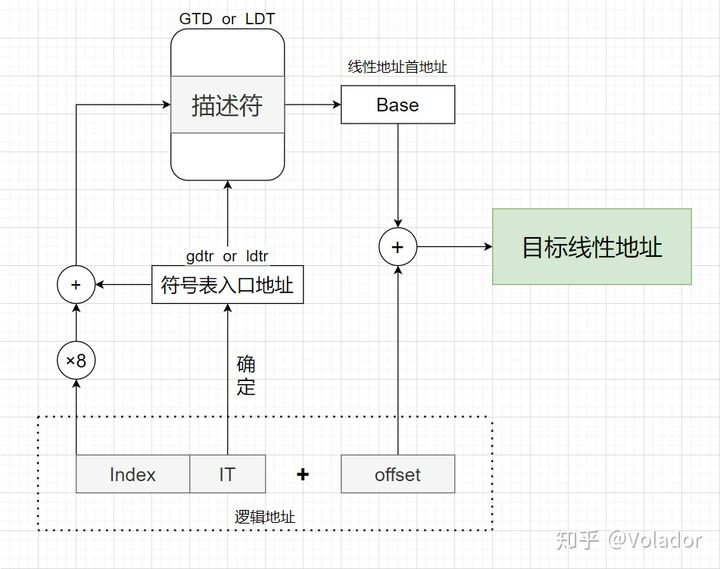
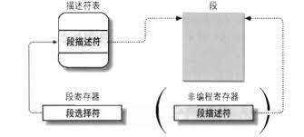
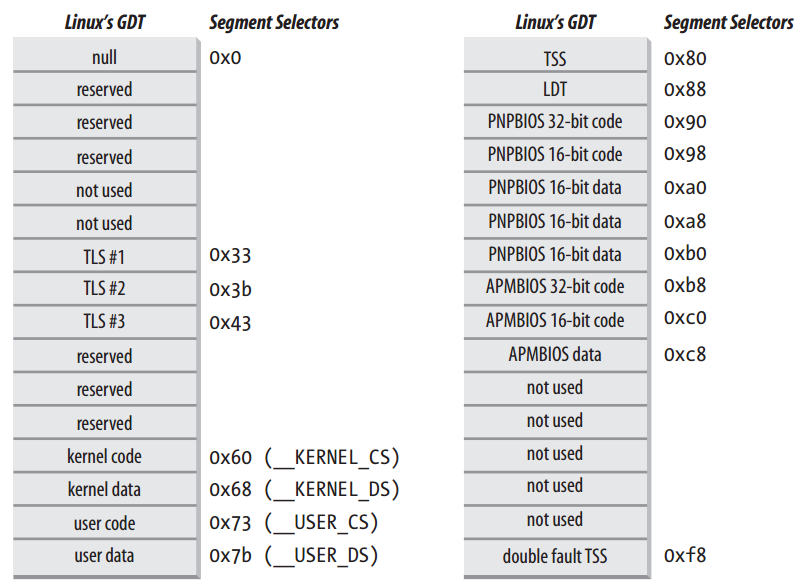
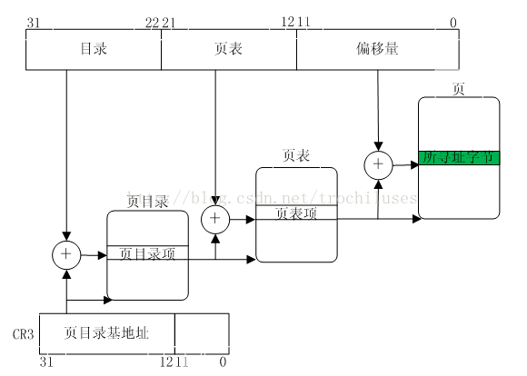
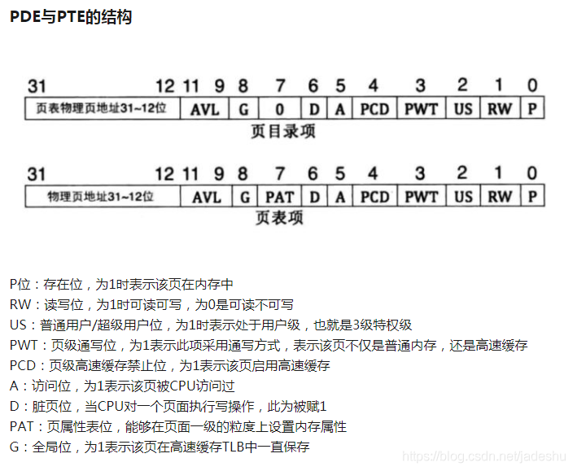
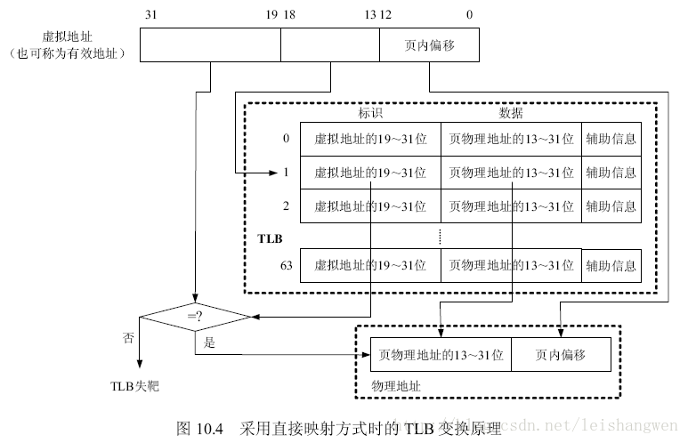
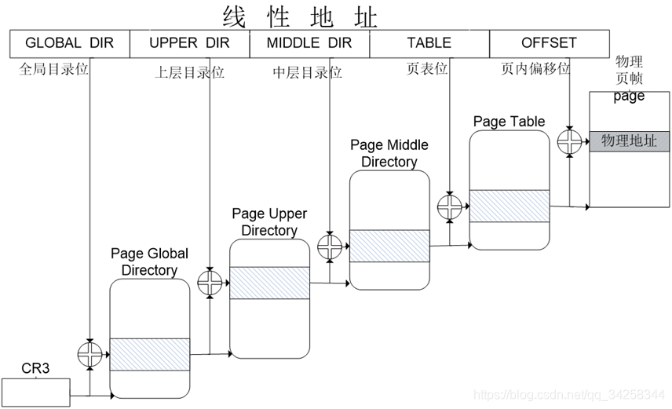
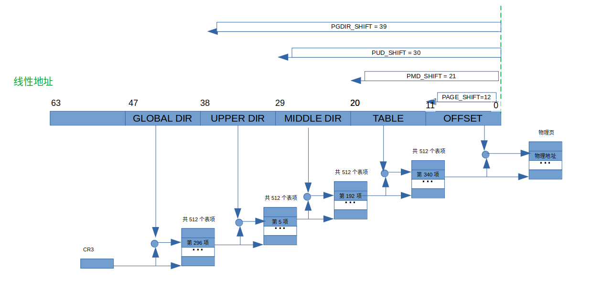

[toc]

# 前言

摘要：理解内存寻址的概念，查看当前系统中的页表查询过程。

内存寻址的概念搬运自：[《深入理解linux内核》](https://book.douban.com/subject/2287506/)这本书的第二章 内存寻址。

查看一个虚拟地址对应的物理地址实验来源：[2.4动手实践-把虚拟地址转换成物理地址](https://gitee.com/ljrcore/linuxmooc/tree/master/《Linux内核分析与应用》动手实践源码/2.4动手实践-把虚拟地址转换成物理地址)

<br>

# 内存寻址

本章介绍寻址技术。值得庆幸的是，操作系统自身不必完全了解物理内存;如今的微处理器包含的硬件线路使内存管理既高效又健壮，所以编程错误就不会对该程序之外的内存产生非法访问。(硬件强壮，那操作系统在内存寻址这里强壮吗？)

<br>

## 内存地址

程序员偶尔会引用内存地址( memory address))作为访问内存单元内容的一种方式，但是，当使用80x86微处理器时，我们必须区分以下<font color=blue>三种不同的地址</font>:

* 逻辑地址( logical address)：包含在机器语言指令中用来指定一个操作数或一条指令的地址。这种寻址方式在80x86著名的分段结构中表现得尤为具体，它促使MS-DOS或 Windows程序员把程序分成若干段每一个逻辑地址都由一个段( segment)和偏移量(offset 或 displacement) 组成，偏移量指明了从段开始的地方到实际地址之间的距离。

* 线性地址( linear address)也称虚拟地址 virtual address)：是一个32位无符号整数，可以用来表示高达4GB的地址，也就是，高达4294967296个内存单元。线性地址通常用十六进制数字表示，值的范围从0x00000000到0xffffffff。

* 物理地址( physical address)：用于内存芯片级内存单元寻址它们与从微处理器的地址引脚发送到内存总线上的电信号相对应。物理地址由32位或36位无符号整数表示。

内存控制单元(MMU)通过一种称为分段单元(segmentation unit) 的硬件电路把一个逻辑地址转换成线性地址; 接着，第二个称为分页单元( paging unit)的硬件电路把线性地址转换成一个物理地址。(如[下图](https://raw.githubusercontent.com/loadlj/img-git/master/20201127113614.png))

 

在多处理器系统中，所有CPU都共享同一内存，这意味着RAM芯片可以由独立的CPU并发地访问。因为在RAM芯片上的读或写操作必须串行地执行，因此一种所谓内存仲裁器( memory arbiter)的硬件电路插在总线和每个RAM芯片之间，其作用是如果某个RAM芯片空闲，就准予一个CPU访问，如果该芯片忙于为另一个处理器提出的请求服务，就延迟这个CPU的访回。即使在单处理器上也使用内存仲裁器，因为单处理器系统中包含一个叫做DMA控制器的特殊处理器，而DMA控制器与CPU并发操作[参见第十三章“直接内存访问(DMA)”一节”]。在多处理器系统的情况下，因为仲裁器有多个输入端口，所以其结构更加复杂。例如，双 Pentium在每个芯片的入口维持一个两端口仲裁器，并在试图使用公用总线前请求两个CPU交换同步信息。从编程观点看，因为仲裁器由硬件电路管理，因此它是隐藏的。

<br>

## 硬件中的分段

总的来说：<font color=blue>段寄存器，用于存放段选择符；段选择符中的索引号，通过gdtr寄存器或ldtr寄存器，索引段描述符表中的段描述符</font>。

<br>

### 段选择符和段寄存器

一个逻辑地址由两部分组成：一个段标识符和一个指定段内相对地址的偏移量。段标识符是一个16位长的字段，称为段选择符( Segment Selector)(如[下图](https://blog.csdn.net/qq_36947774/article/details/112674594))，而偏移量是一个32位长的字段。

 

为了快速方便地找到段选择符，处理器提供段寄存器，段寄存器的唯一目的是存放段选择符。这些段寄存器称为cs，ss，ds，es，fs和gs。尽管只有6个段寄存器，但程序可以把同一个段寄存器用于不同的目的，方法是先将其值保存在内存中，用完后再恢复。

6个寄存器中3个有专门的用途：

* cs：代码段寄存器，指向包含程序指令的段。
* ss：栈段寄存器，指向包含当前程序栈的段
* ds：数据段寄存器，指向包含静态数据或者全局数据段。

其他3个段寄存器作一般用途，可以指向任意的数据段。

cs寄存器还有一个很重要的功能：它含有一个两位的字段，用以指明CPU的当前特权级( Current Privilege Level，cPL)。值为0代表最高优先级，而值为3代表最低优先级。 Linux只用0级和3级，分别称之为内核态和用户态。

<br>

### 段描述符

毎个段由一个8字节的段描述符(Segment Descriptor)表示，它描述了段的特征。段描述符放在全局描述符表( Global Descriptor Table，GDT)或局部描述符表(Local Descriptor Table，LDT) 中。

通常只定义一个GDT，而每个进程除了存放在GDT中的段之外如果还需要创建附加的段，就可以有自己的LDT。GDT在主存中的地址(这个地址应该是物理地址)和大小存放在gdtr控制寄存器中，当前正被使用的LDT地址和大小放在ldtr控制寄存器中。

段描述符格式如[下图](https://blog.csdn.net/KLKFL/article/details/80575051)所示。

 

由于一个段描述符是8字节长，因此它在GDT或LDT内的相对地址是由段选择符的最高13位的值乘以8得到的。例如:如果GDT在0×00020(这个值保存在gdtr寄存器中)，且由段选择符所指定的索引号为2，那么相应的段描述符地址是0x00020000+(2×8)，或0x00020010。

GDT的第一项总是设为0。这就确保空段选择符的逻辑地址会被认为是无效的，因此引起一个处理器异常。能够保存在GDT中的段描述符的最大数目是8191，即$2^{13}-1$

<br>

### 分段单元

[下图](https://zhuanlan.zhihu.com/p/341570104)详细显示了一个逻辑地址是怎样转换成相应的线性地址的。分段单元( segmentationunit)执行以下操作：

* 先检查段选择符的TI字段，以决定段描述符保存在哪一个描述符表中。TI字段指明描述符是在GDT中(在这种情况下，分段单元从gdtr寄存器中得到GDT的线性基地址)还是在激活的LDT中(在这种情况下，分段单元从ldtr寄存器中得到LDT的线性基地址)。

* 从段选择符的 index字段计算段描述符的地址， index字段的值乘以8(一个段描述符的大小)，这个结果与gdtr或ldtr寄在器中的内容相加。

* 把逻辑地址的偏移量与段描述符Base字段的值相加就得到了线性地址。

 

<br>

### 快速访问段描述符

根据上图，每次为了得到base地址，都需要从g(d)tr+index*8的物理地址所指向的描述表中获取段描述符。为了加速这一过程。80x86处理器提供一种附加的非编程的寄存器(一个不能被程序员所设置的寄存器)，供6个可编程的段寄存器使用。每一个非编程的寄存器含有8个字节的段描述符(在前一节已讲述)，由相应的段寄存器中的段选择符来指定。每当一个段选择符被装入段寄存器时，相应的段描述符就由内存装入到对应的非编程CPU寄存器。从那时起，针对那个段的逻辑地址转换就可以不访问主存中的GDT或LDT，处理器只需直接引用存放段描述符的CPU寄存器即可。仅当段寄存器的内容改变时，才有必要访问GDT或LDT。

 

<br>

## Linux中的分段

80x86微处理器中的分段鼓励程序员把他们的程序化分成逻辑上相关的实体，例如子程序或者全局与局部数据区。然而， Linux以非常有限的方式使用分段。实际上，分段和分页在某种程度上有点多余，因为它们都可以划分进程的物理地址空间:分段可以给每个进程分配不同的线性地址空间，而分页可以把同一线性地址空间映射到不同的物理空间。与分段相比， Linux更喜欢使用分页方式，因为:

* 当所有进程使用相同的段寄存器值时，内存管理变得更简单，也就是说它们能共享同样的一组线性地址。

* Linux设计目标之一是可以把它移植到绝大多数流行的处理器平台上。然而，RISC体系结构对分段的支持很有限。

<font color=blue>运行在用户态的所有 Linux进程都使用一对相同的段来对指令和数据寻址</font>。这两个段就是所谓的用户代码段和用户数据段。类似地，运行在内核态的所有 Linux进程都使用对相同的段对指令和数据寻址:它们分别叫做内核代码段和内核数据段。

相应的段选择符由宏_ USER CS，USER_DS，_ KERNEL_CS，和_ KERNEL_DS分别定义。例如，为了对内核代码段寻址，内核只需要把 KERNEL CS宏产生的值装进cs段寄存器即可。

所有段都从0x00000000开始，这可以得出另一个重要结论，那就是在Linux的下逻辑地址与线性地址是一致的，即逻辑地址的偏移量字段的值与相应的线性地址的值总是一致的。

如前所述，CPU的当前特权级(CPL)反映了进程是在用户态还是内核态，并由存放在cs寄存器中的段选择符的RPL字段指定。只要当前特权级被改变，一些段寄存器必须相应地更新。例如，当CPL=3时(用户态)，ds寄存器必须含有用户数据段的段选择符，而当CPL=0时，ds寄存器必须含有内核数据段的段选择符。类似的情况也出现在ss寄存器中。当CPL为3时，它必须指向一个用户数据段中的用户栈，而当CPL为0时，它必须指向内核数据段中的一个内核栈。当从用户态切换到内
核态时， Linux总是确保ss寄存器装有内核数据段的段选择符。(注释：虽然基地址都是零；但是因为权限的要求，或者说段描述符上非基地址的其他参数的要求，还是需要装载不同的段选择符。)

<br>

### Linux GDT&LDT

在单处理器系统中有一个GDT而在多处理器系统中每个CPU对应一个GDT。

下图是GDT的布局示意图。

  

大多数用户态下的linux程序不使用局部描述符表，这样内核就定义了一个缺省的LDT供大多数进程共享。

在某些情况下，进程仍然需要创建自己的局部揎述符表。这对有些应用程序很有用，像wine那样的程序，它们执行面向段的微软 Windows应用程序。 modify_ldt()系统调用允许进程创建自己的局部描述符表。、

<br>

## 硬件中的分页

分页单元( paging unit)把线性地址转换成物理地址。其中的一个关键任务是把所请求的访问类型与线性地址的访问权限相比较，如果这次内存访问是无效的，就产生一个缺页异常(参见第四章和第八章)。

为了效率起见，<font color=blue>线性地址被分成以固定长度为单位的组，称为而页(page)。页内部连续的线性地址被映射到连续的物理地址中。这样，内核可以指定一个页的物理地址和其存取权限，而不用指定页所包含的全部线性地址的存取权限。我们遵循通常习惯，使用术语“页”既指一组线性地址，又指包含在这组地址中的数据</font>。

分页单元把所有的RAM分成固定长度的页框( page frame)(有时叫做物理页)。每个页框包含一个页(page)，也就是说一个页框的长度与一个而的长度一致。页框是主存的一部分，因此也是一个存储区域。区分一页和一个页框是很重要的，前者只是一个数据块，可以存放在任何页框或磁盘中。

把线性地址映射到物理地址的数据结构称为页表( page table)。页表存放在主存中，并在启用分页单元之前必须由内核对页表进行适当的初始化。

从80386开始，所有的80x86处理器都支持分页，它通过设置cr0寄存器的PG标志启用。当PG=0时，线性地址就被解释成物理地址。

<br>

### 二级页表

从80386起，Inter处理器的分页单元处理4KB的页。

32位的线性地址被分成3个域：高10位的Directory，中间10位的Table，最后12位的Offset。

使用这种二级模式的目的在于减少每个进程页表所需RAM的数量。如果使用简单的级页表，那将需要高达20个表项(也就是，在每项4个字节时，需要4 MB RAM)来表示每个进程的页表(如果进程使用全部4GB线性地址空间)，即使一个进程并不使用那个范围内的所有地址。二级模式通过只为进程实际使用的那些虚拟内存区请求页表来减少内存容量。

每个活动进程必须有一个分配给它的页目录。不过，没有必要马上为进程的所有页表都分配RAM。只有在进程实际需要一个页表时才给该页表分配RAM会更为有效率。

正在使用的页目录的物理地址存放在控制寄存器cr3中。线性地址内的 Directory字段决定页目录中的且录项，而目录项指向适当的页表。地址的Tabe字段依次又决定页表中的表项，而表项含有页所在页框的物理地址。Offset字段决定页框内的相对位置。如[下图](https://www.codenong.com/jsfe9ed08ab635/)所示。

 

页目录项和页表项有相同的结构，如[下图](https://blog.csdn.net/jadeshu/article/details/96771215)所示。

 

<br>

### 转换后援缓冲器(TLB)

除了通用硬件高速缓存之外，80x86处理器还包含了另一个称为转换后援缓冲器或TLB( Translation Lookaside Buffer)的高速缓存用于加快线性地址的转换。当一个线性地址被第一次使用时，通过慢速访问RAM中的页表计算出相应的物理地址。同时，物理地址被存放在一个TLB表项( TLB entry)中，以便以后对同一个线性地址的引用可以快速地得到转换。

在多处理系统中，每个CPU都有自己的TLB，这叫做该CPU的本地TLB。与硬件高速缓存相反，TLB中的对应项不必同步，这是因为运行在现有CPU上的进程可以使同一线性地址与不同的物理地址发生联系。

当CPU的cr3控制寄存器被修改时，硬件自动使本地TLB中的所有项都无效，这是因为新的一组页表被启用而TLB指向的是旧数据。

TLB的工作过程，如[下图](https://www.cnblogs.com/alantu2018/p/9000777.html)所示。

 

<br>

## Linux中的分页

Linux采用了一种同时适用于32位和64位系统的普通分页模型。正像前面“64位系统中的分页”一节所解释的那样，两级页表对32位系统来说已经足够了，但64位系统需要更多数量的分页级别。直到2.6.10版本， Linux采用三级分页的模型。从2.6.11版本开始，采用了四级分页模型。[图中](https://github.com/ljrcore/linuxmooc/blob/master/%E7%B2%BE%E5%BD%A9%E6%96%87%E7%AB%A0/%E6%96%B0%E6%89%8B%E4%B8%8A%E8%B7%AF%EF%BC%9ALinux%E5%86%85%E6%A0%B8%E4%B9%8B%E6%B5%85%E8%B0%88%E5%86%85%E5%AD%98%E5%AF%BB%E5%9D%80.md)展示的4种页表分别被为：

* 页全局目录( Page Global Directory)

* 页上级目录( Page Upper Directory)

* 页中间目录( Page Middle Directory)

* 页表( Page Table)

 

页全局目录包含若干页上级目录的地址，页上级目录又依次包含若干页中间目录的地址，而页中间目录又包含若干页表的地址。每一个页表项指向一个页框。线性地址因此被分成五个部分。图中没有显示位数，因为每一部分的大小与具体的计算机体系结构有关。

对于没有启用物理地址扩展的32位系统，两级页表已经足够了。 Linux通过使“页上级目录”位和“页中间目录”位全为0，从根本上取消了页上级目录和页中间目录字段。不过，页上级目录和页中间目录在指针序列中的位置被保留，以便同样的代码在32位系统和64位系统下都能使用。内核为页上级目录和页中间目录保留了一个位置，这是通过把它们的页目录项数设置为1，并把这两个目录项映射到页全局目录的一个适当的目录项而实现的。

在本章剩余的部分，为了具体起见，我们将涉及80x86处理器使用的分页机制我们将在第九章看到，每一个进程有它自己的页全局目录和自己的页表集。当发生进程切换时(参见第三章“进程切换”一节)，Lnux把cr3控制寄存器的内容保存在前一个执行进程的描述符中，然后把下一个要执行进程的描述符的值装入cr3寄存器中。因此，当新进程重新开始在CPU上执行时，分页单元指向一组正确的页表。

把线性地址映射到物理地址虽然有点复杂，但现在已经成了一种机械式的任务。本章下

面的几节中列举了一些比较单调乏味的函数和宏,它们检索内核为了查找地址和管理表格所需的信息;其中大多数函数只有一两行。也许现在你就想跳过这部分,但是知道这些函数和去的功能是非常有用的,因为在贯穿本书的讨论中你会经常看到它们。

<br>

## 相关的函数和宏

挨个去看这些函数和宏，会有双倍掉发的快乐。用的时候google。

这里有个参考：[深入理解计算机系统-之-内存寻址（六）--linux中的分页机制](https://blog.csdn.net/gatieme/article/details/50756050#t24)

<br>

# 内存寻址实验
1. 打印出基本的页表信息：不同页表的偏移量、表项个数、所领衔的内存大小、相对应的线性地址字段的屏蔽字段。

2. 申请一个页，返回为其对应的虚拟地址。查看对应的每层页表表项的物理地址。输出最后虚拟地址对应的物理地址。

<br>

## 实验代码

```c
//内容保存在：paging_lowmem.c
#include <linux/init.h>
#include <linux/module.h>
#include <linux/mm.h>
#include <linux/mm_types.h>
#include <linux/sched.h>
#include <linux/export.h>
#include <linux/delay.h>


static unsigned long cr0,cr3;

static unsigned long vaddr = 0;


static void get_pgtable_macro(void)
{
    cr0 = read_cr0();
    cr3 = read_cr3_pa();
     
    printk("cr0 = 0x%lx, cr3 = 0x%lx\n",cr0,cr3);
    
    /* 页全局目录(PGD)、页4级目录(P4D)、页上级目录(PUD)、页中间目录(PMD)、页表(PTE)，相对应的线性地址字段的偏移量 */
    printk("PGDIR_SHIFT = %d\n", PGDIR_SHIFT);
    printk("P4D_SHIFT = %d\n",P4D_SHIFT); // 如果是5级分页的话，会有相应的输出
    printk("PUD_SHIFT = %d\n", PUD_SHIFT); 
    printk("PMD_SHIFT = %d\n", PMD_SHIFT);
    printk("PAGE_SHIFT = %d\n", PAGE_SHIFT);
 
    /* 页全局目录(PGD)、页4级目录(P4D)、页上级目录(PUD)、页中间目录(PMD)、页表(PTE)， 中表项的个数*/
    printk("PTRS_PER_PGD = %d\n", PTRS_PER_PGD);
    printk("PTRS_PER_P4D = %d\n", PTRS_PER_P4D);
    printk("PTRS_PER_PUD = %d\n", PTRS_PER_PUD);
    printk("PTRS_PER_PMD = %d\n", PTRS_PER_PMD);
    printk("PTRS_PER_PTE = %d\n", PTRS_PER_PTE);

    /* 页全局目录(PGD)、页4级目录(P4D)、页上级目录(PUD)、页中间目录(PMD)、页表(PTE)，所领衔的内存大小 */
    printk("PGDIR_SIZE = %ld\n", PGDIR_SIZE);
    printk("P4D_SIZE = %ld\n", P4D_SIZE);
    printk("PUD_SIZE = %ld\n", PUD_SIZE);
    printk("PMD_SIZE = %ld\n", PMD_SIZE);
    printk("PAGE_SIZE = %ld\n", PAGE_SIZE);

    /* 页全局目录(PGD)、页4级目录(P4D)、页上级目录(PUD)、页中间目录(PMD)、页表(PTE)，相对应的线性地址字段的屏蔽字段(掩码) */
    printk("PGDIR_MASK = 0x%lx\n", PGDIR_MASK);
    printk("P4D_MASK = 0x%lx\n", P4D_MASK);
    printk("PUD_MASK = 0x%lx\n", PUD_MASK);
    printk("PMD_MASK = 0x%lx\n", PMD_MASK);
    printk("PAGE_MASK = 0x%lx\n", PAGE_MASK);
}

/* 有个虚拟地址，通过逐级查询，找到对应的物理地址*/
static unsigned long vaddr2paddr(unsigned long vaddr)
{
    pgd_t *pgd;
    p4d_t *p4d;
    pud_t *pud;
    pmd_t *pmd;
    pte_t *pte;
    unsigned long paddr = 0;
    unsigned long page_addr = 0;
    unsigned long page_offset = 0;
    pgd = pgd_offset(current->mm,vaddr); // task_struct中，有个mm_struct；mm_struct是对进程的地址空间(虚拟内存)的描述；mm_struct里面包含页目录指针pgd；pgd_offset返回，pgd表的入口+index*目录项大小
    printk("pgd_val = 0x%lx, pgd_index = %lu\n", pgd_val(*pgd),pgd_index(vaddr)); // pgd_val(*pgd)，页全局目录项中存放的下一级的物理地址；pgd_index，虚拟地址在也目录项中的index
    if (pgd_none(*pgd)){
        printk("not mapped in pgd\n");
        return -1;
    }

    p4d = p4d_offset(pgd, vaddr);
    printk("p4d_val = 0x%lx, p4d_index = %lu\n", p4d_val(*p4d),p4d_index(vaddr));
    if(p4d_none(*p4d))
    { 
        printk("not mapped in p4d\n");
        return -1;
    }

    pud = pud_offset(p4d, vaddr);
    printk("pud_val = 0x%lx, pud_index = %lu\n", pud_val(*pud),pud_index(vaddr));
    if (pud_none(*pud)) {
        printk("not mapped in pud\n");
        return -1;
    }
 
    pmd = pmd_offset(pud, vaddr);
    printk("pmd_val = 0x%lx, pmd_index = %lu\n", pmd_val(*pmd),pmd_index(vaddr));
    if (pmd_none(*pmd)) {
        printk("not mapped in pmd\n");
        return -1;
    }
 
    pte = pte_offset_kernel(pmd, vaddr);
    printk("pte_val = 0x%lx, ptd_index = %lu\n", pte_val(*pte),pte_index(vaddr));

    if (pte_none(*pte)) {
        printk("not mapped in pte\n");
        return -1;
    }

    /* 最后一层页表查出的结果，与偏移量相加，得到物理地址 */
    page_addr = pte_val(*pte) & PAGE_MASK;
    page_offset = vaddr & ~PAGE_MASK;
    paddr = page_addr | page_offset;
    printk("page_addr = %lx, page_offset = %lx\n", page_addr, page_offset);
    printk("vaddr = %lx, paddr = %lx\n", vaddr, paddr);
    return paddr;
}

static int __init v2p_init(void)
{
    unsigned long vaddr = 0 ;
    printk("vaddr to paddr module is running..\n");
    get_pgtable_macro();
    printk("\n");
    vaddr = __get_free_page(GFP_KERNEL);/*返回一个指向新页的指针, 未清零该页*/
    if (vaddr == 0) {
        printk("__get_free_page failed..\n");
        return 0;
    }
    sprintf((char *)vaddr, "hello world from kernel");
    printk("get_page_vaddr=0x%lx\n", vaddr);
    vaddr2paddr(vaddr);
    // ssleep(600);
    return 0;
}
static void __exit v2p_exit(void)
{
    printk("vaddr to paddr module is leaving..\n");
    free_page(vaddr);
}


module_init(v2p_init);
module_exit(v2p_exit);
MODULE_LICENSE("GPL"); 
```

```makefile
// 模块编译
obj-m:= paging_lowmem.o
PWD:= $(shell pwd)
KERNELDIR:= /lib/modules/$(shell uname -r)/build

all:
	make -C $(KERNELDIR)  M=$(PWD) modules
clean:
	@rm -rf *.o *.mod.c *.mod.o *.ko *.order *.symvers .*.cmd .tmp_versions *.mod
```

编译生成模块。安装模块后，dmesg查看输出。

```shell
sudo insmod paging_lowmem.ko
dmesg

[ 6363.801616] vaddr to paddr module is running..
[ 6363.801619] cr0 = 0x80050033, cr3 = 0x221918000
[ 6363.801620] PGDIR_SHIFT = 39
[ 6363.801621] P4D_SHIFT = 39
[ 6363.801622] PUD_SHIFT = 30
[ 6363.801622] PMD_SHIFT = 21
[ 6363.801623] PAGE_SHIFT = 12
[ 6363.801624] PTRS_PER_PGD = 512
[ 6363.801624] PTRS_PER_P4D = 1
[ 6363.801625] PTRS_PER_PUD = 512
[ 6363.801625] PTRS_PER_PMD = 512
[ 6363.801626] PTRS_PER_PTE = 512
[ 6363.801627] PGDIR_SIZE = 549755813888
[ 6363.801627] P4D_SIZE = 549755813888
[ 6363.801628] PUD_SIZE = 1073741824
[ 6363.801628] PMD_SIZE = 2097152
[ 6363.801629] PAGE_SIZE = 4096
[ 6363.801629] PGDIR_MASK = 0xffffff8000000000
[ 6363.801630] P4D_MASK = 0xffffff8000000000
[ 6363.801631] PUD_MASK = 0xffffffffc0000000
[ 6363.801631] PMD_MASK = 0xffffffffffe00000
[ 6363.801632] PAGE_MASK = 0xfffffffffffff000

[ 6363.801635] get_page_vaddr=0xffff940158154000
[ 6363.801636] pgd_val = 0x137005067, pgd_index = 296
[ 6363.801637] p4d_val = 0x137005067, p4d_index = 0
[ 6363.801637] pud_val = 0x137006067, pud_index = 5
[ 6363.801639] pmd_val = 0x218002063, pmd_index = 192
[ 6363.801639] pte_val = 0x8000000218154063, ptd_index = 340
[ 6363.801640] page_addr = 8000000218154000, page_offset = 0
```

<br>

## 输出内容解释 

| 页(目录)表 | 拆分0X[ffff]940158154[000]虚拟地址的二进制(十进制、十六进制) | 页(目录)表项所在的物理地址 | 该表项中的数据内容 |
| :--------: | :----------------------------------------------------------: | :------------------------: | :----------------: |
|    PGD     |                    1001 0100 0(296、128)                     |     0x221918000+128*8      |    0x137005067     |
|    PUD     |                      0000 0010 1(5、5)                       |      0x137005067+5*8       |    0x137006067     |
|    PMD     |                    0110 0000 0 (192、C0)                     |      0x137006067+C0*8      |    0x218002063     |
|    PTE     |                    1010 1010 0(340、154)                     |     0x218002063+154*8      |    0x218154000     |

 

