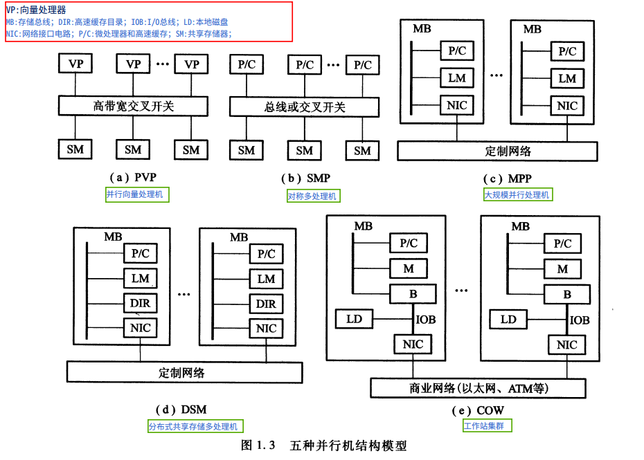
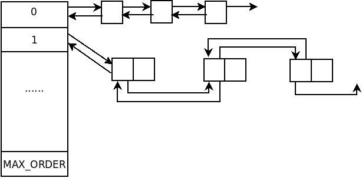
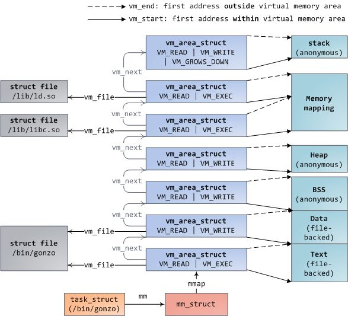

[toc]

# 前言

之前，我整理了[linux内存寻址](https://blog.csdn.net/sinat_38816924/article/details/117432485)。即，虚拟地址通过页表找到物理地址。

其中，“物理地址”通过内存管理实现；“虚拟地址”通过进程地址空间实现。

内存通过三层结构进行管理：node-zone-page。内存管理分为连续内存管理和非连续内存管理。对于连续内存管理而言，当分配一个页框的时候，使用CPU页框高速缓存；当分配多个页框的时候，采用伙伴系统；当分配内存小于页框大小的时候，采用slab。非连续内存也有其好处，避免了外碎片。

进程地址空间：使用了进程描述符中的内存描述符，来描述整个虚拟地址空间。虚拟地址是由一个一个线性区组成。当用户从硬盘加载一个程序的时候，系统可以根据文件信息创建线性区，此时文件并没有加载进入内存。当访问到某部分内容(线性区)，发生缺页异常，将对应内容加载进入内存，并完善页表。（？？）

参考：[Linux 内核分析与应用 第四节](https://www.bilibili.com/video/BV1XV411k72Q?p=15) | 《深入理解linux内核》第八、九章节 | [随笔分类 - Memory Management](https://www.cnblogs.com/linhaostudy/category/1073669.html?page=1)

<br>

# 内存管理

## 共享存储架构(UMA和NUMA)

<font color=red>来源</font>：[服务器体系(SMP， NUMA， MPP)与共享存储器架构(UMA和NUMA)](https://www.cnblogs.com/linhaostudy/p/9980383.html)

其他参考：[对称多处理 -- wiki](https://zh.wikipedia.org/wiki/%E5%AF%B9%E7%A7%B0%E5%A4%9A%E5%A4%84%E7%90%86) | [非均匀访存模型 -- wiki](https://zh.wikipedia.org/wiki/%E9%9D%9E%E5%9D%87%E5%8C%80%E8%AE%BF%E5%AD%98%E6%A8%A1%E5%9E%8B) | 《并行算法的设计与分析， 陈国良， 3ed， 2009》1.2.1 并行计算机体系结构

有个视频介绍，但是我没看：[主题分享: Introduction to NUMA and Hugepage -- Taiwan Linux Kernel Hackers](https://youtu.be/eTxx68jEDXU)

 

### 架构概述

从系统架构来看，目前的商用服务器大体可以分为三类

- 对称多处理器结构(SMP：Symmetric Multi-Processor)
- 非一致存储访问结构(NUMA：Non-Uniform Memory Access)
- 海量并行处理结构(MPP：Massive Parallel Processing)。

共享存储型多处理机有两种模型

- 均匀存储器存取（Uniform-Memory-Access，简称UMA）模型
- 非均匀存储器存取（Nonuniform-Memory-Access，简称NUMA）模型

<br>

### SMP

所谓对称多处理器结构，是指服务器中多个CPU对称工作，无主次或从属关系。

各CPU共享相同的物理内存，每个 CPU访问内存中的任何地址所需时间是相同的，因此SMP也被称为**一致存储器访问结构(UMA：Uniform Memory Access)**

对SMP服务器进行扩展的方式包括增加内存、使用更快的CPU、增加CPU、扩充I/O(槽口数与总线数)以及添加更多的外部设备(通常是磁盘存储)。

SMP服务器的主要特征是共享，系统中所有资源(CPU、内存、I/O等)都是共享的。也正是由于这种特征，导致了SMP服务器的主要问题，那就是它的扩展能力非常有限。

对于SMP服务器而言，每一个共享的环节都可能造成SMP服务器扩展时的瓶颈，而最受限制的则是内存。由于每个CPU必须通过相同的内存总线访问相同的内存资源，因此随着CPU数量的增加，内存访问冲突将迅速增加，最终会造成CPU资源的浪费，使CPU性能的有效性大大降低。实验证明，SMP服务器CPU利用率最好的情况是2至4个CPU。

 

<br>

### NUMA

由于SMP在扩展能力上的限制，人们开始探究如何进行有效地扩展从而构建大型系统的技术，NUMA就是这种努力下的结果之一

利用NUMA技术，可以把几十个CPU(甚至上百个CPU)组合在一个服务器内。

 

NUMA多处理机模型如图所示，其访问时间随存储字的位置不同而变化。其共享存储器物理上是分布在所有处理机的本地存储器上。所有本地存储器的集合组成了全局地址空间，可被所有的处理机访问。处理机访问本地存储器是比较快的，但访问属于另一台处理机的远程存储器则比较慢，因为通过互连网络会产生附加时延。

NUMA服务器的基本特征是具有多个CPU模块，每个CPU模块由多个CPU(如4个)组成，并且具有独立的本地内存、I/O槽口等。

 

由于其节点之间可以通过互联模块(如称为Crossbar Switch)进行连接和信息交互，因此每个CPU可以访问整个系统的内存(这是NUMA系统与MPP系统的重要差别)。显然，访问本地内存的速度将远远高于访问远地内存(系统内其它节点的内存)的速度，这也是非一致存储访问NUMA的由来。

由于这个特点，为了更好地发挥系统性能，开发应用程序时需要尽量减少不同CPU模块之间的信息交互。利用NUMA技术，可以较好地解决原来SMP系统的扩展问题，在一个物理服务器内可以支持上百个CPU。比较典型的NUMA服务器的例子包括HP的Superdome、SUN15K、IBMp690等。

但NUMA技术同样有一定缺陷，由于访问远地内存的延时远远超过本地内存，因此当CPU数量增加时，系统性能无法线性增加。如HP公司发布Superdome服务器时，曾公布了它与HP其它UNIX服务器的相对性能值，结果发现，64路CPU的Superdome (NUMA结构)的相对性能值是20，而8路N4000(共享的SMP结构)的相对性能值是6.3. 从这个结果可以看到，8倍数量的CPU换来的只是3倍性能的提升.

<br>

### 查看当前(硬件)的共享内存架构

参考：[numa_NUMA_学习笔记](https://blog.csdn.net/yk_wing4/article/details/87474172#commentBox)

```shell
➜ grep -i numa /var/log/dmesg
[    0.007488] kernel: No NUMA configuration found

➜ lscpu | grep NUMA
NUMA 节点：                      1
NUMA 节点0 CPU：                 0-3
```

<br>

## 内存管理的三个层次：node-zone-page

参考：[Linux内存描述之概述--Linux内存管理(一)](https://www.cnblogs.com/linhaostudy/p/9986692.html) | [物理内存相关的三个数据结构](https://www.cnblogs.com/muahao/p/10299725.html)

Linux把物理内存划分为三个层次来管理。

| 层次           | 描述                                                         |
| :------------- | :----------------------------------------------------------- |
| 存储节点(Node) | CPU被划分为多个节点(node), 内存则被分簇, 每个CPU对应一个本地物理内存, 即一个CPU-node对应一个内存簇bank，即每个内存簇被认为是一个节点 |
| 管理区(Zone)   | 每个物理内存节点node被划分为多个内存管理区域, 用于表示不同范围的内存, 内核可以使用不同的映射方式映射物理内存 |
| 页面(Page)     | 内存被细分为多个页面帧, 页面是最基本的页面分配的单位         |

<br>

### 内存节点node

[pg_data_t](https://elixir.bootlin.com/linux/v5.6/source/include/linux/mmzone.h#L710)

在 NUMA 机器上，每个 NUMA 节点都有一个 pg_data_t 来描述它的内存布局。 在 UMA 机器上，有一个描述整个内存的 pglist_data。

内存统计和页面替换数据结构是按zone维护的。

```c
typedef struct pglist_data {
	struct zone node_zones[MAX_NR_ZONES]; /* 该节点中zone数组 */
	struct zonelist node_zonelists[MAX_ZONELISTS]; /* 页分配器使用 */
	int nr_zones; /* 节点中zone的个数 */
	......
	unsigned long node_start_pfn; /* 节点中第一个页框的下标 */
	unsigned long node_present_pages; /* 内存节点大小，不包括空洞 */
	unsigned long node_spanned_pages; /* 内存节点大小，包括空洞 */
	......
    int node_id; /* 节点标识符 */
    ......
} pg_data_t;
```

我查看下，我当前系统的内存布局。

1. 如果是操作系统没有定义`CONFIG_NEED_MULTIPLE_NODES`，该系统不需要NUMA，使用全局的contig_page_data。

    ```c
    #ifndef CONFIG_NEED_MULTIPLE_NODES

    extern struct pglist_data contig_page_data;
    #define NODE_DATA(nid)		(&contig_page_data)
    #define NODE_MEM_MAP(nid)	mem_map

    #else /* CONFIG_NEED_MULTIPLE_NODES */

    #include <asm/mmzone.h>

    #endif /* !CONFIG_NEED_MULTIPLE_NODES */
    ```

2. 我们查看下，我们当前使用的内核的编译选项，看是否需要NUMA。

    ```shell
    ➜ cat /boot/config-`uname -r` | grep CONFIG_NEED_MULTIPLE_NODES
    CONFIG_NEED_MULTIPLE_NODES=y
    
    ➜ cat /boot/config-`uname -r` | grep CONFIG_NUMA
    CONFIG_NUMA_BALANCING=y
    CONFIG_NUMA_BALANCING_DEFAULT_ENABLED=y
    CONFIG_NUMA=y
    # CONFIG_NUMA_EMU is not set
    ```

3. 我们的系统，编译的时候需要NUMA。以x86为例，我们去看下[asm/mmzone.h](https://elixir.bootlin.com/linux/v5.6/source/arch/x86/include/asm/mmzone.h#L5)

   ```c
   /* SPDX-License-Identifier: GPL-2.0 */
   #ifdef CONFIG_X86_32
   # include <asm/mmzone_32.h>
   #else
   # include <asm/mmzone_64.h>
   #endif
   ```

   接着看下[asm/mmzone_64.h](https://elixir.bootlin.com/linux/v5.6/source/arch/x86/include/asm/mmzone_64.h#L13)

   ```c
   #ifndef _ASM_X86_MMZONE_64_H
   #define _ASM_X86_MMZONE_64_H
   
   #ifdef CONFIG_NUMA
   
   #include <linux/mmdebug.h>
   #include <asm/smp.h>
   
   extern struct pglist_data *node_data[];
   
   #define NODE_DATA(nid)		(node_data[nid])
   
   #endif
   #endif /* _ASM_X86_MMZONE_64_H */
   ```

4. 所以我的系统内存是按照NUMA进行管理的，虽然只有一个node。

对于这个数据结构，必然有一些相应的操作函数。这里略。

<br>

### 管理区zone

系统中有不同的种类的zone。可以参考：[内核中内存信息的展示](http://linux.laoqinren.net/linux/proc-memory/#proczoneinfo)

> `/proc/zoneinfo`输出了系统上`zone`的信息，其信息主要分为以下几类：
>
> 1. `zone`的一些基本信息，包括名称，空闲页面个数，三个水位，以及管理的页的个数等等
> 2. `zone`中各个类型页面个数的统计信息
> 3. `protection`信息，决定是否可以内存分配请求时，需要用到
> 4. 输出`zone`的每个`cpu`对应的`pagesets`信息
> 5. 其它信息
>
> - 在本示例输出中，`node0`有`DMA`、 `DMA32`、`Normal`这三个`zone`，`node1`只有一个`Normal zone`。

如果你看到有的地方是ZONE_HIGHMEM，可以不理它，直接跳过。它是在32位系统中，3G+896M~4G的的线性地址不够直接映射物理内存的产物，可以参考：[32位Linux内核地址空间划分](https://www.cnblogs.com/vinozly/p/5618451.html)

每个(物理)内存管理区都有自己的描述符。它的字段如下：[zone](https://elixir.bootlin.com/linux/v5.6/source/include/linux/mmzone.h#L432)

```c
struct zone {
	unsigned long _watermark[NR_WMARK]; /* zone watermarks， access with *_wmark_pages(zone) macros */

	unsigned long nr_reserved_highatomic; /* 记录紧急内存的大小 */

     /* 每一个zone的最少保留内存，比如来自high zone
     * 的内存分配时，如果high zone空闲内存不够用，
     * 这个时候就会到normal zone取内存，
     * 而这个lowmem_reserve的意义就是为了，
     * 让high zone在normal zone取内存时不能无限制的取，
     * 最少要保留一些给normal zone。
     * ？
     */
	long lowmem_reserve[MAX_NR_ZONES];

	struct pglist_data	*zone_pgdat; /* 其所在的pglist_data */
	struct per_cpu_pageset __percpu *pageset;  /* 每一个cpu都维护一个page列表用来提高速度 */
	.....
	/* zone_start_pfn == zone_start_paddr >> PAGE_SHIFT */
	unsigned long		zone_start_pfn; /* 第一个页的索引 */

	atomic_long_t		managed_pages; /* 这个zone跨越的所有物理内存的page数目，包括内存空洞 */
	unsigned long		spanned_pages; /* 是这个zone在物理内存真实存在的所有page数目 */
	unsigned long		present_pages; /* 这个zone被Buddy管理的所有的page数目 */

	const char		*name; /* 这个zone的名字 */
	...
	/* free areas of different sizes */
	struct free_area	free_area[MAX_ORDER];

	/* zone flags， see below */
	unsigned long		flags;

	/* Primarily protects free_area */
	spinlock_t		lock;
	......
} ____cacheline_internodealigned_in_smp;
```

<br>

### 页框page

对于NUMA，从zone到page的管理，我不清楚。我们跳过，来看[page(页描述符)结构](https://elixir.bootlin.com/linux/v5.6/source/include/linux/mm_types.h#L68)

```c
struct page {
	unsigned long flags;		/* 描述这个页面的状态：脏页、被上锁等等 */
	......
} _struct_page_alignment;
```

<br>

## 内存(页框)分配[释放]

### 每CPU页框高速缓存(单页框分配)

内核经常请求和释放单个页框。为了提升系统性能，每个内存管理区定义了一个“每CPU”页框高速缓存。所有“每CPU”高速缓存包含一些预先分配的页框，它们被用于满足本地CPU发出的单一内存请求。

上文可以看到，`struct zone`中有为每个cpu维护的page字段。

```c
struct per_cpu_pageset __percpu *pageset; 

struct per_cpu_pages {
	int count;		/* number of pages in the list */
	int high;		/* high watermark， emptying needed */
	int batch;		/* chunk size for buddy add/remove */

	/* Lists of pages， one per migrate type stored on the pcp-lists */
	struct list_head lists[MIGRATE_PCPTYPES];
};

struct per_cpu_pageset {
	struct per_cpu_pages pcp;
#ifdef CONFIG_NUMA
	s8 expire;
	u16 vm_numa_stat_diff[NR_VM_NUMA_STAT_ITEMS];
#endif
#ifdef CONFIG_SMP
	s8 stat_threshold;
	s8 vm_stat_diff[NR_VM_ZONE_STAT_ITEMS];
#endif
};
```

<br>

### 伙伴算法(多页框分配)

参考：[伙伴系统 -- linux内核之旅](http://kerneltravel.net/blog/2020/lp_901/)

Linux内核内存管理的一项重要工作就是如何在频繁申请释放内存的情况下，避免碎片的产生。Linux采用伙伴系统解决外部碎片的问题，采用slab解决内部碎片的问题，在这里我们先讨论外部碎片问题。避免外部碎片的方法有两种：一种是之前介绍过的利用非连续内存的分配；另外一种则是用一种有效的方法来监视内存，保证在内核只要申请一小块内存的情况下，不会从大块的连续空闲内存中截取一段过来，从而保证了大块内存的连续性和完整性。显然，前者不能成为解决问题的普遍方法，一来用来映射非连续内存线性地址空间有限，二来每次映射都要改写内核的页表，进而就要刷新TLB，这使得分配的速度大打折扣，这对于要频繁申请内存的内核显然是无法忍受的。因此Linux采用后者来解决外部碎片的问题，也就是著名的伙伴系统。

大小相同，物理地址连续的两个两个页框就被称为伙伴。Linux的伙伴算法把所有的空闲页面分成多个块链表（链表个数默认为11个），每个链表中的一个块含有2的幂次个页面，即页块或简称块。每个链表中的页块的大小是不一样的。如果分配阶为n的页框块，那么先从第n条页框块链表中查找是否存在这么大小的空闲页块。如果有则分配，否则在第n+1条链表中继续查找，直到找到为止。 伙伴系统的宗旨就是用最小的内存块来满足内核的对于内存的请求。在最初，只有一个块，也就是整个内存，假如为1M大小，而允许的最小块为64K，那么当我们申请一块200K大小的内存时，就要先将1M的块分裂成两等分，各为512K，这两分之间的关系就称为伙伴，然后再将第一个512K的内存块分裂成两等分，各位256K，将第一个256K的内存块分配给内存，这样就是一个分配的过程。

 

每个物理页框对应一个struct page实例（页框的描述数据结构）。每个内存区关联了一个struct zone实例，该结构中使用free_area数组对空闲页框进行管理。

```c
struct free_area	free_area[MAX_ORDER];

struct free_area {
	struct list_head	free_list[MIGRATE_TYPES];
	unsigned long		nr_free;
};
```

free_area共有MAX_ORDER个元素，其中第order个元素记录了$2^{order}$的空闲块，这些空闲块在free_list中以双向链表的形式组织起来，对于同等大小的空闲块，其类型不同，将组织在不同的free_list中，nr_free记录了该free_area中总共的空闲内存块的数量。MAX_ORDER的默认值为11，这意味着最大内存块的大小为$2^{10}=1024$个页框。对于同等大小的内存块，每个内存块的起始页框用于链表的节点进行相连，这些节点对应的着struct page中的lru域。

```shell
enum migratetype {
	MIGRATE_UNMOVABLE， /* 不可移动页，这类页在内存当中有固定的位置，不能移动。内核的核心分配的内存大多属于这种类型 */
	MIGRATE_MOVABLE，   /*可移动页，这类页可以随意移动，用户空间应用程序所用到的页属于该类别。它们通过页表来映射，如果他们复制到新的位置，页表项也会相应的更新，应用程序不会注意到任何改变。*/
	MIGRATE_RECLAIMABLE，  /* 可回收页，这类页不能直接移动，但可以删除，其内容页可以从其他地方重新生成，例如，映射自文件的数据属于这种类型，针对这种页，内核有专门的页面回收处理 */
	MIGRATE_PCPTYPES，	/* 用来表示每CPU页框高速缓存的数据结构中的链表的迁移类型数目 */
	MIGRATE_HIGHATOMIC = MIGRATE_PCPTYPES，
#ifdef CONFIG_CMA
	MIGRATE_CMA，   /* [CMA 布局策略](https://biscuitos.github.io/blog/CMA-layout/) */
#endif
#ifdef CONFIG_MEMORY_ISOLATION
	MIGRATE_ISOLATE，	/*用于跨越NUMA节点移动物理内存页，在大型系统上，它有益于将物理内存页移动到接近于是用该页最频繁地CPU */
#endif
	MIGRATE_TYPES   /* 表示迁移类型的数目 */
};
```

<br>

### slab分配器(内存区管理)

参考：[Linux 内核 | 内存管理——slab 分配器](https://www.dingmos.com/2021/03/22/54.html)

伙伴系统算法采用页框作为基本内存区，这适合于对大块内存的请求，但我们如何处理对小内存区的请求呢，比如说几十或几百个字节?

显然，如果为了存放很少的字节而给它分配一个整页框，这显然是一种浪费。取而代之的正确方法就是引入一种新的数据結构来描述在同一页框中如何分配小内存区。但这样也引出了一个新的问题，即所谓的内碎片( internal fragmentation)。内碎片的产生主要是由于请求内存的大小与分配给它的大小不匹配而造成的。

> 在Linux中，伙伴分配器（buddy allocator）是以页为单位管理和分配内存。但在内核中的需求却以字节为单位（在内核中面临频繁的结构体内存分配问题）。假如我们需要动态申请一个内核结构体（占 20 字节），若仍然分配一页内存，这将严重浪费内存。那么该如何分配呢？slab 分配器专为小内存分配而生，由Sun公司的一个雇员`Jeff Bonwick`在`Solaris 2.4`中设计并实现。slab分配器分配内存以字节为单位，基于伙伴分配器的大内存进一步细分成小内存分配。换句话说，slab 分配器仍然从 Buddy 分配器中申请内存，之后自己对申请来的内存细分管理。
>
> 除了提供小内存外，slab 分配器的第二个任务是维护常用对象的缓存。对于内核中使用的许多结构，初始化对象所需的时间可等于或超过为其分配空间的成本。当创建一个新的slab 时，许多对象将被打包到其中并使用构造函数（如果有）进行初始化。释放对象后，它会保持其初始化状态，这样可以快速分配对象。

 

<br>

### 非连续内存管理

参考：[linux内存管理笔记(二十九）----vmalloc](https://blog.csdn.net/u012489236/article/details/108313150)

从前面的讨论中我们已经知道，把内存区映射到一组连续的页框是最好的选择，这样会充分利用高速缓存并获得较低的平均访问时间。不过，如果对内存区的请求不是很频繁，那么，通过连续的线性地址来访问非连续的而框这样一种分配模式就会很有意义。这种模式的主要优点是避免了外碎片，而缺点是必须打乱内核页表。显然，非连续内存区的大小必须是4096的倍数。Linux在几个方面使用非连续内存区，例如，为活动的交换区分配数据结构(参见第十七章中的“激活和禁用交换区”一节)，为模块分配空间(参见附录二)，或者给某些I/O动程序分配缓冲区。

<br>

# 进程地址空间

在前一章我们已经看到，内核中的函数以相当直接了当的方式获得动态内存。这是通过调用以下几种函数中的个达到的：\_\_get_free__pages()或alloc_page()从分区页框分配器中获得页框； kmem_cache_alloc()或kmalloc()使用slab分配器为专用或通用对象分配块；而vmalloc获得一块非连续的内存区。如果所请求的内存区得以满足，这些函数都返回一个页描述符地址或线性地址(即所分配动态内存区的起始地址)。

使用这些简单方法是基于以下两个原因： 

* 内核是操作系统中优先级最高的成分。如果某个内核函数请求动态内存，那么，必定有正当的理由发出那个请求，因此，没有道理试图推迟这个请求。

* 内核信任自己。所有的内核函数都被假定是没有错误的，因此内核函数不必插入针对编程错误的任何保护措施。

当给用户态进程分配内存时，情况完全不同:

* 进程对动态内在的遣求被认为是不紧迫的。例如，当进程的可执行文件被装入时，进程并不一定立即对所有的代码页进行访问。类似地，当进程调用malloc()以获得请求的动态内存时，也并不意味着进程很快就会访问所有所获得的内存。因此般来说，内核总是尽量推迟给用户杰进程分配动态内存。

* 由于用户进程是不可信任的，因此，内核必须能随时准备捕获用户态进程引起的所有寻址错误。

本章我们会看到，内核使用一种新的资源成功实现了对进程动态内存的推迟分配。**当用户态进程请求动态内存时，并没有获得请求的页框，而仅仅获得对一个新的线性地址区间的使用权，而这一线性地址区间就成为进程地址空间的一部分。这一区间叫做“线性区”( memory region)**(译注1)。

在下一节，我们讨论进程是怎样看待动态内存的。然后，在“线性区”一节中描述进程地址空间的基本组成。接下来，我们仔细分析缺页异常处理程序在推迟给进程分配页框中所起的作用。然后，我们阐述内核怎样创建和删除进程的整个地址空间。最后，我们讨论与进程的地址空间管理有关的API和系统调用。

<br>

## 进程地址空间

参考：[32位&64位进程地址空间](https://zhuanlan.zhihu.com/p/66794639) | [程序在内存中的布局](https://blog.csdn.net/sinat_38816924/article/details/106081193)

 

<br>

## 内存描述符

参考：[内核如何管理内存](https://zhuanlan.zhihu.com/p/34223136)

与进程地址空间有关的全部信息都包含在一个叫做内存描述符( memory descriptor)的数据结构中，这个结构的类型为[mm_struct](https://elixir.bootlin.com/linux/v5.6/source/include/linux/mm_types.h#L375)，[进程描述符](https://blog.csdn.net/sinat_38816924/article/details/117852542#t11)的mm字段就指向这个结构。

 

<br>

## 线性区

Linux通过类型[vm_area_struct](https://elixir.bootlin.com/linux/v5.6/source/include/linux/mm_types.h#L292)的对象（位于mm_struct中），实现线性区。

 

每个虚拟内存区域（VMA）是一个连续的虚拟地址范围；这些区域绝对不会重叠。一个 vm_area_struct的实例完整地描述了一个内存区域，包括它的起始和结束地址，flags决定了访问权限和行为，并且 [vm_file](https://link.zhihu.com/?target=http%3A//lxr.linux.no/linux%2Bv2.6.28.1/include/linux/mm_types.h%23L150) 域指定了映射到这个区域的文件（如果有的话）。（除了内存映射段的例外情况之外，）一个 VMA 是不能**匿名**映射文件的。上面的每个内存段（比如，堆、栈）都对应一个单个的 VMA。虽然它通常都使用在 x86 的机器上，但它并不是必需的。VMA 也不关心它们在哪个段中。

尽管多数的 Linux进程使用的线性区非常少，但是诸如面向对象的数据库，或 malloc()的专用调试器那样过于庞大的大型应用程序可能会有成百上千的线性区。在这种情况下，线性区链表的管理变得非常低效，因此，与内存相关的系统调用的性能就降低到令人无法忍受的程度。

在红二黑树中搜索一个元素因此而变得非常高效。因此，为了存放进程的线性区， Linux既使用了链表，也使用了红一黑树。这两种数据结构包含指向同一线性区描述符的指针，当插入或删除一个线性区描述符时，内核通过红-黑树搜索前后元素，并用搜索结果快速更新链表而不用扫描链表。

般来说红二黑树用来确定含有指定地址的线性区，而链表通常在扫植整个线性区集时来使用。

线性区的相关处理：查找给定地址的最临近地址、查找一个空闲的地址空间、插入一个线性地址空间、分配线性地址空间、释放线性地址空间

<br>

## 缺页异常处理程序

Linux缺页异常处理程序必须区分一下两种情况：由编程错误所引起的异常；由引用所属进程地址空间但还尚未分配物理页框的页所引起的异常。

<br>

# 实验

[动手实践-Linux内存映射实现](https://gitee.com/ljrcore/linuxmooc/tree/master/%E3%80%8ALinux%E5%86%85%E6%A0%B8%E5%88%86%E6%9E%90%E4%B8%8E%E5%BA%94%E7%94%A8%E3%80%8B%E5%8A%A8%E6%89%8B%E5%AE%9E%E8%B7%B5%E6%BA%90%E7%A0%81/4.5%E5%8A%A8%E6%89%8B%E5%AE%9E%E8%B7%B5-Linux%E5%86%85%E5%AD%98%E6%98%A0%E5%B0%84%E5%AE%9E%E7%8E%B0)

<br>

