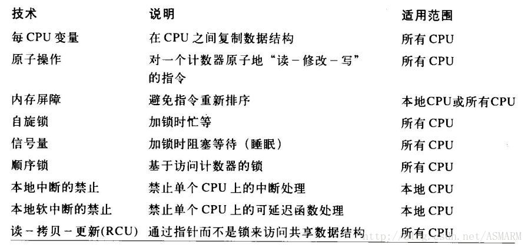

[toc]

## 内核同步

概念部分，自行参考《深入理解linux内核》第五章。

> 本章开始部分我们先回顾一下内核请求是**何时以交错( interleave)的方式执行以及交错程度如何**。然后我们将介绍**内核中所实现的基本同步机制**，并说明**通常情况下如何应用它们**。最后，我们给出了**几个实际的例子**。



这么多，我也没兴趣一个一个去看。我们看下面的示例代码。里面使用了：原子操作，自旋锁，信号量，(工作队列，定时器)。

<br>

## 背景知识点

阅读下一节代码中，涉及到的知识点。

0. [内核同步专栏](http://www.wowotech.net/sort/kernel_synchronization)

    蜗窝科技的内核同步专栏。根据自己的需要，查看对应的博客。

1. 工作队列：[工作队列-视频简介](https://www.bilibili.com/video/BV1XV411k72Q?p=31) | [并发管理工作队列(Concurrency Managed Workqueue, cmwq) -- Linux document](https://www.kernel.org/doc/html/latest/core-api/workqueue.html?highlight=workqueue) | [workqueue的基本概念](http://www.wowotech.net/irq_subsystem/workqueue.html) | [CMWQ概述](http://www.wowotech.net/irq_subsystem/cmwq-intro.html)

   > 在内核代码中，经常希望延缓部分工作到将来某个时间执行。内核中提供了许多机制来实现
   > 这种延迟执行，例如可延迟函数，工作队列等；
   >
   > 工作队列（workqueue）可以把工作推后，并交由一个特殊的内核线程——工作者线程来执
   > 行，该线程运行在进程上文环境中，可以被阻塞。工作队列的优势在于它允许重新调度甚至
   > 是睡眠。
   >
   > 我们把推后执行的任务叫做工作（work） ， 描述它的数据结构为work_struct
   > 这些工作以队列结构组织成工作队列（workqueue），其数据结构workqueue_struct

   ```c
   //用于初始化工作，指定一个工作\_work所要执行性的函数\_func；
   INIT_WORK(_work, _func)
   
   // schedule_work - put work task in global workqueue(system_wq)
   static inline bool schedule_work(struct work_struct *work)
   ```

2. 信号量：[内核同步原语. 第三部分-信号量](https://www.cntofu.com/book/114/SyncPrim/sync-3.md)

   ```c
   // 信号量初始化
   DEFINE_SEMAPHORE(name)
        
   // down 和 up 是用来获取或释放 信号量
   void down(struct semaphore *sem);
   void up(struct semaphore *sem);
   ```

3. 定时器：[【linux】驱动-15-定时器](https://www.cnblogs.com/lizhuming/p/14922233.html)

   ```c
   // 相关结构体
   struct timer_list {
   	/*
   	 * All fields that change during normal runtime grouped to the
   	 * same cacheline
   	 */
   	struct hlist_node	entry;
   	unsigned long		expires;
   	void			(*function)(struct timer_list *);
   	u32			flags;
   
   #ifdef CONFIG_LOCKDEP
   	struct lockdep_map	lockdep_map;
   #endif
   };
   
   // 设置定时器
   timer_setup(timer, callback, flags)
       
   // 向内核添加定时器
   void add_timer(struct timer_list *timer)
   
   // 修改定时器超时时间
   mod_timer(struct timer_list *timer, unsigned long expires)
   ```

4. 自旋锁：[Linux内核的自旋锁](http://www.wowotech.net/kernel_synchronization/460.html)

   ```c
   //定义并且初始化静态自旋锁
   DEFINE_SPINLOCK(x)
   
   // 申请自旋锁
   void spin_lock(spinlock_t *lock);
   
   // 释放自旋锁
   void spin_unlock(spinlock_t *lock);
   ```

5. 原子操作：[原子操作](http://www.wowotech.net/kernel_synchronization/atomic.html)

   ```c
   // 相关数据结构
   typedef struct {
   	volatile int val;
   } atomic_t;
   
   // 获取原子变量的值
   static inline int atomic_read(const atomic_t *v)
   
   // 原子操作+1
   static inline void atomic_inc(atomic_t *v)
   ```

   看到“原子操作”，不知道为啥总是想到“[原子崩坏](https://baike.baidu.com/item/%E9%BA%A6%E9%87%8E%E6%B2%89%E5%88%A9/2525057?fromtitle=%E5%8E%9F%E5%AD%90%E5%B4%A9%E5%9D%8F&fromid=8971808)”，hhh。

6. 双链表结构：[linux内核链表结构](https://blog.csdn.net/sinat_38816924/article/details/117125363)

<br>

## 内核同步示例代码

[代码来源](https://gitee.com/ljrcore/linuxmooc/tree/master/%E3%80%8ALinux%E5%86%85%E6%A0%B8%E5%88%86%E6%9E%90%E4%B8%8E%E5%BA%94%E7%94%A8%E3%80%8B%E5%8A%A8%E6%89%8B%E5%AE%9E%E8%B7%B5%E6%BA%90%E7%A0%81/7.4%E5%8A%A8%E6%89%8B%E5%AE%9E%E8%B7%B5-%E5%86%85%E6%A0%B8%E5%A4%9A%E4%BB%BB%E5%8A%A1%E5%B9%B6%E5%8F%91%E5%AE%9E%E4%BE%8B)

0. 内核中存在一个链表结构的数据。读取操作这段数据，需要加锁/解锁。
1. 使用工作队列，给该链表结构，添加/删除节点。(工作队列中，插入相同的work，由于已经在队列中，结束执行。?) 所以，这里添加了信号量，当该work调用对应的func结束之后；再插入一份(相同的)work。

2. 定时器，每间隔一秒，删除链表中一个节点。

```c
#include <linux/init.h>
#include <linux/module.h>
#include <linux/list.h>
#include <linux/semaphore.h>
#include <linux/sched.h>
#include <linux/timer.h>
#include <linux/spinlock_types.h>
#include <linux/workqueue.h>
#include <linux/slab.h>        /*kmalloc的头文件*/
#include <linux/kthread.h>
#include <linux/kallsyms.h>

#define NTHREADS 200 /* 线程数 */

struct my_struct {
	struct list_head list;
	int id;
	int pid;
};
static struct work_struct queue;
static struct timer_list mytimer;   /* 用于定时器队列 */
static LIST_HEAD(mine);  /* sharelist头 */
static unsigned int list_len = 0; 
static DEFINE_SEMAPHORE(sem);  /* 内核线程启动器之间进行同步的信号量,4.15内核适用*/
static DEFINE_SPINLOCK(my_lock); /* 保护对链表的操作,4.15内核适用 */
static atomic_t my_count = ATOMIC_INIT(0); /* 以原子方式进行追加 */
static int count = 0;

static int sharelist(void *data);
static void start_kthread(void);
static void kthread_launcher(struct work_struct *q);

/* 内核线程，把节点加到链表 */
static int sharelist(void *data)
{
        
    struct my_struct *p;

	if (count++ % 4 == 0)
		printk("\n");

	spin_lock(&my_lock); /* 添加锁，保护共享资源 */
	if (list_len < 50) {
		if ((p = kmalloc(sizeof(struct my_struct), GFP_KERNEL)) == NULL)
			return -ENOMEM;
		p->id = atomic_read(&my_count); /* 原子变量操作 */
		atomic_inc(&my_count);
		p->pid = current->pid;
		list_add(&p->list, &mine); 
		list_len++;
		printk("THREAD ADD:%-5d\t", p->id);
	}
    else { /* 队列超过定长则删除节点 */
		struct my_struct *my = NULL;
		my = list_entry(mine.prev, struct my_struct, list);
		list_del(mine.prev); 
		list_len--;
		printk("THREAD DEL:%-5d\t", my->id);
		kfree(my);
	}
	spin_unlock(&my_lock);
	return 0;
}

/* 调用keventd来运行内核线程 */
static void start_kthread(void)
{
	down(&sem);
	schedule_work(&queue); // schedule_work - put work task in global workqueue
}

static void kthread_launcher(struct work_struct *q)
{ 
          kthread_run(sharelist, NULL, "%d", count);
          up(&sem);
}

void qt_task(struct timer_list *timer)
{
    spin_lock(&my_lock);
	if (!list_empty(&mine)) {
		struct my_struct *i;
		if (count++ % 4 == 0)
			printk("\n");
		i = list_entry(mine.next, struct my_struct, list); /* 取下一个节点 */
		list_del(mine.next); /* 删除节点 */
		list_len--;
		printk("TIMER DEL:%-5d\t", i->id);
		kfree(i);
	}
    spin_unlock(&my_lock);
	mod_timer(timer, jiffies + msecs_to_jiffies(1000));
}


static int share_init(void)
{
    int i;
	printk(KERN_INFO"share list enter\n");
 
	INIT_WORK(&queue, kthread_launcher);
	timer_setup(&mytimer, qt_task, 0);
	add_timer(&mytimer);
	for (i = 0; i < NTHREADS; i++) 
		start_kthread();
	return 0;
}
static void share_exit(void)
{
	struct list_head *n, *p = NULL;
	struct my_struct *my = NULL;
	printk("\nshare list exit\n");
	del_timer(&mytimer);
	spin_lock(&my_lock); /* 上锁，以保护临界区 */
	list_for_each_safe(p, n, &mine)
        { /* 删除所有节点，销毁链表 */
		if (count++ % 4 == 0)
			printk("\n");
		my = list_entry(p, struct my_struct, list); /* 取下一个节点 */
		list_del(p);
		printk("SYSCALL DEL: %d\t", my->id);
		kfree(my);
	}
	spin_unlock(&my_lock); /* 开锁 */	
	printk(KERN_INFO"Over \n");
}

module_init(share_init);
module_exit(share_exit);

MODULE_LICENSE("GPL v2");

```

```makefile
obj-m :=sharelist.o
CURRENT_PATH := $(shell pwd)
LINUX_KERNEL := $(shell uname -r)
LINUX_KERNEL_PATH := /lib/modules/$(shell uname -r)/build

all:
	make -C $(LINUX_KERNEL_PATH) M=$(CURRENT_PATH) modules 
clean:
	@rm -rf .*.cmd *.o *.mod.c *.ko .tmp_versions Module.symvers .Makefile.swp modules.order *.o.ur-detected *.o.ur-safe	
```

