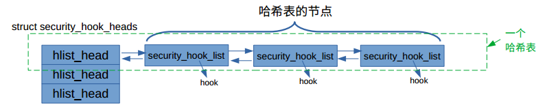

[toc]

# 前言

介绍了LSM框架中钩子函数的建立和被使用过程。

建议阅读本文之前，对LSM有个框架认识，可以参考：[基于Flask的Linux安全模块框架LSM -- coursera](https://www.coursera.org/learn/os-virtsecurity/lecture/OCkZ7/8-5-ji-yu-flaskde-linuxan-quan-mo-kuai-kuang-jia-lsm-i-linuxti-xi-jie-gou-shu-ju)

参考博客：[Linux Security Modules框架源码分析](https://zhuanlan.zhihu.com/p/352103792)

<br>

# LSM 简介

**来源一**：[Linux Security Module Usage](https://www.kernel.org/doc/html/latest/admin-guide/LSM/index.html?highlight=lsm)

Linux安全模块（ Linux Security Module, LSM）框架提供了一种机制，可以将各种安全检查与新的内核扩展挂钩。名称“模块”有点用词不当，因为这些扩展实际上并不是可加载的内核模块。相反，在 `"security=..."` 给定内核中内置了多个LSM的情况下，它们可以在构建时通过CONFIG_DEFAULT_SECURITY 进行选择，并且可以在引导时通过内核命令行参数进行覆盖 。

LSM的主要用于用户的强制访问控制（Mandatory Access Control, MAC）扩展，可提供全面的安全策略。例如包括SELinux，Smack，Tomoyo和AppArmor。除了较大的MAC扩展之外，当Linux本身的核心功能中没有这些调整时，可以使用LSM来构建其他扩展，以对系统操作进行特定的更改。

可以通过`/sys/kernel/security/lsm`查看系统当前活动安全模块的列表。

```shell
➜ cat /sys/kernel/security/lsm
lockdown,capability,yama,apparmor
```

**参考二**：[《Linux内核安全模块深入剖析》](https://www.amazon.com/Linux%E5%86%85%E6%A0%B8%E5%AE%89%E5%85%A8%E6%A8%A1%E5%9D%97%E6%B7%B1%E5%85%A5%E5%89%96%E6%9E%90-%E6%9D%8E%E5%BF%97/dp/B01M8L5ODP) 第二部分 强制访问控制。

<br>

# LSM 启动分析

[start_kernel](https://elixir.bootlin.com/linux/v5.6/source/init/main.c#L785)是系统启动执行完架构相关代码后，通用代码的入口，LSM 的初始化也是在这里调用。

```c
/*
* Interrupts are still disabled. Do necessary setups, then
* enable them.
*/
...
early_security_init();
...

....
security_init();
...
```

- **early_lsm** 用于早期启动的模块，当配置 CONFIG_SECURITY_LOCKDOWN_LSM_EARLY 时lockdown 模块被配置为 early_lsm，调用的函数为 early_security_init。
- **lsm** 是除 lockdown 外默认配置的方式，调用的函数为 security_init。

<br>

## 相关数据结构

在开始介绍上面两个函数之前，我们先简单看下相关的数据结构。

[PS：需要有哈希表结构的相关背景知识，可以参考：[linux内核链表结构](https://blog.csdn.net/sinat_38816924/article/details/117125363)]

**security_hook_heads**：[via](https://elixir.bootlin.com/linux/v5.6/source/include/linux/lsm_hooks.h#L1831)。这是一个结构体，里面的没有个元素都是哈希表的表头。

security.c使用它创建一个名为[security_hook_heads的全局变量](https://elixir.bootlin.com/linux/v5.6/source/security/security.c#L70)，且该变量初始化之后为只读属性，不能再修改。

```c
struct security_hook_heads {
    struct hlist_head binder_set_context_mgr;
	struct hlist_head binder_transaction;
	struct hlist_head binder_transfer_binder;
	struct hlist_head binder_transfer_file;
    ....
    ....
}

struct security_hook_heads security_hook_heads __lsm_ro_after_init;
```

**security_hook_list**：[via](https://elixir.bootlin.com/linux/v5.6/source/include/linux/lsm_hooks.h#L2084) 。这个结构作为哈希表链中的节点。

```c
/*
 * Security module hook list structure.
 * For use with generic list macros for common operations.
 */
struct security_hook_list {
	struct hlist_node		list;
	struct hlist_head		*head;
	union security_list_options	hook;
	char				*lsm;
} __randomize_layout;
```

**security_list_options** ：[via](https://elixir.bootlin.com/linux/v5.6/source/include/linux/lsm_hooks.h#L1458)。security_list_options采用联合体结构，是因为不同的函数指针结构不同。使用联合体，不管hook是列表中的哪种函数类型，都可以指向。

```c
/**
 * union security_list_options - Linux Security Module hook function list
 *
 * Security hooks for program execution operations.
 *
 ...
 */
union security_list_options {
	int (*binder_set_context_mgr)(struct task_struct *mgr);
	int (*binder_transaction)(struct task_struct *from,
					struct task_struct *to);
	int (*binder_transfer_binder)(struct task_struct *from,
					struct task_struct *to);
	int (*binder_transfer_file)(struct task_struct *from,
					struct task_struct *to,
					struct file *file);
    ...
    ...
}
```

它们三者的使用如下图所示。**通过预置的方式，调用这些钩子函数**。[这个后面会展示代码介绍]

 

<br>

## early_security_init

**early_security_init**：[via](https://elixir.bootlin.com/linux/v5.6/source/security/security.c#L361)。

```c
int __init early_security_init(void)
{
	int i;
	struct hlist_head *list = (struct hlist_head *) &security_hook_heads;
	struct lsm_info *lsm;

	for (i = 0; i < sizeof(security_hook_heads) / sizeof(struct hlist_head);
	     i++)
		INIT_HLIST_HEAD(&list[i]); // 全局变量security_hook_heads中的所有的头结点，初始化指向NULL

	for (lsm = __start_early_lsm_info; lsm < __end_early_lsm_info; lsm++) {
		if (!lsm->enabled)
			lsm->enabled = &lsm_enabled_true;
		prepare_lsm(lsm); /* Prepare LSM for initialization. */
		initialize_lsm(lsm);
	}

	return 0;
}
```

**__start_early_lsm_info**：[via](https://elixir.bootlin.com/linux/v5.6/source/include/asm-generic/vmlinux.lds.h#L248)。它的结构在`include/asm-generic/vmlinux.lds.h`中进行初始化。

```c
#ifdef CONFIG_SECURITY
#define LSM_TABLE()	. = ALIGN(8);					\
			__start_lsm_info = .;				\
			KEEP(*(.lsm_info.init))				\
			__end_lsm_info = .;
#define EARLY_LSM_TABLE()	. = ALIGN(8);				\
			__start_early_lsm_info = .;			\
			KEEP(*(.early_lsm_info.init))			\
			__end_early_lsm_info = .;
#else
#define LSM_TABLE()
#define EARLY_LSM_TABLE()
#endif
```

通过`include/linux/lsm_hooks.h`包含进来。

```c
struct lsm_info {
	const char *name;	/* Required. */
	enum lsm_order order;	/* Optional: default is LSM_ORDER_MUTABLE */
	unsigned long flags;	/* Optional: flags describing LSM */
	int *enabled;		/* Optional: controlled by CONFIG_LSM */
	int (*init)(void);	/* Required. */
	struct lsm_blob_sizes *blobs; /* Optional: for blob sharing. */
};

extern struct lsm_info __start_lsm_info[], __end_lsm_info[];
extern struct lsm_info __start_early_lsm_info[], __end_early_lsm_info[];

#define DEFINE_LSM(lsm)							\
	static struct lsm_info __lsm_##lsm				\
		__used __section(.lsm_info.init)			\
		__aligned(sizeof(unsigned long))

#define DEFINE_EARLY_LSM(lsm)						\
	static struct lsm_info __early_lsm_##lsm			\
		__used __section(.early_lsm_info.init)			\
		__aligned(sizeof(unsigned long))
```

正如前文所说，early_lsm用于早期启动的模块，当配置 CONFIG_SECURITY_LOCKDOWN_LSM_EARLY 时lockdown 模块被配置为 early_lsm，调用的函数为 early_security_init。DEFINE_EARLY_LSM(lockdown) ：[via](https://elixir.bootlin.com/linux/v5.6/source/security/lockdown/lockdown.c#L160)。<font color=blue>将early_lsm的相关信息填充到\_\_start_early_lsm_info[] ~__end_early_lsm_info中</font>。

```c
#ifdef CONFIG_SECURITY_LOCKDOWN_LSM_EARLY
DEFINE_EARLY_LSM(lockdown) = {
#else
DEFINE_LSM(lockdown) = {
#endif
	.name = "lockdown",
	.init = lockdown_lsm_init,
};
    
// 宏展开；我不很明白这个__section是如何将这个元素，放入到__start_early_lsm_info[]列表中的；
static struct lsm_info __early_lsm_lockdown = {
    .name = "lockdown",
    .init = lockdown_lsm_init,
}; __used __section(.early_lsm_info.init) __aligned(sizeof(unsigned long))
```

**initialize_lsm**：[via](https://elixir.bootlin.com/linux/v5.6/source/security/security.c#L227)。<font color=blue>调用各自安全模块自己的init函数</font>。

```c
/* Initialize a given LSM, if it is enabled. */
static void __init initialize_lsm(struct lsm_info *lsm)
{
	if (is_enabled(lsm)) {
		int ret;

		init_debug("initializing %s\n", lsm->name);
		ret = lsm->init(); // 调用各自对应的init函数
		WARN(ret, "%s failed to initialize: %d\n", lsm->name, ret);
	}
}
```

<font color=red>小结</font>：`early_security_init`根据lsm_info[]中的信息，调用early_lsm中各自的init函数。目前，整个系统中，只有当配置 CONFIG_SECURITY_LOCKDOWN_LSM_EARLY 时lockdown 模块被配置为 early_lsm。

<br>

## security_init

**security_init**：[via](https://elixir.bootlin.com/linux/v5.6/source/security/security.c#L386)

```c
char *lsm_names;

/**
 * security_init - initializes the security framework
 *
 * This should be called early in the kernel initialization sequence.
 */
int __init security_init(void)
{
	struct lsm_info *lsm;

	pr_info("Security Framework initializing\n");

	/*
	 * Append the names of the early LSM modules now that kmalloc() is
	 * available
	 */
	for (lsm = __start_early_lsm_info; lsm < __end_early_lsm_info; lsm++) {
		if (lsm->enabled)
			lsm_append(lsm->name, &lsm_names); /*将early_lsm模块名拷贝到lsm_names中*/
	}

	/* Load LSMs in specified order. */
	ordered_lsm_init();

	return 0;
}
```

**ordered_lsm_init**：[via](https://elixir.bootlin.com/linux/v5.6/source/security/security.c#L315)。我不知道这个函数的作用。根据注释可以知道，它将LSM的内容排了一个顺序，然后加载。加载函数，同样是上面介绍的`initialize_lsm`。

```c
static void __init ordered_lsm_init(void)
{
	struct lsm_info **lsm;

	ordered_lsms = kcalloc(LSM_COUNT + 1, sizeof(*ordered_lsms),
				GFP_KERNEL);

	if (chosen_lsm_order) {
		if (chosen_major_lsm) {
			pr_info("security= is ignored because it is superseded by lsm=\n");
			chosen_major_lsm = NULL;
		}
		ordered_lsm_parse(chosen_lsm_order, "cmdline");
	} else
		ordered_lsm_parse(builtin_lsm_order, "builtin");

	for (lsm = ordered_lsms; *lsm; lsm++)
		prepare_lsm(*lsm);

	init_debug("cred blob size     = %d\n", blob_sizes.lbs_cred);
	init_debug("file blob size     = %d\n", blob_sizes.lbs_file);
	init_debug("inode blob size    = %d\n", blob_sizes.lbs_inode);
	init_debug("ipc blob size      = %d\n", blob_sizes.lbs_ipc);
	init_debug("msg_msg blob size  = %d\n", blob_sizes.lbs_msg_msg);
	init_debug("task blob size     = %d\n", blob_sizes.lbs_task);

	/*
	 * Create any kmem_caches needed for blobs
	 */
	if (blob_sizes.lbs_file)
		lsm_file_cache = kmem_cache_create("lsm_file_cache",
						   blob_sizes.lbs_file, 0,
						   SLAB_PANIC, NULL);
	if (blob_sizes.lbs_inode)
		lsm_inode_cache = kmem_cache_create("lsm_inode_cache",
						    blob_sizes.lbs_inode, 0,
						    SLAB_PANIC, NULL);

	lsm_early_cred((struct cred *) current->cred);
	lsm_early_task(current);
	for (lsm = ordered_lsms; *lsm; lsm++)
		initialize_lsm(*lsm);

	kfree(ordered_lsms);
}
```

<font color=red>小结</font>：`security_init`也会调用lsm中各个安全模块的init函数。

<br>

## 填充security_hook_heads全局变量

我们以selinux为例，看它是如何填充security_hook_heads全局变量。

（1）[via](https://elixir.bootlin.com/linux/v5.6/source/security/selinux/hooks.c#L7212)：selinux使用DEFINE_LSM宏，将相关信息填充为一个lsm_info结构体变量。这个结构体变量位于\_\_start_lsm_info和 _\_start_lsm_info之间。

```c
/* SELinux requires early initialization in order to label
   all processes and objects when they are created. */
DEFINE_LSM(selinux) = {
	.name = "selinux",
	.flags = LSM_FLAG_LEGACY_MAJOR | LSM_FLAG_EXCLUSIVE,
	.enabled = &selinux_enabled_boot,
	.blobs = &selinux_blob_sizes,
	.init = selinux_init,
};

// 等价于
static struct lsm_info __lsm_selinux = {
	.name = "selinux",
	.flags = LSM_FLAG_LEGACY_MAJOR | LSM_FLAG_EXCLUSIVE,
	.enabled = &selinux_enabled_boot,
	.blobs = &selinux_blob_sizes,
	.init = selinux_init,
}; __used __section(.early_lsm_info.init) __aligned(sizeof(unsigned long))
```

（2）security_init函数会调用结构中的init函数。对于selinux而言，调用selinux_init函数。

**selinux_init**：[via](https://elixir.bootlin.com/linux/v5.6/source/security/selinux/hooks.c#L7155)。这个是selinux的初始化函数。

```c
static __init int selinux_init(void)
{
	pr_info("SELinux:  Initializing.\n");

	memset(&selinux_state, 0, sizeof(selinux_state));
	enforcing_set(&selinux_state, selinux_enforcing_boot);
	selinux_state.checkreqprot = selinux_checkreqprot_boot;
	selinux_ss_init(&selinux_state.ss);
	selinux_avc_init(&selinux_state.avc);

	/* Set the security state for the initial task. */
	cred_init_security();

	default_noexec = !(VM_DATA_DEFAULT_FLAGS & VM_EXEC);

	avc_init();

	avtab_cache_init();

	ebitmap_cache_init();

	hashtab_cache_init();
	/*其中的security_add_hooks函数，会将钩子函数放置到合适的位置。至于这个位置在哪，咱们慢慢看。*/
	security_add_hooks(selinux_hooks, ARRAY_SIZE(selinux_hooks), "selinux"); 

	if (avc_add_callback(selinux_netcache_avc_callback, AVC_CALLBACK_RESET))
		panic("SELinux: Unable to register AVC netcache callback\n");

	if (avc_add_callback(selinux_lsm_notifier_avc_callback, AVC_CALLBACK_RESET))
		panic("SELinux: Unable to register AVC LSM notifier callback\n");

	if (selinux_enforcing_boot)
		pr_debug("SELinux:  Starting in enforcing mode\n");
	else
		pr_debug("SELinux:  Starting in permissive mode\n");

	fs_validate_description("selinux", selinux_fs_parameters);

	return 0;
}
```

**security_add_hooks**：[via ](https://elixir.bootlin.com/linux/v5.6/source/security/security.c#L475) ; 

**static struct security_hook_list selinux_hooks[]** ：[via](https://elixir.bootlin.com/linux/v5.6/source/security/selinux/hooks.c#L6886)

**LSM_HOOK_INIT**：[via](https://elixir.bootlin.com/linux/v5.6/source/include/linux/lsm_hooks.h#L2109)

```c
/**
 * security_add_hooks - Add a modules hooks to the hook lists.
 * @hooks: the hooks to add
 * @count: the number of hooks to add
 * @lsm: the name of the security module
 *
 * Each LSM has to register its hooks with the infrastructure.
 */
void __init security_add_hooks(struct security_hook_list *hooks, int count,
				char *lsm)
{
	int i;

	for (i = 0; i < count; i++) {
		hooks[i].lsm = lsm;
		hlist_add_tail_rcu(&hooks[i].list, hooks[i].head);
	}

	/*
	 * Don't try to append during early_security_init(), we'll come back
	 * and fix this up afterwards.
	 */
	if (slab_is_available()) {
		if (lsm_append(lsm, &lsm_names) < 0)
			panic("%s - Cannot get early memory.\n", __func__);
	}
}

static struct security_hook_list selinux_hooks[] __lsm_ro_after_init = {
	LSM_HOOK_INIT(binder_set_context_mgr, selinux_binder_set_context_mgr),
	LSM_HOOK_INIT(binder_transaction, selinux_binder_transaction),
	LSM_HOOK_INIT(binder_transfer_binder, selinux_binder_transfer_binder),
	LSM_HOOK_INIT(binder_transfer_file, selinux_binder_transfer_file),
    ....
    ....
}


#define LSM_HOOK_INIT(HEAD, HOOK) \
	{ .head = &security_hook_heads.HEAD, .hook = { .HEAD = HOOK } }
```

我们将上面的宏展开来看。

```c
selinux_hooks[0] = security_hook_list {
    struct hlist_node		list;
    // head指向security_hook_heads全局变量中的一个选项。这是哈希表的表头。
	struct hlist_head		*head = &security_hook_heads.binder_set_context_mgr; 
    // union结构的hook，存储着对应钩子函数具体实现所在位置
	union security_list_options	hook = {.binder_set_context_mgr=selinux_binder_set_context_mgr}; 
	char				*lsm;
}
```

（3）security_add_hooks使用hlist_add_tail_rcu，将security_hook_list结构的节点放入哈希表中。每个节点中的hook存储着一个钩子函数。

最后的填充结构，也就是这张图所示的样子。

 

<br>

## 使用安全模块中的钩子函数

（4）以[binder_ioctl_set_ctx_mgr](https://elixir.bootlin.com/linux/v5.6/source/drivers/android/binder.c#L4888)函数为例。该函数中插入了安全钩子：`security_binder_set_context_mgr`。如果检查不通过的话，退出。

```c
static int binder_ioctl_set_ctx_mgr(struct file *filp,
				    struct flat_binder_object *fbo)
{
    ....
	ret = security_binder_set_context_mgr(proc->tsk);
	if (ret < 0)
		goto out;
   ....
}
```

（5）**security_binder_set_context_mgr** ：[via](https://elixir.bootlin.com/linux/v5.6/source/security/security.c#L475)。可以看到它会遍历security_hook_heads全局变量中，以security_hook_heads.binder_set_context_mgr为哈希表头的钩子函数。

```c
int security_binder_set_context_mgr(struct task_struct *mgr)
{
	return call_int_hook(binder_set_context_mgr, 0, mgr);
}


#define call_int_hook(FUNC, IRC, ...) ({			\
	int RC = IRC;						\
	do {							\
		struct security_hook_list *P;			\
								\
		hlist_for_each_entry(P, &security_hook_heads.FUNC, list) { \
			RC = P->hook.FUNC(__VA_ARGS__);		\
			if (RC != 0)				\
				break;				\
		}						\
	} while (0);						\
	RC;							\
})
```

<br>

# 附录

## 小故事

<font color=red>来源</font>：[《Linux内核安全模块深入剖析》](https://www.amazon.com/Linux%E5%86%85%E6%A0%B8%E5%AE%89%E5%85%A8%E6%A8%A1%E5%9D%97%E6%B7%B1%E5%85%A5%E5%89%96%E6%9E%90-%E6%9D%8E%E5%BF%97/dp/B01M8L5ODP) 第二部分 强制访问控制。

### SELinux

在 Linux 内核安全领域， SELinux 可谓鼎鼎大名。几乎所有接触过 Linux 安全和试图接触Linux 安全的人都或多或少了解过 SELinux。了解的结果是大部分人对 SELinux 望而却步，小部分人略知一二后对 SELinux 敬而远之。作者怀疑是否有人在了解 SELinux 之后还会对 SELinux推崇备至。

SELinux 的全称是 Security Enhanced Linux，中文直译为安全增强的 Linux。美国国家安全局（National Security Agency——NSA）主导了 SELinux 的开发工作。

SELinux 的历史可以追溯到 NSA 的三次开发安全操作系统的努力。第一次是在 1992 年到1993 年间， NSA 与安全计算公司（Secure Computing Corporation——SCC）合作开发了以 Mach操作系统为载体的 DTMach，那时的 DTMach 就已经实现了类型增强（Type Enforcement——TE），后来类型增强成为 SELinux 最主要的访问控制机制。第二次是 NSA 和 SCC 在 DTMach 基础上开发的 DTOS（ Distributed Trusted Operating System）。第三次是 NSA、 SCC 和犹他大学合作的 Flux 项目，将 DTOS 安全架构移植到一个名为 Fluke 的科研操作系统上， Flux项目最大的成果是实现了一个能支持动态管理的安全策略架构——Flask（ Flux AdvancedSecurity Kernel）。随后 Flask 衍生出众多后代，包括 Linux 之上的 SELinux、 OpenSolaris上的 FMAC、 BSD 上的 TrustedBSD、 Darwin 上的 SEDarwin、 Xen 上的 XSM（ Xen SecurityModules），以及在用户态应用领域的 SEPostgreSQL、 SE-DBUS、 XACE（ X Access ControlExtension） 。

在科研领域取得突破后， NSA 进而希望安全操作系统能够被广大用户接受并使用。因此以Linux 为载体的 SELinux 就诞生了。 SELinux 的第一个开放源代码版本以内核补丁的方式发布于 2000 年 12 月 22 日。随后， NSA 进行了近三年不懈的努力，终于在 2003 年 8 月 8 日使 SELinux 并入 Linux 2.6.0-test3 主线。

 SELinux 的安全机制包含：基于角色的访问控制（Role Based Access Control， RBAC）、类型增强（Type Enforcement， TE）和多级安全（Multi Level Security， MLS）。

提到 SELinux，作者想到的是两个词：权威和复杂。 SELinux 的理想是让 SELinux 的安全机制可以覆盖 Linux 系统的方方面面，这个理想实现了。 SELinux 之后的 4 个安全模块都没有做到全系统覆盖。

SELinux 的第二个理想是让 Linux 系统中所有的开发人员、管理人员和使用人员都自觉地学习 SELinux，使用 SELinux。这个理想没有实现。因为大家都在抱怨 SELinux 太复杂了。

SELinux 的开发者认为自己努力地开发了一个完美的安全系统，但是发现大家不用，而且随着时间的推移，使用率并没有增加。 SELinux 的一个开发者 Dan Walsh 为此制作了一个网站（http://stopdisablingselinux.com/）鼓励人们使用 SELinux。

  

### SMACK

SMACK 是“ Simplified Mandatory Access Control Kernel”的缩写。它的作者是 Casey Schaufler，目前在 Intel 从事手机操作系统 Tizen 的安全开发工作。 SMACK 于 2008 年 4 月 16日进入了 Linux 2.6.25，是继 SELinux 之后第二个进入 Linux 内核主线的安全模块。

SMACK 的出现在 Linux 内核社区引发了很大的争论。争论的背景是 SELinux 在 2003 年进入了 Linux 内核主线之后并未能如预想的那样为广大系统管理员和应用开发者理解和接受。管理员在发现系统因 SELinux 策略配置问题而不能正常运行时， 往往是简单地关闭 SELinux 功能，而不是去调试和修改 SELinux 策略。应用开发者的开发工作只包括开发应用的功能，不包括开发应用相关的 SELinux 策略。 Linux 发行版，比如 RedHat，面对众多的应用只能为一部分核心应用开发SELinux 策略。这就造成了 SELinux 安全策略滞后于应用，用户在运行应用时，SELinux 常常阻碍应用的正常运行。

既然 LSM 机制的目的是允许多个安全模块并存，既然 SELinux 的主要问题是复杂难用（至少表面上看起来是），那就设计出一种简单的安全模块来作为 SELinux 的替代品。 SMACK 就是循着这个思路而产生的。

SMACK 的出现让 SELinux 的开发者和拥护者备受打击。它不仅动摇了 SELinux 的地位，而且让 SELinux 开发团队的理想更加难以实现。有了 SMACK，内核安全开发人员还要继续作Linux内核开发社区的二等公民， Linux应用的开发者会继续忽视SELinux， 而不是学习SELinux。面对 SMACK， SELinux 开发者的自然反应就是阻挠 SMACK 进入 Linux 内核主线。而 SMACK的开发者 Casey Schaufler 偏偏是一个不屈不挠的人，他一次又一次地提交自己的作品。

这时两个重量级人物站出来支持 SMACK，第一个是 Andrew Morton，他说：“我不是很懂安全。在读过你提交的代码后，我的观点是代码本身的质量很好，但是似乎SELinux 可以有相同的功能。将上面那个‘但是’作为不接受 SMACK 的理由对我而言有些困难。我更倾向于接受 SMACK，然后看大家是否用它。”Andrew Morton 虽然表示 SMACK 在功能上并没有超越 SELinux，但是明确表示倾向于将SMACK 纳入 Linux 内核主线。

这还不够。第二个重量级人物站了出来，这个人是 Linux 的“仁慈的独裁者”——Linus Torvalds。这次的[邮件](http://lwn.net/Articles/252589/)要“刺激”得多 。邮件大意是调度算法是“硬科学”，而安全不是“硬科学”， 因为安全无法定量地度量。 尽管 Stephen Smalley 争辩说 SMACK 能做的事只是 SELinux 的一个子集。但是 Linus Torvalds 关心的根本不是具体的安全功能，他要用 SMACK 的进入主 线来保留 LSM 机制，改变 SELinux 一家独大的局面。大佬一锤定音， SMACK 进入 Linux 内核主线！

SMACK 的强制访问控制机制是类型增强（Type Enforcement）。与 SELinux 不同， SMACK的工作机制只有类型增强，没有基于角色的访问控制和多级安全。因此它更简单。类型在 SMACK 中的体现是标签。

 

### Tomoyo

Tomoyo 是另一个 Linux 内核安全模块。 SELinux 和 SMACK 的名字都来自英文单词缩写，Tomoyo 则不同，它是一个日本女性的名字，写作汉语是“友子”或“[知子](http://en.wikipedia.org/wiki/Tomoyo)” 。 Tomoyo 的开发者是日本的 NTT Data 公司，开发起始于 2003 年 3 月，此时距离 SELinux 被 Linux 主线接受只有五个月。Tomoyo 的开发者不会不知道成熟的 SELinux 已经占尽先机。那么这些日本的 Linux内核安全人员为什么要自己开发一个新的内核安全模块，而不是使用已有的 SELinux 呢？客观地说，Tomoyo  的确有独到之处。

SMACK 鼓吹的是简单。 Tomoyo 推出的则是另一个卖点，而这又涉及一场至今没有结果的争论：基于 inode 的安全与基于路径的安全，哪一个更安全？

要为文件引入安全属性，很自然地想到安全属性不是文件内容，而是属于元数据，应该与inode 关联。于是很多文件系统引入了扩展属性，一些内核安全模块将安全属性存储在文件的扩展属性中，这种方式就是基于 inode 的安全。基于 inode 的安全的优点主要有两个：

* 文件的安全属性与文件路径无关。文件可以在不同目录间移动，不管它怎么移动，它的安全属性都没有变化。
* 同一个文件可以有多个链接，从不同链接访问文件，其安全属性总是一样的。

基于 inode 的安全的缺点是：

* 文件系统必须支持扩展属性，并且挂载文件系统时必须使用扩展属性。现在这个问题已经基本得到解决了。 目前 Linux 上大多数文件系统已经支持扩展属性， 并且挂载时缺省使用扩展属性。
* 删除文件时，文件的安全属性会随之消失。再在原先的路径处创建同名文件，并不能保证新文件和老文件的安全属性相同。
* 安装软件和升级软件需要保证系统中新的文件具有正确的安全属性。新文件来自软件包，新的安全属性自然也应该来自软件包。于是有了下一个要求：众多软件包格式也需要支持文件的扩展属性，比如 tar、 cpio 等。

下面说说基于路径的安全。

从用户角度看，用户通过路径访问文件，用户态进程无法用 inode 号来访问文件。即使是基于inode 的安全，用户读写安全属性也要先通过路径找到文件，然后才能访问文件的安全属性。那么能否将文件的安全属性简单地与文件路径对应起来呢？比如/bin/bash 的安全属性是“system-shell”，/usr/local/bin/bash 的安全属性是“local-shell”。不把这些安全属性存储在文件的扩展属性中，而是存储在系统内部的一张表里，这就是基于路径的安全的实现原理。这样做的优点是：

* 不需要文件系统有额外支持。
* 不怕文件更新，对打包格式也没有额外要求。用户甚至可以为还不存在的文件定义安全属性。

基于路径的安全的缺点是：同一个文件可能有多个安全属性，简单地创建链接就可能让文件拥有另一个安全属性。

 

### AppArmor

AppArmor 源于 1998 年 WireX 公司开发的 SubDomain。 WireX 将 SubDomain 集成进一个名为 Immunix 的 Linux 发行版。 随后， WireX 公司的名字也更改为 Immunix。 在 2005 年， Novell收购了 Immunix 公司。收购的目的就是为了 Immunix 背后的 SubDomain。为了突出这个安全产品， Novell 将 SubDomain 更名为 AppArmor，意思是“Application Armor”——应用装甲。转眼到了 2007 年， Novell 放弃了 AppArmor，裁撤了 AppArmor 的开发团队。这直接导致 AppArmor 的开发停滞。直到 2009 年 5 月，维护 Ubuntu 开发的 Canonical 公司接手了 AppArmor 的开发和维护工作。在 Canonical 公司的努力下， AppArmor 在 2010 年 7 月终于进入了 Linux 主线。AppArmor 的开发工作开始得相当早，却是几个主要安全模块中最后一个被 Linux 主线接受的。

同 Tomoyo 一样， AppArmor 也是基于路径的。 AppArmor 的独特之处在于它并不关注全系统的安全！它只会为特别标明的进程提供强制访问控制，其他的进程都工作在不受控制的状态 。 AppArmor，应用装甲，真是物如其名，它为某个或某些应用提供安全防护。

这样做当然不够安全，但是却易于使用。它的推崇者说 AppArmor 是内核几个主要安全模块中最容易学习和使用的。

AppArmor 这么做有一定道理。在现实中，一个系统迫切需要安全加固的往往只是一个或几个应用。例如一个 Web 服务器，只有 Web 服务进程和外界交流， Web 服务安全了。

 

### Yama

Yama 是一个源自古印度语的英文单词，翻译成汉语就是“阎罗”，阎罗是印度神话中掌管地狱的神。

Yama 可以称为半个安全模块，说它是“半个”，原因是：

* 它是目前（3.14） Linux 主线中最简单的安全模块，只用到了 4 个 LSM 钩子函数，这4 个钩子函数都和 ptrace 相关。
* 它没有一个完整的安全概念在背后支撑，多级安全、基于角色的访问控制、类型增强等都和它无关，它是针对具体问题——ptrace——的安全加固。
* 它可以和其他安全模块同时起作用，系统里可以既有 SELinux 的访问控制，又有 Yama对 ptrace 的控制，而 SELinux、 SMACK、 Tomoyo、 AppArmor 这四者之间是互斥的，不能同时存在。

从某种角度看， Yama 堪称完美。首先， Yama 解决的是一类实际的安全问题，而不是某种虚无缥缈的假想的安全威胁。其次， Yama 可以和别的安全模块共存。 Yama 承认自己只做了很小一部分工作，如果用户想要更全面的安全，可以启用另一个安全模块来和 Yama 合作。其实，内核各个安全模块所做的工作重复之处甚多。

