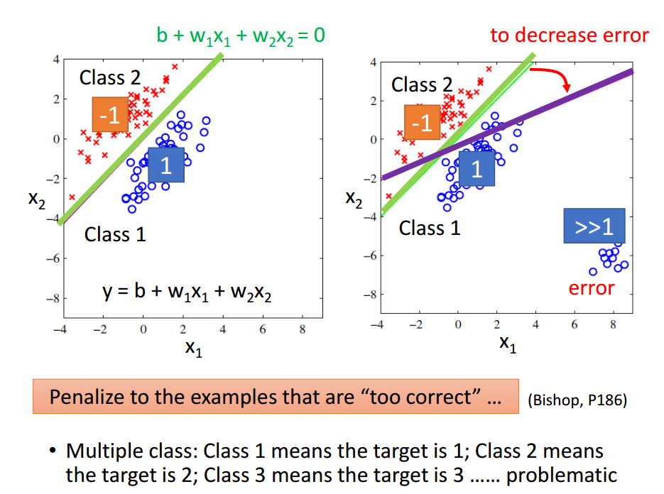
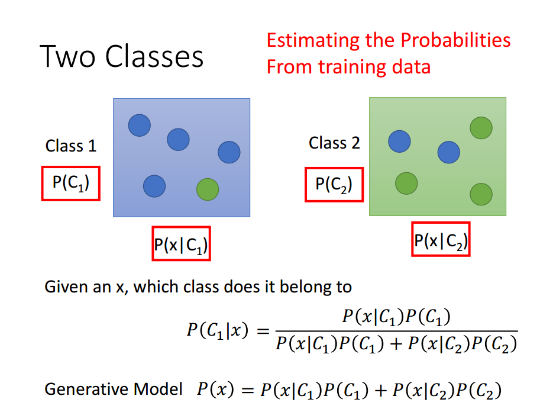
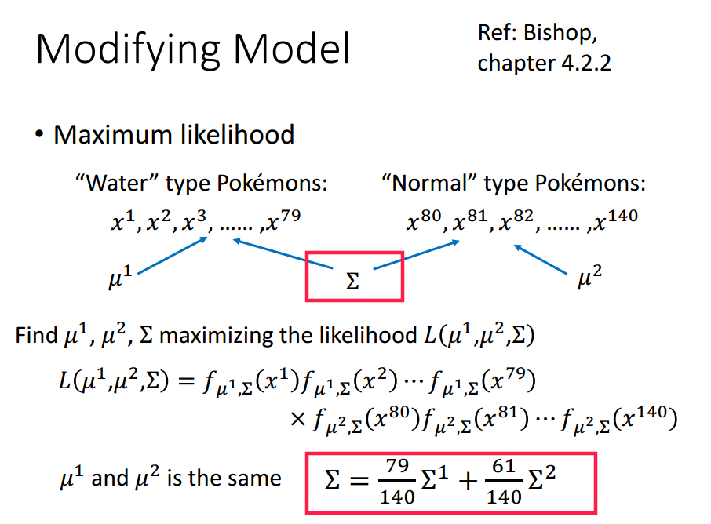
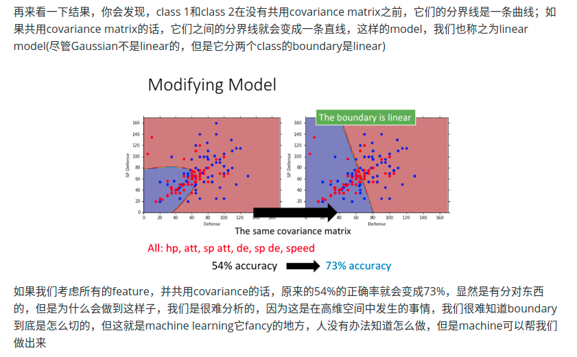

[toc]

## 前言

来源：

* 视频：[李宏毅2020机器学习 -- classification_1](https://www.bilibili.com/video/BV1JE411g7XF?p=10) 

* 作业代码：[Porbabilistic generative model](https://colab.research.google.com/drive/1JaMKJU7hvnDoUfZjvUKzm9u-JLeX6B2C#scrollTo=1C6sqhUbLMGe)

* 课件：[Classification: Probabilistic Generative Model](http://speech.ee.ntu.edu.tw/~tlkagk/courses/ML_2016/Lecture/Classification%20(v3).pdf)

* 其他人的笔记：[Classification: Probabilistic Generative Model](https://sakura-gh.github.io/ML-notes/ML-notes-html/6_Classification.html)

我之前用[线性回归](https://blog.csdn.net/sinat_38816924/article/details/114457368)，做上课机器学习的[作业](https://colab.research.google.com/drive/1VvxBOBz2DA2suBNHzJdK-vxnCkY66koA)。小于0.5的作为一类，大于0.5的为另一类。我不知道这样做方法的好坏(准确率73%左右)，但作业确实这样交了。嘿嘿。

使用线性回归做分类问题，并非一个好的解决方法。因为如下图所示。**好的分类是绿色的直线，但使用线性回归得到的却是紫色的直线**。

 


所以，下面介绍，使用概率生成模型进行分类。

<br>

## 生成模型

假设，我们需要将数据进行分类两类。[分成多类和两类的思考过程相同。我们使用两类进行说明。]

假设分为两类的球，分别占比2/5和3/5。这时候拿一个新的数据过来，预测它属于哪一类。**假如我们什么信息都不知道，肯定选认它是3/5的那一类。这样概率会比较大**。

假如，**我们知道具体的数据信息，如下图所示**。Class 1中四个篮球，一个绿球。Class 2中两个篮球，三个绿球。对于一个给定的球，判断它属于哪一类，则应该使用下图中的公示。[另外是不是感觉哪里不对劲，为什么不把蓝色的球放在一个class中，绿色的球放在一个class中。我这样认为：<font color=blue>蓝色和绿色是不同的属性，class是不同的标签。属性和标签之间有联系，但并不是必然联系。虽然属性相似，但是在不同的标签中。</font>]

 

上面的`P(blue|C_1)=4/5`，`P(green|C_1)=1/5`。但是此时拿过来一个蓝绿色的球，问是哪一类的？我们不可以说没有这一类，因为这一类确实存在，只是我们的测试数据中不存在而已。所以，**我们还需要知道数据的分布**。根据已有的数据，计算出具体的分布函数。

我们使用高斯分布进行说明，其他分布说明过程类似。
$$
f_{\mu, \Sigma}(x)=\frac{1}{(2 \pi)^{D / 2}} \frac{1}{|\Sigma|^{1 / 2}} \exp \left\{-\frac{1}{2}(x-\mu)^{T} \Sigma^{-1}(x-\mu)\right\}
$$
任意一个具体的高斯分布函数，都可以满足数据。但是我们希望得到的`𝜇`(均值)和`Σ`(协方差) ，可以是最符合这组数据的高斯分布函数。其中`𝜇`和`Σ` 如下计算。

 

<font color=red>此时，我们分别计算两类数据的高斯分布，结合两类数据个数的比例</font>，便可以预测一个测试数据属于哪一类。

<br>

## 修改生成模型

改进模型，使两类数据共用同一个协方差，均值不变。这里的协方差由两个类的协方差加权求和构成。[参数过多，多拟合？]

 

  

<br>

## 模型转换

概率生成模型的决策函数可以转换成sigmoid函数。

 

经过一串推导，得到如下结果。

 

所以我们能不能直接把w和b找出来呢？这是下一章节的内容。

<br>

## 代码实现

```python
# Compute in-class mean
X_train_0 = np.array([x for x, y in zip(X_train, Y_train) if y == 0])
X_train_1 = np.array([x for x, y in zip(X_train, Y_train) if y == 1])

# 计算均值
mean_0 = np.mean(X_train_0, axis = 0)
mean_1 = np.mean(X_train_1, axis = 0)  

cov_0 = np.zeros((data_dim, data_dim))
cov_1 = np.zeros((data_dim, data_dim))
# 计算不同类的协方差
for x in X_train_0:
    cov_0 += np.dot(np.transpose([x - mean_0]), [x - mean_0]) / X_train_0.shape[0]
for x in X_train_1:
    cov_1 += np.dot(np.transpose([x - mean_1]), [x - mean_1]) / X_train_1.shape[0]

# 共享协方差被视为单个类内协方差的加权平均值
cov = (cov_0 * X_train_0.shape[0] + cov_1 * X_train_1.shape[0]) / (X_train_0.shape[0] + X_train_1.shape[0])
```

如果不打算转换模型，可以这一步便计算，测试用例属于不同类中的概率，然后选最大值就好。

如果转换模型，计算w和b的话，加上如下代码。这是二分类，所以计算出x在class 1中的概率大于0.5，则属于class 1。否则，则属于class 2。如果是多分类的话，应该还得推导其他的w和b值计算公示。

```python
u, s, v = np.linalg.svd(cov, full_matrices=False)
inv = np.matmul(v.T * 1 / s, u.T)

# Directly compute weights and bias
w = np.dot(inv, mean_0 - mean_1)
b =  (-0.5) * np.dot(mean_0, np.dot(inv, mean_0)) + 0.5 * np.dot(mean_1, np.dot(inv, mean_1))\
    + np.log(float(X_train_0.shape[0]) / X_train_1.shape[0]) 
```

