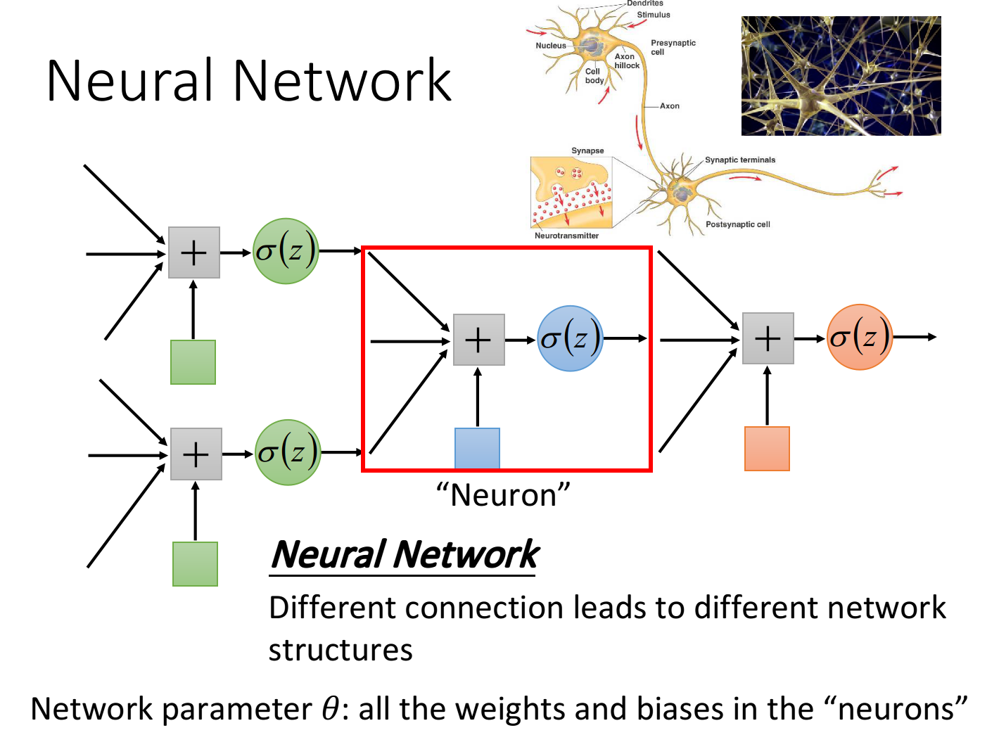
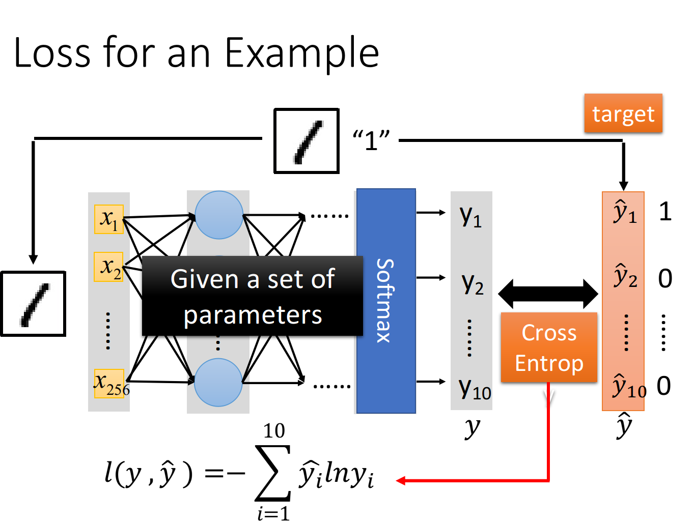
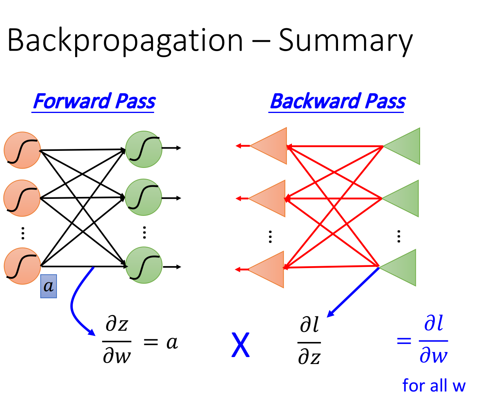
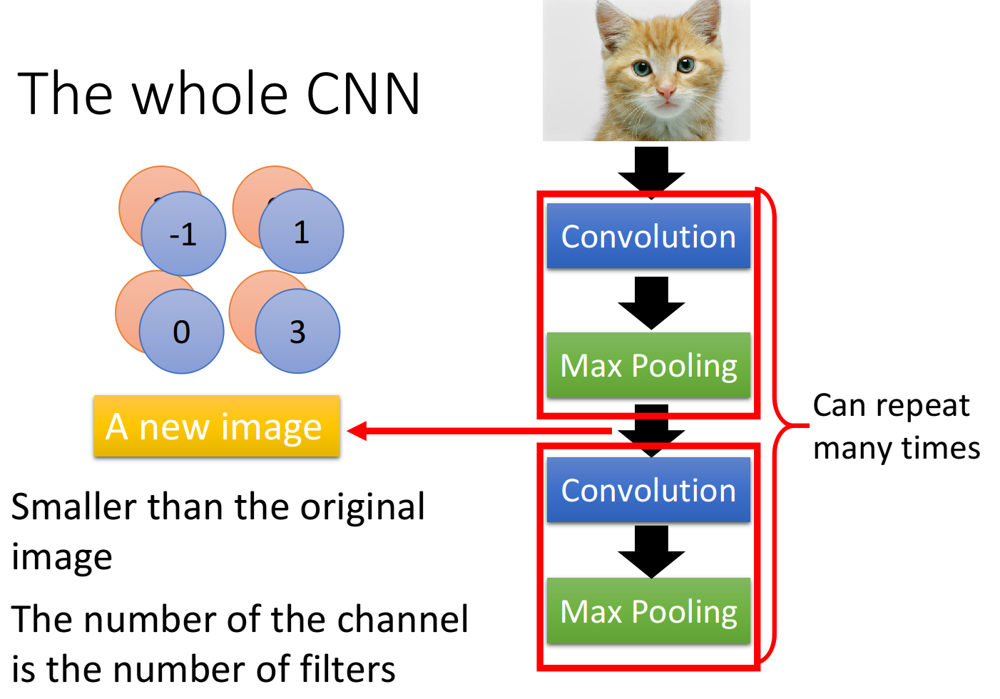

[toc]

## 前言

日常翘课，但是作业还是要写的。

数据集：分别采用usps和mnist两个数据集完成手写数字识别任务

实验要求：分别使用神经网络（BP网络或者RBF网络之一）和支持向量机两种方法进行实验

我使用BP方法进行实验，队友使用支持向量机进行实验。

我的CNN代码改自：[李宏毅 -- CNN -- 食物识别](https://colab.research.google.com/drive/16a3G7Hh8Pv1X1PhZAUBEnZEkXThzDeHJ#scrollTo=9sVrKci4PUFW)

本篇博客的数字识别代码详见：[cnn_num_recognition.ipynb](../code/cnn_num_recognition.ipynb)

本篇博客的代码并不好。我没看[tips for training DNN](https://www.bilibili.com/video/BV1JE411g7XF?p=14)，所以我不知道哪里可以优化，如何优化。能交作业就好。

另外，我不知道原理，只是大概知道流程，使用框架可以运行代码。

<br>

## 背景知识

### Neural Network

把多个Logistic Regression前后connect在一起，然后把一个Logistic Regression称之为neuron，整个称之为neural network。

 

类似的，得有损失函数，然后梯度下降，以找到最好的参数。

现在我们做的是一个Multi-class classification，out要经过softmax和cross entropy，结果越小越好。

 

<br>

### Backpropagation

上面的梯度使用BP进行计算。~~BP过程，我大三时候看吴恩达的网课，做对应的课后作业，看懂过~~。现在毛都看不懂。不过没关系，pytorch会帮我们计算。

 

<br>

### CNN

当我们直接用一般的fully connected的feedforward network来做图像处理的时候，往往会需要太多的参数。

CNN做的事情其实是，来简化这个neural network的架构，我们根据自己的知识和对图像处理的理解，一开始就把某些实际上用不到的参数给过滤掉。

 

<br>

### pytorch 介绍

略。

详见：[PyTorch_Introduction.ipynb](https://colab.research.google.com/drive/1Xed5YSpLsLfkn66OhhyNzr05VE89enng#scrollTo=RQIPkkKdMThD) | [PyTorch 中文教程](https://pytorch.apachecn.org/)

<br>

## 代码

详细见：前言中的仓库。

### CNN模型

进行了两次卷积和池化。然后Flatten，喂入一个两层的全连接网络。

```python
class Classifier(nn.Module):
    def __init__(self):
        super(Classifier, self).__init__()
        # torch.nn.Conv2d(in_channels, out_channels, kernel_size, stride, padding)
        # torch.nn.MaxPool2d(kernel_size, stride, padding)
        # input 維度 [1, 28, 28]
        self.cnn = nn.Sequential(
            nn.Conv2d(1, 6, 3),  # 6个3*3的filter   # [6,26,26]
            nn.MaxPool2d(2, 2),                    # [6,13,13]
            nn.Conv2d(6, 16, 3), # 16个6*3*3的filter# [16,11,11] 
            nn.MaxPool2d(2, 2),                    # [16,5,5]
        )
        self.fc = nn.Sequential(
            nn.Linear(16*5*5, 1024),
            nn.ReLU(),
            nn.Linear(1024, 512),
            nn.ReLU(),
            nn.Linear(512, 10)
        )

    def forward(self, x):
        out = self.cnn(x)
        out = out.view(out.size()[0], -1)
        # print(out.size())
        return self.fc(out)
```

### 训练&测试

模型进行num_epoch次训练，使用梯度下降得到最佳参数。最后测试模型。

```python
model = Classifier()
loss = nn.CrossEntropyLoss() # 因為是 classification task，所以 loss 使用 CrossEntropyLoss
optimizer = torch.optim.Adam(model.parameters(), lr=0.001) # optimizer 使用 Adam
num_epoch = 15

for epoch in range(num_epoch):
    epoch_start_time = time.time()
    train_acc = 0.0
    train_loss = 0.0
    test_acc = 0.0
    test_loss = 0.0

    model.train() # 確保 model 是在 train model (開啟 Dropout 等...)
    for i, data in enumerate(train_loader):
        optimizer.zero_grad() # 用 optimizer 將 model 參數的 gradient 歸零
        train_pred = model(data[0]) # 利用 model 得到預測的機率分佈 這邊實際上就是去呼叫 model 的 forward 函數
        batch_loss = loss(train_pred, data[1]) # 計算 loss （注意 prediction 跟 label 必須同時在 CPU 或是 GPU 上）
        batch_loss.backward() # 利用 back propagation 算出每個參數的 gradient
        optimizer.step() # 以 optimizer 用 gradient 更新參數值

        train_acc += np.sum(np.argmax(train_pred.cpu().data.numpy(), axis=1) == data[1].numpy())
        train_loss += batch_loss.item()
    
    model.eval()
    with torch.no_grad():
        for i, data in enumerate(test_loader):
            test_pred = model(data[0])
            batch_loss = loss(test_pred, data[1])

            test_acc += np.sum(np.argmax(test_pred.cpu().data.numpy(), axis=1) == data[1].numpy())
            test_loss += batch_loss.item()

        #將結果 print 出來
        print('[%03d/%03d] %2.2f sec(s) Train Acc: %3.6f Loss: %3.6f | Test Acc: %3.6f loss: %3.6f' % \
            (epoch + 1, num_epoch, time.time()-epoch_start_time, \
             train_acc/train_set.__len__(), train_loss/train_set.__len__(), test_acc/test_set.__len__(), test_loss/test_set.__len__()))
```

```shell
[001/015] 1.02 sec(s) Train Acc: 0.747806 Loss: 0.008318 | Test Acc: 0.885161 loss: 0.003867
[002/015] 1.00 sec(s) Train Acc: 0.914559 Loss: 0.002815 | Test Acc: 0.922581 loss: 0.002567
[003/015] 1.01 sec(s) Train Acc: 0.942179 Loss: 0.002045 | Test Acc: 0.914839 loss: 0.002599
[004/015] 1.00 sec(s) Train Acc: 0.954053 Loss: 0.001571 | Test Acc: 0.957419 loss: 0.001660
[005/015] 1.02 sec(s) Train Acc: 0.964120 Loss: 0.001268 | Test Acc: 0.953548 loss: 0.001670
[006/015] 1.05 sec(s) Train Acc: 0.968508 Loss: 0.001071 | Test Acc: 0.940645 loss: 0.001872
[007/015] 1.01 sec(s) Train Acc: 0.974187 Loss: 0.000830 | Test Acc: 0.948387 loss: 0.001698
[008/015] 1.00 sec(s) Train Acc: 0.977801 Loss: 0.000697 | Test Acc: 0.950968 loss: 0.001734
[009/015] 1.01 sec(s) Train Acc: 0.980382 Loss: 0.000565 | Test Acc: 0.963871 loss: 0.001496
[010/015] 1.01 sec(s) Train Acc: 0.986577 Loss: 0.000465 | Test Acc: 0.953548 loss: 0.001857
[011/015] 1.01 sec(s) Train Acc: 0.990449 Loss: 0.000350 | Test Acc: 0.956129 loss: 0.001731
[012/015] 1.00 sec(s) Train Acc: 0.991224 Loss: 0.000289 | Test Acc: 0.965161 loss: 0.001571
[013/015] 1.00 sec(s) Train Acc: 0.991482 Loss: 0.000263 | Test Acc: 0.958710 loss: 0.001794
[014/015] 1.00 sec(s) Train Acc: 0.994321 Loss: 0.000206 | Test Acc: 0.957419 loss: 0.001777
[015/015] 1.01 sec(s) Train Acc: 0.995096 Loss: 0.000194 | Test Acc: 0.967742 loss: 0.001748
```

可以看到，准确率不断上升。如果训练次数再多些，结果可能更好些。

