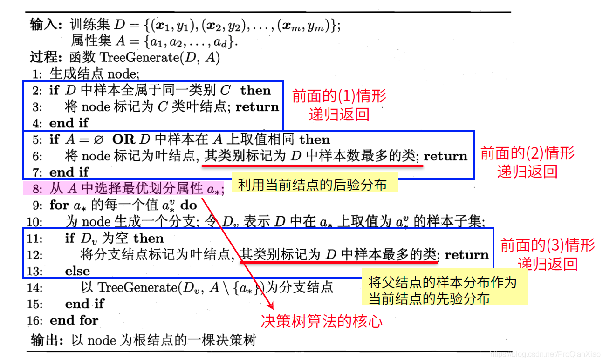
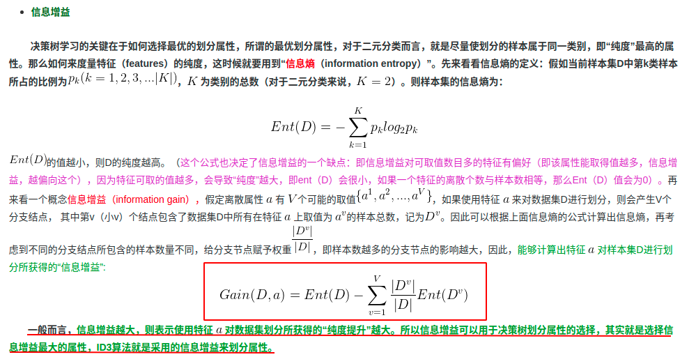
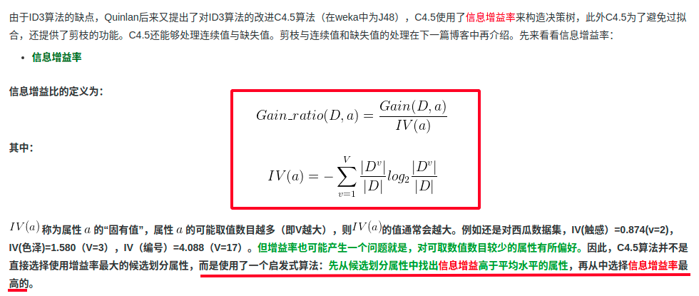
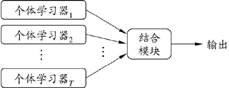
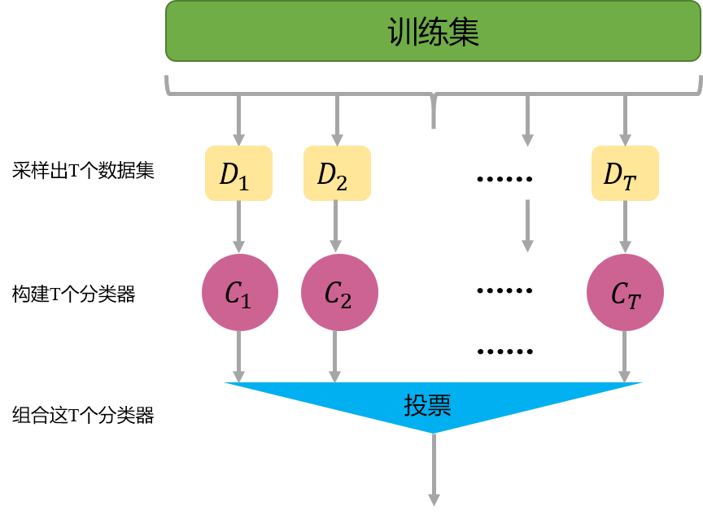
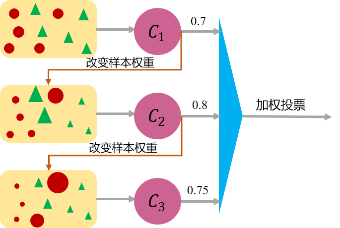

[toc]

# 前言

了解决策树和集成学习的概念。

使用sklearn机器学习框架中的随机森林，对Adult数据集进行分类。

<br>

# 决策树

来源一：《机器学习》周志华 第四章 决策树

来源二：[深入浅出理解决策树算法 -- 核心思想](https://zhuanlan.zhihu.com/p/26703300) | [深入浅出理解决策树算法 -- ID3算法与C4.5算法](https://zhuanlan.zhihu.com/p/26760551) 

来源三：[深入浅出决策树算法](https://blog.csdn.net/ProQianXiao/article/details/105933750)

<font color=red>来源四</font>：[决策树 -- 构造方法、剪枝、连续值处理、缺失值处理](https://blog.csdn.net/u012328159/article/details/79413610)

<br>

## 决策树的构造过程

一般的， 一棵决策树包含一个根结点、 若干个内部结点和若干个叶结点； 叶结点对应于决策结果， 其他每个结点则对应于一个属性测试； 每个结点包含的样本集合根据属性测试的结果被划分到子结点中； 根结点包含样本全集。 从根结点到每个叶结点的路径对应了一个判定测试序列。 决策树学习的目的是为了产生一棵泛化能力强， 即处理未见示例能力强的决策树， 其基本流程遵循简单且直观的“分而治之”（divide-and-conquer） 策略， 如[下图](https://blog.csdn.net/ProQianXiao/article/details/105933750)所示。 

显然， 决策树的生成是一个递归过程。 在决策树基本算法中， 有三种情形会导致递归返回： （1） 当前结点包含的样本全属于同一类别， 无需划分； （2）当前属性集为空， 或是所有样本在所有属性上取值相同， 无法划分； （3） 当前结点包含的样本集合为空， 不能划分。

在第（2） 种情形下， 我们把当前结点标记为叶结点， 并将其类别设定为该结点所含样本最多的类别； 在第（3） 种情形下， 同样把当前结点标记为叶结点， 但将其类别设定为其父结点所含样本最多的类别。 注意这两种情形的处理实质不同： 情形（2） 是在利用当前结点的后验分布， 而情形（3） 则是把父结点的样本分布作为当前结点的先验分布。

<font color=blue>这里的重点是：如何选择最优化属性进行划分。因为对于决策树而言，当(属性内划分选定之后的)属性节点确定，决策树结构确定</font>。

 

 

<br>

## 剪枝过程

首先剪枝（pruning）的目的是为了避免决策树模型的过拟合。因为决策树算法在学习的过程中为了尽可能的正确的分类训练样本，不停地对结点进行划分，因此这会导致整棵树的分支过多，也就导致了过拟合。决策树的剪枝策略最基本的有两种：预剪枝（pre-pruning）和后剪枝（post-pruning）：

* 预剪枝（pre-pruning）：预剪枝就是在构造决策树的过程中，先对每个结点在划分前进行估计，若果当前结点的划分不能带来决策树模型泛华性能的提升，则不对当前结点进行划分并且将当前结点标记为叶结点。
* 后剪枝（post-pruning）：后剪枝就是先把整颗决策树构造完毕，然后自底向上的对非叶结点进行考察，若将该结点对应的子树换为叶结点能够带来泛华性能的提升，则把该子树替换为叶结点。

<br>

## 连续值处理

因为连续属性的可取值数目不再有限，因此不能像前面处理离散属性枚举离散属性取值来对结点进行划分。因此需要连续属性离散化，常用的离散化策略是二分法，这个技术也是C4.5中采用的策略。下面来具体介绍下，如何采用二分法对连续属性离散化：

 

<br>

## 缺失值处理

决策树中处理含有缺失值的样本的时候，需要解决两个问题：

如何在属性值缺失的情况下进行划分属性的选择？（比如“色泽”这个属性有的样本在该属性上的值是缺失的，那么该如何计算“色泽”的信息增益？）
给定划分属性，若样本在该属性上的值是缺失的，那么该如何对这个样本进行划分？（即到底把这个样本划分到哪个结点里？）

在计算属性的信息增益的时候，如果训练集中某些样本的属性值缺失，我们的解决方案是根据该属性值上没有缺失的样本计算信息增益（或者信息增益率，基尼系数等指标）。不过在计算这些指标的过程中，我们需要额外计算一个权重。如果样本在划分属性上的值是缺失的，解决方案就是，把该样本划分到每一个叶子结点，只不过需要调整该样本的权重。

详见：[缺失值处理](https://blog.csdn.net/u012328159/article/details/79413610)

<br>

# 集成学习

来源一：《机器学习》周志华 第八章 集成学习

来源二：[集成学习（ensemble learning）基础知识](https://blog.csdn.net/u012328159/article/details/89740430)

来源三：[随机森林（random forest）](https://blog.csdn.net/u012328159/article/details/89814358)

<br>

## 集成学习概念

集成学习是通过构建并结合多个学习器来完成学习任务，如下图所示，其过程是：先产生一组“个体学习器”，再用某种策略将它们结合起来。个体学习器一般就是我们常见的机器学习算法，比如：决策树，神经网络等。这里集成一般有两种：同质和异质。同质是指个体学习器全是同一类型，这种同质集成中的个体学习器又称“基学习器”。异质是指个体学习器包含不同类型得学习算法，比如同时包含决策树和神经网络。

  

<br>

## 集成学习方法的分类

***Bagging***

Bagging的主要思想如下图所示，首先从数据集中采样出T个数据集，然后基于这T个数据集，每个训练出一个基分类器，再讲这些基分类器进行组合做出预测。Bagging在做预测时，对于分类任务，使用简单的投票法。对于回归任务使用简单平均法。若分类预测时出现两个类票数一样时，则随机选择一个。

Bagging中采样自助采样法。即有放回的采样。

 

***Boosting***

Boosting的工作机制为：先从初始训练集中训练出一个基学习器，再根据基学习器的表现对训练样本分布进行调整（比如增大被误分样本的权重，减小被正确分类样本的权重），使得先前基学习器做错的样本在后续的训练过程中受到更多关注，然后基于调整后的样本分布来训练下一个基学习器，如此重复，直到基学习器数目达到事先自定的值T TT，然后将这T TT个基学习器进行加权结合（比如错误率小的基学习器权重大，错误率大的基学习器权重小，这样做决策时，错误率小的基本学习器影响更大）。Boosting算法的典型代表有AdaBoost和XGBoost。Boosting算法可以用下图简略形象的描述下：
 

<br>

## 随机森林

随机森林（Random Forest， 简称RF） [Breiman， 2001a]是Bagging的一个扩展变体。 RF在以决策树为基学习器构建Bagging集成的基础上， 进一步在决策树的训练过程中引入了随机属性选择。 具体来说， 传统决策树在选择划分属性时是在当前结点的属性集合（假定有d个属性） 中选择一个最优属性； 而在RF中， 对基决策树的每个结点， 先从该结点的属性集合中随机选择一个包含k个属性的子集， 然后再从这个子集中选择一个最优属性用于划分。 这里的参数k控制了随机性的引入程度： 若令k=d， 则基决策树的构建与传统决策树相同； 若令k=1， 则是随机选择一个属性用于划分； 一般情况下， 推荐值k=log2d[Breiman，2001a]。

<br>

# 使用随机森林对Adult数据集进行分类

数据源：[Adult数据集](https://archive.ics.uci.edu/ml/datasets/adult)

参考：[决策树 -- sklearn](https://sklearn.apachecn.org/docs/master/11.html) | [集成方法 -- sklearn](https://sklearn.apachecn.org/docs/master/12.html)

```python
import pandas as pd
import numpy as np
from sklearn.ensemble import RandomForestClassifier

############### 数据处理。感谢zyl的支持
# 从google云盘加载数据
from google.colab import drive 
!gdown --id "19erzzuWGJ-uIpA27t3k4IsqQdbI6VRf-" --output audlt_train.csv
!gdown --id "1chr4nTMLuI0vXngNr4g7SU7IkGXM_7Jm" --output audlt_test.csv

train_data = pd.read_csv("audlt_train.csv",header=0,index_col=False)
test_data = pd.read_csv("audlt_test.csv",header=0,index_col=False)

def get_x_y(df,training=True):
    coulumn_list=[]
    coulumn_list.extend(df.columns.tolist())

    df.dropna(subset=coulumn_list,axis=0, how='any', inplace=True )#有空值的行删除

    # 将字符串转换成数字
    if training==True:
        ls  = [1,3,5,6,7,8,9,13,14]
    else:
        ls  = [1,3,5,6,7,8,9,13,14]
    for index in ls:
        every_feature_value = np.unique(df[coulumn_list[index]].values.tolist())
        feature2id = dict(zip(every_feature_value, range(len(every_feature_value))))
        id2feature =  dict(zip(range(len(every_feature_value)),every_feature_value))
        df[coulumn_list[index]]=df[coulumn_list[index]].map(lambda x:feature2id[x])
    
    train_x = df.drop(df.columns[[14]],axis=1).values 
    feature_list = df.drop(df.columns[[14]],axis=1).columns.tolist()
    train_y = df['Target'].values
    return train_x,train_y,feature_list

x_train,y_train,feature_list = get_x_y(train_data,True)
x_test,y_test,_= get_x_y(test_data,False)


############训练模型
# 随机森林，使用10个基(决策树)学习器
clf = RandomForestClassifier(n_estimators=10,max_features = "sqrt")
clf = clf.fit(x_train, y_train)

###########测试模型
clf.score(x_test,y_test)
```

```shell
# 输出测试的准确率
0.8428286852589641
```

