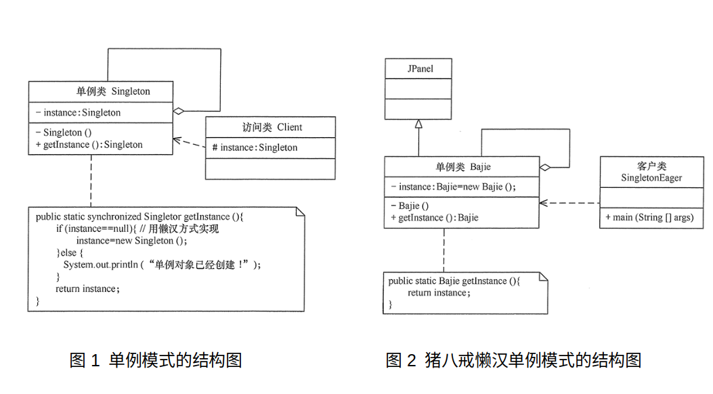

参考：[C++设计模式 – 李建忠 – 视频](https://www.bilibili.com/video/BV1V5411w7qg?p=12)

转载：[单例模式 - C语言中文网](http://c.biancheng.net/view/1338.html)

单例（Singleton）模式的定义：指一个类只有一个实例，且该类能自行创建这个实例的一种模式。

单例模式是[设计模式](http://c.biancheng.net/design_pattern/)中最简单的模式之一。通常，普通类的构造函数是公有的，外部类可以通过“new 构造函数()”来生成多个实例。但是，如果将类的构造函数设为私有的，外部类就无法调用该构造函数，也就无法生成多个实例。这时该类自身必须定义一个静态私有实例，并向外提供一个静态的公有函数用于创建或获取该静态私有实例。

单例模式需要注意多线程的安全性问题。

单例模式的主要角色如下。

- 单例类：包含一个实例且能自行创建这个实例的类。
- 访问类：使用单例的类。

其结构如下所示。

