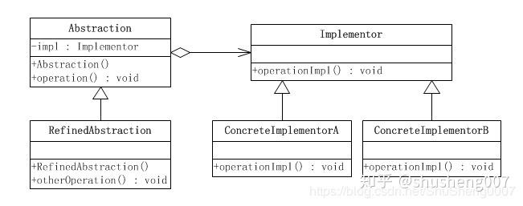

## 前言

参考一：[C++设计模式 – 李建忠 – 视频](https://www.bilibili.com/video/BV1V5411w7qg?p=7)

参考二：[桥接 - 廖雪峰的官方网站](https://www.liaoxuefeng.com/wiki/1252599548343744/1281319266943009) | [桥接模式 - C语言中文网](http://c.biancheng.net/view/1364.html) | [秒懂设计模式之桥接模式 - 知乎](https://zhuanlan.zhihu.com/p/58903776)

 

## 桥接模式

桥接（Bridge）模式的定义如下：将抽象与实现分离，使它们可以独立变化。它是用组合关系代替继承关系来实现，从而降低了抽象和实现这两个可变维度的耦合度。Bridge模式有时候类似于多继承方案，但是多继承方案往往违背单一职责原则（即一个类只有一个变化的原因），复用性比较差。Bridge模式是比多继承方案更好的解决方法。

桥接（Bridge）模式包含以下主要角色：

1. 抽象化（Abstraction）角色：**定义抽象类，并包含一个对实现化对象的引用**。
2. 扩展抽象化（Refined Abstraction）角色：是抽象化角色的子类，实现父类中的业务方法，并通过组合关系调用实现化角色中的业务方法。(选择需要的实现化对象的引用进行组合。)
3. 实现化（Implementor）角色：定义实现化角色的接口，供扩展抽象化角色调用。
4. 具体实现化（Concrete Implementor）角色：给出实现化角色接口的具体实现。

简单总结下：一个类包含两个方向的内容。将其中一个方向内容拆出成为单独一个类，任其向下继承变换；原类中持有一个拆出类的的实例化对象的引用。这样，两个方向的内容在抽象层次建立联系，它俩的变换互不干扰，组合运行。

桥接模式的结构图如下：

 

