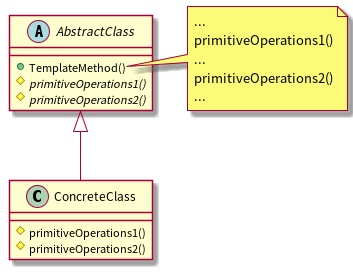

## 前言

本文来源：[C++设计模式 – 李建忠 – 视频](https://www.bilibili.com/video/BV1V5411w7qg?p=3)

推荐阅读1：【大话设计模式 – 吴强 – 书籍】第二十章 订单处理——模板方法模式

推荐阅读2：[模板方法 - 廖雪峰的官方网站](https://www.liaoxuefeng.com/wiki/1252599548343744/1281319636041762)

<br>

## 模板方法

模板方法模式把我们不知道具体实现的步聚封装成抽象方法，提供一些按正确顺序调用它们的具体方法(这些具体方法统称为模板方法)， 这样构成一个抽象基类。 子类通过继承这个抽象基类去实现各个步聚的抽象方法， 而工作流程却由父类来控制。

模板方法定义一个操作中的算法的骨架 (稳定)，而将一些步骤延迟(变化)到子类中。 Template Method使得子类可以不改变(复用)一个算法的结构即可重定义(override 重写)该算法的某些特定步骤。

<br>

## 模板方法的类图表示

这里使用[plantuml](https://plantuml.com/zh/class-diagram)，[绘制](https://blog.csdn.net/sinat_38816924/article/details/113416980)UML图。

```c++
@startuml template_method
abstract class AbstractClass{
    + TemplateMethod()
    # {abstract} primitiveOperations1()
    # {abstract} primitiveOperations2()
}
note right of AbstractClass::"TemplateMethod()"
    ...
    primitiveOperations1()
    ...
    primitiveOperations2()
    ...
end note

class ConcreteClass{
    # primitiveOperations1()
    # primitiveOperations2()
}

AbstractClass <|-- ConcreteClass
@enduml
```

 

