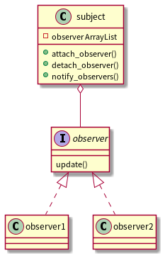

## 前言

参考：[C++设计模式 – 李建忠 – 视频](https://www.bilibili.com/video/BV1V5411w7qg?p=5)

推荐阅读：[观察者 - 廖雪峰的官方网站](https://www.liaoxuefeng.com/wiki/1252599548343744/1281319577321505)

<br>

## 观察者模式

**观察者模式又名发布订阅模式**。 定义对象间的一种一对多的依赖关系， 当一个对象的状态发生改变时， 所有依赖于它的对象都得到通知并被自动更新。

1. 于观察者的一切， 目标只知道观察者实现了某个接口，不需要知道观察者的具体类是谁
2. 任何时候我们都可以增加新的观察者，因为目标唯一依赖的东西是一个实现Observer接口的对象列表
3. 有新类型的观察者出现时， 目标的代码不需要修改。 只要在新类里实现观察者接口， 然后注册为观察者即可
4. 我们可以独立的复用目标或观察者， 因为两者并非紧耦合
5. 改变目标或观察者任何一方， 并不会影响另一方， 只要他们之间的接口仍被遵守

<br>

## 观察者模式类图

```c++
@startuml observer

class subject{
    - observer ArrayList
    + attach_observer()
    + detach_observer()
    + notify_observers()
}

interface observer{
    update()
}

class observer1 implements observer{}
class observer2 implements observer{}

subject <.. observer
@enduml
```

 

